# Summary 
This is a common garden experiment where individual fish **(FISH_ID)** were exposed to four different **TEMPERATURE** treatments (i.e., 27$^\circ$, 28.5$^\circ$, 30$^\circ$, and 31.5$^\circ$). Fish sampled in this experiment were collected from three different sets of **POPULATIONS** that were collected from two different **REGIONS**; a low- and a high-latitude region (i.e., three populations from each region, six different populations in total).  

Fish were first sampled at 27C and then subsequently at higher temperatures. Once all fish were tested at the set treatment temperature, the treatment temperature was increase 1.5$^\circ$ over three days. Fish were then given an additional five days to adjust to the temperature increase.   

To determine the **MAX** metabolic rate fish were placed in a swim tunnel for ten minutes. The first five minutes were used to slowly increase the water flow within the swim tunnel until fish reached the point where fish would alternate between pectoral swimming and lateral body undulations (i.e., gait change). The water flow within the swim tunnel was maintained at gait change speeds for an additional five minutes. Afterwards fish were immediately placed within a designated respirometry **CHAMBER** with air saturation rates being monitored for 3.5-4 hours on a four minute measure, three minutes flush, and five second wait cycle.  

Maximum metabolic rate was determined by extracting the steepest sixty second interval slope from the first (sometimes, but rarely, second or third) measurement period. **RESTING** metabolic rate was determined by extacrting the ten shallowest slopes that were recorded over the length of the experiment. 

Fish were sampled in random order. The order that fish were sampled in determined the **SUMP**/**SYSTEM** fish run on as well as the chamber they were placed in (i.e., the first fish sampled went into chamber 1 on sump/system 1, the second fish into chamber 1 on sump/system 2, the third fish into chamber 2 on sump/system 1 etc.).

Immunocompetence was tested via phytohaemaglutinin (PHA) swelling assays at the same four experimental temperatures metabolic performance was tested at. To perform the assay fish were injected with 0.03 mL of PHA subcutaneously in the caudal peduncle. Thickness of injection site was measured pre-injection as well as 18-24hour post-injection. PHA produces a localized, cell-mediated response (e.g., inflammation, T-cell proliferation, etc).  The change in thickness between measurement periods was used as an proxy for immunocompetence. 

2-weeks after live animal testing concluded blood and tissue samples were collected from each fish. White muscle tissue samples were used to assess enzyme activation levels of 2 different enzymes including, lactate dehydrogenase (LDH; anaerobic) and citrate synthase (CS; aerobic). Blood samples were used to determine hemaetocrit ratios. 


# Glossary of respirometry terms 

--------------------- ------------------------------------------------------------------
**EXP_FISH_ID**       Combined FISH_ID with TEMPERATURE the fish was tested at
**FISH_ID**           Unique alphamueric code provided to fish
**POPULATION**        Population/Reef the fish was collected from 
**REGION**            Region (i.e. core or leading) fish was collected from 
**TEMPERATURE**       Temperature fish was tested at 
**MASS**              Mass of the fish 
**RESTING_DATE**      Date the resting metabolic rate was recorded for each fish     
**RESTING_CHAMBER**   Respirometry chamber the fish was tested in for RMR
**RESTING_SYSTEM**    Respirometry system (i.e. dell or asus) fish was tests with 
**RESTING_SUMP**      Respirometry sump (i.e., 1 or 2) fish was tested in
**RESTING_AM_PM**     Time of day (i.e. morning or afternoon) fish was tested 
**RESTING_START_TIME**Time that the fish was placed inside the repirometry chamber 
**RESTING**           Resting metabolic rate (RMR)  
**RESTING_MgO2.hr**   Resting metabolic rate divded mass 
**MAX_DATE**          Date that maximum metabolic rate was recored 
**MAX_CHAMBER**       Respirometry chamber the fish was tested in for MMR
**MAX_SYSTEM**        Respirometry system fish was test with for MMR 
**MAX_SUMP**          Respirometry sump (i.e., 1 or 2) fish was tested in for MMR 
**MAX_AM_PM**         Time of day (i.e. morning or afternoon) fish was tested for MMR 
**MAX_START_TIME**    Time that the fish was placed inside the chamber for MMR 
**MAX**               Maximum metabolic rate (MMR) 
**MAX_MgO2.hr**       Maximum metabolic rate divided by mass 
**FAS**               Factorial metabolic rate (MMR/RMR) 
**NAS**               Net metabolic rate (MMR - RMR) 
**MgO2.hr_Net**       Net metaboic rate divided by mass 
**Swim.performance**  Fish swim performance in swim tunnel (i.e., good, okay, poor) 
**Notes**             Additional experimental notes
**MASS_CENTERED**     Mass of fish (centered)
--------------------- -----------------------------------------------------------------

# Load packages 

Lets start by loading the packages that are needed 

```r
library(tidyverse) # data manipulation
library(janitor) # data manipulation
library(plyr) # data manipulation
library(dplyr) # data manipulation
library(lubridate) # data manipulation - specifically time data
library(chron) # data manipulation - specifically time data
library(glmmTMB) # running models
library(performance) # model validation
library(DHARMa) # model validation
library(MuMIn) # model validation
library(modelr) # model validation
library(car) # used for Anova function
library(emmeans) # post-hoc analysis
library(kableExtra) # creating tables
library(vtable) # creating tables
library(ggplot2) # plotting figures
library(ggeffects) # plotting models/model validation
library(sjPlot) # plotting models 
library(ggpubr) # plotting figures
library(broom) # dependent
```
# Results {.tabset .tabset-pills}

## Metabolic rates {.tabset .tabset-pills}

### Resting oxygen consumption 

#### Scenario 

For details on the experiment performed please read the information at the top of this document. In brief, _Acanthochromis polyacanthus_ from two different regions on the Great Barrier Reef (GBR) were tested for metabolic performance at four different temperatures, 27$^\circ$C, 28.5$^\circ$C, 30$^\circ$C, and 31.5$^\circ$C. Fish used in this study were collected from two different regions, low- (i.e. Cairns) and high-latitude (i.e., Mackay), within each region fish were collected from a total of three different populations. Individuals were tested at each temperature, resting oxygen consumption, maximum oxygen consumption. Absolute aerboic scope was calculated by using the following formula: 

Absolute aerobic scope = (maximum oxygen consumption - resting oxygen consumption)

Individuals were first tested at 27$^\circ$C. Water temperature was then increased at a rate of 0.5$^\circ$C Day^-1 until the next temperature was reached. Fish were then provided with an additional 5 day to adjust to the new temperature before aerobic physiology was tested again. 

Three traits are included within the aerobic physiology analysis, resting oxygen consumption, maximum oxygen consumption, and absoulte aerboic scope. Data for each metric was collect from respiratory experiments that had data recorded via a combination of programs including, AquaResp and PyroScience. Slopes (i.e., resting and maximum oxygen consumption values) were then calculated via the **RespR** [https://januarharianto.github.io/respR/articles/respR.html] package.  


#### Read in the data

Before beginning always make sure that you are working in the correct directory 


```r
knitr::opts_knit$set(root.dir=working.dir)
```

Now we can import that data. Replace import data with the PATH to your data file. I have secretly labelled my PATH import.data (i.e. import.data = "PATH TO MY FILE")

#### Load data 


```r
resp <- import.data
```

#### Data manipulation 

Before the data can be analysed it is important to clean up the data file. Below a number of adjustments are made, primarily making sure that columns are being treated appropriately as either factors, numeric, or as time, as well as the renaming of some columns. Once these changes are made the data is being saved into a new dataframe called **resp2** 


```{.r .style}
resp2 = resp %>% 
  dplyr::rename(EXP_FISH_ID = FISH_ID) %>%
  separate(EXP_FISH_ID, c("FISH_ID"), remove = FALSE) %>%
  mutate(FISH_ID = factor(FISH_ID), 
         POPULATION = factor(POPULATION), 
         REGION = factor(REGION), 
         TEMPERATURE = as.numeric(TEMPERATURE), #run with temperature as a factor
         RESTING_DATE = factor(RESTING_DATE), 
         RESTING_CHAMBER = factor(RESTING_CHAMBER), 
         RESTING_SYSTEM = factor(RESTING_SYSTEM), 
         RESTING_SUMP = factor(RESTING_SUMP), 
         RESTING_AM_PM = factor(RESTING_AM_PM), 
         RESTING_START_TIME = hms(RESTING_START_TIME),
         RESTING_END_TIME = hms(RESTING_ENDTIME),
         MAX_DATE = factor(MAX_DATE), 
         MAX_CHAMBER = factor(MAX_CHAMBER), 
         MAX_SYSTEM = factor(MAX_SYSTEM), 
         MAX_SUMP = factor(MAX_SUMP), 
         MAX_AM_PM = factor(MAX_AM_PM), 
         MAX_START_TIME = hms(MAX_START_TIME), 
         Swim.performance = factor(Swim.performance), 
         NAS = as.numeric(NAS), 
         FAS = as.numeric(FAS), 
         MgO2.hr_Net = as.numeric(MgO2.hr_Net), 
         RESTING_RUNTIME_SECONDS = as.numeric(hms(RESTING_RUNTIME))) %>% 
  dplyr::rename(MASS = WEIGHT) %>% 
  mutate(MASS_CENTERED = scale(MASS, scale = FALSE, center = TRUE))
```

Next select data points will be removed. Beside the removed data points I have provided reasoning for their exclusion, such as fish died during the experiment, or data quailty was poor - which likely indicated that there was an issue with the equipment during the trial. 


```r
resp3 <- resp2 %>% 
  subset(  
    EXP_FISH_ID !="LCHA127_27" & # deceased during experiment
      EXP_FISH_ID !="LCHA132_27" & # deceased during experiment
      EXP_FISH_ID !="LKES168_27" # poor data quality
  ) 
```

Great! That is everything for data manipulation 

#### Exploratory data analysis {.tabset}

##### Mass v Rest


```r
ggplot(resp3, aes(MASS, RESTING_MgO2.hr_RESPR)) + 
  geom_point() + 
  geom_smooth(method = "lm") + 
  theme_classic()
```

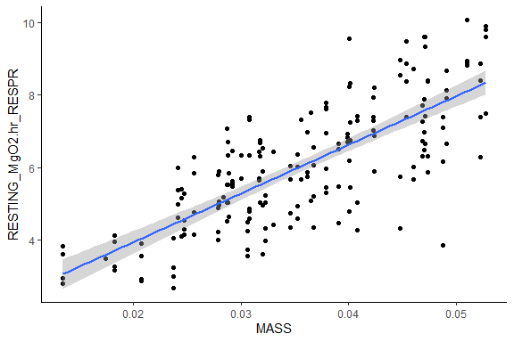<!-- -->

##### Mass v REST (LATITUDE)

```r
ggplot(resp3, aes(MASS, RESTING_MgO2.hr_RESPR, color = REGION)) + 
  geom_point() +
  theme_classic() + 
  geom_smooth(method = "lm")
```

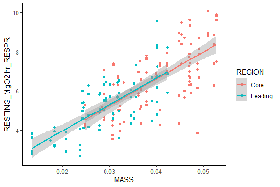<!-- -->

##### TEMPERTURE v REST (LATITUDE)

```r
ggplot(resp3, aes(TEMPERATURE, RESTING_MgO2.hr_RESPR, color = REGION)) + 
  geom_point() +
  theme_classic()
```

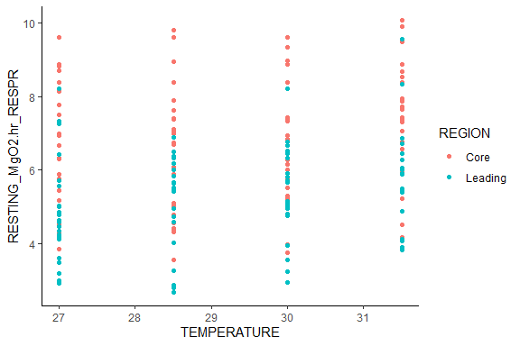<!-- -->

##### {-}

#### Fit the model 

The model was fit using the **glm** and later **glmmTMB** package in R. A number of different models were tested to determine which hypothesis and associated variables best predicted resting oxygen consumption. Model fit was examined using AICc, BIC, and r-squared values. Additional model were examined via the validation diagonistics provided by the **performance** and **dHARMA** packages in R. 

The first set of models tested looked at three different hypotheses including 1) that mass has a major impact of resting oxygen consumption of fish (this has been documented in the literature), 2) if variables related to time have an important impact on the resting oxygen consumption of fish. 

##### Fixed factors (linear regression models)

###### model 1

```r
#--- base model ---#
rmr.1 <- glm(RESTING_MgO2.hr_RESPR ~ 1+ REGION * TEMPERATURE + MASS_CENTERED, 
                 family=gaussian(),
                 data = resp3) 
```
####### summary
<table class=" lightable-paper" style='font-family: "Arial Narrow", arial, helvetica, sans-serif; margin-left: auto; margin-right: auto;'>
 <thead>
  <tr>
   <th style="text-align:left;">   </th>
   <th style="text-align:right;"> Estimate </th>
   <th style="text-align:right;"> Std. Error </th>
   <th style="text-align:right;"> t value </th>
   <th style="text-align:right;"> Pr(&gt;|t|) </th>
  </tr>
 </thead>
<tbody>
  <tr>
   <td style="text-align:left;"> (Intercept) </td>
   <td style="text-align:right;"> 0.9071699 </td>
   <td style="text-align:right;"> 1.8396670 </td>
   <td style="text-align:right;"> 0.4931164 </td>
   <td style="text-align:right;"> 0.6225248 </td>
  </tr>
  <tr>
   <td style="text-align:left;"> REGIONLeading </td>
   <td style="text-align:right;"> -1.0631773 </td>
   <td style="text-align:right;"> 2.7553334 </td>
   <td style="text-align:right;"> -0.3858616 </td>
   <td style="text-align:right;"> 0.7000498 </td>
  </tr>
  <tr>
   <td style="text-align:left;"> TEMPERATURE </td>
   <td style="text-align:right;"> 0.1759916 </td>
   <td style="text-align:right;"> 0.0632351 </td>
   <td style="text-align:right;"> 2.7831307 </td>
   <td style="text-align:right;"> 0.0059520 </td>
  </tr>
  <tr>
   <td style="text-align:left;"> MASS_CENTERED </td>
   <td style="text-align:right;"> 133.8254357 </td>
   <td style="text-align:right;"> 9.9843605 </td>
   <td style="text-align:right;"> 13.4035060 </td>
   <td style="text-align:right;"> 0.0000000 </td>
  </tr>
  <tr>
   <td style="text-align:left;"> REGIONLeading:TEMPERATURE </td>
   <td style="text-align:right;"> 0.0376457 </td>
   <td style="text-align:right;"> 0.0946023 </td>
   <td style="text-align:right;"> 0.3979365 </td>
   <td style="text-align:right;"> 0.6911434 </td>
  </tr>
</tbody>
</table>

###### model 2

```r
#--- experimental rmr equipment hypothesis ---#
rmr.2 <- glm(RESTING_MgO2.hr_RESPR ~ 1+ REGION * TEMPERATURE + RESTING_SUMP + 
                   RESTING_AM_PM + RESTING_RUNTIME_SECONDS, 
                 family=gaussian(),
                 data = resp3) 
```

####### summary
<table class=" lightable-paper" style='font-family: "Arial Narrow", arial, helvetica, sans-serif; margin-left: auto; margin-right: auto;'>
 <thead>
  <tr>
   <th style="text-align:left;">   </th>
   <th style="text-align:right;"> Estimate </th>
   <th style="text-align:right;"> Std. Error </th>
   <th style="text-align:right;"> t value </th>
   <th style="text-align:right;"> Pr(&gt;|t|) </th>
  </tr>
 </thead>
<tbody>
  <tr>
   <td style="text-align:left;"> (Intercept) </td>
   <td style="text-align:right;"> 0.0417266 </td>
   <td style="text-align:right;"> 2.5593818 </td>
   <td style="text-align:right;"> 0.0163034 </td>
   <td style="text-align:right;"> 0.9870104 </td>
  </tr>
  <tr>
   <td style="text-align:left;"> REGIONLeading </td>
   <td style="text-align:right;"> -1.8177666 </td>
   <td style="text-align:right;"> 3.7681132 </td>
   <td style="text-align:right;"> -0.4824077 </td>
   <td style="text-align:right;"> 0.6301025 </td>
  </tr>
  <tr>
   <td style="text-align:left;"> TEMPERATURE </td>
   <td style="text-align:right;"> 0.3212288 </td>
   <td style="text-align:right;"> 0.0949708 </td>
   <td style="text-align:right;"> 3.3823948 </td>
   <td style="text-align:right;"> 0.0008816 </td>
  </tr>
  <tr>
   <td style="text-align:left;"> RESTING_SUMP2 </td>
   <td style="text-align:right;"> -0.0016294 </td>
   <td style="text-align:right;"> 0.2215833 </td>
   <td style="text-align:right;"> -0.0073533 </td>
   <td style="text-align:right;"> 0.9941411 </td>
  </tr>
  <tr>
   <td style="text-align:left;"> RESTING_AM_PMPM </td>
   <td style="text-align:right;"> -0.4196626 </td>
   <td style="text-align:right;"> 0.2161103 </td>
   <td style="text-align:right;"> -1.9418904 </td>
   <td style="text-align:right;"> 0.0537114 </td>
  </tr>
  <tr>
   <td style="text-align:left;"> RESTING_RUNTIME_SECONDS </td>
   <td style="text-align:right;"> -0.0001616 </td>
   <td style="text-align:right;"> 0.0000513 </td>
   <td style="text-align:right;"> -3.1477047 </td>
   <td style="text-align:right;"> 0.0019264 </td>
  </tr>
  <tr>
   <td style="text-align:left;"> REGIONLeading:TEMPERATURE </td>
   <td style="text-align:right;"> 0.0125324 </td>
   <td style="text-align:right;"> 0.1293602 </td>
   <td style="text-align:right;"> 0.0968801 </td>
   <td style="text-align:right;"> 0.9229294 </td>
  </tr>
</tbody>
</table>

###### model comparison table
<table class=" lightable-paper" style='font-family: "Arial Narrow", arial, helvetica, sans-serif; margin-left: auto; margin-right: auto;'>
 <thead>
  <tr>
   <th style="text-align:left;"> model </th>
   <th style="text-align:right;"> df </th>
   <th style="text-align:right;"> AICc </th>
   <th style="text-align:right;"> BIC </th>
   <th style="text-align:right;"> r2 </th>
  </tr>
 </thead>
<tbody>
  <tr>
   <td style="text-align:left;"> rmr.1 </td>
   <td style="text-align:right;"> 6 </td>
   <td style="text-align:right;"> 561.9094 </td>
   <td style="text-align:right;"> 580.8294 </td>
   <td style="text-align:right;"> 0.6058512 </td>
  </tr>
  <tr>
   <td style="text-align:left;"> rmr.2 </td>
   <td style="text-align:right;"> 8 </td>
   <td style="text-align:right;"> 680.4894 </td>
   <td style="text-align:right;"> 705.5293 </td>
   <td style="text-align:right;"> 0.2768734 </td>
  </tr>
</tbody>
</table>
The model that contains **MASS_CENTERED** seems to do better than the model that incorporates variables that are associated with the time that experiments are performed.This is demonstrated by the lower AIC and BIC scores, as well as higher r-squared value. However, **RESTING_RUNTIME_SECONDS** was a significant variable in model 2. Let's see what a third model looks like if we both **MASS_CENTERED** and **RESTING_RUNTIME_SECONDS**. 

###### model 3

```r
rmr.3 <- glm(RESTING_MgO2.hr_RESPR ~ 1+ REGION * TEMPERATURE + MASS_CENTERED + RESTING_RUNTIME_SECONDS, 
                 family=gaussian(),
                 data = resp3)
```

###### model comparison table 2
<table class=" lightable-paper" style='font-family: "Arial Narrow", arial, helvetica, sans-serif; margin-left: auto; margin-right: auto;'>
 <thead>
  <tr>
   <th style="text-align:left;"> model </th>
   <th style="text-align:right;"> df </th>
   <th style="text-align:right;"> AICc </th>
   <th style="text-align:right;"> BIC </th>
   <th style="text-align:right;"> r2 </th>
  </tr>
 </thead>
<tbody>
  <tr>
   <td style="text-align:left;"> rmr.1 </td>
   <td style="text-align:right;"> 6 </td>
   <td style="text-align:right;"> 561.9094 </td>
   <td style="text-align:right;"> 580.8294 </td>
   <td style="text-align:right;"> 0.6058512 </td>
  </tr>
  <tr>
   <td style="text-align:left;"> rmr.2 </td>
   <td style="text-align:right;"> 8 </td>
   <td style="text-align:right;"> 680.4894 </td>
   <td style="text-align:right;"> 705.5293 </td>
   <td style="text-align:right;"> 0.2768734 </td>
  </tr>
  <tr>
   <td style="text-align:left;"> rmr.3 </td>
   <td style="text-align:right;"> 7 </td>
   <td style="text-align:right;"> 544.9015 </td>
   <td style="text-align:right;"> 566.8936 </td>
   <td style="text-align:right;"> 0.6426906 </td>
  </tr>
</tbody>
</table>

It looks like the third model is better than the previous two. Next we will test to see if the variable temperature performs best as a 1^st (linear), 2^nd (quadratic), or 3^rd (cubic) order polynomial. As the relationship between temperature and resting oxygen consumption is predicted to be non-linear. 

##### Polynomials 

###### polynomial models 

Note that the linear model has already been created via model _rmr.3_ in the previous section.


```r
rmr.3.p2 <- glm(RESTING_MgO2.hr_RESPR ~ 1+ REGION * poly(TEMPERATURE, 2) + MASS_CENTERED + RESTING_RUNTIME_SECONDS, 
                 family=gaussian(),
                 data = resp3)  

rmr.3.p3 <- glm(RESTING_MgO2.hr_RESPR ~ 1+ REGION * poly(TEMPERATURE, 3) + MASS_CENTERED + RESTING_RUNTIME_SECONDS, 
                 family=gaussian(),
                 data = resp3)
```

####### polynomial model comparisons
<table class=" lightable-paper" style='font-family: "Arial Narrow", arial, helvetica, sans-serif; margin-left: auto; margin-right: auto;'>
 <thead>
  <tr>
   <th style="text-align:left;"> model </th>
   <th style="text-align:right;"> df </th>
   <th style="text-align:right;"> AICc </th>
   <th style="text-align:right;"> BIC </th>
   <th style="text-align:right;"> r2 </th>
  </tr>
 </thead>
<tbody>
  <tr>
   <td style="text-align:left;"> rmr.3 </td>
   <td style="text-align:right;"> 7 </td>
   <td style="text-align:right;"> 544.9015 </td>
   <td style="text-align:right;"> 566.8936 </td>
   <td style="text-align:right;"> 0.6489236 </td>
  </tr>
  <tr>
   <td style="text-align:left;"> rmr.3.p2 </td>
   <td style="text-align:right;"> 9 </td>
   <td style="text-align:right;"> 545.1143 </td>
   <td style="text-align:right;"> 573.1773 </td>
   <td style="text-align:right;"> 0.6566813 </td>
  </tr>
  <tr>
   <td style="text-align:left;"> rmr.3.p3 </td>
   <td style="text-align:right;"> 11 </td>
   <td style="text-align:right;"> 548.8463 </td>
   <td style="text-align:right;"> 582.8799 </td>
   <td style="text-align:right;"> 0.6580731 </td>
  </tr>
</tbody>
</table>

From our model comparison we can see the there is no additional benefit to the model by including temperature as a 2^nd or 3^rd order polynomial. However, the linear and quadratic model both perform well. 

##### Random factors 

Fish were repeatedly sampled over four different temperatures, therefore repeated sampling needs to be accounted for. To do this random factors will be included within the model. There are a number of options that can be used for random factors including 1) accounting for repeated sampling of individuals, 2) accounting for repeated sampling of individuals nested within population, 3) account for repeated sampling of individuals and populations without nesting. All three models will be run a compaired. 

###### random factor models


```r
rmr.3a <- glmmTMB(RESTING_MgO2.hr_RESPR ~ 1+ REGION * TEMPERATURE + MASS_CENTERED + RESTING_RUNTIME_SECONDS + RESTING_AM_PM + (1|FISH_ID), 
                  family=gaussian(),
                  data = resp3,
                  REML = TRUE) 


rmr.3b <- glmmTMB(RESTING_MgO2.hr_RESPR ~ 1+ REGION * TEMPERATURE + MASS_CENTERED + RESTING_RUNTIME_SECONDS + RESTING_AM_PM + (1|POPULATION/FISH_ID), 
                  family=gaussian(),
                  data = resp3,
                  REML = TRUE)

rmr.3c <- glmmTMB(RESTING_MgO2.hr_RESPR ~ 1+ REGION * TEMPERATURE + MASS_CENTERED + RESTING_RUNTIME_SECONDS + RESTING_AM_PM + (1|FISH_ID) + (1|POPULATION), 
                  family=gaussian(),
                  data = resp3,
                  REML = TRUE)
```

####### random factor model comparisons 

<table class=" lightable-paper" style='font-family: "Arial Narrow", arial, helvetica, sans-serif; margin-left: auto; margin-right: auto;'>
 <thead>
  <tr>
   <th style="text-align:left;"> model </th>
   <th style="text-align:right;"> df </th>
   <th style="text-align:right;"> AICc </th>
   <th style="text-align:right;"> BIC </th>
   <th style="text-align:right;"> r2m </th>
   <th style="text-align:right;"> r2c </th>
  </tr>
 </thead>
<tbody>
  <tr>
   <td style="text-align:left;"> rmr.3a </td>
   <td style="text-align:right;"> 9 </td>
   <td style="text-align:right;"> 559.5705 </td>
   <td style="text-align:right;"> 587.6335 </td>
   <td style="text-align:right;"> 0.6508181 </td>
   <td style="text-align:right;"> 0.7311944 </td>
  </tr>
  <tr>
   <td style="text-align:left;"> rmr.3b </td>
   <td style="text-align:right;"> 10 </td>
   <td style="text-align:right;"> 561.8036 </td>
   <td style="text-align:right;"> 592.8646 </td>
   <td style="text-align:right;"> 0.6508181 </td>
   <td style="text-align:right;"> 0.7311944 </td>
  </tr>
  <tr>
   <td style="text-align:left;"> rmr.3c </td>
   <td style="text-align:right;"> 10 </td>
   <td style="text-align:right;"> 561.8036 </td>
   <td style="text-align:right;"> 592.8646 </td>
   <td style="text-align:right;"> 0.6508181 </td>
   <td style="text-align:right;"> 0.7311944 </td>
  </tr>
</tbody>
</table>

Model _rmr.3a_ appears to be the best model, however, there seems to be no difference in how the models change depending on how the random factors are arranged.

#### Model validation {.tabset .tabset-faded}

##### performance {.tabset .tabset-faded}

###### rmr.3a (linear)
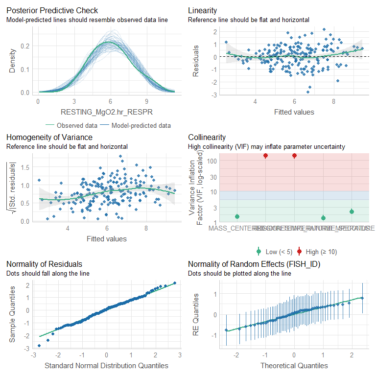<!-- -->

The _rmr.3a_ model performs well, however, in the model validation performed by the **performance** model it looks like there are two variables that are highly correlated. If we expand the figure we can see that the highly correlated variables are REGION and REGION:TEMPERATURE. Perhaps this is unsurprising  but lets see what happens when we run the quadratic (2^nd polynomial) model to see if this helps deal with the high correlation between these two variables, as it performed very similarly to _rmr.3a_, and even had a higher r2 value. 

###### rmr.3.p2a (quadratic)

First we need to update the model by adding in the missing random factor

```r
rmr.3.p2a <- glmmTMB(RESTING_MgO2.hr_RESPR ~ 1+ REGION * poly(TEMPERATURE, 2) + MASS_CENTERED + RESTING_RUNTIME_SECONDS + (1|FISH_ID), 
                 family=gaussian(),
                 data = resp3, 
                 REML = TRUE) 
```

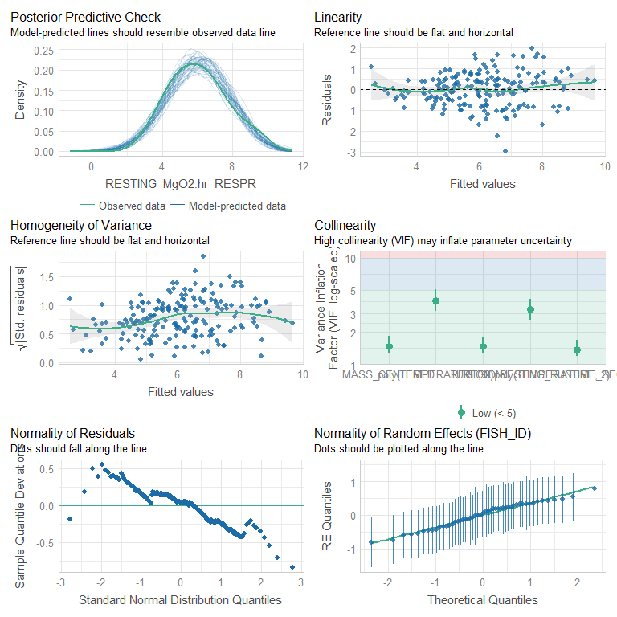<!-- -->

##### DHARMa residuals {.tabset .tabset-faded}

###### rmr.3a (linear)

```r
rmr.3a %>% simulateResiduals(plot=TRUE)
```

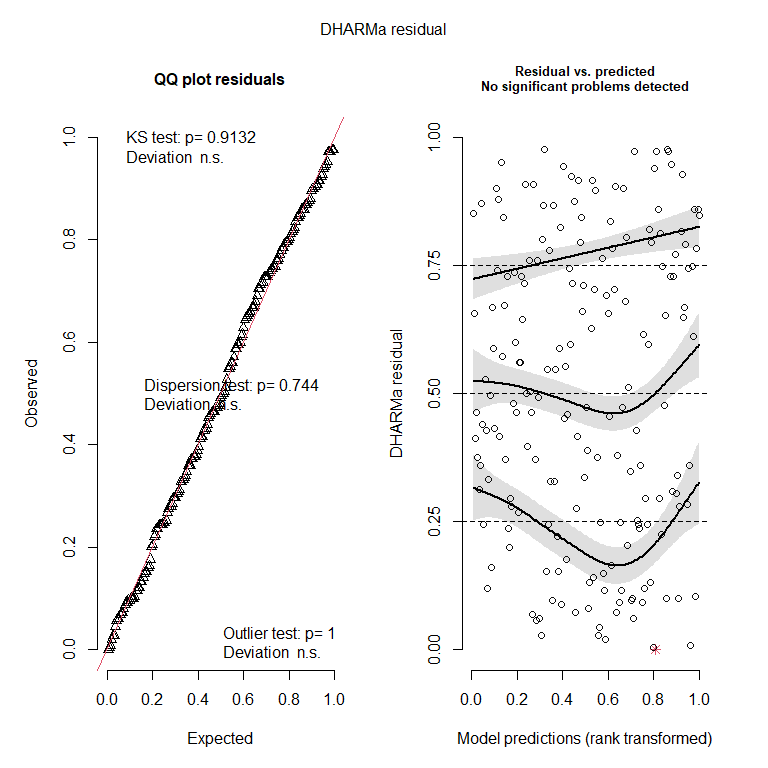<!-- -->

```
## Object of Class DHARMa with simulated residuals based on 250 simulations with refit = FALSE . See ?DHARMa::simulateResiduals for help. 
##  
## Scaled residual values: 0.464 0.76 0.164 0.916 0.844 0.804 0.772 0.816 0.748 0.848 0.328 0.152 0.096 0.14 0 0.308 0.236 0.304 0.372 0.028 ...
```

```r
rmr.3a %>% DHARMa::testResiduals(plot=TRUE)
```

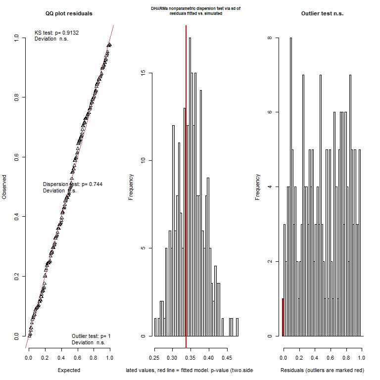<!-- -->

```
## $uniformity
## 
## 	Asymptotic one-sample Kolmogorov-Smirnov test
## 
## data:  simulationOutput$scaledResiduals
## D = 0.040898, p-value = 0.9132
## alternative hypothesis: two-sided
## 
## 
## $dispersion
## 
## 	DHARMa nonparametric dispersion test via sd of residuals fitted vs.
## 	simulated
## 
## data:  simulationOutput
## dispersion = 0.96366, p-value = 0.744
## alternative hypothesis: two.sided
## 
## 
## $outliers
## 
## 	DHARMa outlier test based on exact binomial test with approximate
## 	expectations
## 
## data:  simulationOutput
## outliers at both margin(s) = 1, observations = 187, p-value = 1
## alternative hypothesis: true probability of success is not equal to 0.007968127
## 95 percent confidence interval:
##  0.0001353802 0.0294332214
## sample estimates:
## frequency of outliers (expected: 0.00796812749003984 ) 
##                                            0.005347594
```

```
## $uniformity
## 
## 	Asymptotic one-sample Kolmogorov-Smirnov test
## 
## data:  simulationOutput$scaledResiduals
## D = 0.040898, p-value = 0.9132
## alternative hypothesis: two-sided
## 
## 
## $dispersion
## 
## 	DHARMa nonparametric dispersion test via sd of residuals fitted vs.
## 	simulated
## 
## data:  simulationOutput
## dispersion = 0.96366, p-value = 0.744
## alternative hypothesis: two.sided
## 
## 
## $outliers
## 
## 	DHARMa outlier test based on exact binomial test with approximate
## 	expectations
## 
## data:  simulationOutput
## outliers at both margin(s) = 1, observations = 187, p-value = 1
## alternative hypothesis: true probability of success is not equal to 0.007968127
## 95 percent confidence interval:
##  0.0001353802 0.0294332214
## sample estimates:
## frequency of outliers (expected: 0.00796812749003984 ) 
##                                            0.005347594
```

###### rmr.3.p2 (quadratic)

First we need to update the model by adding in the missing random factor

```r
rmr.3.p2a <- glmmTMB(RESTING_MgO2.hr_RESPR ~ 1+ REGION * poly(TEMPERATURE, 2) + MASS_CENTERED + RESTING_RUNTIME_SECONDS + (1|FISH_ID), 
                 family=gaussian(),
                 data = resp3, 
                 REML = TRUE) 
```


```r
rmr.3.p2a %>% simulateResiduals(plot=TRUE) 
```

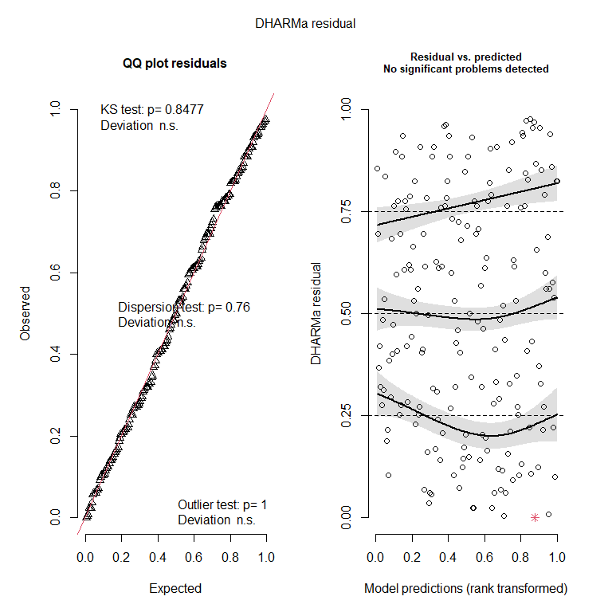<!-- -->

```
## Object of Class DHARMa with simulated residuals based on 250 simulations with refit = FALSE . See ?DHARMa::simulateResiduals for help. 
##  
## Scaled residual values: 0.444 0.784 0.164 0.932 0.884 0.764 0.688 0.852 0.792 0.824 0.308 0.168 0.16 0.06 0 0.408 0.212 0.272 0.272 0.036 ...
```

```r
rmr.3.p2a %>% DHARMa::testResiduals(plot=TRUE)
```

<!-- -->

```
## $uniformity
## 
## 	Asymptotic one-sample Kolmogorov-Smirnov test
## 
## data:  simulationOutput$scaledResiduals
## D = 0.04477, p-value = 0.8477
## alternative hypothesis: two-sided
## 
## 
## $dispersion
## 
## 	DHARMa nonparametric dispersion test via sd of residuals fitted vs.
## 	simulated
## 
## data:  simulationOutput
## dispersion = 0.96383, p-value = 0.76
## alternative hypothesis: two.sided
## 
## 
## $outliers
## 
## 	DHARMa outlier test based on exact binomial test with approximate
## 	expectations
## 
## data:  simulationOutput
## outliers at both margin(s) = 1, observations = 187, p-value = 1
## alternative hypothesis: true probability of success is not equal to 0.007968127
## 95 percent confidence interval:
##  0.0001353802 0.0294332214
## sample estimates:
## frequency of outliers (expected: 0.00796812749003984 ) 
##                                            0.005347594
```

```
## $uniformity
## 
## 	Asymptotic one-sample Kolmogorov-Smirnov test
## 
## data:  simulationOutput$scaledResiduals
## D = 0.04477, p-value = 0.8477
## alternative hypothesis: two-sided
## 
## 
## $dispersion
## 
## 	DHARMa nonparametric dispersion test via sd of residuals fitted vs.
## 	simulated
## 
## data:  simulationOutput
## dispersion = 0.96383, p-value = 0.76
## alternative hypothesis: two.sided
## 
## 
## $outliers
## 
## 	DHARMa outlier test based on exact binomial test with approximate
## 	expectations
## 
## data:  simulationOutput
## outliers at both margin(s) = 1, observations = 187, p-value = 1
## alternative hypothesis: true probability of success is not equal to 0.007968127
## 95 percent confidence interval:
##  0.0001353802 0.0294332214
## sample estimates:
## frequency of outliers (expected: 0.00796812749003984 ) 
##                                            0.005347594
```

##### {-}

#### {-}

It looks like the model that treats temperature as a second order polynomial does a better job at avoiding high levels of collinearity within the model. The quadratic model will be used moving forward because it: 

* The **quadratic model** performs just as well as the linear model based on the model validation scores (i.e., AIC, BIC, and r2) 
* The **quadratic model** does a **better** job at dealing with collinearity that appeared in the model 

#### Partial plots {.tabset .tabset-faded}

##### ggemmeans 

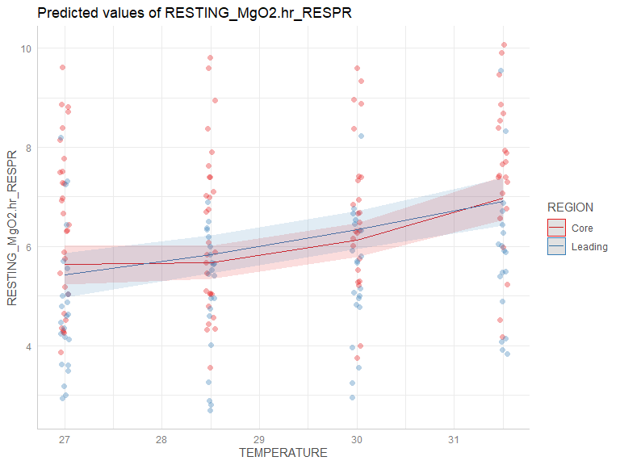<!-- -->

##### plot_model 

<!-- -->

#### {-} 

#### Model investigation {.tabset .tabset-faded}

##### summary 
<table class=" lightable-paper" style='font-family: "Arial Narrow", arial, helvetica, sans-serif; margin-left: auto; margin-right: auto;'>
 <thead>
  <tr>
   <th style="text-align:left;">   </th>
   <th style="text-align:right;"> Estimate </th>
   <th style="text-align:right;"> StdError </th>
   <th style="text-align:right;"> Zvalue </th>
   <th style="text-align:right;"> Pvalue </th>
  </tr>
 </thead>
<tbody>
  <tr>
   <td style="text-align:left;"> (Intercept) </td>
   <td style="text-align:right;"> 8.3165021 </td>
   <td style="text-align:right;"> 0.5180504 </td>
   <td style="text-align:right;"> 16.0534626 </td>
   <td style="text-align:right;"> 0.0000000 </td>
  </tr>
  <tr>
   <td style="text-align:left;"> REGIONLeading </td>
   <td style="text-align:right;"> 0.0172115 </td>
   <td style="text-align:right;"> 0.2341284 </td>
   <td style="text-align:right;"> 0.0735129 </td>
   <td style="text-align:right;"> 0.9413980 </td>
  </tr>
  <tr>
   <td style="text-align:left;"> poly(TEMPERATURE, 2)1 </td>
   <td style="text-align:right;"> 6.5820041 </td>
   <td style="text-align:right;"> 1.3078841 </td>
   <td style="text-align:right;"> 5.0325592 </td>
   <td style="text-align:right;"> 0.0000005 </td>
  </tr>
  <tr>
   <td style="text-align:left;"> poly(TEMPERATURE, 2)2 </td>
   <td style="text-align:right;"> 2.7374223 </td>
   <td style="text-align:right;"> 1.1855357 </td>
   <td style="text-align:right;"> 2.3090171 </td>
   <td style="text-align:right;"> 0.0209426 </td>
  </tr>
  <tr>
   <td style="text-align:left;"> MASS_CENTERED </td>
   <td style="text-align:right;"> 133.3083220 </td>
   <td style="text-align:right;"> 12.2781446 </td>
   <td style="text-align:right;"> 10.8573670 </td>
   <td style="text-align:right;"> 0.0000000 </td>
  </tr>
  <tr>
   <td style="text-align:left;"> RESTING_RUNTIME_SECONDS </td>
   <td style="text-align:right;"> -0.0001467 </td>
   <td style="text-align:right;"> 0.0000321 </td>
   <td style="text-align:right;"> -4.5683146 </td>
   <td style="text-align:right;"> 0.0000049 </td>
  </tr>
  <tr>
   <td style="text-align:left;"> REGIONLeading:poly(TEMPERATURE, 2)1 </td>
   <td style="text-align:right;"> 0.8398236 </td>
   <td style="text-align:right;"> 1.7827144 </td>
   <td style="text-align:right;"> 0.4710926 </td>
   <td style="text-align:right;"> 0.6375746 </td>
  </tr>
  <tr>
   <td style="text-align:left;"> REGIONLeading:poly(TEMPERATURE, 2)2 </td>
   <td style="text-align:right;"> -2.2347739 </td>
   <td style="text-align:right;"> 1.7668476 </td>
   <td style="text-align:right;"> -1.2648368 </td>
   <td style="text-align:right;"> 0.2059298 </td>
  </tr>
</tbody>
</table>

##### Anova 
<table class=" lightable-paper" style='font-family: "Arial Narrow", arial, helvetica, sans-serif; margin-left: auto; margin-right: auto;'>
 <thead>
  <tr>
   <th style="text-align:left;">   </th>
   <th style="text-align:right;"> Chisq </th>
   <th style="text-align:right;"> Df </th>
   <th style="text-align:right;"> Pr(&gt;Chisq) </th>
  </tr>
 </thead>
<tbody>
  <tr>
   <td style="text-align:left;"> REGION </td>
   <td style="text-align:right;"> 0.003263 </td>
   <td style="text-align:right;"> 1 </td>
   <td style="text-align:right;"> 0.9544475 </td>
  </tr>
  <tr>
   <td style="text-align:left;"> poly(TEMPERATURE, 2) </td>
   <td style="text-align:right;"> 51.567789 </td>
   <td style="text-align:right;"> 2 </td>
   <td style="text-align:right;"> 0.0000000 </td>
  </tr>
  <tr>
   <td style="text-align:left;"> MASS_CENTERED </td>
   <td style="text-align:right;"> 117.882419 </td>
   <td style="text-align:right;"> 1 </td>
   <td style="text-align:right;"> 0.0000000 </td>
  </tr>
  <tr>
   <td style="text-align:left;"> RESTING_RUNTIME_SECONDS </td>
   <td style="text-align:right;"> 20.869498 </td>
   <td style="text-align:right;"> 1 </td>
   <td style="text-align:right;"> 0.0000049 </td>
  </tr>
  <tr>
   <td style="text-align:left;"> REGION:poly(TEMPERATURE, 2) </td>
   <td style="text-align:right;"> 1.823912 </td>
   <td style="text-align:right;"> 2 </td>
   <td style="text-align:right;"> 0.4017376 </td>
  </tr>
</tbody>
</table>

##### confint 
<table class=" lightable-paper" style='font-family: "Arial Narrow", arial, helvetica, sans-serif; margin-left: auto; margin-right: auto;'>
 <thead>
  <tr>
   <th style="text-align:left;">   </th>
   <th style="text-align:right;"> 2.5 % </th>
   <th style="text-align:right;"> 97.5 % </th>
   <th style="text-align:right;"> Estimate </th>
  </tr>
 </thead>
<tbody>
  <tr>
   <td style="text-align:left;"> (Intercept) </td>
   <td style="text-align:right;"> 7.3011420 </td>
   <td style="text-align:right;"> 9.3318621 </td>
   <td style="text-align:right;"> 8.3165021 </td>
  </tr>
  <tr>
   <td style="text-align:left;"> REGIONLeading </td>
   <td style="text-align:right;"> -0.4416717 </td>
   <td style="text-align:right;"> 0.4760947 </td>
   <td style="text-align:right;"> 0.0172115 </td>
  </tr>
  <tr>
   <td style="text-align:left;"> poly(TEMPERATURE, 2)1 </td>
   <td style="text-align:right;"> 4.0185984 </td>
   <td style="text-align:right;"> 9.1454098 </td>
   <td style="text-align:right;"> 6.5820041 </td>
  </tr>
  <tr>
   <td style="text-align:left;"> poly(TEMPERATURE, 2)2 </td>
   <td style="text-align:right;"> 0.4138150 </td>
   <td style="text-align:right;"> 5.0610297 </td>
   <td style="text-align:right;"> 2.7374223 </td>
  </tr>
  <tr>
   <td style="text-align:left;"> MASS_CENTERED </td>
   <td style="text-align:right;"> 109.2436009 </td>
   <td style="text-align:right;"> 157.3730432 </td>
   <td style="text-align:right;"> 133.3083220 </td>
  </tr>
  <tr>
   <td style="text-align:left;"> RESTING_RUNTIME_SECONDS </td>
   <td style="text-align:right;"> -0.0002096 </td>
   <td style="text-align:right;"> -0.0000837 </td>
   <td style="text-align:right;"> -0.0001467 </td>
  </tr>
  <tr>
   <td style="text-align:left;"> REGIONLeading:poly(TEMPERATURE, 2)1 </td>
   <td style="text-align:right;"> -2.6542324 </td>
   <td style="text-align:right;"> 4.3338797 </td>
   <td style="text-align:right;"> 0.8398236 </td>
  </tr>
  <tr>
   <td style="text-align:left;"> REGIONLeading:poly(TEMPERATURE, 2)2 </td>
   <td style="text-align:right;"> -5.6977316 </td>
   <td style="text-align:right;"> 1.2281839 </td>
   <td style="text-align:right;"> -2.2347739 </td>
  </tr>
  <tr>
   <td style="text-align:left;"> Std.Dev.(Intercept)|FISH_ID </td>
   <td style="text-align:right;"> 0.3510707 </td>
   <td style="text-align:right;"> 0.7291319 </td>
   <td style="text-align:right;"> 0.5059415 </td>
  </tr>
</tbody>
</table>

##### r-squared
<table class=" lightable-paper" style='font-family: "Arial Narrow", arial, helvetica, sans-serif; margin-left: auto; margin-right: auto;'>
 <thead>
  <tr>
   <th style="text-align:right;"> R2_conditional </th>
   <th style="text-align:right;"> R2_marginal </th>
   <th style="text-align:left;"> optional </th>
  </tr>
 </thead>
<tbody>
  <tr>
   <td style="text-align:right;"> 0.7370331 </td>
   <td style="text-align:right;"> 0.6487262 </td>
   <td style="text-align:left;"> FALSE </td>
  </tr>
</tbody>
</table>

#### {-} 

#### Pairwise comparisons {.tabset .tabset-faded} 

##### emtrends [latitudes]


```r
rmr.3.p2a %>% emtrends(var = "TEMPERATURE", type = "response") %>% pairs(by = "TEMPERATURE") %>% summary(by = NULL, adjust = "tukey", infer=TRUE)
```

<div data-pagedtable="false">
  <script data-pagedtable-source type="application/json">
{"columns":[{"label":[""],"name":["_rn_"],"type":[""],"align":["left"]},{"label":["contrast"],"name":[1],"type":["fct"],"align":["left"]},{"label":["TEMPERATURE"],"name":[2],"type":["dbl"],"align":["right"]},{"label":["estimate"],"name":[3],"type":["dbl"],"align":["right"]},{"label":["SE"],"name":[4],"type":["dbl"],"align":["right"]},{"label":["df"],"name":[5],"type":["dbl"],"align":["right"]},{"label":["lower.CL"],"name":[6],"type":["dbl"],"align":["right"]},{"label":["upper.CL"],"name":[7],"type":["dbl"],"align":["right"]},{"label":["t.ratio"],"name":[8],"type":["dbl"],"align":["right"]},{"label":["p.value"],"name":[9],"type":["dbl"],"align":["right"]}],"data":[{"1":"(Core MASS_CENTERED7.75330706445238e-05 RESTING_RUNTIME_SECONDS15500.5240641711) - (Leading MASS_CENTERED7.75330706445238e-05 RESTING_RUNTIME_SECONDS15500.5240641711)","2":"29.08556","3":"-0.05310072","4":"0.07961835","5":"185","6":"-0.2101774","7":"0.1039759","8":"-0.6669407","9":"0.505641","_rn_":"1"}],"options":{"columns":{"min":{},"max":[10]},"rows":{"min":[10],"max":[10]},"pages":{}}}
  </script>
</div>
SCROLL TO THE RIGHT -->

The numbers in the left most column in the table just mention that the slopes are assuming mean **MASS_CENTERED** and **RESTING_TIME_SEONDS** values when looking at differences between latitudinal slopes.

##### emmeans [latitudes]

```r
rmr.3.p2a %>% emmeans(pairwise ~ TEMPERATURE*REGION, type = "response") %>% pairs(by = "TEMPERATURE") %>% summary(by = NULL, adjust = "tukey", infer=TRUE)
```

<div data-pagedtable="false">
  <script data-pagedtable-source type="application/json">
{"columns":[{"label":[""],"name":["_rn_"],"type":[""],"align":["left"]},{"label":["contrast"],"name":[1],"type":["fct"],"align":["left"]},{"label":["TEMPERATURE"],"name":[2],"type":["dbl"],"align":["right"]},{"label":["estimate"],"name":[3],"type":["dbl"],"align":["right"]},{"label":["SE"],"name":[4],"type":["dbl"],"align":["right"]},{"label":["df"],"name":[5],"type":["dbl"],"align":["right"]},{"label":["lower.CL"],"name":[6],"type":["dbl"],"align":["right"]},{"label":["upper.CL"],"name":[7],"type":["dbl"],"align":["right"]},{"label":["t.ratio"],"name":[8],"type":["dbl"],"align":["right"]},{"label":["p.value"],"name":[9],"type":["dbl"],"align":["right"]}],"data":[{"1":"Core - Leading","2":"29.08556","3":"-0.2175183","4":"0.2828536","5":"185","6":"-0.7755517","7":"0.3405151","8":"-0.7690136","9":"0.4428659","_rn_":"1"}],"options":{"columns":{"min":{},"max":[10]},"rows":{"min":[10],"max":[10]},"pages":{}}}
  </script>
</div>

##### temperature 

```r
rmr.3.p2a %>% emmeans(~ TEMPERATURE*REGION, type = "response")  %>% summary(infer=TRUE)
```

<div data-pagedtable="false">
  <script data-pagedtable-source type="application/json">
{"columns":[{"label":[""],"name":["_rn_"],"type":[""],"align":["left"]},{"label":["TEMPERATURE"],"name":[1],"type":["dbl"],"align":["right"]},{"label":["REGION"],"name":[2],"type":["fct"],"align":["left"]},{"label":["emmean"],"name":[3],"type":["dbl"],"align":["right"]},{"label":["SE"],"name":[4],"type":["dbl"],"align":["right"]},{"label":["df"],"name":[5],"type":["dbl"],"align":["right"]},{"label":["lower.CL"],"name":[6],"type":["dbl"],"align":["right"]},{"label":["upper.CL"],"name":[7],"type":["dbl"],"align":["right"]},{"label":["t.ratio"],"name":[8],"type":["dbl"],"align":["right"]},{"label":["p.value"],"name":[9],"type":["dbl"],"align":["right"]}],"data":[{"1":"29.08556","2":"Core","3":"5.807860","4":"0.1765530","5":"185","6":"5.459544","7":"6.156176","8":"32.89584","9":"3.190502e-79","_rn_":"1"},{"1":"29.08556","2":"Leading","3":"6.025378","4":"0.2004965","5":"185","6":"5.629825","7":"6.420932","8":"30.05229","9":"4.244126e-73","_rn_":"2"}],"options":{"columns":{"min":{},"max":[10]},"rows":{"min":[10],"max":[10]},"pages":{}}}
  </script>
</div>


##### Means - f(temperature)

```r
rmr.3.p2a %>% update(.~1+ REGION * as.factor(TEMPERATURE) + MASS_CENTERED + RESTING_RUNTIME_SECONDS + (1|FISH_ID)) %>% 
  emmeans(~REGION*TEMPERATURE, type = "response") %>% summary(infer=TRUE)
```

<div data-pagedtable="false">
  <script data-pagedtable-source type="application/json">
{"columns":[{"label":[""],"name":["_rn_"],"type":[""],"align":["left"]},{"label":["REGION"],"name":[1],"type":["fct"],"align":["left"]},{"label":["TEMPERATURE"],"name":[2],"type":["dbl"],"align":["right"]},{"label":["emmean"],"name":[3],"type":["dbl"],"align":["right"]},{"label":["SE"],"name":[4],"type":["dbl"],"align":["right"]},{"label":["df"],"name":[5],"type":["dbl"],"align":["right"]},{"label":["lower.CL"],"name":[6],"type":["dbl"],"align":["right"]},{"label":["upper.CL"],"name":[7],"type":["dbl"],"align":["right"]},{"label":["t.ratio"],"name":[8],"type":["dbl"],"align":["right"]},{"label":["p.value"],"name":[9],"type":["dbl"],"align":["right"]}],"data":[{"1":"Core","2":"27.0","3":"5.621100","4":"0.2035805","5":"185","6":"5.219462","7":"6.022738","8":"27.61120","9":"1.582540e-67","_rn_":"1"},{"1":"Leading","2":"27.0","3":"5.451700","4":"0.2294247","5":"185","6":"4.999075","7":"5.904325","8":"23.76248","9":"4.142217e-58","_rn_":"2"},{"1":"Core","2":"28.5","3":"5.665348","4":"0.1991892","5":"185","6":"5.272373","7":"6.058322","8":"28.44204","9":"1.858367e-69","_rn_":"3"},{"1":"Leading","2":"28.5","3":"5.704704","4":"0.2311045","5":"185","6":"5.248764","7":"6.160643","8":"24.68452","9":"1.941657e-60","_rn_":"4"},{"1":"Core","2":"30.0","3":"6.152914","4":"0.2146306","5":"185","6":"5.729476","7":"6.576352","8":"28.66746","9":"5.643319e-70","_rn_":"5"},{"1":"Leading","2":"30.0","3":"6.490145","4":"0.2432571","5":"185","6":"6.010231","7":"6.970060","8":"26.68019","9":"2.540523e-65","_rn_":"6"},{"1":"Core","2":"31.5","3":"6.985710","4":"0.2262840","5":"185","6":"6.539281","7":"7.432139","8":"30.87143","9":"6.675295e-75","_rn_":"7"},{"1":"Leading","2":"31.5","3":"6.861451","4":"0.2501101","5":"185","6":"6.368016","7":"7.354886","8":"27.43372","9":"4.133236e-67","_rn_":"8"}],"options":{"columns":{"min":{},"max":[10]},"rows":{"min":[10],"max":[10]},"pages":{}}}
  </script>
</div>

##### Abs. diff - f(temperature)

```r
rmr.3.p2a %>% update(.~1+ REGION * as.factor(TEMPERATURE) + MASS_CENTERED + RESTING_RUNTIME_SECONDS + (1|FISH_ID)) %>% 
  emmeans(~REGION*TEMPERATURE, type = "response") %>% pairs(by ="REGION") %>% summary(infer=TRUE)
```

<div data-pagedtable="false">
  <script data-pagedtable-source type="application/json">
{"columns":[{"label":[""],"name":["_rn_"],"type":[""],"align":["left"]},{"label":["contrast"],"name":[1],"type":["fct"],"align":["left"]},{"label":["REGION"],"name":[2],"type":["fct"],"align":["left"]},{"label":["estimate"],"name":[3],"type":["dbl"],"align":["right"]},{"label":["SE"],"name":[4],"type":["dbl"],"align":["right"]},{"label":["df"],"name":[5],"type":["dbl"],"align":["right"]},{"label":["lower.CL"],"name":[6],"type":["dbl"],"align":["right"]},{"label":["upper.CL"],"name":[7],"type":["dbl"],"align":["right"]},{"label":["t.ratio"],"name":[8],"type":["dbl"],"align":["right"]},{"label":["p.value"],"name":[9],"type":["dbl"],"align":["right"]}],"data":[{"1":"TEMPERATURE27 - TEMPERATURE28.5","2":"Core","3":"-0.04424797","4":"0.2376907","5":"185","6":"-0.6604694","7":"0.57197349","8":"-0.1861578","9":"9.977040e-01","_rn_":"1"},{"1":"TEMPERATURE27 - TEMPERATURE30","2":"Core","3":"-0.53181439","4":"0.2609503","5":"185","6":"-1.2083371","7":"0.14470828","8":"-2.0379914","9":"1.779066e-01","_rn_":"2"},{"1":"TEMPERATURE27 - TEMPERATURE31.5","2":"Core","3":"-1.36461049","4":"0.2710400","5":"185","6":"-2.0672911","7":"-0.66192991","8":"-5.0347204","9":"6.711507e-06","_rn_":"3"},{"1":"TEMPERATURE28.5 - TEMPERATURE30","2":"Core","3":"-0.48756642","4":"0.2474277","5":"185","6":"-1.1290312","7":"0.15389840","8":"-1.9705413","9":"2.029323e-01","_rn_":"4"},{"1":"TEMPERATURE28.5 - TEMPERATURE31.5","2":"Core","3":"-1.32036252","4":"0.2575930","5":"185","6":"-1.9881814","7":"-0.65254366","8":"-5.1257700","9":"4.413068e-06","_rn_":"5"},{"1":"TEMPERATURE30 - TEMPERATURE31.5","2":"Core","3":"-0.83279610","4":"0.2571900","5":"185","6":"-1.4995700","7":"-0.16602219","8":"-3.2380585","9":"7.721839e-03","_rn_":"6"},{"1":"TEMPERATURE27 - TEMPERATURE28.5","2":"Leading","3":"-0.25300401","4":"0.2617729","5":"185","6":"-0.9316594","7":"0.42565136","8":"-0.9665019","9":"7.686398e-01","_rn_":"7"},{"1":"TEMPERATURE27 - TEMPERATURE30","2":"Leading","3":"-1.03844560","4":"0.2873344","5":"185","6":"-1.7833700","7":"-0.29352119","8":"-3.6140666","9":"2.181806e-03","_rn_":"8"},{"1":"TEMPERATURE27 - TEMPERATURE31.5","2":"Leading","3":"-1.40975145","4":"0.2911352","5":"185","6":"-2.1645295","7":"-0.65497341","8":"-4.8422578","9":"1.599379e-05","_rn_":"9"},{"1":"TEMPERATURE28.5 - TEMPERATURE30","2":"Leading","3":"-0.78544159","4":"0.2878777","5":"185","6":"-1.5317747","7":"-0.03910848","8":"-2.7283859","9":"3.489568e-02","_rn_":"10"},{"1":"TEMPERATURE28.5 - TEMPERATURE31.5","2":"Leading","3":"-1.15674744","4":"0.2918744","5":"185","6":"-1.9134421","7":"-0.40005282","8":"-3.9631682","9":"6.066498e-04","_rn_":"11"},{"1":"TEMPERATURE30 - TEMPERATURE31.5","2":"Leading","3":"-0.37130585","4":"0.2859663","5":"185","6":"-1.1126835","7":"0.37007176","8":"-1.2984252","9":"5.650944e-01","_rn_":"12"}],"options":{"columns":{"min":{},"max":[10]},"rows":{"min":[10],"max":[10]},"pages":{}}}
  </script>
</div>

##### Effect size

```r
rmr.emm <- rmr.3.p2a %>% emmeans(~REGION*TEMPERATURE)
eff_size(rmr.emm, sigma = sigma(rmr.3.p2a), edf=df.residual(rmr.3.p2a))
```

```
##  contrast                                                              
##  Core TEMPERATURE29.0855614973262 - Leading TEMPERATURE29.0855614973262
##  effect.size    SE  df lower.CL upper.CL
##       -0.249 0.324 185   -0.889    0.391
## 
## sigma used for effect sizes: 0.8731 
## Confidence level used: 0.95
```
#### {-}

#### Summary figure 

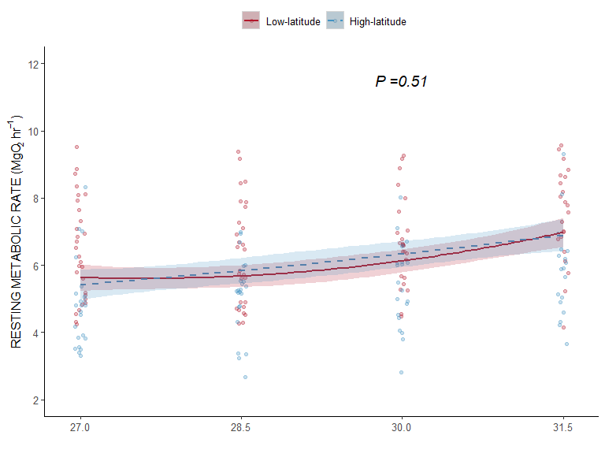<!-- -->

#### Conclusion 

* In conclusion while resting oxygen consumption is **significantly** positively correlated with temperature. However, there is no significant difference in the resting oxygen consumption between the low- and high-latitude regions. 

 
 
### Maximum oxygen consumption 

#### Scenario 

For details on the experiment performed please read the information at the top of this document. In brief, _Acanthochromis polyacanthus_ from two different regions on the Great Barrier Reef (GBR) were tested for metabolic performance at four different temperatures, 27$^\circ$C, 28.5$^\circ$C, 30$^\circ$C, and 31.5$^\circ$C. Fish used in this study were collected from two different regions, low- (i.e. Cairns) and high-latitude (i.e., Mackay), within each region fish were collected from a total of three different populations. Individuals were tested at each temperature, resting oxygen consumption, maximum oxygen consumption. Absolute aerboic scope was calculated by using the following formula: 

Absolute aerobic scope = (maximum oxygen consumption - resting oxygen consumption)

Individuals were first tested at 27$^\circ$C. Water temperature was then increased at a rate of 0.5$^\circ$C Day^-1 until the next temperature was reached. Fish were then provided with an additional 5 day to adjust to the new temperature before aerobic physiology was tested again. 

Three traits are included within the aerobic physiology analysis, resting oxygen consumption, maximum oxygen consumption, and absoulte aerboic scope. Data for each metric was collect from respiratory experiments that had data recorded via a combination of programs including, AquaResp and PyroScience. Slopes (i.e., resting and maximum oxygen consumption values) were then calculated via the **RespR** [https://januarharianto.github.io/respR/articles/respR.html] package.  


#### Read in the data

Before beginning always make sure that you are working in the correct directory 


```r
knitr::opts_knit$set(root.dir=working.dir)
```


Now we can import that data. Replace import data with the PATH to your data file. I have secretly labelled my PATH import.data (i.e. import.data = "PATH TO MY FILE")

#### Load data 


```r
resp <- import.data
```

#### Data manipulation 

Before the data can be analysed it is important to clean up the data file. Below a number of adjustments are made, primarily making sure that columns are being treated appropriately as either factors, numeric, or as time, as well as the renaming of some columns. Once these changes are made the data is being saved into a new dataframe called **resp2** 


```{.r .style}
resp2 = resp %>% 
  dplyr::rename(EXP_FISH_ID = FISH_ID) %>%
  separate(EXP_FISH_ID, c("FISH_ID"), remove = FALSE) %>%
  mutate(FISH_ID = factor(FISH_ID), 
         POPULATION = factor(POPULATION), 
         REGION = factor(REGION), 
         TEMPERATURE = as.numeric(TEMPERATURE), #run with temperature as a factor
         RESTING_DATE = factor(RESTING_DATE), 
         RESTING_CHAMBER = factor(RESTING_CHAMBER), 
         RESTING_SYSTEM = factor(RESTING_SYSTEM), 
         RESTING_SUMP = factor(RESTING_SUMP), 
         RESTING_AM_PM = factor(RESTING_AM_PM), 
         RESTING_START_TIME = hms(RESTING_START_TIME),
         RESTING_END_TIME = hms(RESTING_ENDTIME),
         MAX_DATE = factor(MAX_DATE), 
         MAX_CHAMBER = factor(MAX_CHAMBER), 
         MAX_SYSTEM = factor(MAX_SYSTEM), 
         MAX_SUMP = factor(MAX_SUMP), 
         MAX_AM_PM = factor(MAX_AM_PM), 
         MAX_START_TIME = hms(MAX_START_TIME), 
         Swim.performance = factor(Swim.performance), 
         NAS = as.numeric(NAS), 
         FAS = as.numeric(FAS), 
         MgO2.hr_Net = as.numeric(MgO2.hr_Net), 
         RESTING_RUNTIME_SECONDS = as.numeric(hms(RESTING_RUNTIME))) %>% 
  dplyr::rename(MASS = WEIGHT) %>% 
  mutate(MASS_CENTERED = scale(MASS, scale = FALSE, center = TRUE))
```

Next select data points will be removed. Beside the removed data points I have provided reasoning for their exclusion, such as fish died during the experiment, or data quailty was poor - which likely indicated that there was an issue with the equipment during the trial. 


```r
resp3 <- resp2 %>% 
  subset(  
    EXP_FISH_ID !="LCHA127_27" & # deceased during experiment
      EXP_FISH_ID !="LCHA132_27" & # deceased during experiment
      EXP_FISH_ID !="LKES168_27" # poor data quality
  ) 
```

So far the analysis has been the same as the protocol outlined in the **resting oxygen consumption** data. One additional data removal step will take place in the maximum oxygen consumption analysis for samples where fish swam poorly and therefore their maximum oxygen consumption data is thought to be unreliable. This step is done before any data analysis has taken place. 


```r
resp4 <- resp3 %>% 
  subset(
    EXP_FISH_ID !="CSUD008_27" &  # poor swim
      EXP_FISH_ID !="CSUD008_30" &  # poor swim 
      EXP_FISH_ID !="CSUD008_28.5" & # poor swim
      EXP_FISH_ID !="CSUD018_31.5" & # poor swim 
      EXP_FISH_ID !="CSUD026_30" & # max. value low 
      EXP_FISH_ID !="CSUD074_28.5" & # fas value low 
      EXP_FISH_ID !="CSUD079_30" &
      EXP_FISH_ID !="CVLA052_27" & #nas value low 
      EXP_FISH_ID !="CVLA054_28.5" & # low max value? 
      EXP_FISH_ID !="LCHA113_27" & # poor data quality 
      EXP_FISH_ID !="LCHA113_30" & # poor swim 
      EXP_FISH_ID !="LCHA127_27" # deceased during experiment
  ) 
```

#### Exploratory data analysis {.tabset}

##### Mass v Max


```r
ggplot(resp4, aes(MASS, MAX_MgO2.hr_RESPR)) + 
  geom_point() + 
  geom_smooth(method = "lm") + 
  theme_classic()
```

<!-- -->

##### Mass v Max (LATITUDE)

```r
ggplot(resp4, aes(MASS, MAX_MgO2.hr_RESPR, color = REGION)) + 
  geom_point() +
  theme_classic() + 
  geom_smooth(method = "lm")
```

<!-- -->

##### TEMPERTURE v Max (LATITUDE)

```r
ggplot(resp4, aes(TEMPERATURE, MAX_MgO2.hr_RESPR, color = REGION)) + 
  geom_point() +
  theme_classic()
```

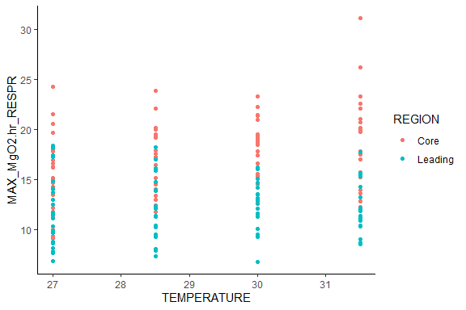<!-- -->

##### {-}

#### Fit the model 

The model was fit using the **glm** and later **glmmTMB** package in R. A number of different models were tested to determine which hypothesis and associated variables best predicted resting oxygen consumption. Model fit was examined using AICc, BIC, and r-squared values. Additional model were examined via the validation diagnostics provided by the **performance** and **dHARMA** packages in R. 

##### Fixed factors (linear regression models)

###### model 1

```r
#--- base model ---#
mmr.1 <- glm(MAX_MgO2.hr_RESPR ~ 1+ REGION * TEMPERATURE + MASS_CENTERED, 
                 family=gaussian(),
                 data = resp4)  
```
####### summary
<table class=" lightable-paper" style='font-family: "Arial Narrow", arial, helvetica, sans-serif; margin-left: auto; margin-right: auto;'>
 <thead>
  <tr>
   <th style="text-align:left;">   </th>
   <th style="text-align:right;"> Estimate </th>
   <th style="text-align:right;"> Std. Error </th>
   <th style="text-align:right;"> t value </th>
   <th style="text-align:right;"> Pr(&gt;|t|) </th>
  </tr>
 </thead>
<tbody>
  <tr>
   <td style="text-align:left;"> (Intercept) </td>
   <td style="text-align:right;"> -4.5748341 </td>
   <td style="text-align:right;"> 4.4522838 </td>
   <td style="text-align:right;"> -1.027525 </td>
   <td style="text-align:right;"> 0.3056245 </td>
  </tr>
  <tr>
   <td style="text-align:left;"> REGIONLeading </td>
   <td style="text-align:right;"> 17.6468408 </td>
   <td style="text-align:right;"> 6.5852635 </td>
   <td style="text-align:right;"> 2.679747 </td>
   <td style="text-align:right;"> 0.0080880 </td>
  </tr>
  <tr>
   <td style="text-align:left;"> TEMPERATURE </td>
   <td style="text-align:right;"> 0.6944978 </td>
   <td style="text-align:right;"> 0.1530872 </td>
   <td style="text-align:right;"> 4.536615 </td>
   <td style="text-align:right;"> 0.0000107 </td>
  </tr>
  <tr>
   <td style="text-align:left;"> MASS_CENTERED </td>
   <td style="text-align:right;"> 298.1596890 </td>
   <td style="text-align:right;"> 24.1436460 </td>
   <td style="text-align:right;"> 12.349406 </td>
   <td style="text-align:right;"> 0.0000000 </td>
  </tr>
  <tr>
   <td style="text-align:left;"> REGIONLeading:TEMPERATURE </td>
   <td style="text-align:right;"> -0.6609056 </td>
   <td style="text-align:right;"> 0.2261837 </td>
   <td style="text-align:right;"> -2.921986 </td>
   <td style="text-align:right;"> 0.0039482 </td>
  </tr>
</tbody>
</table>

###### model 2

```r
#--- experimental rmr equipment hypothesis ---#
mmr.2 <- glm(MAX_MgO2.hr_RESPR ~ 1+ REGION * TEMPERATURE + MAX_SUMP + MAX_CHAMBER + 
                   MAX_AM_PM, 
                 family=gaussian(),
                 data = resp4) 
```

####### summary
<table class=" lightable-paper" style='font-family: "Arial Narrow", arial, helvetica, sans-serif; margin-left: auto; margin-right: auto;'>
 <thead>
  <tr>
   <th style="text-align:left;">   </th>
   <th style="text-align:right;"> Estimate </th>
   <th style="text-align:right;"> Std. Error </th>
   <th style="text-align:right;"> t value </th>
   <th style="text-align:right;"> Pr(&gt;|t|) </th>
  </tr>
 </thead>
<tbody>
  <tr>
   <td style="text-align:left;"> (Intercept) </td>
   <td style="text-align:right;"> -6.2242856 </td>
   <td style="text-align:right;"> 6.4786135 </td>
   <td style="text-align:right;"> -0.9607435 </td>
   <td style="text-align:right;"> 0.3380701 </td>
  </tr>
  <tr>
   <td style="text-align:left;"> REGIONLeading </td>
   <td style="text-align:right;"> 16.0665387 </td>
   <td style="text-align:right;"> 9.1812310 </td>
   <td style="text-align:right;"> 1.7499330 </td>
   <td style="text-align:right;"> 0.0819666 </td>
  </tr>
  <tr>
   <td style="text-align:left;"> TEMPERATURE </td>
   <td style="text-align:right;"> 0.7876835 </td>
   <td style="text-align:right;"> 0.2182937 </td>
   <td style="text-align:right;"> 3.6083665 </td>
   <td style="text-align:right;"> 0.0004069 </td>
  </tr>
  <tr>
   <td style="text-align:left;"> MAX_SUMP2 </td>
   <td style="text-align:right;"> -0.1739027 </td>
   <td style="text-align:right;"> 0.5317501 </td>
   <td style="text-align:right;"> -0.3270383 </td>
   <td style="text-align:right;"> 0.7440484 </td>
  </tr>
  <tr>
   <td style="text-align:left;"> MAX_CHAMBER2 </td>
   <td style="text-align:right;"> 0.9203132 </td>
   <td style="text-align:right;"> 0.7549758 </td>
   <td style="text-align:right;"> 1.2189970 </td>
   <td style="text-align:right;"> 0.2245644 </td>
  </tr>
  <tr>
   <td style="text-align:left;"> MAX_CHAMBER3 </td>
   <td style="text-align:right;"> 1.1525268 </td>
   <td style="text-align:right;"> 0.7667736 </td>
   <td style="text-align:right;"> 1.5030861 </td>
   <td style="text-align:right;"> 0.1347055 </td>
  </tr>
  <tr>
   <td style="text-align:left;"> MAX_CHAMBER4 </td>
   <td style="text-align:right;"> 0.5061699 </td>
   <td style="text-align:right;"> 0.8313336 </td>
   <td style="text-align:right;"> 0.6088649 </td>
   <td style="text-align:right;"> 0.5434413 </td>
  </tr>
  <tr>
   <td style="text-align:left;"> MAX_AM_PMPM </td>
   <td style="text-align:right;"> -0.4757712 </td>
   <td style="text-align:right;"> 0.5382845 </td>
   <td style="text-align:right;"> -0.8838656 </td>
   <td style="text-align:right;"> 0.3780394 </td>
  </tr>
  <tr>
   <td style="text-align:left;"> REGIONLeading:TEMPERATURE </td>
   <td style="text-align:right;"> -0.7177722 </td>
   <td style="text-align:right;"> 0.3148211 </td>
   <td style="text-align:right;"> -2.2799368 </td>
   <td style="text-align:right;"> 0.0238764 </td>
  </tr>
</tbody>
</table>

###### model comparison table
<table class=" lightable-paper" style='font-family: "Arial Narrow", arial, helvetica, sans-serif; margin-left: auto; margin-right: auto;'>
 <thead>
  <tr>
   <th style="text-align:left;"> model </th>
   <th style="text-align:right;"> df </th>
   <th style="text-align:right;"> AICc </th>
   <th style="text-align:right;"> BIC </th>
   <th style="text-align:right;"> r2 </th>
  </tr>
 </thead>
<tbody>
  <tr>
   <td style="text-align:left;"> mmr.1 </td>
   <td style="text-align:right;"> 6 </td>
   <td style="text-align:right;"> 828.4562 </td>
   <td style="text-align:right;"> 846.9821 </td>
   <td style="text-align:right;"> 0.6622066 </td>
  </tr>
  <tr>
   <td style="text-align:left;"> mmr.2 </td>
   <td style="text-align:right;"> 10 </td>
   <td style="text-align:right;"> 945.6551 </td>
   <td style="text-align:right;"> 976.0266 </td>
   <td style="text-align:right;"> 0.3732903 </td>
  </tr>
</tbody>
</table>

The model that contains **MASS_CENTERED** seems to do better than the model that incorporates variables that are associated with the time that experiments are performed.This is demonstrated by the lower AIC and BIC scores, as well as higher r-squared value.  

##### Polynomials 

###### polynomial models 

Note that the linear model has already been created via model _mmr.1_ in the previous section.


```r
mmr.1.p2 <- glm(MAX_MgO2.hr_RESPR ~ 1+ REGION * poly(TEMPERATURE, 2) + MASS_CENTERED, 
                 family=gaussian(),
                 data = resp4)

mmr.1.p3 <- glm(MAX_MgO2.hr_RESPR ~ 1+ REGION * poly(TEMPERATURE, 3) + MASS_CENTERED, 
                 family=gaussian(),
                 data = resp4)
```

####### polynomial model comparisons
<table class=" lightable-paper" style='font-family: "Arial Narrow", arial, helvetica, sans-serif; margin-left: auto; margin-right: auto;'>
 <thead>
  <tr>
   <th style="text-align:left;"> model </th>
   <th style="text-align:right;"> df </th>
   <th style="text-align:right;"> AICc </th>
   <th style="text-align:right;"> BIC </th>
   <th style="text-align:right;"> r2 </th>
  </tr>
 </thead>
<tbody>
  <tr>
   <td style="text-align:left;"> mmr.1 </td>
   <td style="text-align:right;"> 6 </td>
   <td style="text-align:right;"> 828.4562 </td>
   <td style="text-align:right;"> 846.9821 </td>
   <td style="text-align:right;"> 0.6673593 </td>
  </tr>
  <tr>
   <td style="text-align:left;"> mmr.1.p2 </td>
   <td style="text-align:right;"> 8 </td>
   <td style="text-align:right;"> 832.3856 </td>
   <td style="text-align:right;"> 856.8872 </td>
   <td style="text-align:right;"> 0.6681820 </td>
  </tr>
  <tr>
   <td style="text-align:left;"> mmr.1.p3 </td>
   <td style="text-align:right;"> 10 </td>
   <td style="text-align:right;"> 836.8419 </td>
   <td style="text-align:right;"> 867.2134 </td>
   <td style="text-align:right;"> 0.6682098 </td>
  </tr>
</tbody>
</table>

From our model comparison we can see the there is no additional benefit to the model by including temperature as a 2^nd^ or 3^rd^ order polynomial. However, the linear and quadratic model both perform well. 

##### Random factors 

Fish were repeatedly sampled over four different temperatures, therefore repeated sampling needs to be accounted for. To do this random factors will be included within the model. There are a number of options that can be used for random factors including 1) accounting for repeated sampling of individuals, 2) accounting for repeated sampling of individuals nested within population, 3) account for repeated sampling of individuals and populations without nesting. All three models will be run a compared. 

###### random factor models


```r
mmr.1a <- glmmTMB(MAX_MgO2.hr_RESPR ~ 1+ REGION * TEMPERATURE + MASS_CENTERED + (1|FISH_ID), 
                  family=gaussian(),
                  data = resp4,
                  REML = TRUE) 

mmr.1b <- glmmTMB(MAX_MgO2.hr_RESPR ~ 1+ REGION * TEMPERATURE + MASS_CENTERED + (1|POPULATION/FISH_ID), 
                  family=gaussian(),
                  data = resp4,
                  REML = TRUE)

mmr.1c <- glmmTMB(MAX_MgO2.hr_RESPR ~ 1+ REGION * TEMPERATURE + MASS_CENTERED + (1|FISH_ID) + (REGION|POPULATION), 
                  family=gaussian(),
                  data = resp4,
                  REML = TRUE) # Convergence problem
```

####### random factor model comparisons 

<table class=" lightable-paper" style='font-family: "Arial Narrow", arial, helvetica, sans-serif; margin-left: auto; margin-right: auto;'>
 <thead>
  <tr>
   <th style="text-align:left;"> model </th>
   <th style="text-align:right;"> df </th>
   <th style="text-align:right;"> AICc </th>
   <th style="text-align:right;"> BIC </th>
   <th style="text-align:right;"> r2m </th>
   <th style="text-align:right;"> r2c </th>
  </tr>
 </thead>
<tbody>
  <tr>
   <td style="text-align:left;"> mmr.1a </td>
   <td style="text-align:right;"> 7 </td>
   <td style="text-align:right;"> 809.5847 </td>
   <td style="text-align:right;"> 831.1115 </td>
   <td style="text-align:right;"> 0.6693399 </td>
   <td style="text-align:right;"> 0.7836732 </td>
  </tr>
  <tr>
   <td style="text-align:left;"> mmr.1b </td>
   <td style="text-align:right;"> 8 </td>
   <td style="text-align:right;"> 811.5475 </td>
   <td style="text-align:right;"> 836.0491 </td>
   <td style="text-align:right;"> 0.6694043 </td>
   <td style="text-align:right;"> 0.7848247 </td>
  </tr>
  <tr>
   <td style="text-align:left;"> mmr.1c </td>
   <td style="text-align:right;"> 10 </td>
   <td style="text-align:right;"> NA </td>
   <td style="text-align:right;"> NA </td>
   <td style="text-align:right;"> 0.6697666 </td>
   <td style="text-align:right;"> 0.7848011 </td>
  </tr>
</tbody>
</table>

Model _mmr.1a_ appears to be the best model, however, there seems to be little difference in how the models change depending on how the random factors are arranged.

#### Model validation {.tabset .tabset-faded}

##### performance {.tabset .tabset-faded}

###### rmr.3a (linear)
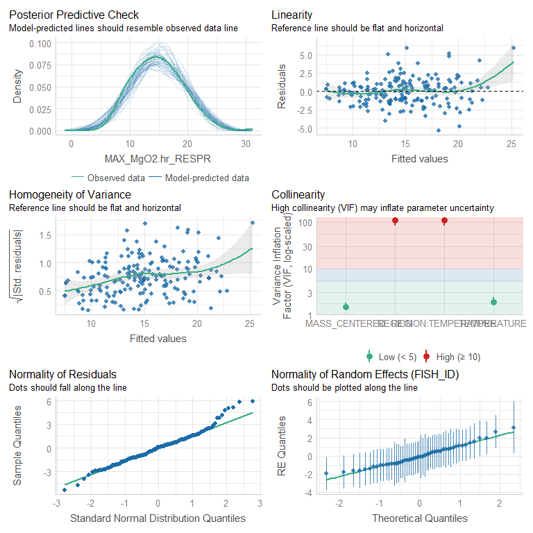<!-- -->

The _mmr.1a_ model performs well, however, in the model validation performed by the **performance** model it looks like there are two variables that are highly correlated. If we expand the figure we can see that the highly correlated variables are REGION and REGION:TEMPERATURE. Perhaps this is unsurprising  but lets see what happens when we run the quadratic (2^nd^ polynomial) model to see if this helps deal with the high correlation between these two variables, as it performed very similarly to _mmr.1a_, and even had a higher r2 value. 

###### mmr.1.p2a (quadratic)

First we need to update the model by adding in the missing random factor

```r
mmr.1.p2a <- glmmTMB(MAX_MgO2.hr_RESPR ~ 1+ REGION * poly(TEMPERATURE, 2) + MASS_CENTERED + (1|FISH_ID), 
                 family=gaussian(),
                 data = resp4, 
                 REML = TRUE) 
```

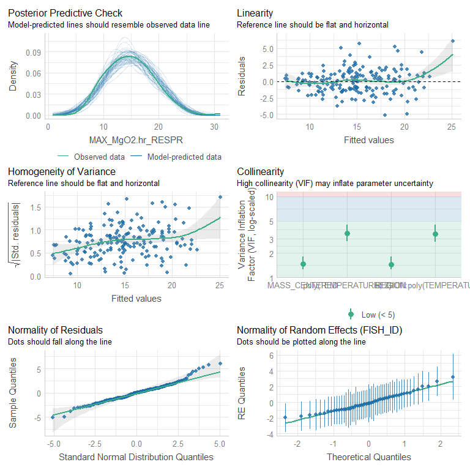<!-- -->

##### DHARMa residuals {.tabset .tabset-faded}

###### mmr.1a (linear)

```r
mmr.1a %>% simulateResiduals(plot=TRUE)
```

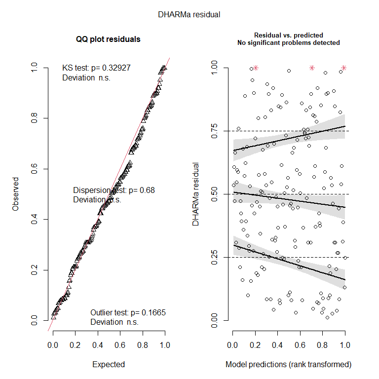<!-- -->

```
## Object of Class DHARMa with simulated residuals based on 250 simulations with refit = FALSE . See ?DHARMa::simulateResiduals for help. 
##  
## Scaled residual values: 0.212 0.328 0.456 0.744 0.812 0.852 1 0.7 0.372 0.684 0.692 0.032 0.216 0.204 0.612 0.084 0.452 0.988 0.936 0.848 ...
```

```r
mmr.1a %>% DHARMa::testResiduals(plot=TRUE)
```

<!-- -->

```
## $uniformity
## 
## 	Asymptotic one-sample Kolmogorov-Smirnov test
## 
## data:  simulationOutput$scaledResiduals
## D = 0.0715, p-value = 0.3293
## alternative hypothesis: two-sided
## 
## 
## $dispersion
## 
## 	DHARMa nonparametric dispersion test via sd of residuals fitted vs.
## 	simulated
## 
## data:  simulationOutput
## dispersion = 0.94899, p-value = 0.68
## alternative hypothesis: two.sided
## 
## 
## $outliers
## 
## 	DHARMa outlier test based on exact binomial test with approximate
## 	expectations
## 
## data:  simulationOutput
## outliers at both margin(s) = 3, observations = 176, p-value = 0.1665
## alternative hypothesis: true probability of success is not equal to 0.007968127
## 95 percent confidence interval:
##  0.003529072 0.049003686
## sample estimates:
## frequency of outliers (expected: 0.00796812749003984 ) 
##                                             0.01704545
```

```
## $uniformity
## 
## 	Asymptotic one-sample Kolmogorov-Smirnov test
## 
## data:  simulationOutput$scaledResiduals
## D = 0.0715, p-value = 0.3293
## alternative hypothesis: two-sided
## 
## 
## $dispersion
## 
## 	DHARMa nonparametric dispersion test via sd of residuals fitted vs.
## 	simulated
## 
## data:  simulationOutput
## dispersion = 0.94899, p-value = 0.68
## alternative hypothesis: two.sided
## 
## 
## $outliers
## 
## 	DHARMa outlier test based on exact binomial test with approximate
## 	expectations
## 
## data:  simulationOutput
## outliers at both margin(s) = 3, observations = 176, p-value = 0.1665
## alternative hypothesis: true probability of success is not equal to 0.007968127
## 95 percent confidence interval:
##  0.003529072 0.049003686
## sample estimates:
## frequency of outliers (expected: 0.00796812749003984 ) 
##                                             0.01704545
```

###### mmr.1.p2 (quadratic)

First we need to update the model by adding in the missing random factor

```r
mmr.1.p2a <- glmmTMB(MAX_MgO2.hr_RESPR ~ 1+ REGION * poly(TEMPERATURE, 2) + MASS_CENTERED + (1|FISH_ID), 
                 family=gaussian(),
                 data = resp4, 
                 REML = TRUE) 
```


```r
mmr.1.p2a %>% simulateResiduals(plot=TRUE) 
```

<!-- -->

```
## Object of Class DHARMa with simulated residuals based on 250 simulations with refit = FALSE . See ?DHARMa::simulateResiduals for help. 
##  
## Scaled residual values: 0.228 0.308 0.492 0.728 0.788 0.876 1 0.728 0.356 0.664 0.724 0.04 0.188 0.192 0.644 0.092 0.42 0.98 0.936 0.836 ...
```

```r
mmr.1.p2a %>% DHARMa::testResiduals(plot=TRUE)
```

<!-- -->

```
## $uniformity
## 
## 	Asymptotic one-sample Kolmogorov-Smirnov test
## 
## data:  simulationOutput$scaledResiduals
## D = 0.076136, p-value = 0.2594
## alternative hypothesis: two-sided
## 
## 
## $dispersion
## 
## 	DHARMa nonparametric dispersion test via sd of residuals fitted vs.
## 	simulated
## 
## data:  simulationOutput
## dispersion = 0.94042, p-value = 0.608
## alternative hypothesis: two.sided
## 
## 
## $outliers
## 
## 	DHARMa outlier test based on exact binomial test with approximate
## 	expectations
## 
## data:  simulationOutput
## outliers at both margin(s) = 3, observations = 176, p-value = 0.1665
## alternative hypothesis: true probability of success is not equal to 0.007968127
## 95 percent confidence interval:
##  0.003529072 0.049003686
## sample estimates:
## frequency of outliers (expected: 0.00796812749003984 ) 
##                                             0.01704545
```

```
## $uniformity
## 
## 	Asymptotic one-sample Kolmogorov-Smirnov test
## 
## data:  simulationOutput$scaledResiduals
## D = 0.076136, p-value = 0.2594
## alternative hypothesis: two-sided
## 
## 
## $dispersion
## 
## 	DHARMa nonparametric dispersion test via sd of residuals fitted vs.
## 	simulated
## 
## data:  simulationOutput
## dispersion = 0.94042, p-value = 0.608
## alternative hypothesis: two.sided
## 
## 
## $outliers
## 
## 	DHARMa outlier test based on exact binomial test with approximate
## 	expectations
## 
## data:  simulationOutput
## outliers at both margin(s) = 3, observations = 176, p-value = 0.1665
## alternative hypothesis: true probability of success is not equal to 0.007968127
## 95 percent confidence interval:
##  0.003529072 0.049003686
## sample estimates:
## frequency of outliers (expected: 0.00796812749003984 ) 
##                                             0.01704545
```

##### {-}

#### {-}

It looks like the model that treats temperature as a second order polynomial does a better job at avoiding high levels of collinearity within the model. The quadratic model will be used moving forward because it: 

* The **quadratic model** performs just as well as the linear model based on the model validation scores (i.e., AIC, BIC, and r2) 
* The **quadratic model** does a **better** job at dealing with collinearity that appeared in the model 

#### Partial plots {.tabset .tabset-faded}

##### ggemmeans 

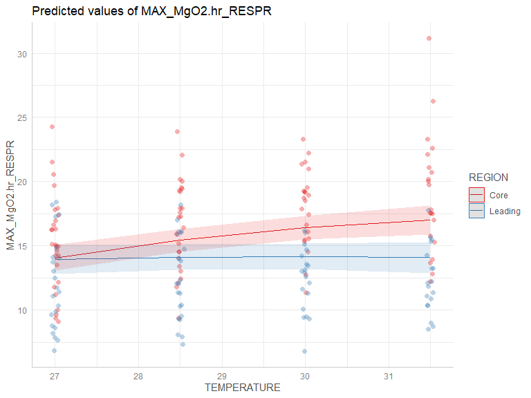<!-- -->

##### plot_model 

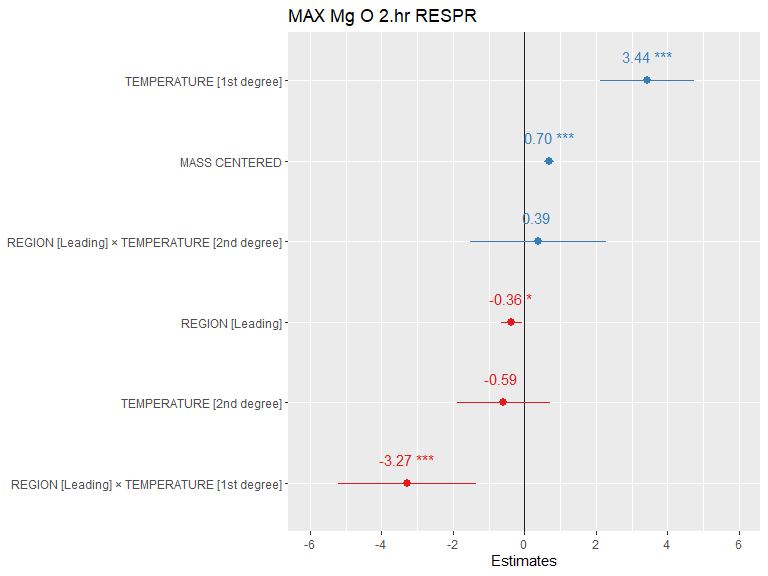<!-- -->

#### {-} 

#### Model investigation {.tabset .tabset-faded}

##### summary 
<table class=" lightable-paper" style='font-family: "Arial Narrow", arial, helvetica, sans-serif; margin-left: auto; margin-right: auto;'>
 <thead>
  <tr>
   <th style="text-align:left;">   </th>
   <th style="text-align:right;"> Estimate </th>
   <th style="text-align:right;"> StdError </th>
   <th style="text-align:right;"> Zvalue </th>
   <th style="text-align:right;"> Pvalue </th>
  </tr>
 </thead>
<tbody>
  <tr>
   <td style="text-align:left;"> (Intercept) </td>
   <td style="text-align:right;"> 15.665104 </td>
   <td style="text-align:right;"> 0.3860064 </td>
   <td style="text-align:right;"> 40.5824948 </td>
   <td style="text-align:right;"> 0.0000000 </td>
  </tr>
  <tr>
   <td style="text-align:left;"> REGIONLeading </td>
   <td style="text-align:right;"> -1.540213 </td>
   <td style="text-align:right;"> 0.6378566 </td>
   <td style="text-align:right;"> -2.4146702 </td>
   <td style="text-align:right;"> 0.0157495 </td>
  </tr>
  <tr>
   <td style="text-align:left;"> poly(TEMPERATURE, 2)1 </td>
   <td style="text-align:right;"> 14.695118 </td>
   <td style="text-align:right;"> 2.8646793 </td>
   <td style="text-align:right;"> 5.1297602 </td>
   <td style="text-align:right;"> 0.0000003 </td>
  </tr>
  <tr>
   <td style="text-align:left;"> poly(TEMPERATURE, 2)2 </td>
   <td style="text-align:right;"> -2.507947 </td>
   <td style="text-align:right;"> 2.8404686 </td>
   <td style="text-align:right;"> -0.8829342 </td>
   <td style="text-align:right;"> 0.3772718 </td>
  </tr>
  <tr>
   <td style="text-align:left;"> MASS_CENTERED </td>
   <td style="text-align:right;"> 313.864413 </td>
   <td style="text-align:right;"> 34.0009493 </td>
   <td style="text-align:right;"> 9.2310485 </td>
   <td style="text-align:right;"> 0.0000000 </td>
  </tr>
  <tr>
   <td style="text-align:left;"> REGIONLeading:poly(TEMPERATURE, 2)1 </td>
   <td style="text-align:right;"> -13.979779 </td>
   <td style="text-align:right;"> 4.2142722 </td>
   <td style="text-align:right;"> -3.3172464 </td>
   <td style="text-align:right;"> 0.0009091 </td>
  </tr>
  <tr>
   <td style="text-align:left;"> REGIONLeading:poly(TEMPERATURE, 2)2 </td>
   <td style="text-align:right;"> 1.659481 </td>
   <td style="text-align:right;"> 4.1665787 </td>
   <td style="text-align:right;"> 0.3982838 </td>
   <td style="text-align:right;"> 0.6904210 </td>
  </tr>
</tbody>
</table>

##### Anova 
<table class=" lightable-paper" style='font-family: "Arial Narrow", arial, helvetica, sans-serif; margin-left: auto; margin-right: auto;'>
 <thead>
  <tr>
   <th style="text-align:left;">   </th>
   <th style="text-align:right;"> Chisq </th>
   <th style="text-align:right;"> Df </th>
   <th style="text-align:right;"> Pr(&gt;Chisq) </th>
  </tr>
 </thead>
<tbody>
  <tr>
   <td style="text-align:left;"> REGION </td>
   <td style="text-align:right;"> 5.244328 </td>
   <td style="text-align:right;"> 1 </td>
   <td style="text-align:right;"> 0.0220184 </td>
  </tr>
  <tr>
   <td style="text-align:left;"> poly(TEMPERATURE, 2) </td>
   <td style="text-align:right;"> 16.284260 </td>
   <td style="text-align:right;"> 2 </td>
   <td style="text-align:right;"> 0.0002910 </td>
  </tr>
  <tr>
   <td style="text-align:left;"> MASS_CENTERED </td>
   <td style="text-align:right;"> 85.212257 </td>
   <td style="text-align:right;"> 1 </td>
   <td style="text-align:right;"> 0.0000000 </td>
  </tr>
  <tr>
   <td style="text-align:left;"> REGION:poly(TEMPERATURE, 2) </td>
   <td style="text-align:right;"> 11.182851 </td>
   <td style="text-align:right;"> 2 </td>
   <td style="text-align:right;"> 0.0037297 </td>
  </tr>
</tbody>
</table>

##### confint 
<table class=" lightable-paper" style='font-family: "Arial Narrow", arial, helvetica, sans-serif; margin-left: auto; margin-right: auto;'>
 <thead>
  <tr>
   <th style="text-align:left;">   </th>
   <th style="text-align:right;"> 2.5 % </th>
   <th style="text-align:right;"> 97.5 % </th>
   <th style="text-align:right;"> Estimate </th>
  </tr>
 </thead>
<tbody>
  <tr>
   <td style="text-align:left;"> (Intercept) </td>
   <td style="text-align:right;"> 14.908545 </td>
   <td style="text-align:right;"> 16.4216626 </td>
   <td style="text-align:right;"> 15.665104 </td>
  </tr>
  <tr>
   <td style="text-align:left;"> REGIONLeading </td>
   <td style="text-align:right;"> -2.790389 </td>
   <td style="text-align:right;"> -0.2900373 </td>
   <td style="text-align:right;"> -1.540213 </td>
  </tr>
  <tr>
   <td style="text-align:left;"> poly(TEMPERATURE, 2)1 </td>
   <td style="text-align:right;"> 9.080450 </td>
   <td style="text-align:right;"> 20.3097864 </td>
   <td style="text-align:right;"> 14.695118 </td>
  </tr>
  <tr>
   <td style="text-align:left;"> poly(TEMPERATURE, 2)2 </td>
   <td style="text-align:right;"> -8.075163 </td>
   <td style="text-align:right;"> 3.0592692 </td>
   <td style="text-align:right;"> -2.507947 </td>
  </tr>
  <tr>
   <td style="text-align:left;"> MASS_CENTERED </td>
   <td style="text-align:right;"> 247.223777 </td>
   <td style="text-align:right;"> 380.5050495 </td>
   <td style="text-align:right;"> 313.864413 </td>
  </tr>
  <tr>
   <td style="text-align:left;"> REGIONLeading:poly(TEMPERATURE, 2)1 </td>
   <td style="text-align:right;"> -22.239601 </td>
   <td style="text-align:right;"> -5.7199575 </td>
   <td style="text-align:right;"> -13.979779 </td>
  </tr>
  <tr>
   <td style="text-align:left;"> REGIONLeading:poly(TEMPERATURE, 2)2 </td>
   <td style="text-align:right;"> -6.506863 </td>
   <td style="text-align:right;"> 9.8258252 </td>
   <td style="text-align:right;"> 1.659481 </td>
  </tr>
  <tr>
   <td style="text-align:left;"> Std.Dev.(Intercept)|FISH_ID </td>
   <td style="text-align:right;"> 1.054358 </td>
   <td style="text-align:right;"> 2.1168357 </td>
   <td style="text-align:right;"> 1.493956 </td>
  </tr>
</tbody>
</table>

##### r-squared
<table class=" lightable-paper" style='font-family: "Arial Narrow", arial, helvetica, sans-serif; margin-left: auto; margin-right: auto;'>
 <thead>
  <tr>
   <th style="text-align:right;"> R2_conditional </th>
   <th style="text-align:right;"> R2_marginal </th>
   <th style="text-align:left;"> optional </th>
  </tr>
 </thead>
<tbody>
  <tr>
   <td style="text-align:right;"> 0.7829506 </td>
   <td style="text-align:right;"> 0.6683685 </td>
   <td style="text-align:left;"> FALSE </td>
  </tr>
</tbody>
</table>

#### {-} 

#### Pairwise comparisons {.tabset .tabset-faded} 

##### emtrends [latitudes]


```r
mmr.1.p2a %>% emtrends(var = "TEMPERATURE", type = "response") %>% pairs(by = "TEMPERATURE") %>% summary(by = NULL, adjust = "tukey", infer=TRUE)
```

<div data-pagedtable="false">
  <script data-pagedtable-source type="application/json">
{"columns":[{"label":[""],"name":["_rn_"],"type":[""],"align":["left"]},{"label":["contrast"],"name":[1],"type":["fct"],"align":["left"]},{"label":["TEMPERATURE"],"name":[2],"type":["dbl"],"align":["right"]},{"label":["estimate"],"name":[3],"type":["dbl"],"align":["right"]},{"label":["SE"],"name":[4],"type":["dbl"],"align":["right"]},{"label":["df"],"name":[5],"type":["dbl"],"align":["right"]},{"label":["lower.CL"],"name":[6],"type":["dbl"],"align":["right"]},{"label":["upper.CL"],"name":[7],"type":["dbl"],"align":["right"]},{"label":["t.ratio"],"name":[8],"type":["dbl"],"align":["right"]},{"label":["p.value"],"name":[9],"type":["dbl"],"align":["right"]}],"data":[{"1":"(Core MASS_CENTERED-0.000127610645933016) - (Leading MASS_CENTERED-0.000127610645933016)","2":"29.09659","3":"0.6432331","4":"0.1924589","5":"174","6":"0.2633786","7":"1.023088","8":"3.342184","9":"0.001017531","_rn_":"1"}],"options":{"columns":{"min":{},"max":[10]},"rows":{"min":[10],"max":[10]},"pages":{}}}
  </script>
</div>
SCROLL TO THE RIGHT -->

The numbers in the left most column in the table just mention that the slopes are assuming mean **MASS_CENTERED** values when looking at differences between latitudinal slopes.

##### emmeans [latitudes]

```r
mmr.1.p2a %>% emmeans(pairwise ~ TEMPERATURE*REGION, type = "response") %>% pairs(by = "TEMPERATURE") %>% summary(by = NULL, adjust = "tukey", infer=TRUE)
```

<div data-pagedtable="false">
  <script data-pagedtable-source type="application/json">
{"columns":[{"label":[""],"name":["_rn_"],"type":[""],"align":["left"]},{"label":["contrast"],"name":[1],"type":["fct"],"align":["left"]},{"label":["TEMPERATURE"],"name":[2],"type":["dbl"],"align":["right"]},{"label":["estimate"],"name":[3],"type":["dbl"],"align":["right"]},{"label":["SE"],"name":[4],"type":["dbl"],"align":["right"]},{"label":["df"],"name":[5],"type":["dbl"],"align":["right"]},{"label":["lower.CL"],"name":[6],"type":["dbl"],"align":["right"]},{"label":["upper.CL"],"name":[7],"type":["dbl"],"align":["right"]},{"label":["t.ratio"],"name":[8],"type":["dbl"],"align":["right"]},{"label":["p.value"],"name":[9],"type":["dbl"],"align":["right"]}],"data":[{"1":"Core - Leading","2":"29.09659","3":"1.695557","4":"0.7435233","5":"174","6":"0.2280712","7":"3.163042","8":"2.280435","9":"0.02379491","_rn_":"1"}],"options":{"columns":{"min":{},"max":[10]},"rows":{"min":[10],"max":[10]},"pages":{}}}
  </script>
</div>

##### temperature 

```r
mmr.1.p2a %>% emmeans(~ TEMPERATURE*REGION, type = "response")  %>% summary(infer=TRUE)
```

<div data-pagedtable="false">
  <script data-pagedtable-source type="application/json">
{"columns":[{"label":[""],"name":["_rn_"],"type":[""],"align":["left"]},{"label":["TEMPERATURE"],"name":[1],"type":["dbl"],"align":["right"]},{"label":["REGION"],"name":[2],"type":["fct"],"align":["left"]},{"label":["emmean"],"name":[3],"type":["dbl"],"align":["right"]},{"label":["SE"],"name":[4],"type":["dbl"],"align":["right"]},{"label":["df"],"name":[5],"type":["dbl"],"align":["right"]},{"label":["lower.CL"],"name":[6],"type":["dbl"],"align":["right"]},{"label":["upper.CL"],"name":[7],"type":["dbl"],"align":["right"]},{"label":["t.ratio"],"name":[8],"type":["dbl"],"align":["right"]},{"label":["p.value"],"name":[9],"type":["dbl"],"align":["right"]}],"data":[{"1":"29.09659","2":"Core","3":"15.85982","4":"0.4704955","5":"174","6":"14.93121","7":"16.78843","8":"33.70876","9":"3.378353e-78","_rn_":"1"},{"1":"29.09659","2":"Leading","3":"14.16426","4":"0.5214344","5":"174","6":"13.13511","7":"15.19341","8":"27.16403","9":"1.735592e-64","_rn_":"2"}],"options":{"columns":{"min":{},"max":[10]},"rows":{"min":[10],"max":[10]},"pages":{}}}
  </script>
</div>


##### Means - f(temperature)

```r
mmr.1.p2a %>% update(.~1+ REGION * as.factor(TEMPERATURE) + MASS_CENTERED + RESTING_RUNTIME_SECONDS + (1|FISH_ID)) %>% 
  emmeans(~REGION*TEMPERATURE, type = "response") %>% summary(infer=TRUE)
```

<div data-pagedtable="false">
  <script data-pagedtable-source type="application/json">
{"columns":[{"label":[""],"name":["_rn_"],"type":[""],"align":["left"]},{"label":["REGION"],"name":[1],"type":["fct"],"align":["left"]},{"label":["TEMPERATURE"],"name":[2],"type":["dbl"],"align":["right"]},{"label":["emmean"],"name":[3],"type":["dbl"],"align":["right"]},{"label":["SE"],"name":[4],"type":["dbl"],"align":["right"]},{"label":["df"],"name":[5],"type":["dbl"],"align":["right"]},{"label":["lower.CL"],"name":[6],"type":["dbl"],"align":["right"]},{"label":["upper.CL"],"name":[7],"type":["dbl"],"align":["right"]},{"label":["t.ratio"],"name":[8],"type":["dbl"],"align":["right"]},{"label":["p.value"],"name":[9],"type":["dbl"],"align":["right"]}],"data":[{"1":"Core","2":"27.0","3":"13.90434","4":"0.5275303","5":"174","6":"12.86315","7":"14.94552","8":"26.35742","9":"1.187092e-62","_rn_":"1"},{"1":"Leading","2":"27.0","3":"13.83242","4":"0.5923828","5":"174","6":"12.66324","7":"15.00160","8":"23.35048","9":"1.659212e-55","_rn_":"2"},{"1":"Core","2":"28.5","3":"15.44277","4":"0.5243370","5":"174","6":"14.40789","7":"16.47765","8":"29.45200","9":"1.638937e-69","_rn_":"3"},{"1":"Leading","2":"28.5","3":"14.06788","4":"0.5882491","5":"174","6":"12.90686","7":"15.22891","8":"23.91484","9":"6.943035e-57","_rn_":"4"},{"1":"Core","2":"30.0","3":"16.46500","4":"0.5667728","5":"174","6":"15.34637","7":"17.58364","8":"29.05045","9":"1.195713e-68","_rn_":"5"},{"1":"Leading","2":"30.0","3":"14.25629","4":"0.6251032","5":"174","6":"13.02253","7":"15.49005","8":"22.80629","9":"3.676862e-54","_rn_":"6"},{"1":"Core","2":"31.5","3":"17.12324","4":"0.5798435","5":"174","6":"15.97880","7":"18.26767","8":"29.53079","9":"1.112103e-69","_rn_":"7"},{"1":"Leading","2":"31.5","3":"14.20198","4":"0.6317663","5":"174","6":"12.95507","7":"15.44889","8":"22.47980","9":"2.402005e-53","_rn_":"8"}],"options":{"columns":{"min":{},"max":[10]},"rows":{"min":[10],"max":[10]},"pages":{}}}
  </script>
</div>

##### Abs. diff - f(temperature)

```r
mmr.1.p2a %>% update(.~1+ REGION * as.factor(TEMPERATURE) + MASS_CENTERED + RESTING_RUNTIME_SECONDS + (1|FISH_ID)) %>% 
  emmeans(~REGION*TEMPERATURE, type = "response") %>% pairs(by ="REGION") %>% summary(infer=TRUE)
```

<div data-pagedtable="false">
  <script data-pagedtable-source type="application/json">
{"columns":[{"label":[""],"name":["_rn_"],"type":[""],"align":["left"]},{"label":["contrast"],"name":[1],"type":["fct"],"align":["left"]},{"label":["REGION"],"name":[2],"type":["fct"],"align":["left"]},{"label":["estimate"],"name":[3],"type":["dbl"],"align":["right"]},{"label":["SE"],"name":[4],"type":["dbl"],"align":["right"]},{"label":["df"],"name":[5],"type":["dbl"],"align":["right"]},{"label":["lower.CL"],"name":[6],"type":["dbl"],"align":["right"]},{"label":["upper.CL"],"name":[7],"type":["dbl"],"align":["right"]},{"label":["t.ratio"],"name":[8],"type":["dbl"],"align":["right"]},{"label":["p.value"],"name":[9],"type":["dbl"],"align":["right"]}],"data":[{"1":"TEMPERATURE27 - TEMPERATURE28.5","2":"Core","3":"-1.53843734","4":"0.5938799","5":"174","6":"-3.078980","7":"0.00210572","8":"-2.59048559","9":"5.045819e-02","_rn_":"1"},{"1":"TEMPERATURE27 - TEMPERATURE30","2":"Core","3":"-2.56066721","4":"0.6492325","5":"174","6":"-4.244797","7":"-0.87653775","8":"-3.94414504","9":"6.654002e-04","_rn_":"2"},{"1":"TEMPERATURE27 - TEMPERATURE31.5","2":"Core","3":"-3.21889902","4":"0.6599391","5":"174","6":"-4.930802","7":"-1.50699640","8":"-4.87756996","9":"1.427813e-05","_rn_":"3"},{"1":"TEMPERATURE28.5 - TEMPERATURE30","2":"Core","3":"-1.02222987","4":"0.6287983","5":"174","6":"-2.653352","7":"0.60889261","8":"-1.62568801","9":"3.669065e-01","_rn_":"4"},{"1":"TEMPERATURE28.5 - TEMPERATURE31.5","2":"Core","3":"-1.68046168","4":"0.6392790","5":"174","6":"-3.338772","7":"-0.02215185","8":"-2.62868259","9":"4.570512e-02","_rn_":"5"},{"1":"TEMPERATURE30 - TEMPERATURE31.5","2":"Core","3":"-0.65823181","4":"0.6452530","5":"174","6":"-2.332038","7":"1.01557474","8":"-1.02011425","9":"7.378999e-01","_rn_":"6"},{"1":"TEMPERATURE27 - TEMPERATURE28.5","2":"Leading","3":"-0.23546008","4":"0.6295418","5":"174","6":"-1.868511","7":"1.39759118","8":"-0.37401815","9":"9.821016e-01","_rn_":"7"},{"1":"TEMPERATURE27 - TEMPERATURE30","2":"Leading","3":"-0.42386353","4":"0.6960953","5":"174","6":"-2.229557","7":"1.38182947","8":"-0.60891595","9":"9.291393e-01","_rn_":"8"},{"1":"TEMPERATURE27 - TEMPERATURE31.5","2":"Leading","3":"-0.36955401","4":"0.6966401","5":"174","6":"-2.176660","7":"1.43755227","8":"-0.53048052","9":"9.515685e-01","_rn_":"9"},{"1":"TEMPERATURE28.5 - TEMPERATURE30","2":"Leading","3":"-0.18840346","4":"0.6933597","5":"174","6":"-1.987000","7":"1.61019341","8":"-0.27172541","9":"9.929633e-01","_rn_":"10"},{"1":"TEMPERATURE28.5 - TEMPERATURE31.5","2":"Leading","3":"-0.13409394","4":"0.6943276","5":"174","6":"-1.935202","7":"1.66701369","8":"-0.19312775","9":"9.974383e-01","_rn_":"11"},{"1":"TEMPERATURE30 - TEMPERATURE31.5","2":"Leading","3":"0.05430952","4":"0.6839527","5":"174","6":"-1.719885","7":"1.82850415","8":"0.07940538","9":"9.998198e-01","_rn_":"12"}],"options":{"columns":{"min":{},"max":[10]},"rows":{"min":[10],"max":[10]},"pages":{}}}
  </script>
</div>

##### Effect size

```r
mmr.emm <- mmr.1.p2a %>% emmeans(~REGION*TEMPERATURE)
eff_size(mmr.emm, sigma = sigma(mmr.1.p2a), edf=df.residual(mmr.1.p2a))
```

```
##  contrast                                                              
##  Core TEMPERATURE29.0965909090909 - Leading TEMPERATURE29.0965909090909
##  effect.size    SE  df lower.CL upper.CL
##        0.825 0.364 174    0.106     1.54
## 
## sigma used for effect sizes: 2.056 
## Confidence level used: 0.95
```
#### {-}

#### Summary figure 

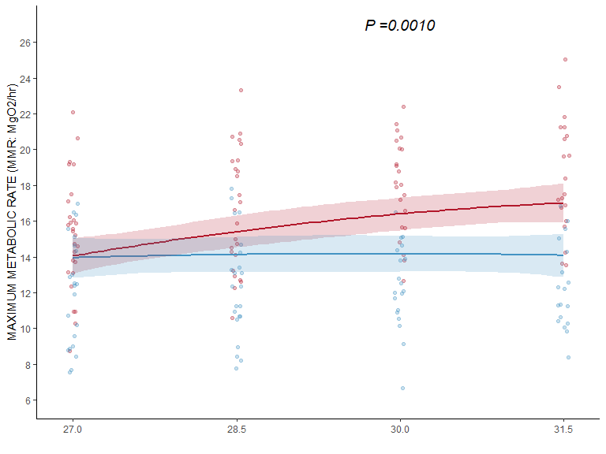<!-- -->


#### Conclusion 

* In conclusion while maximum oxygen consumption is **significantly** positively correlated with temperature and fish from low latitudes have **significantly** higher maximum consumption at elevated temperatures compared to fish from high latitudes.


### Absolute aerobic scope 

#### Scenario 

For details on the experiment performed please read the information at the top of this document. In brief, _Acanthochromis polyacanthus_ from two different regions on the Great Barrier Reef (GBR) were tested for metabolic performance at four different temperatures, 27$^\circ$C, 28.5$^\circ$C, 30$^\circ$C, and 31.5$^\circ$C. Fish used in this study were collected from two different regions, low- (i.e. Cairns) and high-latitude (i.e., Mackay), within each region fish were collected from a total of three different populations. Individuals were tested at each temperature, resting oxygen consumption, maximum oxygen consumption. Absolute aerboic scope was calculated by using the following formula: 

Absolute aerobic scope = (maximum oxygen consumption - resting oxygen consumption)

Individuals were first tested at 27$^\circ$C. Water temperature was then increased at a rate of 0.5$^\circ$C Day^-1 until the next temperature was reached. Fish were then provided with an additional 5 day to adjust to the new temperature before aerobic physiology was tested again. 

Three traits are included within the aerobic physiology analysis, resting oxygen consumption, maximum oxygen consumption, and absolute aerobic scope. Data for each metric was collect from respiratory experiments that had data recorded via a combination of programs including, AquaResp3 and PyroScience. Slopes (i.e., resting and maximum oxygen consumption values) were then calculated via the **RespR** [https://januarharianto.github.io/respR/articles/respR.html] package.   

**Note:** Absolute aerobic scope is sometime called net aerobic scope. When making the models labeling was done using 'net aerobic scope' (i.e., nas). 


#### Read in the data

Before beginning always make sure that you are working in the correct directory 


```r
knitr::opts_knit$set(root.dir=working.dir)
```

Now we can import that data. Replace import data with the PATH to your data file. I have secretly labelled my PATH import.data (i.e. import.data = "PATH TO MY FILE")

##### Load data 


```r
resp <- import.data
```

#### Data manipulation 

Before the data can be analysed it is important to clean up the data file. Below a number of adjustments are made, primarily making sure that columns are being treated appropriately as either factors, numeric, or as time, as well as the renaming of some columns. Once these changes are made the data is being saved into a new dataframe called **resp2** 


```{.r .style}
resp2 = resp %>% 
  dplyr::rename(EXP_FISH_ID = FISH_ID) %>%
  separate(EXP_FISH_ID, c("FISH_ID"), remove = FALSE) %>%
  mutate(FISH_ID = factor(FISH_ID), 
         POPULATION = factor(POPULATION), 
         REGION = factor(REGION), 
         TEMPERATURE = as.numeric(TEMPERATURE), #run with temperature as a factor
         RESTING_DATE = factor(RESTING_DATE), 
         RESTING_CHAMBER = factor(RESTING_CHAMBER), 
         RESTING_SYSTEM = factor(RESTING_SYSTEM), 
         RESTING_SUMP = factor(RESTING_SUMP), 
         RESTING_AM_PM = factor(RESTING_AM_PM), 
         RESTING_START_TIME = hms(RESTING_START_TIME),
         RESTING_END_TIME = hms(RESTING_ENDTIME),
         MAX_DATE = factor(MAX_DATE), 
         MAX_CHAMBER = factor(MAX_CHAMBER), 
         MAX_SYSTEM = factor(MAX_SYSTEM), 
         MAX_SUMP = factor(MAX_SUMP), 
         MAX_AM_PM = factor(MAX_AM_PM), 
         MAX_START_TIME = hms(MAX_START_TIME), 
         Swim.performance = factor(Swim.performance), 
         NAS = as.numeric(NAS), 
         FAS = as.numeric(FAS), 
         MgO2.hr_Net = as.numeric(MgO2.hr_Net), 
         RESTING_RUNTIME_SECONDS = as.numeric(hms(RESTING_RUNTIME))) %>% 
  dplyr::rename(MASS = WEIGHT) %>% 
  mutate(MASS_CENTERED = scale(MASS, scale = FALSE, center = TRUE))
```

Next select data points will be removed. Beside the removed data points I have provided reasoning for their exclusion, such as fish died during the experiment, or data quailty was poor - which likely indicated that there was an issue with the equipment during the trial. 


```r
resp3 <- resp2 %>% 
  subset(  
    EXP_FISH_ID !="LCHA127_27" & # deceased during experiment
      EXP_FISH_ID !="LCHA132_27" & # deceased during experiment
      EXP_FISH_ID !="LKES168_27" # poor data quality
  ) 
```

So far the analysis has been the same as the protocol outlined in the **maximum oxygen consumption** data.  


```r
resp4 <- resp3 %>% 
  subset(
    EXP_FISH_ID !="CSUD008_27" &  # poor swim
      EXP_FISH_ID !="CSUD008_30" &  # poor swim 
      EXP_FISH_ID !="CSUD008_28.5" & # poor swim
      EXP_FISH_ID !="CSUD018_31.5" & # poor swim 
      EXP_FISH_ID !="CSUD026_30" & # max. value low 
      EXP_FISH_ID !="CSUD074_28.5" & # fas value low 
      EXP_FISH_ID !="CSUD079_30" &
      EXP_FISH_ID !="CVLA052_27" & #nas value low 
      EXP_FISH_ID !="CVLA054_28.5" & # low max value? 
      EXP_FISH_ID !="LCHA113_27" & # poor data quality 
      EXP_FISH_ID !="LCHA113_30" & # poor swim 
      EXP_FISH_ID !="LCHA127_27" # deceased during experiment
  ) 
```

#### Exploratory data analysis {.tabset}

##### Mass v AAS


```r
ggplot(resp4, aes(MASS, MgO2.hr_Net)) + 
  geom_point() + 
  geom_smooth(method = "lm") + 
  theme_classic()
```

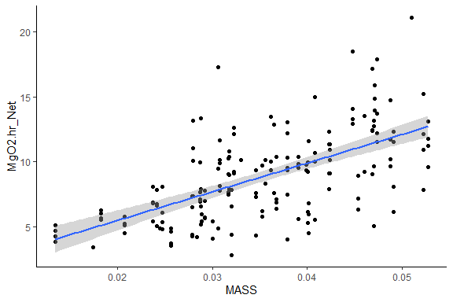<!-- -->

##### Mass v AAS (LATITUDE)

```r
ggplot(resp4, aes(MASS, MgO2.hr_Net, color = REGION)) + 
  geom_point() +
  theme_classic() + 
  geom_smooth(method = "lm")
```

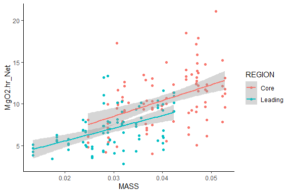<!-- -->

##### TEMPERTURE v AAS (LATITUDE)

```r
ggplot(resp4, aes(TEMPERATURE, MgO2.hr_Net, color = REGION)) + 
  geom_point() +
  theme_classic()
```

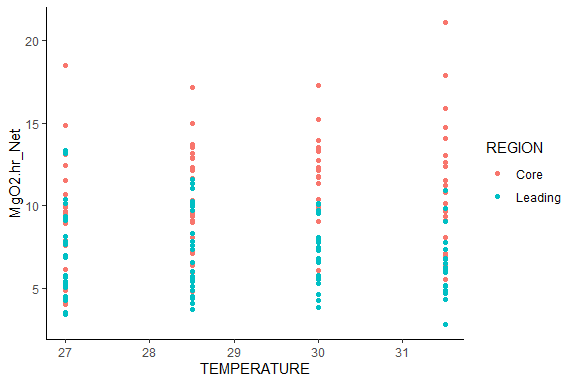<!-- -->

##### {-}

#### Fit the model 

The model was fit using the **glm** and later **glmmTMB** package in R. A number of different models were tested to determine which hypothesis and associated variables best predicted resting oxygen consumption. Model fit was examined using AICc, BIC, and r-squared values. Additional model were examined via the validation diagnostics provided by the **performance** and **dHARMA** packages in R. 


##### Fixed factors (linear regression models)

###### model 1

```r
#--- base model ---#
nas.1 <- glm(MgO2.hr_Net ~ 1+ REGION * TEMPERATURE + MASS_CENTERED, 
                 family=gaussian(),
                 data = resp4)  
```
####### summary
<table class=" lightable-paper" style='font-family: "Arial Narrow", arial, helvetica, sans-serif; margin-left: auto; margin-right: auto;'>
 <thead>
  <tr>
   <th style="text-align:left;">   </th>
   <th style="text-align:right;"> Estimate </th>
   <th style="text-align:right;"> Std. Error </th>
   <th style="text-align:right;"> t value </th>
   <th style="text-align:right;"> Pr(&gt;|t|) </th>
  </tr>
 </thead>
<tbody>
  <tr>
   <td style="text-align:left;"> (Intercept) </td>
   <td style="text-align:right;"> -4.6505476 </td>
   <td style="text-align:right;"> 4.5988210 </td>
   <td style="text-align:right;"> -1.011248 </td>
   <td style="text-align:right;"> 0.3133266 </td>
  </tr>
  <tr>
   <td style="text-align:left;"> REGIONLeading </td>
   <td style="text-align:right;"> 17.8617376 </td>
   <td style="text-align:right;"> 6.8020030 </td>
   <td style="text-align:right;"> 2.625953 </td>
   <td style="text-align:right;"> 0.0094246 </td>
  </tr>
  <tr>
   <td style="text-align:left;"> TEMPERATURE </td>
   <td style="text-align:right;"> 0.4921098 </td>
   <td style="text-align:right;"> 0.1581257 </td>
   <td style="text-align:right;"> 3.112143 </td>
   <td style="text-align:right;"> 0.0021773 </td>
  </tr>
  <tr>
   <td style="text-align:left;"> MASS_CENTERED </td>
   <td style="text-align:right;"> 167.6469322 </td>
   <td style="text-align:right;"> 24.9382811 </td>
   <td style="text-align:right;"> 6.722473 </td>
   <td style="text-align:right;"> 0.0000000 </td>
  </tr>
  <tr>
   <td style="text-align:left;"> REGIONLeading:TEMPERATURE </td>
   <td style="text-align:right;"> -0.6707332 </td>
   <td style="text-align:right;"> 0.2336280 </td>
   <td style="text-align:right;"> -2.870945 </td>
   <td style="text-align:right;"> 0.0046100 </td>
  </tr>
</tbody>
</table>

###### model 2

```r
#--- experimental rmr equipment hypothesis ---#
nas.2 <- glm(MgO2.hr_Net ~ 1+ REGION * TEMPERATURE + MASS_CENTERED + RESTING_SUMP + RESTING_RUNTIME_SECONDS + 
                   RESTING_AM_PM, 
                 family=gaussian(),
                 data = resp4) 
```

####### summary
<table class=" lightable-paper" style='font-family: "Arial Narrow", arial, helvetica, sans-serif; margin-left: auto; margin-right: auto;'>
 <thead>
  <tr>
   <th style="text-align:left;">   </th>
   <th style="text-align:right;"> Estimate </th>
   <th style="text-align:right;"> Std. Error </th>
   <th style="text-align:right;"> t value </th>
   <th style="text-align:right;"> Pr(&gt;|t|) </th>
  </tr>
 </thead>
<tbody>
  <tr>
   <td style="text-align:left;"> (Intercept) </td>
   <td style="text-align:right;"> -4.1166901 </td>
   <td style="text-align:right;"> 4.6900539 </td>
   <td style="text-align:right;"> -0.8777490 </td>
   <td style="text-align:right;"> 0.3813335 </td>
  </tr>
  <tr>
   <td style="text-align:left;"> REGIONLeading </td>
   <td style="text-align:right;"> 17.7878857 </td>
   <td style="text-align:right;"> 6.8578591 </td>
   <td style="text-align:right;"> 2.5937958 </td>
   <td style="text-align:right;"> 0.0103304 </td>
  </tr>
  <tr>
   <td style="text-align:left;"> TEMPERATURE </td>
   <td style="text-align:right;"> 0.4314945 </td>
   <td style="text-align:right;"> 0.1732534 </td>
   <td style="text-align:right;"> 2.4905397 </td>
   <td style="text-align:right;"> 0.0137265 </td>
  </tr>
  <tr>
   <td style="text-align:left;"> MASS_CENTERED </td>
   <td style="text-align:right;"> 167.2794598 </td>
   <td style="text-align:right;"> 25.2897560 </td>
   <td style="text-align:right;"> 6.6145146 </td>
   <td style="text-align:right;"> 0.0000000 </td>
  </tr>
  <tr>
   <td style="text-align:left;"> RESTING_SUMP2 </td>
   <td style="text-align:right;"> 0.0078043 </td>
   <td style="text-align:right;"> 0.4108966 </td>
   <td style="text-align:right;"> 0.0189932 </td>
   <td style="text-align:right;"> 0.9848690 </td>
  </tr>
  <tr>
   <td style="text-align:left;"> RESTING_RUNTIME_SECONDS </td>
   <td style="text-align:right;"> 0.0000818 </td>
   <td style="text-align:right;"> 0.0000936 </td>
   <td style="text-align:right;"> 0.8735816 </td>
   <td style="text-align:right;"> 0.3835932 </td>
  </tr>
  <tr>
   <td style="text-align:left;"> RESTING_AM_PMPM </td>
   <td style="text-align:right;"> -0.1069842 </td>
   <td style="text-align:right;"> 0.3960028 </td>
   <td style="text-align:right;"> -0.2701603 </td>
   <td style="text-align:right;"> 0.7873685 </td>
  </tr>
  <tr>
   <td style="text-align:left;"> REGIONLeading:TEMPERATURE </td>
   <td style="text-align:right;"> -0.6678804 </td>
   <td style="text-align:right;"> 0.2355090 </td>
   <td style="text-align:right;"> -2.8359020 </td>
   <td style="text-align:right;"> 0.0051315 </td>
  </tr>
</tbody>
</table>

###### model comparison table
<table class=" lightable-paper" style='font-family: "Arial Narrow", arial, helvetica, sans-serif; margin-left: auto; margin-right: auto;'>
 <thead>
  <tr>
   <th style="text-align:left;"> model </th>
   <th style="text-align:right;"> df </th>
   <th style="text-align:right;"> AICc </th>
   <th style="text-align:right;"> BIC </th>
   <th style="text-align:right;"> r2 </th>
  </tr>
 </thead>
<tbody>
  <tr>
   <td style="text-align:left;"> nas.1 </td>
   <td style="text-align:right;"> 6 </td>
   <td style="text-align:right;"> 839.8550 </td>
   <td style="text-align:right;"> 858.3808 </td>
   <td style="text-align:right;"> 0.440634 </td>
  </tr>
  <tr>
   <td style="text-align:left;"> nas.2 </td>
   <td style="text-align:right;"> 9 </td>
   <td style="text-align:right;"> 845.5166 </td>
   <td style="text-align:right;"> 872.9666 </td>
   <td style="text-align:right;"> 0.439167 </td>
  </tr>
</tbody>
</table>

The model that contains **MASS_CENTERED** seems to do better than the model that incorporates variables that are associated with the time that experiments are performed.This is demonstrated by the lower AIC and BIC scores, as well as higher r-squared value.  

##### Polynomials 

###### polynomial models 

Note that the linear model has already been created via model _nas.1_ in the previous section.


```r
#--- second order polynomial ---# 
nas.1.p2 <- glm(MgO2.hr_Net ~ 1+ REGION * poly(TEMPERATURE,2) + MASS_CENTERED, 
                 family=gaussian(),
                 data = resp4) 

#--- third order polynomial ---#
nas.1.p3 <- glm(MgO2.hr_Net ~ 1+ REGION * poly(TEMPERATURE, 3) + MASS_CENTERED, 
                 family=gaussian(),
                 data = resp4) 
```

####### polynomial model comparisons
<table class=" lightable-paper" style='font-family: "Arial Narrow", arial, helvetica, sans-serif; margin-left: auto; margin-right: auto;'>
 <thead>
  <tr>
   <th style="text-align:left;"> model </th>
   <th style="text-align:right;"> df </th>
   <th style="text-align:right;"> AICc </th>
   <th style="text-align:right;"> BIC </th>
   <th style="text-align:right;"> r2 </th>
  </tr>
 </thead>
<tbody>
  <tr>
   <td style="text-align:left;"> nas.1 </td>
   <td style="text-align:right;"> 6 </td>
   <td style="text-align:right;"> 839.8550 </td>
   <td style="text-align:right;"> 858.3808 </td>
   <td style="text-align:right;"> 0.4463407 </td>
  </tr>
  <tr>
   <td style="text-align:left;"> nas.1.p2 </td>
   <td style="text-align:right;"> 8 </td>
   <td style="text-align:right;"> 840.4431 </td>
   <td style="text-align:right;"> 864.9447 </td>
   <td style="text-align:right;"> 0.4580961 </td>
  </tr>
  <tr>
   <td style="text-align:left;"> nas.1.p3 </td>
   <td style="text-align:right;"> 10 </td>
   <td style="text-align:right;"> 844.9023 </td>
   <td style="text-align:right;"> 875.2738 </td>
   <td style="text-align:right;"> 0.4581327 </td>
  </tr>
</tbody>
</table>

From our model comparison we can see the there is no additional benefit to the model by including temperature as a 2^nd^ or 3^rd^ order polynomial. However, the linear and quadratic model both perform well. 

##### Random factors 

Fish were repeatedly sampled over four different temperatures, therefore repeated sampling needs to be accounted for. To do this random factors will be included within the model. There are a number of options that can be used for random factors including 1) accounting for repeated sampling of individuals, 2) accounting for repeated sampling of individuals nested within population, 3) account for repeated sampling of individuals and populations without nesting. All three models will be run a compaired. 

###### random factor models


```r
nas.1a <- glmmTMB(MgO2.hr_Net ~ 1+ REGION * TEMPERATURE + MASS_CENTERED + (1|FISH_ID), 
                  family=gaussian(),
                  data = resp4,
                  REML = TRUE) 

nas.1b <- glmmTMB(MgO2.hr_Net ~ 1+ REGION * TEMPERATURE + MASS_CENTERED + (1|POPULATION/FISH_ID), 
                  family=gaussian(),
                  data = resp4,
                  REML = TRUE)

nas.1c <- glmmTMB(MgO2.hr_Net ~ 1+ REGION * TEMPERATURE + MASS_CENTERED + (1|FISH_ID) + (REGION|POPULATION), 
                  family=gaussian(),
                  data = resp4,
                  REML = TRUE) # convergence problem
```

####### random factor model comparisons 

<table class=" lightable-paper" style='font-family: "Arial Narrow", arial, helvetica, sans-serif; margin-left: auto; margin-right: auto;'>
 <thead>
  <tr>
   <th style="text-align:left;"> model </th>
   <th style="text-align:right;"> df </th>
   <th style="text-align:right;"> AICc </th>
   <th style="text-align:right;"> BIC </th>
   <th style="text-align:right;"> r2m </th>
   <th style="text-align:right;"> r2c </th>
  </tr>
 </thead>
<tbody>
  <tr>
   <td style="text-align:left;"> nas.1a </td>
   <td style="text-align:right;"> 7 </td>
   <td style="text-align:right;"> 828.7221 </td>
   <td style="text-align:right;"> 850.2488 </td>
   <td style="text-align:right;"> 0.4525497 </td>
   <td style="text-align:right;"> 0.5901940 </td>
  </tr>
  <tr>
   <td style="text-align:left;"> nas.1b </td>
   <td style="text-align:right;"> 8 </td>
   <td style="text-align:right;"> 830.8106 </td>
   <td style="text-align:right;"> 855.3122 </td>
   <td style="text-align:right;"> 0.4542611 </td>
   <td style="text-align:right;"> 0.5928177 </td>
  </tr>
  <tr>
   <td style="text-align:left;"> nas.1c </td>
   <td style="text-align:right;"> 10 </td>
   <td style="text-align:right;"> NA </td>
   <td style="text-align:right;"> NA </td>
   <td style="text-align:right;"> 0.4560622 </td>
   <td style="text-align:right;"> 0.5944637 </td>
  </tr>
</tbody>
</table>

Model _nas.1a_ appears to be the best model, however, there seems to be little difference in how the models change depending on how the random factors are arranged.

#### Model validation {.tabset .tabset-faded}

##### performance {.tabset .tabset-faded}

###### rmr.3a (linear)
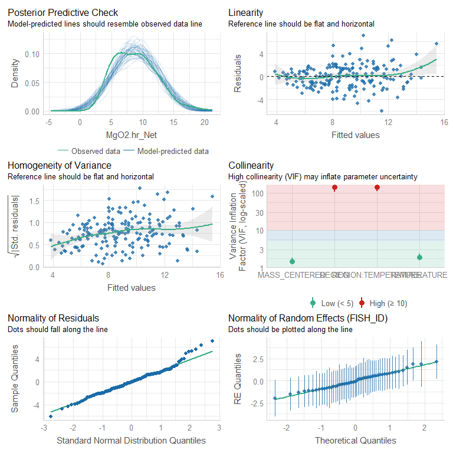<!-- -->

The _nas.1a_ model performs well, however, in the model validation performed by the **performance** model it looks like there are two variables that are highly correlated. If we expand the figure we can see that the highly correlated variables are REGION and REGION:TEMPERATURE. Perhaps this is unsurprising  but lets see what happens when we run the quadratic (2^nd^ polynomial) model to see if this helps deal with the high correlation between these two variables, as it performed very similarly to _nas.1a_, and even had a higher r2 value. 

###### nas.1.p2a (quadratic)

First we need to update the model by adding in the missing random factor

```r
nas.1.p2a <- glmmTMB(MgO2.hr_Net ~ 1+ REGION * poly(TEMPERATURE,2) + MASS_CENTERED + (1|FISH_ID), 
                 family=gaussian(),
                 data = resp4, 
                 REML=TRUE) 
```

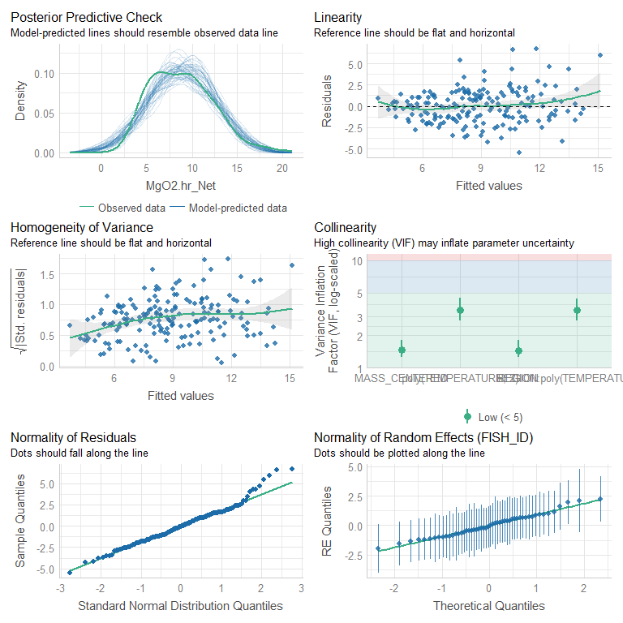<!-- -->

##### DHARMa residuals {.tabset .tabset-faded}

###### nas.1a (linear)

```r
nas.1a %>% simulateResiduals(plot=TRUE)
```

<!-- -->

```
## Object of Class DHARMa with simulated residuals based on 250 simulations with refit = FALSE . See ?DHARMa::simulateResiduals for help. 
##  
## Scaled residual values: 0.212 0.244 0.556 0.532 0.74 0.728 1 0.712 0.596 0.868 0.788 0.364 0.28 0.416 0.744 0.124 0.676 0.996 0.788 0.864 ...
```

```r
nas.1a %>% DHARMa::testResiduals(plot=TRUE)
```

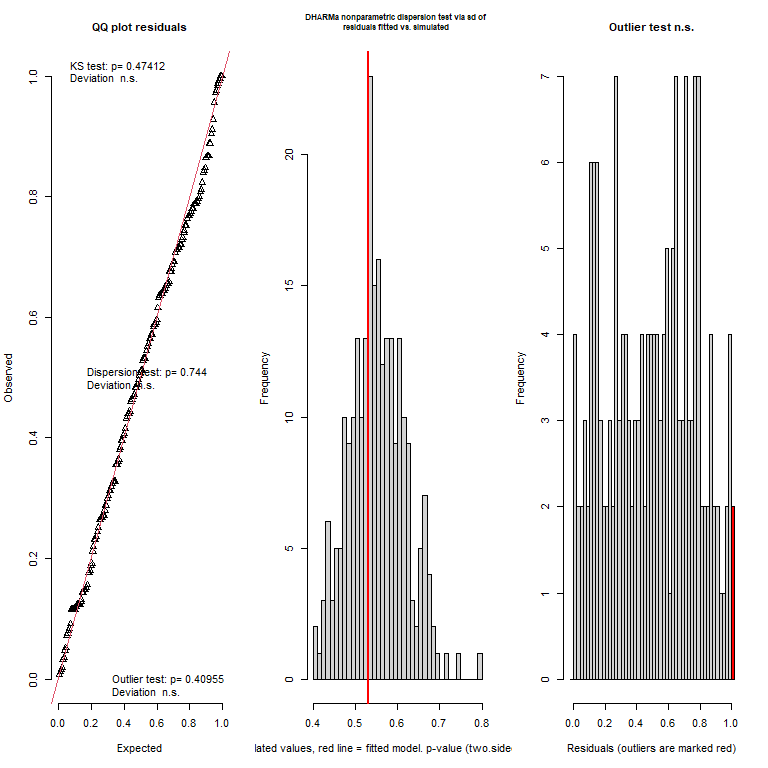<!-- -->

```
## $uniformity
## 
## 	Asymptotic one-sample Kolmogorov-Smirnov test
## 
## data:  simulationOutput$scaledResiduals
## D = 0.063636, p-value = 0.4741
## alternative hypothesis: two-sided
## 
## 
## $dispersion
## 
## 	DHARMa nonparametric dispersion test via sd of residuals fitted vs.
## 	simulated
## 
## data:  simulationOutput
## dispersion = 0.96215, p-value = 0.744
## alternative hypothesis: two.sided
## 
## 
## $outliers
## 
## 	DHARMa outlier test based on exact binomial test with approximate
## 	expectations
## 
## data:  simulationOutput
## outliers at both margin(s) = 2, observations = 176, p-value = 0.4095
## alternative hypothesis: true probability of success is not equal to 0.007968127
## 95 percent confidence interval:
##  0.001379164 0.040444565
## sample estimates:
## frequency of outliers (expected: 0.00796812749003984 ) 
##                                             0.01136364
```

```
## $uniformity
## 
## 	Asymptotic one-sample Kolmogorov-Smirnov test
## 
## data:  simulationOutput$scaledResiduals
## D = 0.063636, p-value = 0.4741
## alternative hypothesis: two-sided
## 
## 
## $dispersion
## 
## 	DHARMa nonparametric dispersion test via sd of residuals fitted vs.
## 	simulated
## 
## data:  simulationOutput
## dispersion = 0.96215, p-value = 0.744
## alternative hypothesis: two.sided
## 
## 
## $outliers
## 
## 	DHARMa outlier test based on exact binomial test with approximate
## 	expectations
## 
## data:  simulationOutput
## outliers at both margin(s) = 2, observations = 176, p-value = 0.4095
## alternative hypothesis: true probability of success is not equal to 0.007968127
## 95 percent confidence interval:
##  0.001379164 0.040444565
## sample estimates:
## frequency of outliers (expected: 0.00796812749003984 ) 
##                                             0.01136364
```

###### nas.1.p2 (quadratic)

First we need to update the model by adding in the missing random factor

```r
nas.1.p2a <- glmmTMB(MgO2.hr_Net ~ 1+ REGION * poly(TEMPERATURE,2) + MASS_CENTERED + (1|FISH_ID), 
                 family=gaussian(),
                 data = resp4, 
                 REML=TRUE)  
```


```r
nas.1.p2a %>% simulateResiduals(plot=TRUE) 
```

<!-- -->

```
## Object of Class DHARMa with simulated residuals based on 250 simulations with refit = FALSE . See ?DHARMa::simulateResiduals for help. 
##  
## Scaled residual values: 0.268 0.2 0.648 0.472 0.664 0.8 1 0.756 0.488 0.812 0.844 0.4 0.224 0.352 0.792 0.172 0.596 0.996 0.876 0.828 ...
```

```r
nas.1.p2a %>% DHARMa::testResiduals(plot=TRUE)
```

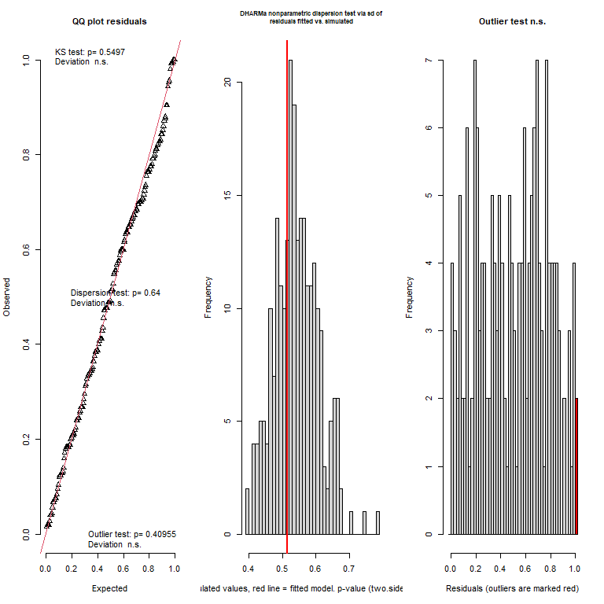<!-- -->

```
## $uniformity
## 
## 	Asymptotic one-sample Kolmogorov-Smirnov test
## 
## data:  simulationOutput$scaledResiduals
## D = 0.060045, p-value = 0.5497
## alternative hypothesis: two-sided
## 
## 
## $dispersion
## 
## 	DHARMa nonparametric dispersion test via sd of residuals fitted vs.
## 	simulated
## 
## data:  simulationOutput
## dispersion = 0.95158, p-value = 0.64
## alternative hypothesis: two.sided
## 
## 
## $outliers
## 
## 	DHARMa outlier test based on exact binomial test with approximate
## 	expectations
## 
## data:  simulationOutput
## outliers at both margin(s) = 2, observations = 176, p-value = 0.4095
## alternative hypothesis: true probability of success is not equal to 0.007968127
## 95 percent confidence interval:
##  0.001379164 0.040444565
## sample estimates:
## frequency of outliers (expected: 0.00796812749003984 ) 
##                                             0.01136364
```

```
## $uniformity
## 
## 	Asymptotic one-sample Kolmogorov-Smirnov test
## 
## data:  simulationOutput$scaledResiduals
## D = 0.060045, p-value = 0.5497
## alternative hypothesis: two-sided
## 
## 
## $dispersion
## 
## 	DHARMa nonparametric dispersion test via sd of residuals fitted vs.
## 	simulated
## 
## data:  simulationOutput
## dispersion = 0.95158, p-value = 0.64
## alternative hypothesis: two.sided
## 
## 
## $outliers
## 
## 	DHARMa outlier test based on exact binomial test with approximate
## 	expectations
## 
## data:  simulationOutput
## outliers at both margin(s) = 2, observations = 176, p-value = 0.4095
## alternative hypothesis: true probability of success is not equal to 0.007968127
## 95 percent confidence interval:
##  0.001379164 0.040444565
## sample estimates:
## frequency of outliers (expected: 0.00796812749003984 ) 
##                                             0.01136364
```

##### {-}

#### {-}

It looks like the model that treats temperature as a second order polynomial does a better job at avoiding high levels of collinearity within the model. The quadratic model will be used moving forward because it: 

* The **quadratic model** performs just as well as the linear model based on the model validation scores (i.e., AIC, BIC, and r2) 
* The **quadratic model** does a **better** job at dealing with collinearity that appeared in the model 

#### Partial plots {.tabset .tabset-faded}

##### ggemmeans 

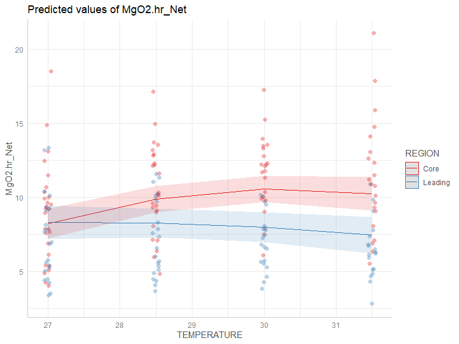<!-- -->

##### plot_model 

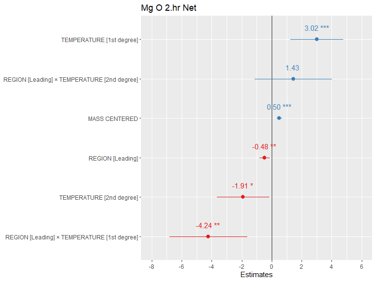<!-- -->

#### {-} 

#### Model investigation {.tabset .tabset-faded}

##### summary 
<table class=" lightable-paper" style='font-family: "Arial Narrow", arial, helvetica, sans-serif; margin-left: auto; margin-right: auto;'>
 <thead>
  <tr>
   <th style="text-align:left;">   </th>
   <th style="text-align:right;"> Estimate </th>
   <th style="text-align:right;"> StdError </th>
   <th style="text-align:right;"> Zvalue </th>
   <th style="text-align:right;"> Pvalue </th>
  </tr>
 </thead>
<tbody>
  <tr>
   <td style="text-align:left;"> (Intercept) </td>
   <td style="text-align:right;"> 9.676637 </td>
   <td style="text-align:right;"> 0.3717003 </td>
   <td style="text-align:right;"> 26.033437 </td>
   <td style="text-align:right;"> 0.0000000 </td>
  </tr>
  <tr>
   <td style="text-align:left;"> REGIONLeading </td>
   <td style="text-align:right;"> -1.632353 </td>
   <td style="text-align:right;"> 0.6124654 </td>
   <td style="text-align:right;"> -2.665216 </td>
   <td style="text-align:right;"> 0.0076939 </td>
  </tr>
  <tr>
   <td style="text-align:left;"> poly(TEMPERATURE, 2)1 </td>
   <td style="text-align:right;"> 10.324322 </td>
   <td style="text-align:right;"> 3.0798654 </td>
   <td style="text-align:right;"> 3.352199 </td>
   <td style="text-align:right;"> 0.0008017 </td>
  </tr>
  <tr>
   <td style="text-align:left;"> poly(TEMPERATURE, 2)2 </td>
   <td style="text-align:right;"> -6.546341 </td>
   <td style="text-align:right;"> 3.0573845 </td>
   <td style="text-align:right;"> -2.141157 </td>
   <td style="text-align:right;"> 0.0322613 </td>
  </tr>
  <tr>
   <td style="text-align:left;"> MASS_CENTERED </td>
   <td style="text-align:right;"> 179.593117 </td>
   <td style="text-align:right;"> 32.6469695 </td>
   <td style="text-align:right;"> 5.501066 </td>
   <td style="text-align:right;"> 0.0000000 </td>
  </tr>
  <tr>
   <td style="text-align:left;"> REGIONLeading:poly(TEMPERATURE, 2)1 </td>
   <td style="text-align:right;"> -14.500327 </td>
   <td style="text-align:right;"> 4.5325854 </td>
   <td style="text-align:right;"> -3.199129 </td>
   <td style="text-align:right;"> 0.0013784 </td>
  </tr>
  <tr>
   <td style="text-align:left;"> REGIONLeading:poly(TEMPERATURE, 2)2 </td>
   <td style="text-align:right;"> 4.897260 </td>
   <td style="text-align:right;"> 4.4894335 </td>
   <td style="text-align:right;"> 1.090841 </td>
   <td style="text-align:right;"> 0.2753427 </td>
  </tr>
</tbody>
</table>

##### Anova 
<table class=" lightable-paper" style='font-family: "Arial Narrow", arial, helvetica, sans-serif; margin-left: auto; margin-right: auto;'>
 <thead>
  <tr>
   <th style="text-align:left;">   </th>
   <th style="text-align:right;"> Chisq </th>
   <th style="text-align:right;"> Df </th>
   <th style="text-align:right;"> Pr(&gt;Chisq) </th>
  </tr>
 </thead>
<tbody>
  <tr>
   <td style="text-align:left;"> REGION </td>
   <td style="text-align:right;"> 6.537818 </td>
   <td style="text-align:right;"> 1 </td>
   <td style="text-align:right;"> 0.0105605 </td>
  </tr>
  <tr>
   <td style="text-align:left;"> poly(TEMPERATURE, 2) </td>
   <td style="text-align:right;"> 6.515869 </td>
   <td style="text-align:right;"> 2 </td>
   <td style="text-align:right;"> 0.0384678 </td>
  </tr>
  <tr>
   <td style="text-align:left;"> MASS_CENTERED </td>
   <td style="text-align:right;"> 30.261721 </td>
   <td style="text-align:right;"> 1 </td>
   <td style="text-align:right;"> 0.0000000 </td>
  </tr>
  <tr>
   <td style="text-align:left;"> REGION:poly(TEMPERATURE, 2) </td>
   <td style="text-align:right;"> 11.460373 </td>
   <td style="text-align:right;"> 2 </td>
   <td style="text-align:right;"> 0.0032465 </td>
  </tr>
</tbody>
</table>

##### confint 
<table class=" lightable-paper" style='font-family: "Arial Narrow", arial, helvetica, sans-serif; margin-left: auto; margin-right: auto;'>
 <thead>
  <tr>
   <th style="text-align:left;">   </th>
   <th style="text-align:right;"> 2.5 % </th>
   <th style="text-align:right;"> 97.5 % </th>
   <th style="text-align:right;"> Estimate </th>
  </tr>
 </thead>
<tbody>
  <tr>
   <td style="text-align:left;"> (Intercept) </td>
   <td style="text-align:right;"> 8.9481173 </td>
   <td style="text-align:right;"> 10.4051557 </td>
   <td style="text-align:right;"> 9.676637 </td>
  </tr>
  <tr>
   <td style="text-align:left;"> REGIONLeading </td>
   <td style="text-align:right;"> -2.8327627 </td>
   <td style="text-align:right;"> -0.4319423 </td>
   <td style="text-align:right;"> -1.632353 </td>
  </tr>
  <tr>
   <td style="text-align:left;"> poly(TEMPERATURE, 2)1 </td>
   <td style="text-align:right;"> 4.2878974 </td>
   <td style="text-align:right;"> 16.3607477 </td>
   <td style="text-align:right;"> 10.324322 </td>
  </tr>
  <tr>
   <td style="text-align:left;"> poly(TEMPERATURE, 2)2 </td>
   <td style="text-align:right;"> -12.5387048 </td>
   <td style="text-align:right;"> -0.5539778 </td>
   <td style="text-align:right;"> -6.546341 </td>
  </tr>
  <tr>
   <td style="text-align:left;"> MASS_CENTERED </td>
   <td style="text-align:right;"> 115.6062324 </td>
   <td style="text-align:right;"> 243.5800011 </td>
   <td style="text-align:right;"> 179.593117 </td>
  </tr>
  <tr>
   <td style="text-align:left;"> REGIONLeading:poly(TEMPERATURE, 2)1 </td>
   <td style="text-align:right;"> -23.3840309 </td>
   <td style="text-align:right;"> -5.6166225 </td>
   <td style="text-align:right;"> -14.500327 </td>
  </tr>
  <tr>
   <td style="text-align:left;"> REGIONLeading:poly(TEMPERATURE, 2)2 </td>
   <td style="text-align:right;"> -3.9018683 </td>
   <td style="text-align:right;"> 13.6963875 </td>
   <td style="text-align:right;"> 4.897260 </td>
  </tr>
  <tr>
   <td style="text-align:left;"> Std.Dev.(Intercept)|FISH_ID </td>
   <td style="text-align:right;"> 0.8790124 </td>
   <td style="text-align:right;"> 1.9917277 </td>
   <td style="text-align:right;"> 1.323160 </td>
  </tr>
</tbody>
</table>

##### r-squared
<table class=" lightable-paper" style='font-family: "Arial Narrow", arial, helvetica, sans-serif; margin-left: auto; margin-right: auto;'>
 <thead>
  <tr>
   <th style="text-align:right;"> R2_conditional </th>
   <th style="text-align:right;"> R2_marginal </th>
   <th style="text-align:left;"> optional </th>
  </tr>
 </thead>
<tbody>
  <tr>
   <td style="text-align:right;"> 0.6031021 </td>
   <td style="text-align:right;"> 0.4622269 </td>
   <td style="text-align:left;"> FALSE </td>
  </tr>
</tbody>
</table>

#### {-} 

#### Pairwise comparisons {.tabset .tabset-faded} 

##### emtrends [latitudes]


```r
nas.1.p2a %>% emtrends(var = "TEMPERATURE", type = "response") %>% pairs(by = "TEMPERATURE") %>% summary(by = NULL, adjust = "tukey", infer=TRUE)
```

<div data-pagedtable="false">
  <script data-pagedtable-source type="application/json">
{"columns":[{"label":[""],"name":["_rn_"],"type":[""],"align":["left"]},{"label":["contrast"],"name":[1],"type":["fct"],"align":["left"]},{"label":["TEMPERATURE"],"name":[2],"type":["dbl"],"align":["right"]},{"label":["estimate"],"name":[3],"type":["dbl"],"align":["right"]},{"label":["SE"],"name":[4],"type":["dbl"],"align":["right"]},{"label":["df"],"name":[5],"type":["dbl"],"align":["right"]},{"label":["lower.CL"],"name":[6],"type":["dbl"],"align":["right"]},{"label":["upper.CL"],"name":[7],"type":["dbl"],"align":["right"]},{"label":["t.ratio"],"name":[8],"type":["dbl"],"align":["right"]},{"label":["p.value"],"name":[9],"type":["dbl"],"align":["right"]}],"data":[{"1":"(Core MASS_CENTERED-0.000127610645933016) - (Leading MASS_CENTERED-0.000127610645933016)","2":"29.09659","3":"0.690616","4":"0.2070788","5":"174","6":"0.2819063","7":"1.099326","8":"3.335039","9":"0.00104241","_rn_":"1"}],"options":{"columns":{"min":{},"max":[10]},"rows":{"min":[10],"max":[10]},"pages":{}}}
  </script>
</div>
SCROLL TO THE RIGHT -->

The numbers in the left most column in the table just mention that the slopes are assuming mean **MASS_CENTERED** values when looking at differences between latitudinal slopes.

##### emmeans [latitudes]

```r
nas.1.p2a %>% emmeans(pairwise ~ TEMPERATURE*REGION, type = "response") %>% pairs(by = "TEMPERATURE") %>% summary(by = NULL, adjust = "tukey", infer=TRUE)
```

<div data-pagedtable="false">
  <script data-pagedtable-source type="application/json">
{"columns":[{"label":[""],"name":["_rn_"],"type":[""],"align":["left"]},{"label":["contrast"],"name":[1],"type":["fct"],"align":["left"]},{"label":["TEMPERATURE"],"name":[2],"type":["dbl"],"align":["right"]},{"label":["estimate"],"name":[3],"type":["dbl"],"align":["right"]},{"label":["SE"],"name":[4],"type":["dbl"],"align":["right"]},{"label":["df"],"name":[5],"type":["dbl"],"align":["right"]},{"label":["lower.CL"],"name":[6],"type":["dbl"],"align":["right"]},{"label":["upper.CL"],"name":[7],"type":["dbl"],"align":["right"]},{"label":["t.ratio"],"name":[8],"type":["dbl"],"align":["right"]},{"label":["p.value"],"name":[9],"type":["dbl"],"align":["right"]}],"data":[{"1":"Core - Leading","2":"29.09659","3":"2.090783","4":"0.7384902","5":"174","6":"0.633231","7":"3.548335","8":"2.831158","9":"0.005184537","_rn_":"1"}],"options":{"columns":{"min":{},"max":[10]},"rows":{"min":[10],"max":[10]},"pages":{}}}
  </script>
</div>

##### temperature 

```r
nas.1.p2a %>% emmeans(~ TEMPERATURE*REGION, type = "response")  %>% summary(infer=TRUE)
```

<div data-pagedtable="false">
  <script data-pagedtable-source type="application/json">
{"columns":[{"label":[""],"name":["_rn_"],"type":[""],"align":["left"]},{"label":["TEMPERATURE"],"name":[1],"type":["dbl"],"align":["right"]},{"label":["REGION"],"name":[2],"type":["fct"],"align":["left"]},{"label":["emmean"],"name":[3],"type":["dbl"],"align":["right"]},{"label":["SE"],"name":[4],"type":["dbl"],"align":["right"]},{"label":["df"],"name":[5],"type":["dbl"],"align":["right"]},{"label":["lower.CL"],"name":[6],"type":["dbl"],"align":["right"]},{"label":["upper.CL"],"name":[7],"type":["dbl"],"align":["right"]},{"label":["t.ratio"],"name":[8],"type":["dbl"],"align":["right"]},{"label":["p.value"],"name":[9],"type":["dbl"],"align":["right"]}],"data":[{"1":"29.09659","2":"Core","3":"10.266519","4":"0.4706466","5":"174","6":"9.337607","7":"11.195430","8":"21.81365","9":"1.152724e-51","_rn_":"1"},{"1":"29.09659","2":"Leading","3":"8.175736","4":"0.5182601","5":"174","6":"7.152850","7":"9.198621","8":"15.77535","9":"2.202822e-35","_rn_":"2"}],"options":{"columns":{"min":{},"max":[10]},"rows":{"min":[10],"max":[10]},"pages":{}}}
  </script>
</div>

##### Means - f(temperature)

```r
nas.1.p2a %>% update(.~1+ REGION * as.factor(TEMPERATURE) + MASS_CENTERED + RESTING_RUNTIME_SECONDS + (1|FISH_ID)) %>% 
  emmeans(~REGION*TEMPERATURE, type = "response") %>% summary(infer=TRUE)
```

<div data-pagedtable="false">
  <script data-pagedtable-source type="application/json">
{"columns":[{"label":[""],"name":["_rn_"],"type":[""],"align":["left"]},{"label":["REGION"],"name":[1],"type":["fct"],"align":["left"]},{"label":["TEMPERATURE"],"name":[2],"type":["dbl"],"align":["right"]},{"label":["emmean"],"name":[3],"type":["dbl"],"align":["right"]},{"label":["SE"],"name":[4],"type":["dbl"],"align":["right"]},{"label":["df"],"name":[5],"type":["dbl"],"align":["right"]},{"label":["lower.CL"],"name":[6],"type":["dbl"],"align":["right"]},{"label":["upper.CL"],"name":[7],"type":["dbl"],"align":["right"]},{"label":["t.ratio"],"name":[8],"type":["dbl"],"align":["right"]},{"label":["p.value"],"name":[9],"type":["dbl"],"align":["right"]}],"data":[{"1":"Core","2":"27.0","3":"8.319363","4":"0.5374013","5":"174","6":"7.258698","7":"9.380027","8":"15.48073","9":"1.507435e-34","_rn_":"1"},{"1":"Leading","2":"27.0","3":"8.368538","4":"0.6002530","5":"174","6":"7.183824","7":"9.553252","8":"13.94169","9":"3.790369e-30","_rn_":"2"},{"1":"Core","2":"28.5","3":"9.901579","4":"0.5337707","5":"174","6":"8.848080","7":"10.955078","8":"18.55025","9":"4.381380e-43","_rn_":"3"},{"1":"Leading","2":"28.5","3":"8.374571","4":"0.5959145","5":"174","6":"7.198420","7":"9.550722","8":"14.05331","9":"1.810995e-30","_rn_":"4"},{"1":"Core","2":"30.0","3":"10.465447","4":"0.5811305","5":"174","6":"9.318475","7":"11.612420","8":"18.00877","9":"1.311792e-41","_rn_":"5"},{"1":"Leading","2":"30.0","3":"7.830956","4":"0.6367256","5":"174","6":"6.574256","7":"9.087656","8":"12.29879","9":"2.033216e-25","_rn_":"6"},{"1":"Core","2":"31.5","3":"10.171357","4":"0.5949223","5":"174","6":"8.997164","7":"11.345550","8":"17.09695","9":"4.309548e-39","_rn_":"7"},{"1":"Leading","2":"31.5","3":"7.377908","4":"0.6439594","5":"174","6":"6.106931","7":"8.648886","8":"11.45710","9":"5.271775e-23","_rn_":"8"}],"options":{"columns":{"min":{},"max":[10]},"rows":{"min":[10],"max":[10]},"pages":{}}}
  </script>
</div>

##### Abs. diff - f(temperature)

```r
nas.1.p2a %>% update(.~1+ REGION * as.factor(TEMPERATURE) + MASS_CENTERED + RESTING_RUNTIME_SECONDS + (1|FISH_ID)) %>% 
  emmeans(~REGION*TEMPERATURE, type = "response") %>% pairs(by ="REGION") %>% summary(infer=TRUE)
```

<div data-pagedtable="false">
  <script data-pagedtable-source type="application/json">
{"columns":[{"label":[""],"name":["_rn_"],"type":[""],"align":["left"]},{"label":["contrast"],"name":[1],"type":["fct"],"align":["left"]},{"label":["REGION"],"name":[2],"type":["fct"],"align":["left"]},{"label":["estimate"],"name":[3],"type":["dbl"],"align":["right"]},{"label":["SE"],"name":[4],"type":["dbl"],"align":["right"]},{"label":["df"],"name":[5],"type":["dbl"],"align":["right"]},{"label":["lower.CL"],"name":[6],"type":["dbl"],"align":["right"]},{"label":["upper.CL"],"name":[7],"type":["dbl"],"align":["right"]},{"label":["t.ratio"],"name":[8],"type":["dbl"],"align":["right"]},{"label":["p.value"],"name":[9],"type":["dbl"],"align":["right"]}],"data":[{"1":"TEMPERATURE27 - TEMPERATURE28.5","2":"Core","3":"-1.582216316","4":"0.6413915","5":"174","6":"-3.2460061","7":"0.081573433","8":"-2.466849333","9":"0.06880331","_rn_":"1"},{"1":"TEMPERATURE27 - TEMPERATURE30","2":"Core","3":"-2.146084736","4":"0.7011379","5":"174","6":"-3.9648585","7":"-0.327310983","8":"-3.060859522","9":"0.01351335","_rn_":"2"},{"1":"TEMPERATURE27 - TEMPERATURE31.5","2":"Core","3":"-1.851993894","4":"0.7106950","5":"174","6":"-3.6955590","7":"-0.008428825","8":"-2.605891266","9":"0.04849296","_rn_":"3"},{"1":"TEMPERATURE28.5 - TEMPERATURE30","2":"Core","3":"-0.563868420","4":"0.6790505","5":"174","6":"-2.3253466","7":"1.197609751","8":"-0.830377775","9":"0.83997841","_rn_":"4"},{"1":"TEMPERATURE28.5 - TEMPERATURE31.5","2":"Core","3":"-0.269777578","4":"0.6885327","5":"174","6":"-2.0558529","7":"1.516297771","8":"-0.391815205","9":"0.97952846","_rn_":"5"},{"1":"TEMPERATURE30 - TEMPERATURE31.5","2":"Core","3":"0.294090842","4":"0.6955968","5":"174","6":"-1.5103090","7":"2.098490676","8":"0.422789246","9":"0.97452238","_rn_":"6"},{"1":"TEMPERATURE27 - TEMPERATURE28.5","2":"Leading","3":"-0.006033198","4":"0.6806629","5":"174","6":"-1.7716941","7":"1.759627718","8":"-0.008863709","9":"0.99999975","_rn_":"7"},{"1":"TEMPERATURE27 - TEMPERATURE30","2":"Leading","3":"0.537581507","4":"0.7521353","5":"174","6":"-1.4134809","7":"2.488643910","8":"0.714740466","9":"0.89114214","_rn_":"8"},{"1":"TEMPERATURE27 - TEMPERATURE31.5","2":"Leading","3":"0.990629420","4":"0.7523973","5":"174","6":"-0.9611127","7":"2.942371519","8":"1.316630775","9":"0.55360508","_rn_":"9"},{"1":"TEMPERATURE28.5 - TEMPERATURE30","2":"Leading","3":"0.543614705","4":"0.7490150","5":"174","6":"-1.3993537","7":"2.486583068","8":"0.725772783","9":"0.88668113","_rn_":"10"},{"1":"TEMPERATURE28.5 - TEMPERATURE31.5","2":"Leading","3":"0.996662618","4":"0.7497366","5":"174","6":"-0.9481776","7":"2.941502840","8":"1.329350343","9":"0.54553766","_rn_":"11"},{"1":"TEMPERATURE30 - TEMPERATURE31.5","2":"Leading","3":"0.453047912","4":"0.7406739","5":"174","6":"-1.4682834","7":"2.374379199","8":"0.611669872","9":"0.92826253","_rn_":"12"}],"options":{"columns":{"min":{},"max":[10]},"rows":{"min":[10],"max":[10]},"pages":{}}}
  </script>
</div>

##### Effect size

```r
aas.emm <- nas.1.p2a %>% emmeans(~REGION*TEMPERATURE)
eff_size(aas.emm, sigma = sigma(nas.1.p2a), edf=df.residual(nas.1.p2a))
```

```
##  contrast                                                              
##  Core TEMPERATURE29.0965909090909 - Leading TEMPERATURE29.0965909090909
##  effect.size    SE  df lower.CL upper.CL
##        0.941 0.336 174    0.278     1.61
## 
## sigma used for effect sizes: 2.221 
## Confidence level used: 0.95
```
#### {-}

#### Summary figure 


```
## Warning: Removed 4 rows containing missing values (`geom_point()`).
```

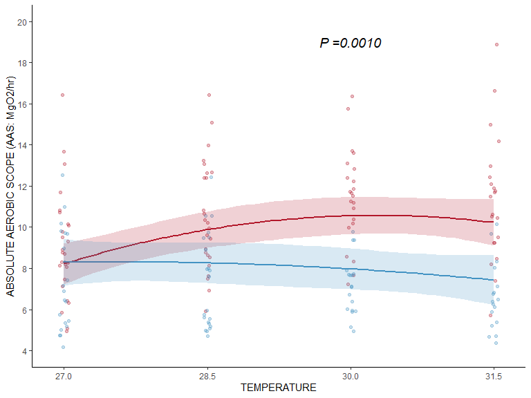<!-- -->

#### Conclusion 

* In conclusion while absolute aerobic scope is **significantly** positively correlated with temperature and fish from low latitudes have **significantly** higher maximum consumption at elevated temperatures compared to fish from high latitudes.


## Enzymes {.tabset .tabset-pills}

### Lactate dehydrogenase

#### Scenario 

For initial details at the top of this document. In brief, _Acanthochromis polyacanthus_ from two different regions on the Great Barrier Reef (GBR) were tested for metabolic performance at four different temperatures, 27$^\circ$C, 28.5$^\circ$C, 30$^\circ$C, and 31.5$^\circ$C. Fish used in this study were collected from two different regions, low- (i.e. Cairns) and high-latitude (i.e., Mackay), within each region fish were collected from a total of three different populations. After metabolic performance was tested blood and tissue samples were collected. White muscle tissue samples were used to look at the relationship between activity and temperature in two different enzymes, Lactate Dehydrogenase (LDH; anaerobic) and Citrate Synthase (CS: aerobic). Enzyme activity was measured over four different temperatures including 20$^\circ$C, 30$^\circ$C, 40$^\circ$C, and 50$^\circ$C. Enzyme activity was measured using a spectrometer and wavelength absorption levels were recorded using the software program LabX. 

#### Read in the data

Before beginning always make sure that you are working in the correct directory 


```r
knitr::opts_knit$set(root.dir=working.dir)
```

Now we can import that data. Two different data frames are being imported. The first has all the enzyme wave length absorption data for each sample and the tissue.mass data file contained information pertaining to the tissue samples that was used for each sample. Later on these two data frames will be merged. 

#### Load data 

```r
ldh <- read_delim("./enzymes/LDH_LocalAdapt.txt", delim = "\t", 
                  escape_double = FALSE, col_types = cols(`Creation time` = col_datetime(format = "%d/%m/%Y %H:%M")), 
                  trim_ws = TRUE)
tissue.mass <- read.delim("C:/Users/jc527762/OneDrive - James Cook University/PhD dissertation/Data/Chapter1_LocalAdaptation/enzymes/tissue_mass.txt") 
```

#### Data manipulation 

Before the data can be analysed it is important to clean up the data file. I won't explain step, that can be figured out by examining the different functions. The main steps that are occurring below are columns being broken up to make new columns (this is the _separate_ function), or columns being combined to make a unique_sample_Id value. Time data can also be tricky to deal with in R, so there are a number of data manipulation steps being used to make sure that time is being read properly.


```r
#--- data preparation/manipulation ---# 
ldh2 <- ldh %>%
  clean_names() %>%
  mutate(muscle_type = str_replace(muscle_type, " ", ".")) %>%
  unite("UNIQUE_SAMPLE_ID", c(fish_id,temperature,sample_index), sep="_", remove = FALSE) %>% 
  separate(creation_time, into=c('DATE','TIME'), sep = " ", remove = FALSE) %>% 
  arrange(sample_id_1, DATE, TIME) 

ldh3 <- ldh2 %>% 
  mutate(TIME = hms(ldh2$TIME)) %>% 
  mutate(TIME = chron(times=ldh2$TIME)) %>% 
  arrange(TIME) %>%
  group_by(UNIQUE_SAMPLE_ID, sample_id_1) %>% 
  mutate(TIME_DIFF = TIME - first(TIME)) %>% 
  filter(TIME != first(TIME)) %>%
  ungroup() %>% 
  mutate(TIME_DIFF_SECS = period_to_seconds(hms(TIME_DIFF))) %>% 
  mutate(MINUTES = TIME_DIFF_SECS/60) %>% 
  mutate(MINUTES = round(MINUTES, digits = 2)) %>% 
  dplyr::rename(CUVETTE = sample_id_1) %>% 
  mutate(REGION = substr(fish_id, 1, 1 ), 
         POPULATION = substr(fish_id, 2, 4), 
         SAMPLE_NO = substr(fish_id, 5, 7)) %>% 
  mutate(REGION = case_when( REGION =="L"~ "Leading", 
                             REGION == "C" ~ "Core", 
                             TRUE ~ "na"))   
```

#### Data cleaning

Next select data points will be removed. Data points have been checked using previously written app script that allows the user to look at the plotted points of samples that were run. Because we are interested in the slope, points that plateaued were removed from the analysis, as it signifies that the reaction ran out of 'fuel' to use. For LDH 'fuel' would refer to NADH, for CS 'fuel' would refer to Oxaloacetic acid. Samples that were removed were placed into one of five different groups, that can be found below: 

* **grp1**: removed last data point which was causing a plateau
* **grp2**: removed last 2 data points which was causing a plateau
* **grp3**: removed last 3 data points which was causing a plateau
* **grp4**: removed last 4 data points which was causing a plateau
* **grp5**: removed last 5 data points which was causing a plateau


```r
grp1 <- c("CSUD008_20_1","CSUD008_20_2","CSUD008_20_3","CSUD008_20_4","CSUD008_20_5","CSUD008_20_6", 
          "CVLA047_50_1","CVLA047_50_2","CVLA047_50_3","CVLA047_50_4","CVLA047_50_5","CVLA047_50_6", 
          "CVLA046_50_1","CVLA046_50_2","CVLA046_50_3","CVLA046_50_4","CVLA046_50_5","CVLA046_50_6") 
grp2 <- c("LCKM180_30_1","LCKM180_30_2","LCKM180_30_3","LCKM180_30_4","LCKM180_30_5","LCKM180_30_6", 
          "LKES172_50_1","LKES172_50_2","CLKES172_50_3","LKES172_50_4","LKES172_50_5","LKES172_50_6", 
          "LCHA114_50_1","LCHA114_50_2","LCHA114_50_3","LCHA114_50_4","LCHA114_50_5","LCHA114_50_6", 
          "CSUD074_50_1","CSUD074_50_2","CSUD074_50_3","CSUD074_50_4","CSUD074_50_5","CSUD074_50_6")
grp3 <- c("LCKM165_50_1","LCKM165_50_2","LCKM165_50_3","LCKM165_50_4","LCKM165_50_5","LCKM165_50_6", 
          "LCKM163_50_1","LCKM163_50_2","CLCKM163_50_3","LCKM163_50_4","LCKM163_50_5","LCKM163_50_6", 
          "CTON068_50_1","CTON068_50_2","CTON068_50_3","CTON068_50_4","CTON068_50_5","CTON068_50_6", 
          "CVLA104_50_1","CVLA104_50_2","CVLA104_50_3","CVLA104_50_4","CVLA104_50_5","CVLA104_50_6") 
grp4 <- c("LCHA135_50_1","LCHA135_50_2","LCHA135_50_3","LCHA135_50_4","LCHA135_50_5","LCHA135_50_6", 
          "CTON069_50_1","CTON069_50_2","CCTON069_50_3","CTON069_50_4","CTON069_50_5","CTON069_50_6", 
          "CVLA045_50_1","CVLA045_50_2","CVLA045_50_3","CVLA045_50_4","CVLA045_50_5","CVLA045_50_6") 
grp5 <- c("CSUD014_50_1","CSUD014_50_2","CSUD014_50_3","CSUD014_50_4","CSUD014_50_5","CSUD014_50_6", 
          "CTON110_50_1","CTON110_50_2","CCTON110_50_3","CTON110_50_4","CTON110_50_5","CTON110_50_6")  
```

For some samples entire runs on certain cuvettes were poor. These samples were removed below, as well as samples from each grp outlined above: 


```r
ldh3.filtered <- ldh3 %>% 
  filter(!(UNIQUE_SAMPLE_ID %in% c("LCKM154_20_1", 
                                   "LKES143_30_3", 
                                   "LKES143_20_2", 
                                   "CSUD010_40_2"))) %>% 
  group_by(UNIQUE_SAMPLE_ID) %>% 
  arrange(UNIQUE_SAMPLE_ID, TIME) %>% 
  filter(!(UNIQUE_SAMPLE_ID %in% grp1 & row_number() > (n() - 1))) %>% 
  filter(!(UNIQUE_SAMPLE_ID %in% grp2 & row_number() > (n() - 2))) %>% 
  filter(!(UNIQUE_SAMPLE_ID %in% grp3 & row_number() > (n() - 3))) %>% 
  filter(!(UNIQUE_SAMPLE_ID %in% grp4 & row_number() > (n() - 4))) %>% 
  filter(!(UNIQUE_SAMPLE_ID %in% grp5 & row_number() > (n() - 5))) %>% 
  ungroup() %>% 
  mutate(UNIQUE_SAMPLE_ID = str_sub(UNIQUE_SAMPLE_ID, end = -3)) 
```

Great! Now we have all the data points that we want to keep. However, the data needs to manipulated in a way that we can obtain and pull out slopes from the absorption readings, and the calculate enzyme activity based on these slopes. This will involve a number of steps. 

#### Data calculations

##### Step1: Extract slopes 

Step1 will produce a data frame that provides you with the slope that was obtained for cuvettes 1-3 for each sample run at each experimental temperature

```r
LDH_activity <- ldh3.filtered %>% 
  group_by(UNIQUE_SAMPLE_ID, CUVETTE) %>% 
  do({
    mod = lm(result ~ MINUTES, data = .)
    data.frame(Intercept = coef(mod)[1],
               Slope = coef(mod)[2], 
               r2 = summary(mod)$adj.r.squared)
  }) %>%
  ungroup() %>%
  filter(CUVETTE != ("6"))%>% 
  filter(CUVETTE != ("4"))%>% 
  filter(CUVETTE != ("5")) %>% 
  filter(Slope <= 0)
```

##### Step2: Slope means

Step2 will calculate the mean slope for cuvette 1-3. 

```r
LDH_activity_means <- LDH_activity %>% 
  group_by(UNIQUE_SAMPLE_ID) %>% 
  dplyr::mutate(Mean = mean(Slope)) %>% 
  ungroup()
```

##### Step3: Background activity level

Step3 will calculate background activity level by measuring the slope from cuvette 5 (postive control)

```r
LDH_background <- ldh3 %>% 
  group_by(UNIQUE_SAMPLE_ID, CUVETTE) %>% 
  do({
    mod = lm(result ~ MINUTES, data = .)
    data.frame(Intercept = coef(mod)[1],
               Slope = coef(mod)[2])
  }) %>%
  ungroup() %>%
  filter(CUVETTE == ("5")) %>% 
  dplyr::rename(Background = Slope) %>% 
  mutate(UNIQUE_SAMPLE_ID = str_sub(UNIQUE_SAMPLE_ID, end = -3)) 
```

##### Step4: Merging dataframes

Step4 will merge the data frames that you created with the mean slopes and the background slopes.

```r
final_table <- LDH_activity %>% 
  full_join(distinct(LDH_activity_means[,c(1,6)]), by = "UNIQUE_SAMPLE_ID") %>% 
  full_join(LDH_background[,c(1,4)], by = "UNIQUE_SAMPLE_ID") 
final_table$Mean[duplicated(final_table$Mean)] <- ""
final_table$Background[duplicated(final_table$Background)] <- ""
final_table <- final_table %>% 
  mutate(Mean = as.numeric(Mean), 
         Background = as.numeric(Background), 
         Background_perc = Background/Mean) 
```

##### Step5: Enzyme activity levels 

Step5 is where enzyme activity levels are calculated. See further details in manuscript (doi: xxx). Within this step background activity level is taken into account and subtracted from slopes where background activity was >5% or more of the sample slope. 

```r
ldh.data <- final_table %>% 
  select(c(UNIQUE_SAMPLE_ID, Mean, Background, Background_perc)) %>% 
  mutate(Mean = as.numeric(Mean), 
         Background = as.numeric(Background), 
         Background_perc = as.numeric(Background_perc)) %>% 
  mutate(Background2 = case_when(Background_perc <= 0.05 ~ 0, 
                                    TRUE ~ Background), 
         LDH_ABSORBANCE = Mean - Background2) %>%
  drop_na() %>% 
  inner_join(select(ldh3.filtered, c(UNIQUE_SAMPLE_ID, REGION, POPULATION, temperature, fish_id)), by ="UNIQUE_SAMPLE_ID") %>% 
  inner_join(tissue.mass, by = "fish_id") %>% 
  mutate(TISSUE_MASS_CENTERED = scale(TISSUE_MASS, center = TRUE, scale = FALSE)) %>%
  distinct(UNIQUE_SAMPLE_ID, REGION, POPULATION, .keep_all = TRUE) %>% 
  mutate(PATH_LENGTH = 1, 
         EXTINCTION_COEFFICIENT = 6.22, 
         TISSUE_CONCENTRATION = 0.005, 
         ASSAY_VOL = 2.975, 
         SAMPLE_VOL = 0.025, 
         LDH_ACTIVITY = ((LDH_ABSORBANCE/(PATH_LENGTH*EXTINCTION_COEFFICIENT*TISSUE_CONCENTRATION))*(ASSAY_VOL/SAMPLE_VOL))*-1) %>% 
  filter(LDH_ACTIVITY >=0) %>% 
  filter(fish_id != "CVLA047")
```


By the end of this stage you should have a data frame that included a column called **LDH_ACTIVITY** along with necessary metadata - this data frame will be used to perform the statistical analysis. 

#### Exploratory data analysis {.tabset}

##### LDH v TEMPERATURE [LATITUDE]

```r
ggplot(ldh.data, aes(x =as.numeric(temperature), y= LDH_ACTIVITY, color = REGION)) + 
  geom_point() + geom_smooth(method = "lm", se=FALSE)
```

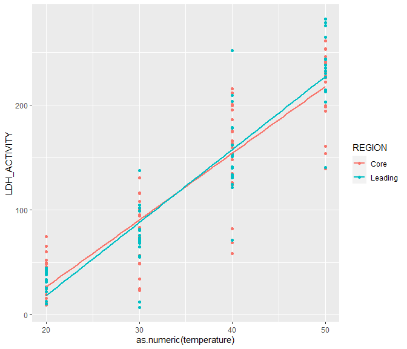<!-- -->

##### LDH V TEMPERATURE [DENSITY]

```r
ggplot(ldh.data, aes(x = LDH_ACTIVITY, fill = temperature, color = temperature)) + 
  geom_density(alpha =0.5, position = "identity") 
```

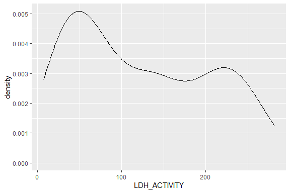<!-- -->

##### LDH v TISSUE MASS (LATITUDE)

```r
ggplot(ldh.data, aes(x =TISSUE_MASS_CENTERED, y= LDH_ACTIVITY, color = REGION)) + 
  geom_point() + geom_smooth(method = "lm", se=FALSE)
```

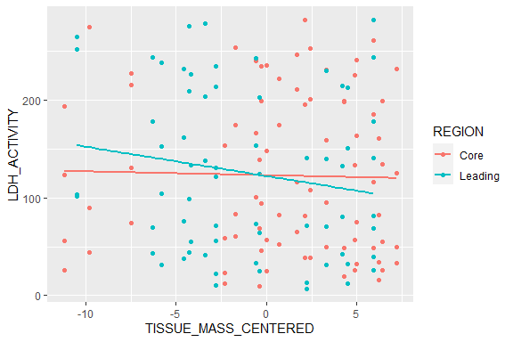<!-- -->


#### {-}

#### Fit the model 

The model was fit using the **glm** and later **glmmTMB** package in R. A number of different models were tested to determine which hypothesis and associated variables best predicted resting oxygen consumption. Model fit was examined using AICc, BIC, and r-squared values. Additional model were examined via the validation diagonistics provided by the **performance** and **dHARMA** packages in R. 

##### Fixed factors (linear regression models)

###### model 1

```r
#--- base model ---#
ldh.model.1 <- glm(LDH_ACTIVITY ~ 1 + REGION*temperature + TISSUE_MASS_CENTERED, 
                       family=gaussian(), 
                       data = ldh.data)  
```
####### summary
<table class=" lightable-paper" style='font-family: "Arial Narrow", arial, helvetica, sans-serif; margin-left: auto; margin-right: auto;'>
 <thead>
  <tr>
   <th style="text-align:left;">   </th>
   <th style="text-align:right;"> Estimate </th>
   <th style="text-align:right;"> Std. Error </th>
   <th style="text-align:right;"> t value </th>
   <th style="text-align:right;"> Pr(&gt;|t|) </th>
  </tr>
 </thead>
<tbody>
  <tr>
   <td style="text-align:left;"> (Intercept) </td>
   <td style="text-align:right;"> -98.8473323 </td>
   <td style="text-align:right;"> 12.7538631 </td>
   <td style="text-align:right;"> -7.7503836 </td>
   <td style="text-align:right;"> 0.0000000 </td>
  </tr>
  <tr>
   <td style="text-align:left;"> REGIONLeading </td>
   <td style="text-align:right;"> -15.7431756 </td>
   <td style="text-align:right;"> 19.0212806 </td>
   <td style="text-align:right;"> -0.8276612 </td>
   <td style="text-align:right;"> 0.4092512 </td>
  </tr>
  <tr>
   <td style="text-align:left;"> temperature </td>
   <td style="text-align:right;"> 6.3664611 </td>
   <td style="text-align:right;"> 0.3464135 </td>
   <td style="text-align:right;"> 18.3782116 </td>
   <td style="text-align:right;"> 0.0000000 </td>
  </tr>
  <tr>
   <td style="text-align:left;"> TISSUE_MASS_CENTERED </td>
   <td style="text-align:right;"> -1.4109245 </td>
   <td style="text-align:right;"> 0.6197670 </td>
   <td style="text-align:right;"> -2.2765402 </td>
   <td style="text-align:right;"> 0.0243089 </td>
  </tr>
  <tr>
   <td style="text-align:left;"> REGIONLeading:temperature </td>
   <td style="text-align:right;"> 0.4104065 </td>
   <td style="text-align:right;"> 0.5148700 </td>
   <td style="text-align:right;"> 0.7971070 </td>
   <td style="text-align:right;"> 0.4267197 </td>
  </tr>
</tbody>
</table>

###### model 2

```r
ldh.model.2 <- glm(LDH_ACTIVITY ~ 1 + REGION*temperature, 
                       family=gaussian(), 
                       data = ldh.data)
```

####### summary
<table class=" lightable-paper" style='font-family: "Arial Narrow", arial, helvetica, sans-serif; margin-left: auto; margin-right: auto;'>
 <thead>
  <tr>
   <th style="text-align:left;">   </th>
   <th style="text-align:right;"> Estimate </th>
   <th style="text-align:right;"> Std. Error </th>
   <th style="text-align:right;"> t value </th>
   <th style="text-align:right;"> Pr(&gt;|t|) </th>
  </tr>
 </thead>
<tbody>
  <tr>
   <td style="text-align:left;"> (Intercept) </td>
   <td style="text-align:right;"> -100.6938247 </td>
   <td style="text-align:right;"> 12.9128467 </td>
   <td style="text-align:right;"> -7.7979571 </td>
   <td style="text-align:right;"> 0.0000000 </td>
  </tr>
  <tr>
   <td style="text-align:left;"> REGIONLeading </td>
   <td style="text-align:right;"> -12.6091234 </td>
   <td style="text-align:right;"> 19.2468460 </td>
   <td style="text-align:right;"> -0.6551267 </td>
   <td style="text-align:right;"> 0.5134386 </td>
  </tr>
  <tr>
   <td style="text-align:left;"> temperature </td>
   <td style="text-align:right;"> 6.3664611 </td>
   <td style="text-align:right;"> 0.3514432 </td>
   <td style="text-align:right;"> 18.1151935 </td>
   <td style="text-align:right;"> 0.0000000 </td>
  </tr>
  <tr>
   <td style="text-align:left;"> REGIONLeading:temperature </td>
   <td style="text-align:right;"> 0.4183038 </td>
   <td style="text-align:right;"> 0.5223337 </td>
   <td style="text-align:right;"> 0.8008364 </td>
   <td style="text-align:right;"> 0.4245549 </td>
  </tr>
</tbody>
</table>

##### model comparison table
<table class=" lightable-paper" style='font-family: "Arial Narrow", arial, helvetica, sans-serif; margin-left: auto; margin-right: auto;'>
 <thead>
  <tr>
   <th style="text-align:left;"> model </th>
   <th style="text-align:right;"> df </th>
   <th style="text-align:right;"> AICc </th>
   <th style="text-align:right;"> BIC </th>
   <th style="text-align:right;"> r2 </th>
  </tr>
 </thead>
<tbody>
  <tr>
   <td style="text-align:left;"> ldh.model.1 </td>
   <td style="text-align:right;"> 6 </td>
   <td style="text-align:right;"> 1466.925 </td>
   <td style="text-align:right;"> 1484.268 </td>
   <td style="text-align:right;"> 0.818999 </td>
  </tr>
  <tr>
   <td style="text-align:left;"> ldh.model.2 </td>
   <td style="text-align:right;"> 5 </td>
   <td style="text-align:right;"> 1470.020 </td>
   <td style="text-align:right;"> 1484.547 </td>
   <td style="text-align:right;"> 0.813494 </td>
  </tr>
</tbody>
</table>

The model that contains **TISSUE_MASS_CENTERED** seems to do better than the model that leaves TISSUE_MASS_CENTERED out. Therefore we will move ahead with the model that contains **TISSUE_MASS_CENTERED** as a co-variate.  

#### Polynomials 

##### polynomial models 

Note that the linear model has already been created via model _ldh.model.1_ in the previous section.


```r
#--- second order polynomial ---# 
ldh.model.1.p2 <- glm(LDH_ACTIVITY ~ 1 + REGION*poly(temperature, 2) + TISSUE_MASS_CENTERED, 
                       family=gaussian(), 
                       data = ldh.data)  

#--- third order polynomial ---# 
ldh.model.1.p3 <- glm(LDH_ACTIVITY ~ 1 + REGION*poly(temperature, 3) + TISSUE_MASS_CENTERED, 
                          family=gaussian(), 
                          data = ldh.data)  
```

###### polynomial model comparisons
<table class=" lightable-paper" style='font-family: "Arial Narrow", arial, helvetica, sans-serif; margin-left: auto; margin-right: auto;'>
 <thead>
  <tr>
   <th style="text-align:left;"> model </th>
   <th style="text-align:right;"> df </th>
   <th style="text-align:right;"> AICc </th>
   <th style="text-align:right;"> BIC </th>
   <th style="text-align:right;"> r2 </th>
  </tr>
 </thead>
<tbody>
  <tr>
   <td style="text-align:left;"> ldh.model.1 </td>
   <td style="text-align:right;"> 6 </td>
   <td style="text-align:right;"> 1466.925 </td>
   <td style="text-align:right;"> 1484.268 </td>
   <td style="text-align:right;"> 0.8230806 </td>
  </tr>
  <tr>
   <td style="text-align:left;"> ldh.model.1.p2 </td>
   <td style="text-align:right;"> 8 </td>
   <td style="text-align:right;"> 1461.007 </td>
   <td style="text-align:right;"> 1483.887 </td>
   <td style="text-align:right;"> 0.8351212 </td>
  </tr>
  <tr>
   <td style="text-align:left;"> ldh.model.1.p3 </td>
   <td style="text-align:right;"> 10 </td>
   <td style="text-align:right;"> 1460.160 </td>
   <td style="text-align:right;"> 1488.447 </td>
   <td style="text-align:right;"> 0.8410910 </td>
  </tr>
</tbody>
</table>

From our model comparison we can see that the model that runs temperature as a second order polynomial performs the best. Therefore, moving forward we will use the second order polynomial model. 

#### Random factors 

Fish were repeatedly sampled over four different temperatures, therefore repeated sampling needs to be accounted for. To do this random factors will be included within the model. There are a number of options that can be used for random factors including 1) accounting for repeated sampling of individuals, 2) accounting for repeated sampling of individuals nested within population, 3) account for repeated sampling of individuals and populations without nesting. All three models will be run a compaired. 

##### random factor models


```r
ldh.model.1.p2a <- glmmTMB(LDH_ACTIVITY ~ 1 + REGION*poly(temperature, 3) + TISSUE_MASS_CENTERED + (1|fish_id), 
                       family=gaussian(), 
                       data = ldh.data, 
                       REML = TRUE) 

ldh.model.1.p2b <- glmmTMB(LDH_ACTIVITY ~ 1 + REGION*poly(temperature, 3) + TISSUE_MASS_CENTERED + (1|POPULATION/fish_id), 
                  family=gaussian(), 
                  data = ldh.data, 
                  REML = TRUE) 

ldh.model.1.p2c <- glmmTMB(LDH_ACTIVITY ~ 1 + REGION*poly(temperature, 3) + TISSUE_MASS_CENTERED + (1|fish_id) + (1 + REGION|POPULATION), 
                       family=gaussian(), 
                       data = ldh.data, 
                       REML = TRUE) # convergence problem
```

###### random factor model comparisons 

<table class=" lightable-paper" style='font-family: "Arial Narrow", arial, helvetica, sans-serif; margin-left: auto; margin-right: auto;'>
 <thead>
  <tr>
   <th style="text-align:left;"> model </th>
   <th style="text-align:right;"> df </th>
   <th style="text-align:right;"> AICc </th>
   <th style="text-align:right;"> BIC </th>
   <th style="text-align:right;"> r2m </th>
   <th style="text-align:right;"> r2c </th>
  </tr>
 </thead>
<tbody>
  <tr>
   <td style="text-align:left;"> ldh.model.1.p2a </td>
   <td style="text-align:right;"> 11 </td>
   <td style="text-align:right;"> 1315.961 </td>
   <td style="text-align:right;"> 1346.900 </td>
   <td style="text-align:right;"> 0.8321446 </td>
   <td style="text-align:right;"> 0.8321446 </td>
  </tr>
  <tr>
   <td style="text-align:left;"> ldh.model.1.p2b </td>
   <td style="text-align:right;"> 12 </td>
   <td style="text-align:right;"> 1318.334 </td>
   <td style="text-align:right;"> 1351.891 </td>
   <td style="text-align:right;"> 0.8321469 </td>
   <td style="text-align:right;"> 0.8321469 </td>
  </tr>
  <tr>
   <td style="text-align:left;"> ldh.model.1.p2c </td>
   <td style="text-align:right;"> 14 </td>
   <td style="text-align:right;"> NA </td>
   <td style="text-align:right;"> NA </td>
   <td style="text-align:right;"> 0.8321443 </td>
   <td style="text-align:right;"> 0.8321443 </td>
  </tr>
</tbody>
</table>

Model _ldh.model.1.p2a_ appears to be the best model, however, there seems to be little difference in how the models change depending on how the random factors are arranged.

#### Model validation {.tabset .tabset-faded}

##### performance {.tabset .tabset-faded}

###### ldh.model.1.p2a (2nd order polynomial)
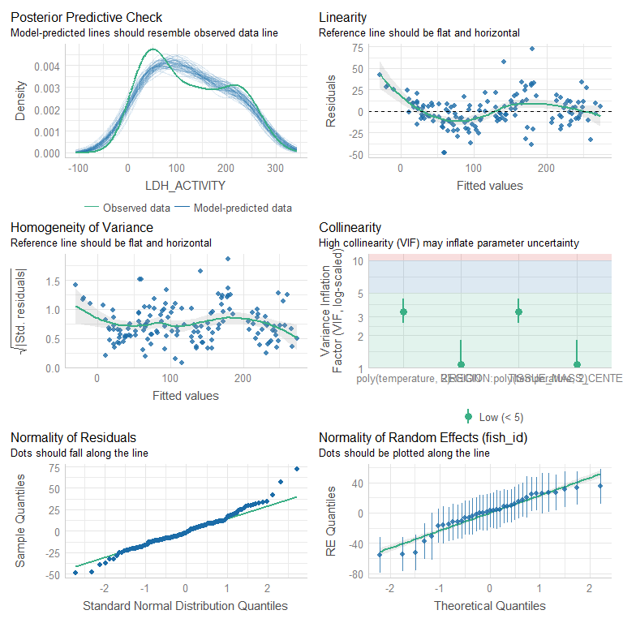<!-- -->

The _ldh.model.1.p2a_ model looks like it performs well.

##### DHARMa residuals {.tabset .tabset-faded}

###### ldh.model.1.p2a (3rd order polynomial))

```r
ldh.model.1.p2a %>% simulateResiduals(plot=TRUE)
```

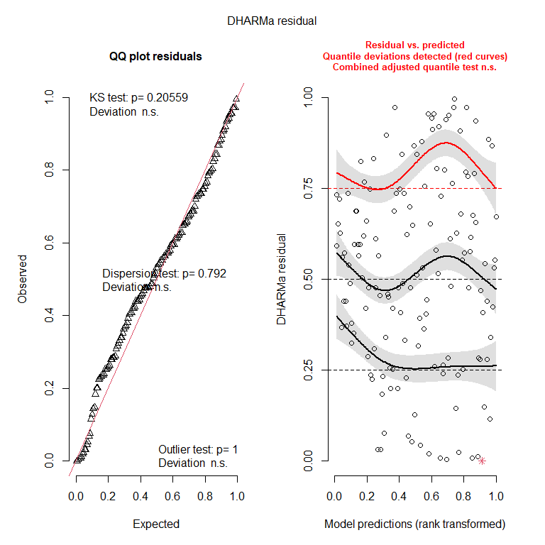<!-- -->

```
## Object of Class DHARMa with simulated residuals based on 250 simulations with refit = FALSE . See ?DHARMa::simulateResiduals for help. 
##  
## Scaled residual values: 0.184 0.068 0.004 0.012 0.376 0.28 0.396 0.608 0.444 0.788 0.636 0.708 0.816 0.884 0.94 0.808 0.328 0.276 0.932 0.312 ...
```

```r
ldh.model.1.p2a %>% DHARMa::testResiduals(plot=TRUE)
```

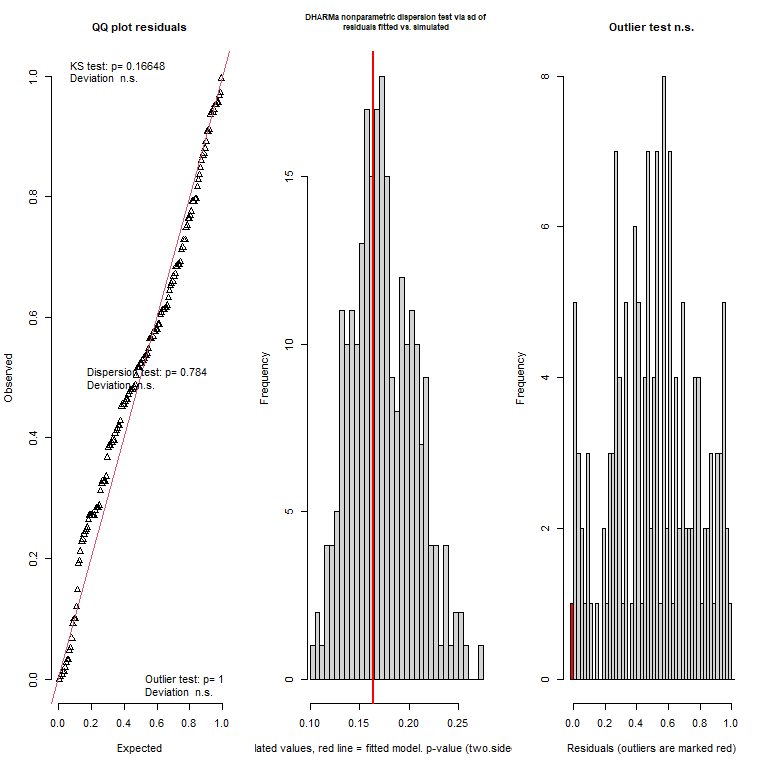<!-- -->

```
## $uniformity
## 
## 	Asymptotic one-sample Kolmogorov-Smirnov test
## 
## data:  simulationOutput$scaledResiduals
## D = 0.088735, p-value = 0.1974
## alternative hypothesis: two-sided
## 
## 
## $dispersion
## 
## 	DHARMa nonparametric dispersion test via sd of residuals fitted vs.
## 	simulated
## 
## data:  simulationOutput
## dispersion = 0.93516, p-value = 0.776
## alternative hypothesis: two.sided
## 
## 
## $outliers
## 
## 	DHARMa outlier test based on exact binomial test with approximate
## 	expectations
## 
## data:  simulationOutput
## outliers at both margin(s) = 1, observations = 147, p-value = 1
## alternative hypothesis: true probability of success is not equal to 0.007968127
## 95 percent confidence interval:
##  0.0001722152 0.0373181816
## sample estimates:
## frequency of outliers (expected: 0.00796812749003984 ) 
##                                            0.006802721
```

```
## $uniformity
## 
## 	Asymptotic one-sample Kolmogorov-Smirnov test
## 
## data:  simulationOutput$scaledResiduals
## D = 0.088735, p-value = 0.1974
## alternative hypothesis: two-sided
## 
## 
## $dispersion
## 
## 	DHARMa nonparametric dispersion test via sd of residuals fitted vs.
## 	simulated
## 
## data:  simulationOutput
## dispersion = 0.93516, p-value = 0.776
## alternative hypothesis: two.sided
## 
## 
## $outliers
## 
## 	DHARMa outlier test based on exact binomial test with approximate
## 	expectations
## 
## data:  simulationOutput
## outliers at both margin(s) = 1, observations = 147, p-value = 1
## alternative hypothesis: true probability of success is not equal to 0.007968127
## 95 percent confidence interval:
##  0.0001722152 0.0373181816
## sample estimates:
## frequency of outliers (expected: 0.00796812749003984 ) 
##                                            0.006802721
```

##### {-}

#### {-}

The model performs well and passes validation checks. 

#### Partial plots {.tabset .tabset-faded}

##### ggemmeans 

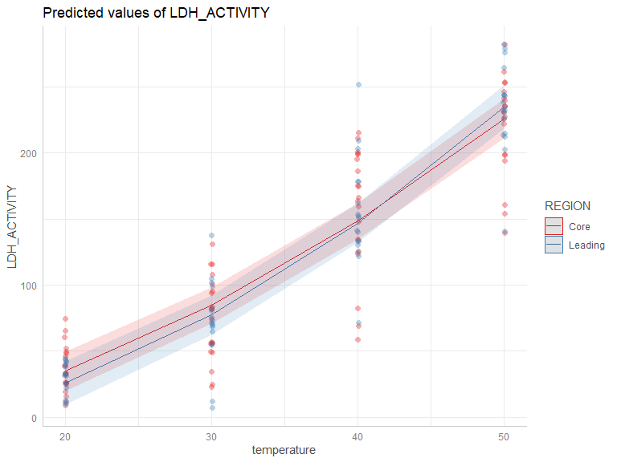<!-- -->

##### plot_model 

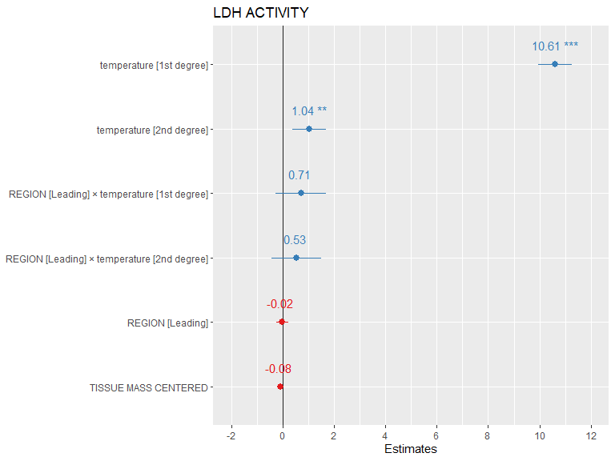<!-- -->

#### {-} 

#### Model investigation {.tabset .tabset-faded}

##### summary 
<table class=" lightable-paper" style='font-family: "Arial Narrow", arial, helvetica, sans-serif; margin-left: auto; margin-right: auto;'>
 <thead>
  <tr>
   <th style="text-align:left;">   </th>
   <th style="text-align:right;"> Estimate </th>
   <th style="text-align:right;"> StdError </th>
   <th style="text-align:right;"> Zvalue </th>
   <th style="text-align:right;"> Pvalue </th>
  </tr>
 </thead>
<tbody>
  <tr>
   <td style="text-align:left;"> (Intercept) </td>
   <td style="text-align:right;"> 124.555285 </td>
   <td style="text-align:right;"> 6.679426 </td>
   <td style="text-align:right;"> 18.6476039 </td>
   <td style="text-align:right;"> 0.0000000 </td>
  </tr>
  <tr>
   <td style="text-align:left;"> REGIONLeading </td>
   <td style="text-align:right;"> -1.411446 </td>
   <td style="text-align:right;"> 9.986395 </td>
   <td style="text-align:right;"> -0.1413369 </td>
   <td style="text-align:right;"> 0.8876038 </td>
  </tr>
  <tr>
   <td style="text-align:left;"> poly(temperature, 3)1 </td>
   <td style="text-align:right;"> 861.723891 </td>
   <td style="text-align:right;"> 25.570654 </td>
   <td style="text-align:right;"> 33.6997207 </td>
   <td style="text-align:right;"> 0.0000000 </td>
  </tr>
  <tr>
   <td style="text-align:left;"> poly(temperature, 3)2 </td>
   <td style="text-align:right;"> 83.842778 </td>
   <td style="text-align:right;"> 25.638721 </td>
   <td style="text-align:right;"> 3.2701623 </td>
   <td style="text-align:right;"> 0.0010749 </td>
  </tr>
  <tr>
   <td style="text-align:left;"> poly(temperature, 3)3 </td>
   <td style="text-align:right;"> -81.413847 </td>
   <td style="text-align:right;"> 25.709496 </td>
   <td style="text-align:right;"> -3.1666839 </td>
   <td style="text-align:right;"> 0.0015419 </td>
  </tr>
  <tr>
   <td style="text-align:left;"> TISSUE_MASS_CENTERED </td>
   <td style="text-align:right;"> -1.406645 </td>
   <td style="text-align:right;"> 1.044818 </td>
   <td style="text-align:right;"> -1.3463059 </td>
   <td style="text-align:right;"> 0.1782039 </td>
  </tr>
  <tr>
   <td style="text-align:left;"> REGIONLeading:poly(temperature, 3)1 </td>
   <td style="text-align:right;"> 56.873119 </td>
   <td style="text-align:right;"> 38.086232 </td>
   <td style="text-align:right;"> 1.4932724 </td>
   <td style="text-align:right;"> 0.1353659 </td>
  </tr>
  <tr>
   <td style="text-align:left;"> REGIONLeading:poly(temperature, 3)2 </td>
   <td style="text-align:right;"> 43.574437 </td>
   <td style="text-align:right;"> 38.029467 </td>
   <td style="text-align:right;"> 1.1458072 </td>
   <td style="text-align:right;"> 0.2518749 </td>
  </tr>
  <tr>
   <td style="text-align:left;"> REGIONLeading:poly(temperature, 3)3 </td>
   <td style="text-align:right;"> 14.222674 </td>
   <td style="text-align:right;"> 37.970193 </td>
   <td style="text-align:right;"> 0.3745747 </td>
   <td style="text-align:right;"> 0.7079768 </td>
  </tr>
</tbody>
</table>

##### Anova 
<table class=" lightable-paper" style='font-family: "Arial Narrow", arial, helvetica, sans-serif; margin-left: auto; margin-right: auto;'>
 <thead>
  <tr>
   <th style="text-align:left;">   </th>
   <th style="text-align:right;"> Chisq </th>
   <th style="text-align:right;"> Df </th>
   <th style="text-align:right;"> Pr(&gt;Chisq) </th>
  </tr>
 </thead>
<tbody>
  <tr>
   <td style="text-align:left;"> REGION </td>
   <td style="text-align:right;"> 0.0197919 </td>
   <td style="text-align:right;"> 1 </td>
   <td style="text-align:right;"> 0.8881199 </td>
  </tr>
  <tr>
   <td style="text-align:left;"> poly(temperature, 3) </td>
   <td style="text-align:right;"> 2241.9339643 </td>
   <td style="text-align:right;"> 3 </td>
   <td style="text-align:right;"> 0.0000000 </td>
  </tr>
  <tr>
   <td style="text-align:left;"> TISSUE_MASS_CENTERED </td>
   <td style="text-align:right;"> 1.8125396 </td>
   <td style="text-align:right;"> 1 </td>
   <td style="text-align:right;"> 0.1782039 </td>
  </tr>
  <tr>
   <td style="text-align:left;"> REGION:poly(temperature, 3) </td>
   <td style="text-align:right;"> 3.6997580 </td>
   <td style="text-align:right;"> 3 </td>
   <td style="text-align:right;"> 0.2957632 </td>
  </tr>
</tbody>
</table>

##### confint 
<table class=" lightable-paper" style='font-family: "Arial Narrow", arial, helvetica, sans-serif; margin-left: auto; margin-right: auto;'>
 <thead>
  <tr>
   <th style="text-align:left;">   </th>
   <th style="text-align:right;"> 2.5 % </th>
   <th style="text-align:right;"> 97.5 % </th>
   <th style="text-align:right;"> Estimate </th>
  </tr>
 </thead>
<tbody>
  <tr>
   <td style="text-align:left;"> (Intercept) </td>
   <td style="text-align:right;"> 111.463851 </td>
   <td style="text-align:right;"> 137.6467184 </td>
   <td style="text-align:right;"> 124.555285 </td>
  </tr>
  <tr>
   <td style="text-align:left;"> REGIONLeading </td>
   <td style="text-align:right;"> -20.984421 </td>
   <td style="text-align:right;"> 18.1615283 </td>
   <td style="text-align:right;"> -1.411446 </td>
  </tr>
  <tr>
   <td style="text-align:left;"> poly(temperature, 3)1 </td>
   <td style="text-align:right;"> 811.606331 </td>
   <td style="text-align:right;"> 911.8414518 </td>
   <td style="text-align:right;"> 861.723891 </td>
  </tr>
  <tr>
   <td style="text-align:left;"> poly(temperature, 3)2 </td>
   <td style="text-align:right;"> 33.591808 </td>
   <td style="text-align:right;"> 134.0937479 </td>
   <td style="text-align:right;"> 83.842778 </td>
  </tr>
  <tr>
   <td style="text-align:left;"> poly(temperature, 3)3 </td>
   <td style="text-align:right;"> -131.803533 </td>
   <td style="text-align:right;"> -31.0241611 </td>
   <td style="text-align:right;"> -81.413847 </td>
  </tr>
  <tr>
   <td style="text-align:left;"> TISSUE_MASS_CENTERED </td>
   <td style="text-align:right;"> -3.454451 </td>
   <td style="text-align:right;"> 0.6411612 </td>
   <td style="text-align:right;"> -1.406645 </td>
  </tr>
  <tr>
   <td style="text-align:left;"> REGIONLeading:poly(temperature, 3)1 </td>
   <td style="text-align:right;"> -17.774525 </td>
   <td style="text-align:right;"> 131.5207627 </td>
   <td style="text-align:right;"> 56.873119 </td>
  </tr>
  <tr>
   <td style="text-align:left;"> REGIONLeading:poly(temperature, 3)2 </td>
   <td style="text-align:right;"> -30.961948 </td>
   <td style="text-align:right;"> 118.1108231 </td>
   <td style="text-align:right;"> 43.574437 </td>
  </tr>
  <tr>
   <td style="text-align:left;"> REGIONLeading:poly(temperature, 3)3 </td>
   <td style="text-align:right;"> -60.197538 </td>
   <td style="text-align:right;"> 88.6428847 </td>
   <td style="text-align:right;"> 14.222674 </td>
  </tr>
  <tr>
   <td style="text-align:left;"> Std.Dev.(Intercept)|fish_id </td>
   <td style="text-align:right;"> 21.203654 </td>
   <td style="text-align:right;"> 36.0995765 </td>
   <td style="text-align:right;"> 27.666639 </td>
  </tr>
</tbody>
</table>

##### r-squared
<table class=" lightable-paper" style='font-family: "Arial Narrow", arial, helvetica, sans-serif; margin-left: auto; margin-right: auto;'>
 <thead>
  <tr>
   <th style="text-align:right;"> R2_conditional </th>
   <th style="text-align:right;"> R2_marginal </th>
   <th style="text-align:left;"> optional </th>
  </tr>
 </thead>
<tbody>
  <tr>
   <td style="text-align:right;"> 0.9465329 </td>
   <td style="text-align:right;"> 0.8321446 </td>
   <td style="text-align:left;"> FALSE </td>
  </tr>
</tbody>
</table>

#### {-} 

#### Pairwise comparisons {.tabset .tabset-faded} 

##### emtrends [latitudes]


```r
ldh.model.1.p2a  %>% emtrends(var = "temperature", type = "response") %>% pairs(by = "temperature") %>% summary(by = NULL, adjust = "tukey", infer=TRUE)
```

<div data-pagedtable="false">
  <script data-pagedtable-source type="application/json">
{"columns":[{"label":[""],"name":["_rn_"],"type":[""],"align":["left"]},{"label":["contrast"],"name":[1],"type":["fct"],"align":["left"]},{"label":["temperature"],"name":[2],"type":["dbl"],"align":["right"]},{"label":["estimate"],"name":[3],"type":["dbl"],"align":["right"]},{"label":["SE"],"name":[4],"type":["dbl"],"align":["right"]},{"label":["df"],"name":[5],"type":["dbl"],"align":["right"]},{"label":["lower.CL"],"name":[6],"type":["dbl"],"align":["right"]},{"label":["upper.CL"],"name":[7],"type":["dbl"],"align":["right"]},{"label":["t.ratio"],"name":[8],"type":["dbl"],"align":["right"]},{"label":["p.value"],"name":[9],"type":["dbl"],"align":["right"]}],"data":[{"1":"Core TISSUE_MASS_CENTERED0.206432155367117 - Leading TISSUE_MASS_CENTERED0.206432155367117","2":"35.10204","3":"-0.06914598","4":"0.993288","5":"145","6":"-2.03234","7":"1.894048","8":"-0.06961323","9":"0.9445974","_rn_":"1"}],"options":{"columns":{"min":{},"max":[10]},"rows":{"min":[10],"max":[10]},"pages":{}}}
  </script>
</div>
SCROLL TO THE RIGHT -->

The numbers in the left most column in the table just mention that the slopes are assuming mean **TISSUE_MASS_CENTERED** values when looking at differences between latitudinal slopes.

##### emmeans [latitudes]

```r
ldh.model.1.p2a  %>% emmeans(pairwise ~ temperature*REGION, type = "response") %>% pairs(by = "temperature") %>% summary(by = NULL, adjust = "tukey", infer=TRUE)
```

<div data-pagedtable="false">
  <script data-pagedtable-source type="application/json">
{"columns":[{"label":[""],"name":["_rn_"],"type":[""],"align":["left"]},{"label":["contrast"],"name":[1],"type":["fct"],"align":["left"]},{"label":["temperature"],"name":[2],"type":["dbl"],"align":["right"]},{"label":["estimate"],"name":[3],"type":["dbl"],"align":["right"]},{"label":["SE"],"name":[4],"type":["dbl"],"align":["right"]},{"label":["df"],"name":[5],"type":["dbl"],"align":["right"]},{"label":["lower.CL"],"name":[6],"type":["dbl"],"align":["right"]},{"label":["upper.CL"],"name":[7],"type":["dbl"],"align":["right"]},{"label":["t.ratio"],"name":[8],"type":["dbl"],"align":["right"]},{"label":["p.value"],"name":[9],"type":["dbl"],"align":["right"]}],"data":[{"1":"Core - Leading","2":"35.10204","3":"5.914894","4":"10.7187","5":"145","6":"-15.27019","7":"27.09998","8":"0.5518293","9":"0.5819148","_rn_":"1"}],"options":{"columns":{"min":{},"max":[10]},"rows":{"min":[10],"max":[10]},"pages":{}}}
  </script>
</div>

##### temperature 

```r
ldh.model.1.p2a  %>% emmeans(~ temperature*REGION, type = "response")  %>% summary(infer=TRUE)
```

<div data-pagedtable="false">
  <script data-pagedtable-source type="application/json">
{"columns":[{"label":[""],"name":["_rn_"],"type":[""],"align":["left"]},{"label":["temperature"],"name":[1],"type":["dbl"],"align":["right"]},{"label":["REGION"],"name":[2],"type":["fct"],"align":["left"]},{"label":["emmean"],"name":[3],"type":["dbl"],"align":["right"]},{"label":["SE"],"name":[4],"type":["dbl"],"align":["right"]},{"label":["df"],"name":[5],"type":["dbl"],"align":["right"]},{"label":["lower.CL"],"name":[6],"type":["dbl"],"align":["right"]},{"label":["upper.CL"],"name":[7],"type":["dbl"],"align":["right"]},{"label":["t.ratio"],"name":[8],"type":["dbl"],"align":["right"]},{"label":["p.value"],"name":[9],"type":["dbl"],"align":["right"]}],"data":[{"1":"35.10204","2":"Core","3":"115.8714","4":"7.145787","5":"145","6":"101.74808","7":"129.9948","8":"16.21535","9":"2.215130e-34","_rn_":"1"},{"1":"35.10204","2":"Leading","3":"109.9565","4":"7.781246","5":"145","6":"94.57722","7":"125.3359","8":"14.13097","9":"4.710313e-29","_rn_":"2"}],"options":{"columns":{"min":{},"max":[10]},"rows":{"min":[10],"max":[10]},"pages":{}}}
  </script>
</div>


##### Means - f(temperature)

```r
ldh.model.1.p2a  %>% update(.~1+ REGION * as.factor(temperature) + TISSUE_MASS_CENTERED + (1|fish_id)) %>% 
  emmeans(~REGION*temperature, type = "response") %>% summary(infer=TRUE)
```

<div data-pagedtable="false">
  <script data-pagedtable-source type="application/json">
{"columns":[{"label":[""],"name":["_rn_"],"type":[""],"align":["left"]},{"label":["REGION"],"name":[1],"type":["fct"],"align":["left"]},{"label":["temperature"],"name":[2],"type":["dbl"],"align":["right"]},{"label":["emmean"],"name":[3],"type":["dbl"],"align":["right"]},{"label":["SE"],"name":[4],"type":["dbl"],"align":["right"]},{"label":["df"],"name":[5],"type":["dbl"],"align":["right"]},{"label":["lower.CL"],"name":[6],"type":["dbl"],"align":["right"]},{"label":["upper.CL"],"name":[7],"type":["dbl"],"align":["right"]},{"label":["t.ratio"],"name":[8],"type":["dbl"],"align":["right"]},{"label":["p.value"],"name":[9],"type":["dbl"],"align":["right"]}],"data":[{"1":"Core","2":"20","3":"38.11728","4":"7.582058","5":"145","6":"23.13165","7":"53.10291","8":"5.027300","9":"1.445950e-06","_rn_":"1"},{"1":"Leading","2":"20","3":"33.47857","4":"8.349669","5":"145","6":"16.97579","7":"49.98136","8":"4.009569","9":"9.699945e-05","_rn_":"2"},{"1":"Core","2":"30","3":"75.92933","4":"7.582058","5":"145","6":"60.94370","7":"90.91497","8":"10.014344","9":"2.872868e-18","_rn_":"3"},{"1":"Leading","2":"30","3":"70.38417","4":"8.252014","5":"145","6":"54.07440","7":"86.69394","8":"8.529332","9":"1.778898e-14","_rn_":"4"},{"1":"Core","2":"40","3":"157.56341","4":"7.582058","5":"145","6":"142.57778","7":"172.54904","8":"20.781087","9":"2.536940e-45","_rn_":"5"},{"1":"Leading","2":"40","3":"153.06093","4":"8.252014","5":"145","6":"136.75116","7":"169.37070","8":"18.548312","9":"4.143414e-40","_rn_":"6"},{"1":"Core","2":"50","3":"223.12129","4":"7.582058","5":"145","6":"208.13566","7":"238.10693","8":"29.427537","9":"5.116549e-63","_rn_":"7"},{"1":"Leading","2":"50","3":"232.07463","4":"8.252014","5":"145","6":"215.76486","7":"248.38440","8":"28.123393","9":"1.382666e-60","_rn_":"8"}],"options":{"columns":{"min":{},"max":[10]},"rows":{"min":[10],"max":[10]},"pages":{}}}
  </script>
</div>

##### Abs. diff - f(temperature)

```r
ldh.model.1.p2a  %>% update(.~1+ REGION * as.factor(temperature) + TISSUE_MASS_CENTERED + (1|fish_id)) %>% 
  emmeans(~REGION*temperature, type = "response") %>% pairs(by ="REGION") %>% summary(infer=TRUE)
```

<div data-pagedtable="false">
  <script data-pagedtable-source type="application/json">
{"columns":[{"label":[""],"name":["_rn_"],"type":[""],"align":["left"]},{"label":["contrast"],"name":[1],"type":["fct"],"align":["left"]},{"label":["REGION"],"name":[2],"type":["fct"],"align":["left"]},{"label":["estimate"],"name":[3],"type":["dbl"],"align":["right"]},{"label":["SE"],"name":[4],"type":["dbl"],"align":["right"]},{"label":["df"],"name":[5],"type":["dbl"],"align":["right"]},{"label":["lower.CL"],"name":[6],"type":["dbl"],"align":["right"]},{"label":["upper.CL"],"name":[7],"type":["dbl"],"align":["right"]},{"label":["t.ratio"],"name":[8],"type":["dbl"],"align":["right"]},{"label":["p.value"],"name":[9],"type":["dbl"],"align":["right"]}],"data":[{"1":"temperature20 - temperature30","2":"Core","3":"-37.81205","4":"5.981486","5":"145","6":"-53.35838","7":"-22.26573","8":"-6.321515","9":"1.803058e-08","_rn_":"1"},{"1":"temperature20 - temperature40","2":"Core","3":"-119.44613","4":"5.981486","5":"145","6":"-134.99245","7":"-103.89980","8":"-19.969307","9":"3.552714e-15","_rn_":"2"},{"1":"temperature20 - temperature50","2":"Core","3":"-185.00401","4":"5.981486","5":"145","6":"-200.55034","7":"-169.45769","8":"-30.929441","9":"3.552714e-15","_rn_":"3"},{"1":"temperature30 - temperature40","2":"Core","3":"-81.63407","4":"5.981486","5":"145","6":"-97.18040","7":"-66.08775","8":"-13.647792","9":"3.552714e-15","_rn_":"4"},{"1":"temperature30 - temperature50","2":"Core","3":"-147.19196","4":"5.981486","5":"145","6":"-162.73828","7":"-131.64564","8":"-24.607926","9":"3.552714e-15","_rn_":"5"},{"1":"temperature40 - temperature50","2":"Core","3":"-65.55789","4":"5.981486","5":"145","6":"-81.10421","7":"-50.01156","8":"-10.960134","9":"2.620126e-14","_rn_":"6"},{"1":"temperature20 - temperature30","2":"Leading","3":"-36.90560","4":"6.617361","5":"145","6":"-54.10461","7":"-19.70659","8":"-5.577087","9":"6.927738e-07","_rn_":"7"},{"1":"temperature20 - temperature40","2":"Leading","3":"-119.58236","4":"6.617361","5":"145","6":"-136.78137","7":"-102.38335","8":"-18.071005","9":"3.552714e-15","_rn_":"8"},{"1":"temperature20 - temperature50","2":"Leading","3":"-198.59606","4":"6.617361","5":"145","6":"-215.79507","7":"-181.39705","8":"-30.011370","9":"3.552714e-15","_rn_":"9"},{"1":"temperature30 - temperature40","2":"Leading","3":"-82.67676","4":"6.487832","5":"145","6":"-99.53912","7":"-65.81441","8":"-12.743357","9":"3.996803e-15","_rn_":"10"},{"1":"temperature30 - temperature50","2":"Leading","3":"-161.69046","4":"6.487832","5":"145","6":"-178.55282","7":"-144.82810","8":"-24.922108","9":"3.552714e-15","_rn_":"11"},{"1":"temperature40 - temperature50","2":"Leading","3":"-79.01370","4":"6.487832","5":"145","6":"-95.87605","7":"-62.15134","8":"-12.178752","9":"5.884182e-15","_rn_":"12"}],"options":{"columns":{"min":{},"max":[10]},"rows":{"min":[10],"max":[10]},"pages":{}}}
  </script>
</div>

##### Effect size

```r
ldh.emm <- ldh.model.1.p2a %>% emmeans(~REGION*temperature)
eff_size(ldh.emm, sigma = sigma(ldh.model.1.p2a), edf=df.residual(ldh.model.1.p2a))
```

```
##  contrast                                                              
##  Core temperature35.1020408163265 - Leading temperature35.1020408163265
##  effect.size    SE  df lower.CL upper.CL
##        0.313 0.567 145   -0.808     1.43
## 
## sigma used for effect sizes: 18.92 
## Confidence level used: 0.95
```
#### {-}

#### Summary figure 


```
## Warning: Removed 5 rows containing missing values (`geom_point()`).
```

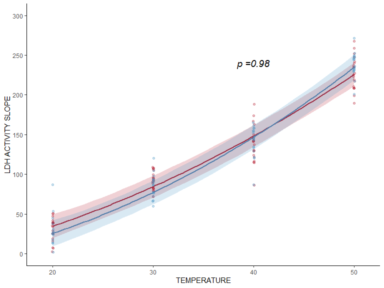<!-- -->

#### Conclusion 

* In conclusion while LDH enzyme activity has a **significantly** positively correlated with temperature, however, there is no significant difference in the relationship between temperature and LDH activity when comparing fish from low- and high-latitudes.


### Citrate synthase 

#### Scenario 

For initial details on the experiment performed please read the **ReadMe** file. In brief, _Acanthochromis polyacanthus_ from two different regions on the Great Barrier Reef (GBR) were tested for metabolic performance at four different temperatures, 27$^\circ$C, 28.5$^\circ$C, 30$^\circ$C, and 31.5$^\circ$C. Fish used in this study were collected from two different regions, low- (i.e. Cairns) and high-latitude (i.e., Mackay), within each region fish were collected from a total of three different populations. After metabolic performance was tested blood and tissue samples were collected. White muscle tissue samples were used to look at the relationship between activity and temperature in two different enzymes, Lactate Dehydrogenase (LDH; anaerobic) and Citrate Synthase (CS: aerobic). Enzyme activity was measured over four different temperatures including 20$^\circ$C, 30$^\circ$C, 40$^\circ$C, and 50$^\circ$C. Enzyme activity was measured using a spectophotometer and wavelength absoprtion levels were recorded using the software program LabX. 

Before beginning always make sure that you are working in the correct directory 


```r
knitr::opts_knit$set(root.dir=working.dir)
```

Now we can import that data. Two different data frames are being imported. The first has all the enzyme wave length absorption data for each sample and the tissue.mass data file contained information pertaining to the tissue samples that was used for each sample. Later on these two data frames will be merged. 

#### Load data 

```r
cs <- read_delim("C:/Users/jc527762/OneDrive - James Cook University/PhD dissertation/Data/Chapter1_LocalAdaptation/enzymes/CS_LocalAdapt6.txt", 
                             delim = "\t", escape_double = FALSE, 
                             col_types = cols(...21 = col_skip(), 
                                              ...22 = col_skip()), trim_ws = TRUE) %>% 
  clean_names() %>% 
  mutate(creation_time = as.POSIXct(creation_time, format = "%d/%m/%Y %H:%M:%S"))
tissue.mass <- read.delim("C:/Users/jc527762/OneDrive - James Cook University/PhD dissertation/Data/Chapter1_LocalAdaptation/enzymes/tissue_mass.txt") %>% 
  dplyr::rename(FISH_ID = fish_id)
```

#### Data manipulation 

Before the data can be analysed it is important to clean up the data file. I won't explain step, that can be figured out by examining the different functions. The main steps that are occurring below are columns being broken up to make new columns (this is the _separate_ function), or columns being combined to make a unique_sample_Id value. Time data can also be tricky to deal with in R, so there are a number of data manipulation steps being used to make sure that time is being read properly.


```r
#--- data preparation/manipulation ---# 
cs2 <- cs %>%
  mutate(muscle_type = str_replace(muscle_type, " ", ".")) %>%
  unite("UNIQUE_SAMPLE_ID", c(fish_id,temperature,sample_index), sep="_", remove = FALSE) %>% 
  separate(creation_time, into=c('DATE','TIME'), sep = " ", remove = FALSE) %>% 
  arrange(sample_id_1, DATE, TIME) 

cs3 <- cs2 %>% 
  mutate(DATE = as.Date(creation_time), 
         TIME = format(creation_time, "%H:%M:%S")) %>%
  mutate(TIME = hms(cs2$TIME)) %>% 
  mutate(TIME = chron(times=cs2$TIME)) %>% 
  arrange(TIME) %>%
  group_by(UNIQUE_SAMPLE_ID, sample_id_1) %>% 
  mutate(TIME_DIFF = TIME - first(TIME)) %>% 
  filter(TIME != first(TIME)) %>%
  ungroup() %>% 
  mutate(TIME_DIFF_SECS = period_to_seconds(hms(TIME_DIFF))) %>% 
  mutate(MINUTES = TIME_DIFF_SECS/60) %>% 
  mutate(MINUTES = round(MINUTES, digits = 2)) %>% 
  dplyr::rename(CUVETTE = sample_id_1) %>% 
  mutate(REGION = substr(fish_id, 1, 1 ), 
         POPULATION = substr(fish_id, 2, 4), 
         SAMPLE_NO = substr(fish_id, 5, 7)) %>% 
  mutate(REGION = case_when( REGION =="L"~ "Leading", 
                             REGION == "C" ~ "Core", 
                             TRUE ~ "na"))   
```

#### Data cleaning

Next select data points will be removed. Data points have been checked using previously written app script that allows the user to look at the plotted points of samples that were run. Because we are interested in the slope, points that plateaued were removed from the analysis, as it signifies that the reaction ran out of 'fuel' to use. For LDH 'fuel' would refer to NADH, for CS 'fuel' would refer to Oxaloacetic acid. Samples that were removed were placed into one of five different groups. No reactions reached plateau for CS, however there were a number of runs and/or cuvettes where data quailty was poor. 


```r
cs3.filtered <- cs3 %>% 
  dplyr::rename(TEMPERATURE = temperature, 
         FISH_ID = fish_id) %>%
  filter(!(TEMPERATURE == "50" & FISH_ID == "LCKM158")) %>% 
  filter(!(TEMPERATURE == "50" & FISH_ID == "CSUD010")) %>% 
  filter(!(TEMPERATURE == "40" & FISH_ID == "CSUD018")) %>% 
  filter(!(TEMPERATURE == "20" & FISH_ID == "CTON061")) %>% 
  filter(!(TEMPERATURE == "50" & FISH_ID == "CTON065")) %>%
  filter(!(FISH_ID == "CTON069")) %>% 
  filter(!(UNIQUE_SAMPLE_ID %in% c("CTON060_50_3", 
                                   "CTON061_30_3", 
                                   "CTON061_40_3", 
                                   "CTON061_50_2", 
                                   "CTON061_50_3")))%>% 
  mutate(UNIQUE_SAMPLE_ID = str_sub(UNIQUE_SAMPLE_ID, end = -3))
```

Great! Now we have all the data points that we want to keep. However, the data needs to manipulated in a way that we can obtain and pull out slopes from the absorption readings, and the calculate enzyme activity based on these slopes. This will involve a number of steps. 

#### Data calculations

##### Step1: Extract slopes 

Step1 will produce a data frame that provides you with the slope that was obtained for cuvettes 1-3 for each sample run at each experimental temperature

```r
CS_activity <- cs3.filtered %>% 
  dplyr::group_by(UNIQUE_SAMPLE_ID, CUVETTE) %>% 
  do({
    mod = lm(result ~ MINUTES, data = .)
    data.frame(Intercept = coef(mod)[1],
               Slope = coef(mod)[2], 
               r2 = summary(mod)$adj.r.squared)
  }) %>%
  dplyr::ungroup() %>%
  filter(CUVETTE != ("6"))%>% 
  filter(CUVETTE != ("4"))%>% 
  filter(CUVETTE != ("5"))
```

##### Step2: Slope means

Step2 will calculate the mean slope for cuvette 1-3. 

```r
CS_activity_means <- CS_activity %>%
  dplyr::group_by(UNIQUE_SAMPLE_ID) %>% 
  dplyr::mutate(Mean = mean(Slope))
```

##### Step3: Background activity level

Step3 will calculate background activity level by measuring the slope from cuvette 5 (postive control)

```r
CS_background <- cs3.filtered %>% 
  group_by(UNIQUE_SAMPLE_ID, CUVETTE) %>% 
  do({
    mod = lm(result ~ MINUTES, data = .)
    data.frame(Intercept = coef(mod)[1],
               Slope = coef(mod)[2], 
               r2 = summary(mod)$adj.r.squared)
  }) %>%
  ungroup() %>%
  filter(CUVETTE == ("5")) %>% 
  dplyr::rename(Background = Slope)
```

##### Step4: Merging dataframes

Step4 will merge the data frames that you created with the mean slopes and the background slopes.

```r
final_table <- CS_activity %>% 
  full_join(distinct(CS_activity_means[,c(1,6)]), by = "UNIQUE_SAMPLE_ID") %>% 
  full_join(CS_background[,c(1,4)], by = "UNIQUE_SAMPLE_ID") 
final_table$Mean[duplicated(final_table$Mean)] <- ""
final_table$Background[duplicated(final_table$Background)] <- ""
final_table <- final_table %>% 
  mutate(Mean = as.numeric(Mean), 
         Background = as.numeric(Background), 
         Background_perc = Background/Mean) 
```

##### Step5: Enzyme activity levels 

Step5 is where enzyme activity levels are calculated. See further details in manuscript (doi: xxx). Within this step background activity level is taken into account and subtracted from slopes where background activity was >5% or more of the sample slope. 

```r
CS.data <- final_table %>% 
  select(c(UNIQUE_SAMPLE_ID, Mean, Background, Background_perc)) %>% 
  mutate(Mean = as.numeric(Mean), 
         Background = as.numeric(Background), 
         Background_perc = as.numeric(Background_perc)) %>% 
  mutate(Background2 = case_when(Background_perc <= 0.05 ~ 0, 
                                 TRUE ~ Background), 
         CS_ABSORBANCE = Mean - Background2) %>%
  inner_join(select(cs3.filtered, c(UNIQUE_SAMPLE_ID, REGION, POPULATION, TEMPERATURE, FISH_ID)), by ="UNIQUE_SAMPLE_ID") %>% 
  inner_join(tissue.mass, by = "FISH_ID") %>% 
  mutate(TISSUE_MASS_CENTERED = scale(TISSUE_MASS, center = TRUE, scale = FALSE)) %>%
  distinct(UNIQUE_SAMPLE_ID, REGION, POPULATION, .keep_all = TRUE) %>% 
  mutate(REGION = factor(REGION),
         PATH_LENGTH = 1, 
         EXTINCTION_COEFFICIENT = 13.6, 
         TISSUE_CONCENTRATION = 0.01, 
         ASSAY_VOL = 0.930, 
         SAMPLE_VOL = 0.020, 
         CS_ACTIVITY = ((CS_ABSORBANCE/(PATH_LENGTH*EXTINCTION_COEFFICIENT*TISSUE_CONCENTRATION))*(ASSAY_VOL/SAMPLE_VOL))) %>% 
  filter(FISH_ID != "CVLA047")
```


By the end of this stage you should have a data frame that included a column called **LDH_ACTIVITY** along with necessary metadata - this data frame will be used to perform the statistical analysis. 

#### Exploratory data analysis {.tabset}

##### CS v TEMPERATURE [LATITUDE]

```r
ggplot(CS.data, aes(x =as.numeric(TEMPERATURE), y= CS_ACTIVITY, color = REGION)) + 
  geom_point() + geom_smooth(method = "lm", se=FALSE)
```

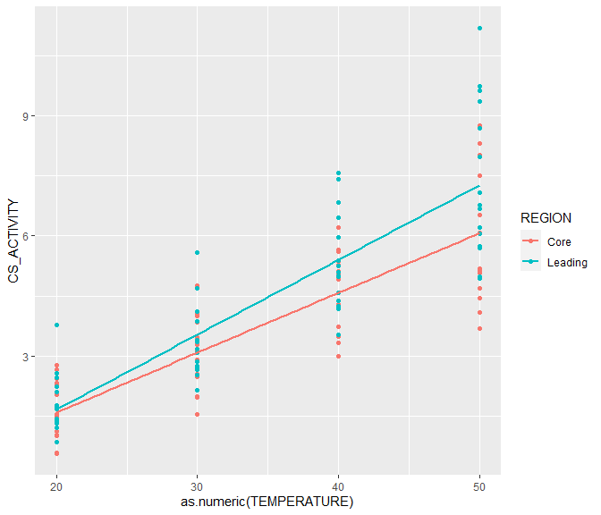<!-- -->

##### CS V TEMPERATURE [DENSITY]

```r
ggplot(CS.data, aes(x = CS_ACTIVITY, fill = TEMPERATURE, color = TEMPERATURE)) + 
  geom_density(alpha =0.5, position = "identity") 
```

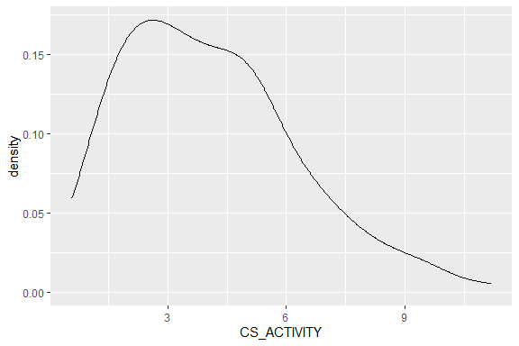<!-- -->

##### CS v TISSUE MASS (LATITUDE)

```r
ggplot(CS.data, aes(x =TISSUE_MASS_CENTERED, y= CS_ACTIVITY, color = REGION)) + 
  geom_point() + geom_smooth(method = "lm", se=FALSE)
```

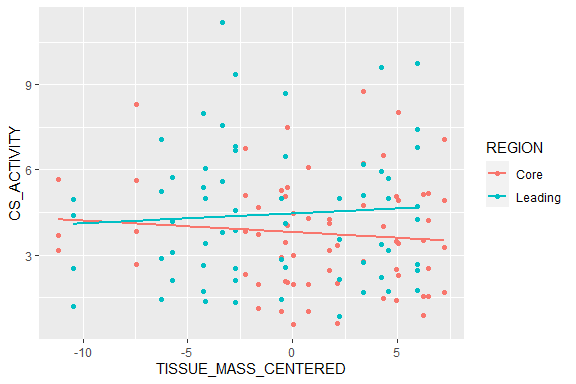<!-- -->


##### {-}

#### Fit the model 

The model was fit using the **glm** and later **glmmTMB** package in R. A number of different models were tested to determine which hypothesis and associated variables best predicted resting oxygen consumption. Model fit was examined using AICc, BIC, and r-squared values. Additional model were examined via the validation diagonistics provided by the **performance** and **dHARMA** packages in R. 

##### Fixed factors (linear regression models)

###### model 1

```r
#--- base model ---#
cs.model.1 <- glm(CS_ACTIVITY ~ 1 + REGION*TEMPERATURE + TISSUE_MASS_CENTERED, 
                       family=gaussian(), 
                       data = CS.data)  
```
####### summary
<table class=" lightable-paper" style='font-family: "Arial Narrow", arial, helvetica, sans-serif; margin-left: auto; margin-right: auto;'>
 <thead>
  <tr>
   <th style="text-align:left;">   </th>
   <th style="text-align:right;"> Estimate </th>
   <th style="text-align:right;"> Std. Error </th>
   <th style="text-align:right;"> t value </th>
   <th style="text-align:right;"> Pr(&gt;|t|) </th>
  </tr>
 </thead>
<tbody>
  <tr>
   <td style="text-align:left;"> (Intercept) </td>
   <td style="text-align:right;"> -1.3917427 </td>
   <td style="text-align:right;"> 0.4681525 </td>
   <td style="text-align:right;"> -2.9728401 </td>
   <td style="text-align:right;"> 0.0035409 </td>
  </tr>
  <tr>
   <td style="text-align:left;"> REGIONLeading </td>
   <td style="text-align:right;"> -0.6551419 </td>
   <td style="text-align:right;"> 0.6711737 </td>
   <td style="text-align:right;"> -0.9761138 </td>
   <td style="text-align:right;"> 0.3308934 </td>
  </tr>
  <tr>
   <td style="text-align:left;"> TEMPERATURE </td>
   <td style="text-align:right;"> 0.1491176 </td>
   <td style="text-align:right;"> 0.0128965 </td>
   <td style="text-align:right;"> 11.5626489 </td>
   <td style="text-align:right;"> 0.0000000 </td>
  </tr>
  <tr>
   <td style="text-align:left;"> TISSUE_MASS_CENTERED </td>
   <td style="text-align:right;"> 0.0065822 </td>
   <td style="text-align:right;"> 0.0217986 </td>
   <td style="text-align:right;"> 0.3019550 </td>
   <td style="text-align:right;"> 0.7631882 </td>
  </tr>
  <tr>
   <td style="text-align:left;"> REGIONLeading:TEMPERATURE </td>
   <td style="text-align:right;"> 0.0372828 </td>
   <td style="text-align:right;"> 0.0183990 </td>
   <td style="text-align:right;"> 2.0263512 </td>
   <td style="text-align:right;"> 0.0448568 </td>
  </tr>
</tbody>
</table>

###### model 2

```r
cs.model.2 <- glm(CS_ACTIVITY ~ 1 + REGION*TEMPERATURE, 
                       family=gaussian(), 
                       data = CS.data) 
```

####### summary
<table class=" lightable-paper" style='font-family: "Arial Narrow", arial, helvetica, sans-serif; margin-left: auto; margin-right: auto;'>
 <thead>
  <tr>
   <th style="text-align:left;">   </th>
   <th style="text-align:right;"> Estimate </th>
   <th style="text-align:right;"> Std. Error </th>
   <th style="text-align:right;"> t value </th>
   <th style="text-align:right;"> Pr(&gt;|t|) </th>
  </tr>
 </thead>
<tbody>
  <tr>
   <td style="text-align:left;"> (Intercept) </td>
   <td style="text-align:right;"> -1.3792002 </td>
   <td style="text-align:right;"> 0.4646214 </td>
   <td style="text-align:right;"> -2.968439 </td>
   <td style="text-align:right;"> 0.0035836 </td>
  </tr>
  <tr>
   <td style="text-align:left;"> REGIONLeading </td>
   <td style="text-align:right;"> -0.6734697 </td>
   <td style="text-align:right;"> 0.6660086 </td>
   <td style="text-align:right;"> -1.011203 </td>
   <td style="text-align:right;"> 0.3138573 </td>
  </tr>
  <tr>
   <td style="text-align:left;"> TEMPERATURE </td>
   <td style="text-align:right;"> 0.1489822 </td>
   <td style="text-align:right;"> 0.0128421 </td>
   <td style="text-align:right;"> 11.601054 </td>
   <td style="text-align:right;"> 0.0000000 </td>
  </tr>
  <tr>
   <td style="text-align:left;"> REGIONLeading:TEMPERATURE </td>
   <td style="text-align:right;"> 0.0374138 </td>
   <td style="text-align:right;"> 0.0183274 </td>
   <td style="text-align:right;"> 2.041412 </td>
   <td style="text-align:right;"> 0.0432978 </td>
  </tr>
</tbody>
</table>

##### model comparison table
<table class=" lightable-paper" style='font-family: "Arial Narrow", arial, helvetica, sans-serif; margin-left: auto; margin-right: auto;'>
 <thead>
  <tr>
   <th style="text-align:left;"> model </th>
   <th style="text-align:right;"> df </th>
   <th style="text-align:right;"> AICc </th>
   <th style="text-align:right;"> BIC </th>
   <th style="text-align:right;"> r2 </th>
  </tr>
 </thead>
<tbody>
  <tr>
   <td style="text-align:left;"> cs.model.1 </td>
   <td style="text-align:right;"> 6 </td>
   <td style="text-align:right;"> 414.3969 </td>
   <td style="text-align:right;"> 430.9192 </td>
   <td style="text-align:right;"> 0.7286043 </td>
  </tr>
  <tr>
   <td style="text-align:left;"> cs.model.2 </td>
   <td style="text-align:right;"> 5 </td>
   <td style="text-align:right;"> 412.2926 </td>
   <td style="text-align:right;"> 426.1464 </td>
   <td style="text-align:right;"> 0.7299815 </td>
  </tr>
</tbody>
</table>

The model that contains **TISSUE_MASS_CENTERED** seems to do better than the model that leaves TISSUE_MASS_CENTERED out. Therefore we will move ahead with the model that contains **TISSUE_MASS_CENTERED** as a co-variate.  

#### Polynomials 

##### polynomial models 

Note that the linear model has already been created via model _cs.model.1_ in the previous section.


```r
##--- second order polynomial ---# 
cs.model.1.p2 <- glm(CS_ACTIVITY ~ 1 + REGION*poly(TEMPERATURE, 2) + TISSUE_MASS_CENTERED, 
                      family=gaussian(), 
                      data = CS.data)  

#--- third order polynomial ---# 
cs.model.1.p3 <- glm(CS_ACTIVITY ~ 1 + REGION*poly(TEMPERATURE, 3) + TISSUE_MASS_CENTERED, 
                      family=gaussian(), 
                      data = CS.data)  
```

###### polynomial model comparisons
<table class=" lightable-paper" style='font-family: "Arial Narrow", arial, helvetica, sans-serif; margin-left: auto; margin-right: auto;'>
 <thead>
  <tr>
   <th style="text-align:left;"> model </th>
   <th style="text-align:right;"> df </th>
   <th style="text-align:right;"> AICc </th>
   <th style="text-align:right;"> BIC </th>
   <th style="text-align:right;"> r2 </th>
  </tr>
 </thead>
<tbody>
  <tr>
   <td style="text-align:left;"> cs.model.1 </td>
   <td style="text-align:right;"> 6 </td>
   <td style="text-align:right;"> 414.3969 </td>
   <td style="text-align:right;"> 430.9192 </td>
   <td style="text-align:right;"> 0.7347879 </td>
  </tr>
  <tr>
   <td style="text-align:left;"> cs.model.1.p2 </td>
   <td style="text-align:right;"> 8 </td>
   <td style="text-align:right;"> 417.7056 </td>
   <td style="text-align:right;"> 439.4558 </td>
   <td style="text-align:right;"> 0.7372215 </td>
  </tr>
  <tr>
   <td style="text-align:left;"> cs.model.1.p3 </td>
   <td style="text-align:right;"> 10 </td>
   <td style="text-align:right;"> 421.9615 </td>
   <td style="text-align:right;"> 448.7881 </td>
   <td style="text-align:right;"> 0.7380345 </td>
  </tr>
</tbody>
</table>

From our model comparison we can see that the model that runs temperature as a linear model performs the best. Therefore, moving forward we will use the linear model. 

#### Random factors 

Fish were repeatedly sampled over four different temperatures, therefore repeated sampling needs to be accounted for. To do this random factors will be included within the model. There are a number of options that can be used for random factors including 1) accounting for repeated sampling of individuals, 2) accounting for repeated sampling of individuals nested within population, 3) account for repeated sampling of individuals and populations without nesting. All three models will be run a compaired. 

##### random factor models


```r
cs.model.1a <- glmmTMB(CS_ACTIVITY ~ 1 + REGION*TEMPERATURE + TISSUE_MASS_CENTERED + (1|FISH_ID), 
                       family=gaussian(), 
                       data = CS.data, 
                       REML = TRUE) 

cs.model.1b <- glmmTMB(CS_ACTIVITY ~ 1 + REGION*TEMPERATURE + TISSUE_MASS_CENTERED + (1|POPULATION/FISH_ID), 
                       family=gaussian(), 
                       data = CS.data,
                       REML = TRUE) 

cs.model.1c <- glmmTMB(CS_ACTIVITY ~ 1 + REGION*TEMPERATURE + TISSUE_MASS_CENTERED + (1|FISH_ID) + (1 + REGION|POPULATION), 
                       family=gaussian(), 
                       data = CS.data,
                       REML = TRUE)
```

###### random factor model comparisons 

<table class=" lightable-paper" style='font-family: "Arial Narrow", arial, helvetica, sans-serif; margin-left: auto; margin-right: auto;'>
 <thead>
  <tr>
   <th style="text-align:left;"> model </th>
   <th style="text-align:right;"> df </th>
   <th style="text-align:right;"> AICc </th>
   <th style="text-align:right;"> BIC </th>
   <th style="text-align:right;"> r2m </th>
   <th style="text-align:right;"> r2c </th>
  </tr>
 </thead>
<tbody>
  <tr>
   <td style="text-align:left;"> cs.model.1a </td>
   <td style="text-align:right;"> 7 </td>
   <td style="text-align:right;"> 368.4369 </td>
   <td style="text-align:right;"> 387.5916 </td>
   <td style="text-align:right;"> 0.7237186 </td>
   <td style="text-align:right;"> 0.7237186 </td>
  </tr>
  <tr>
   <td style="text-align:left;"> cs.model.1b </td>
   <td style="text-align:right;"> 8 </td>
   <td style="text-align:right;"> 369.5447 </td>
   <td style="text-align:right;"> 391.2949 </td>
   <td style="text-align:right;"> 0.7114656 </td>
   <td style="text-align:right;"> 0.7114656 </td>
  </tr>
  <tr>
   <td style="text-align:left;"> cs.model.1c </td>
   <td style="text-align:right;"> 10 </td>
   <td style="text-align:right;"> 373.7411 </td>
   <td style="text-align:right;"> 400.5677 </td>
   <td style="text-align:right;"> 0.7110716 </td>
   <td style="text-align:right;"> 0.7110716 </td>
  </tr>
</tbody>
</table>

Model _cs.model.1a_ appears to be the best model, however, there seems to be little difference in how the models change depending on how the random factors are arranged.

#### Model validation {.tabset .tabset-faded}

##### performance {.tabset .tabset-faded}

###### cs.model.1a (linear)
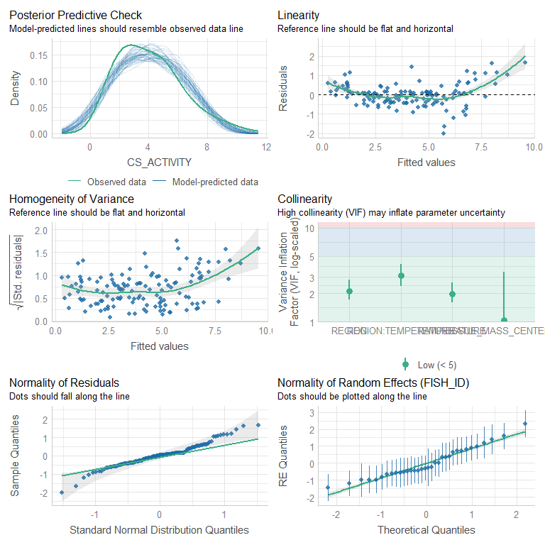<!-- -->

##### DHARMa residuals {.tabset .tabset-faded}

###### cs.model.1a (linear)

```r
cs.model.1a %>% simulateResiduals(plot=TRUE)
```

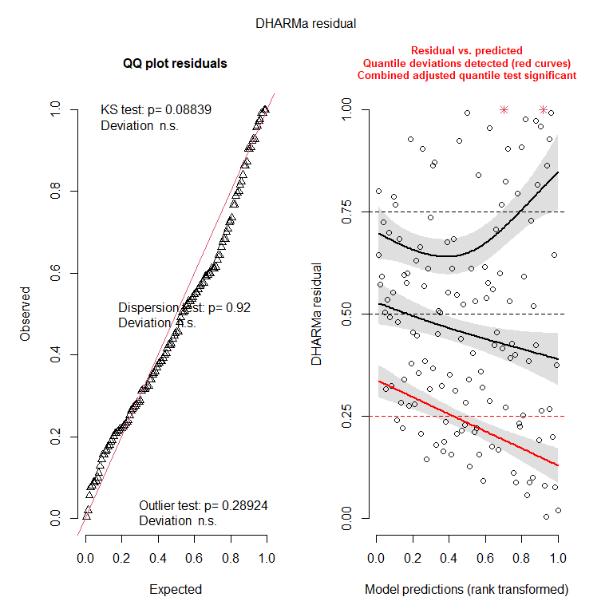<!-- -->

```
## Object of Class DHARMa with simulated residuals based on 250 simulations with refit = FALSE . See ?DHARMa::simulateResiduals for help. 
##  
## Scaled residual values: 0.724 0.74 0.66 0.72 0.156 0.196 0.08 0.068 0.36 0.464 0.792 0.784 0.588 0.416 0.04 0.484 0.828 0.64 0.2 0.168 ...
```

```r
cs.model.1a %>% DHARMa::testResiduals(plot=TRUE)
```

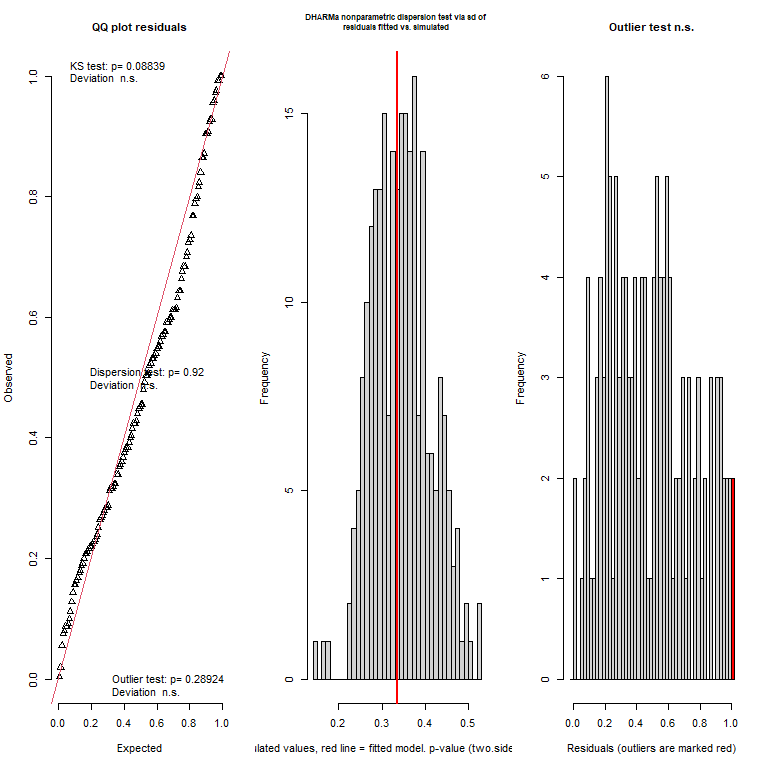<!-- -->

```
## $uniformity
## 
## 	Asymptotic one-sample Kolmogorov-Smirnov test
## 
## data:  simulationOutput$scaledResiduals
## D = 0.065231, p-value = 0.6377
## alternative hypothesis: two-sided
## 
## 
## $dispersion
## 
## 	DHARMa nonparametric dispersion test via sd of residuals fitted vs.
## 	simulated
## 
## data:  simulationOutput
## dispersion = 0.97307, p-value = 0.984
## alternative hypothesis: two.sided
## 
## 
## $outliers
## 
## 	DHARMa outlier test based on exact binomial test with approximate
## 	expectations
## 
## data:  simulationOutput
## outliers at both margin(s) = 1, observations = 130, p-value = 1
## alternative hypothesis: true probability of success is not equal to 0.007968127
## 95 percent confidence interval:
##  0.0001947334 0.0421127390
## sample estimates:
## frequency of outliers (expected: 0.00796812749003984 ) 
##                                            0.007692308
```

```
## $uniformity
## 
## 	Asymptotic one-sample Kolmogorov-Smirnov test
## 
## data:  simulationOutput$scaledResiduals
## D = 0.065231, p-value = 0.6377
## alternative hypothesis: two-sided
## 
## 
## $dispersion
## 
## 	DHARMa nonparametric dispersion test via sd of residuals fitted vs.
## 	simulated
## 
## data:  simulationOutput
## dispersion = 0.97307, p-value = 0.984
## alternative hypothesis: two.sided
## 
## 
## $outliers
## 
## 	DHARMa outlier test based on exact binomial test with approximate
## 	expectations
## 
## data:  simulationOutput
## outliers at both margin(s) = 1, observations = 130, p-value = 1
## alternative hypothesis: true probability of success is not equal to 0.007968127
## 95 percent confidence interval:
##  0.0001947334 0.0421127390
## sample estimates:
## frequency of outliers (expected: 0.00796812749003984 ) 
##                                            0.007692308
```

##### {-}

#### {-}

The _cs.model.1a_ model looks okay....lets play around with a link transformation to see if we can get any improvement 

#### Fit the model (link transformations)


```r
cs.model.1a <- glmmTMB(CS_ACTIVITY ~ 1 + REGION*TEMPERATURE + TISSUE_MASS_CENTERED + (1|FISH_ID), #deafult
                       family=gaussian(link = "identity"), 
                       data = CS.data, 
                       REML = TRUE) 

cs.model.1a.log <- glmmTMB(CS_ACTIVITY ~ 1 + REGION*TEMPERATURE + TISSUE_MASS_CENTERED + (1|FISH_ID), 
                       family=gaussian(link="log"), 
                       data = CS.data, 
                       REML = TRUE)  

cs.model.1a.inv <- glmmTMB(CS_ACTIVITY ~ 1 + REGION*TEMPERATURE + TISSUE_MASS_CENTERED + (1|FISH_ID), 
                       family=gaussian(link="inverse"), 
                       data = CS.data, 
                       REML = TRUE) 
```

#### Model re-validation {.tabset .tabset-faded}

##### performance {.tabset .tabset-faded}

###### Gaussian (identity)

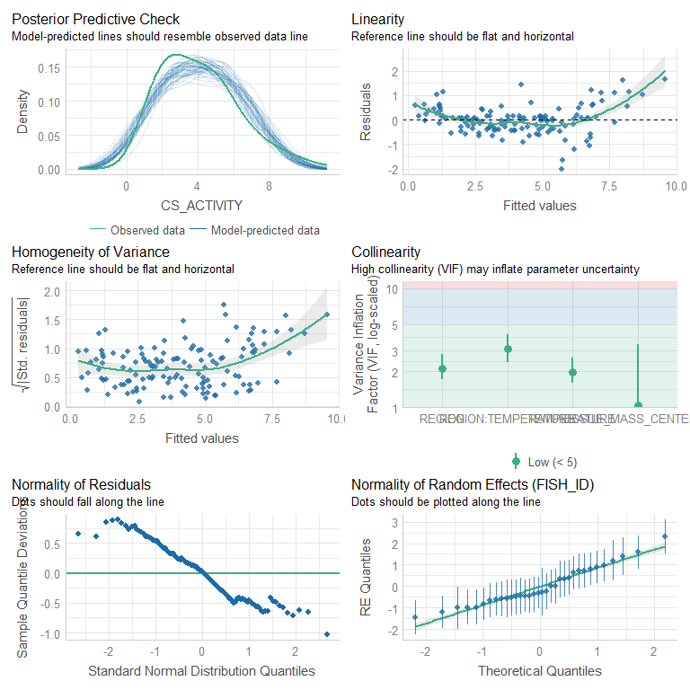<!-- -->

###### Gaussian (log)
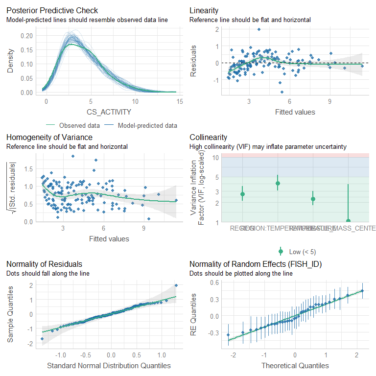<!-- -->

###### Gaussian (inverse)
<!-- -->

##### DHARMa {.tabset .tabset-faded}

###### Gaussian (identity)

```r
cs.model.1a %>% simulateResiduals(plot=TRUE)
```

<!-- -->

```
## Object of Class DHARMa with simulated residuals based on 250 simulations with refit = FALSE . See ?DHARMa::simulateResiduals for help. 
##  
## Scaled residual values: 0.724 0.74 0.66 0.72 0.156 0.196 0.08 0.068 0.36 0.464 0.792 0.784 0.588 0.416 0.04 0.484 0.828 0.64 0.2 0.168 ...
```

```r
cs.model.1a %>% DHARMa::testResiduals(plot=TRUE)
```

<!-- -->

```
## $uniformity
## 
## 	Asymptotic one-sample Kolmogorov-Smirnov test
## 
## data:  simulationOutput$scaledResiduals
## D = 0.065231, p-value = 0.6377
## alternative hypothesis: two-sided
## 
## 
## $dispersion
## 
## 	DHARMa nonparametric dispersion test via sd of residuals fitted vs.
## 	simulated
## 
## data:  simulationOutput
## dispersion = 0.97307, p-value = 0.984
## alternative hypothesis: two.sided
## 
## 
## $outliers
## 
## 	DHARMa outlier test based on exact binomial test with approximate
## 	expectations
## 
## data:  simulationOutput
## outliers at both margin(s) = 1, observations = 130, p-value = 1
## alternative hypothesis: true probability of success is not equal to 0.007968127
## 95 percent confidence interval:
##  0.0001947334 0.0421127390
## sample estimates:
## frequency of outliers (expected: 0.00796812749003984 ) 
##                                            0.007692308
```

```
## $uniformity
## 
## 	Asymptotic one-sample Kolmogorov-Smirnov test
## 
## data:  simulationOutput$scaledResiduals
## D = 0.065231, p-value = 0.6377
## alternative hypothesis: two-sided
## 
## 
## $dispersion
## 
## 	DHARMa nonparametric dispersion test via sd of residuals fitted vs.
## 	simulated
## 
## data:  simulationOutput
## dispersion = 0.97307, p-value = 0.984
## alternative hypothesis: two.sided
## 
## 
## $outliers
## 
## 	DHARMa outlier test based on exact binomial test with approximate
## 	expectations
## 
## data:  simulationOutput
## outliers at both margin(s) = 1, observations = 130, p-value = 1
## alternative hypothesis: true probability of success is not equal to 0.007968127
## 95 percent confidence interval:
##  0.0001947334 0.0421127390
## sample estimates:
## frequency of outliers (expected: 0.00796812749003984 ) 
##                                            0.007692308
```

###### Gaussian (log)

```r
cs.model.1a.log %>% simulateResiduals(plot=TRUE)
```

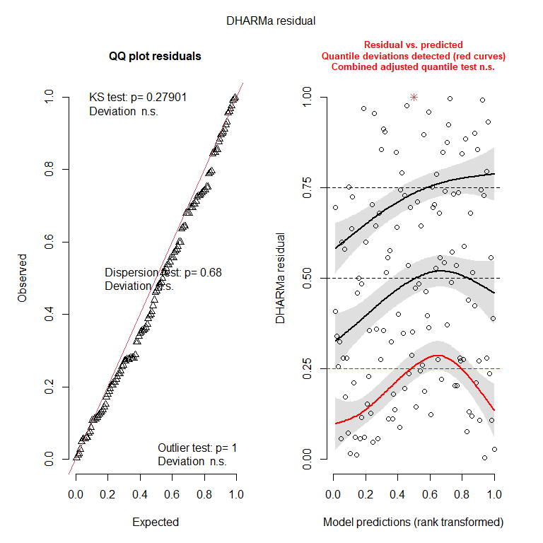<!-- -->

```
## Object of Class DHARMa with simulated residuals based on 250 simulations with refit = FALSE . See ?DHARMa::simulateResiduals for help. 
##  
## Scaled residual values: 0.676 0.864 0.752 0.664 0.036 0.144 0.112 0.088 0.1 0.524 0.836 0.748 0.64 0.568 0.06 0.256 0.896 0.58 0.012 0.14 ...
```

```r
cs.model.1a.log %>% DHARMa::testResiduals(plot=TRUE)
```

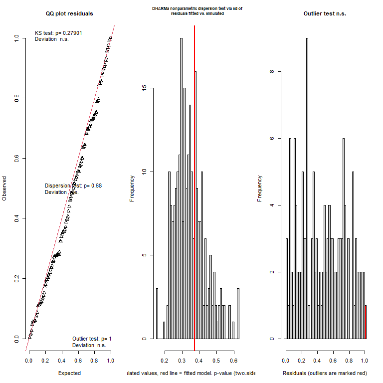<!-- -->

```
## $uniformity
## 
## 	Asymptotic one-sample Kolmogorov-Smirnov test
## 
## data:  simulationOutput$scaledResiduals
## D = 0.091692, p-value = 0.2244
## alternative hypothesis: two-sided
## 
## 
## $dispersion
## 
## 	DHARMa nonparametric dispersion test via sd of residuals fitted vs.
## 	simulated
## 
## data:  simulationOutput
## dispersion = 0.98328, p-value = 0.944
## alternative hypothesis: two.sided
## 
## 
## $outliers
## 
## 	DHARMa outlier test based on exact binomial test with approximate
## 	expectations
## 
## data:  simulationOutput
## outliers at both margin(s) = 0, observations = 130, p-value = 0.6309
## alternative hypothesis: true probability of success is not equal to 0.007968127
## 95 percent confidence interval:
##  0.00000000 0.02797718
## sample estimates:
## frequency of outliers (expected: 0.00796812749003984 ) 
##                                                      0
```

```
## $uniformity
## 
## 	Asymptotic one-sample Kolmogorov-Smirnov test
## 
## data:  simulationOutput$scaledResiduals
## D = 0.091692, p-value = 0.2244
## alternative hypothesis: two-sided
## 
## 
## $dispersion
## 
## 	DHARMa nonparametric dispersion test via sd of residuals fitted vs.
## 	simulated
## 
## data:  simulationOutput
## dispersion = 0.98328, p-value = 0.944
## alternative hypothesis: two.sided
## 
## 
## $outliers
## 
## 	DHARMa outlier test based on exact binomial test with approximate
## 	expectations
## 
## data:  simulationOutput
## outliers at both margin(s) = 0, observations = 130, p-value = 0.6309
## alternative hypothesis: true probability of success is not equal to 0.007968127
## 95 percent confidence interval:
##  0.00000000 0.02797718
## sample estimates:
## frequency of outliers (expected: 0.00796812749003984 ) 
##                                                      0
```

###### Gaussian (inverse)

```r
cs.model.1a.inv %>% simulateResiduals(plot=TRUE)
```

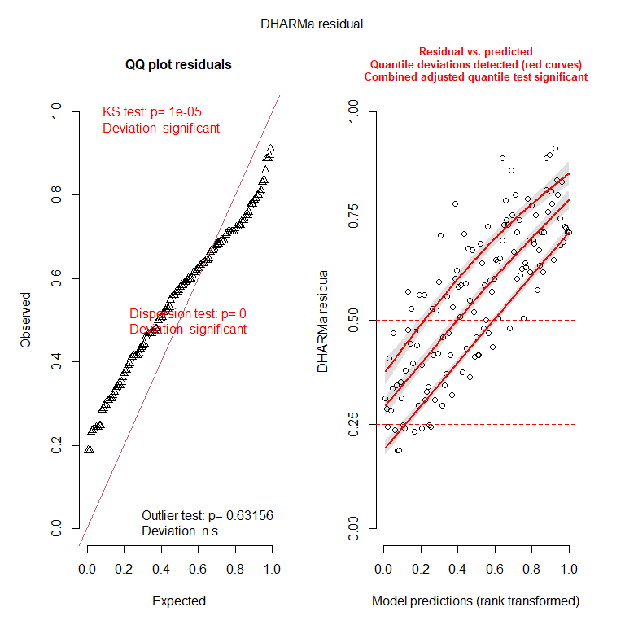<!-- -->

```
## Object of Class DHARMa with simulated residuals based on 250 simulations with refit = FALSE . See ?DHARMa::simulateResiduals for help. 
##  
## Scaled residual values: 0.512 0.856 0.864 0.652 0.032 0.104 0.136 0.08 0.064 0.396 0.848 0.516 0.6 0.564 0.048 0.148 0.888 0.524 0.008 0.144 ...
```

```r
cs.model.1a.inv %>% DHARMa::testResiduals(plot=TRUE)
```

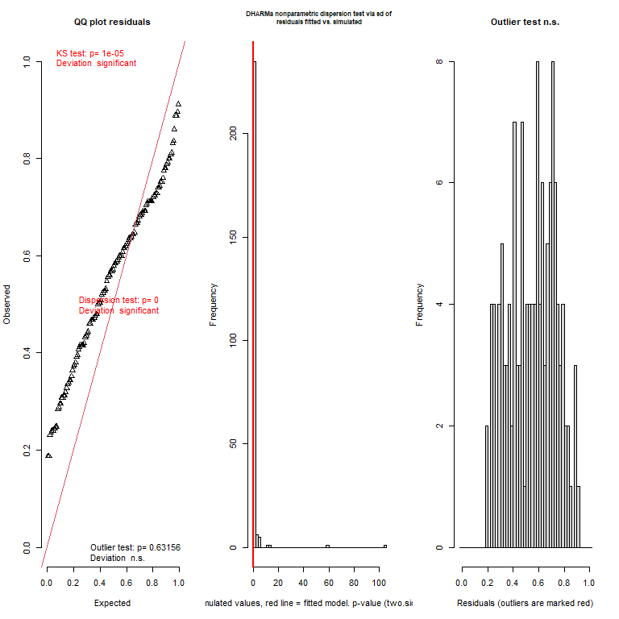<!-- -->

```
## $uniformity
## 
## 	Asymptotic one-sample Kolmogorov-Smirnov test
## 
## data:  simulationOutput$scaledResiduals
## D = 0.11877, p-value = 0.05107
## alternative hypothesis: two-sided
## 
## 
## $dispersion
## 
## 	DHARMa nonparametric dispersion test via sd of residuals fitted vs.
## 	simulated
## 
## data:  simulationOutput
## dispersion = 0.58039, p-value = 0.408
## alternative hypothesis: two.sided
## 
## 
## $outliers
## 
## 	DHARMa outlier test based on exact binomial test with approximate
## 	expectations
## 
## data:  simulationOutput
## outliers at both margin(s) = 0, observations = 130, p-value = 0.6309
## alternative hypothesis: true probability of success is not equal to 0.007968127
## 95 percent confidence interval:
##  0.00000000 0.02797718
## sample estimates:
## frequency of outliers (expected: 0.00796812749003984 ) 
##                                                      0
```

```
## $uniformity
## 
## 	Asymptotic one-sample Kolmogorov-Smirnov test
## 
## data:  simulationOutput$scaledResiduals
## D = 0.11877, p-value = 0.05107
## alternative hypothesis: two-sided
## 
## 
## $dispersion
## 
## 	DHARMa nonparametric dispersion test via sd of residuals fitted vs.
## 	simulated
## 
## data:  simulationOutput
## dispersion = 0.58039, p-value = 0.408
## alternative hypothesis: two.sided
## 
## 
## $outliers
## 
## 	DHARMa outlier test based on exact binomial test with approximate
## 	expectations
## 
## data:  simulationOutput
## outliers at both margin(s) = 0, observations = 130, p-value = 0.6309
## alternative hypothesis: true probability of success is not equal to 0.007968127
## 95 percent confidence interval:
##  0.00000000 0.02797718
## sample estimates:
## frequency of outliers (expected: 0.00796812749003984 ) 
##                                                      0
```
##### {-}

#### {-}

From looking at the different models it looks like the model with the log-link function performs the best. In the DHARMa validation test we can see that one of quantile deviations is violated. Because the model passes all the other data validations realtively well we could move on with the log-link model. However, previously we showed that the 2^nd^ and 3^rd^ order polynomials also performed quite well, and we know the LDH model was not linear. So before we choose out final model, lets see what the 2^nd^ and 3^rd^ order polynomials look like with a log-link. 

#### Fit model - polynomials and link functions 


```r
cs.model.1a.log <- glmmTMB(CS_ACTIVITY ~ 1 + REGION*TEMPERATURE + TISSUE_MASS_CENTERED + (1|FISH_ID), 
                       family=gaussian(link="log"), 
                       data = CS.data, 
                       REML = FALSE) 

cs.model.1a.log.p2 <- glmmTMB(CS_ACTIVITY ~ 1 + REGION*poly(TEMPERATURE, 2) + TISSUE_MASS_CENTERED + (1|FISH_ID), 
                       family=gaussian(link="log"), 
                       data = CS.data, 
                       REML = FALSE)

cs.model.1a.log.p3 <- glmmTMB(CS_ACTIVITY ~ 1 + REGION*poly(TEMPERATURE, 3) + TISSUE_MASS_CENTERED + (1|FISH_ID), 
                       family=gaussian(link="log"), 
                       data = CS.data, 
                       REML = FALSE)
```

<table class=" lightable-paper" style='font-family: "Arial Narrow", arial, helvetica, sans-serif; margin-left: auto; margin-right: auto;'>
 <thead>
  <tr>
   <th style="text-align:left;"> model </th>
   <th style="text-align:right;"> df </th>
   <th style="text-align:right;"> AICc </th>
   <th style="text-align:right;"> BIC </th>
   <th style="text-align:right;"> r2m </th>
   <th style="text-align:right;"> r2c </th>
  </tr>
 </thead>
<tbody>
  <tr>
   <td style="text-align:left;"> cs.model.1a.log </td>
   <td style="text-align:right;"> 7 </td>
   <td style="text-align:right;"> 319.7416 </td>
   <td style="text-align:right;"> 338.8963 </td>
   <td style="text-align:right;"> 0.3504577 </td>
   <td style="text-align:right;"> 0.3504577 </td>
  </tr>
  <tr>
   <td style="text-align:left;"> cs.model.1a.log.p2 </td>
   <td style="text-align:right;"> 9 </td>
   <td style="text-align:right;"> 296.4647 </td>
   <td style="text-align:right;"> 320.7725 </td>
   <td style="text-align:right;"> 0.4639599 </td>
   <td style="text-align:right;"> 0.4639599 </td>
  </tr>
  <tr>
   <td style="text-align:left;"> cs.model.1a.log.p3 </td>
   <td style="text-align:right;"> 11 </td>
   <td style="text-align:right;"> 300.4024 </td>
   <td style="text-align:right;"> 329.7080 </td>
   <td style="text-align:right;"> 0.4653824 </td>
   <td style="text-align:right;"> 0.4653824 </td>
  </tr>
</tbody>
</table>

From this model comparison we can see that the 2^nd^ order polynomial with the log-link seems to be the best model. Let's look at our model validations 

#### Model re-re-validation {.tabset .tabset-faded}

##### performance {.tabset .tabset-faded}

###### Gaussian (quadratic-log)
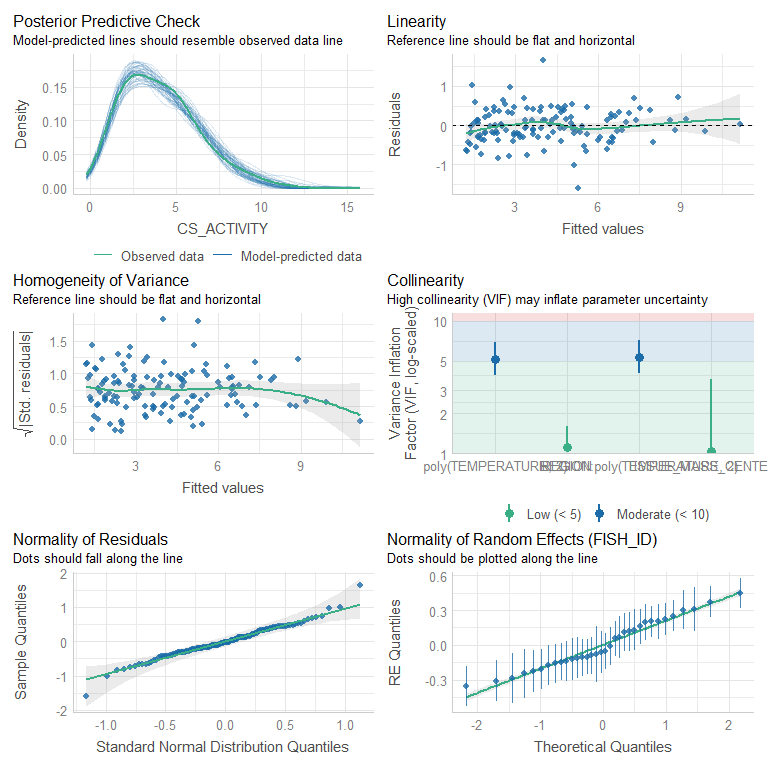<!-- -->

##### DHARMa {.tabset .tabset-faded}

###### Gaussian (quadratic-log)


```r
cs.model.1a.log.p2 %>% simulateResiduals(plot=TRUE)
```

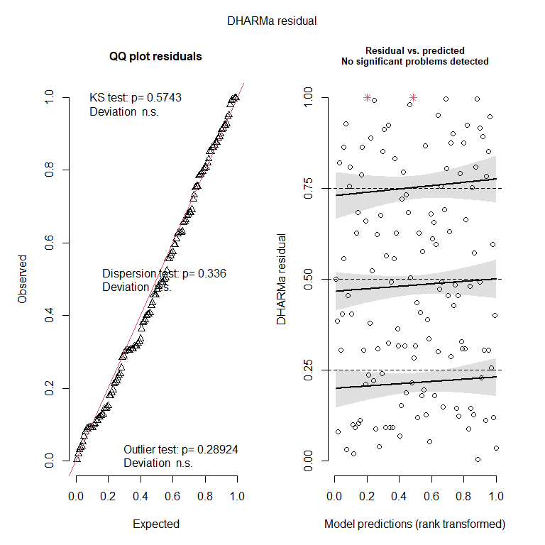<!-- -->

```
## Object of Class DHARMa with simulated residuals based on 250 simulations with refit = FALSE . See ?DHARMa::simulateResiduals for help. 
##  
## Scaled residual values: 0.84 0.864 0.696 0.724 0.04 0.096 0.064 0.1 0.164 0.484 0.8 0.9 0.624 0.444 0.072 0.36 0.896 0.636 0.036 0.072 ...
```

```r
cs.model.1a.log.p2 %>% DHARMa::testResiduals(plot=TRUE)
```

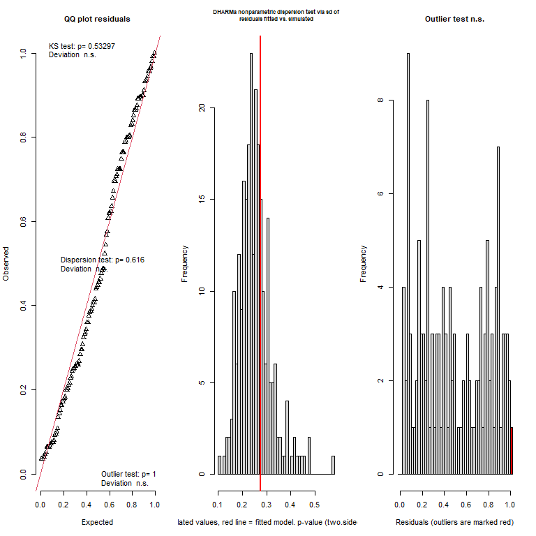<!-- -->

```
## $uniformity
## 
## 	Asymptotic one-sample Kolmogorov-Smirnov test
## 
## data:  simulationOutput$scaledResiduals
## D = 0.070769, p-value = 0.533
## alternative hypothesis: two-sided
## 
## 
## $dispersion
## 
## 	DHARMa nonparametric dispersion test via sd of residuals fitted vs.
## 	simulated
## 
## data:  simulationOutput
## dispersion = 1.087, p-value = 0.616
## alternative hypothesis: two.sided
## 
## 
## $outliers
## 
## 	DHARMa outlier test based on exact binomial test with approximate
## 	expectations
## 
## data:  simulationOutput
## outliers at both margin(s) = 1, observations = 130, p-value = 1
## alternative hypothesis: true probability of success is not equal to 0.007968127
## 95 percent confidence interval:
##  0.0001947334 0.0421127390
## sample estimates:
## frequency of outliers (expected: 0.00796812749003984 ) 
##                                            0.007692308
```

```
## $uniformity
## 
## 	Asymptotic one-sample Kolmogorov-Smirnov test
## 
## data:  simulationOutput$scaledResiduals
## D = 0.070769, p-value = 0.533
## alternative hypothesis: two-sided
## 
## 
## $dispersion
## 
## 	DHARMa nonparametric dispersion test via sd of residuals fitted vs.
## 	simulated
## 
## data:  simulationOutput
## dispersion = 1.087, p-value = 0.616
## alternative hypothesis: two.sided
## 
## 
## $outliers
## 
## 	DHARMa outlier test based on exact binomial test with approximate
## 	expectations
## 
## data:  simulationOutput
## outliers at both margin(s) = 1, observations = 130, p-value = 1
## alternative hypothesis: true probability of success is not equal to 0.007968127
## 95 percent confidence interval:
##  0.0001947334 0.0421127390
## sample estimates:
## frequency of outliers (expected: 0.00796812749003984 ) 
##                                            0.007692308
```

Validations look great! Moving ahead with the quadratic log-link model. 

#### Partial plots {.tabset .tabset-faded}

##### ggemmeans 

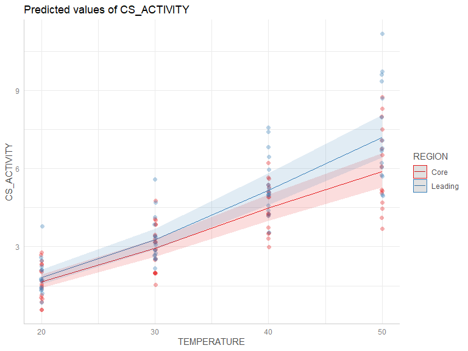<!-- -->

##### plot_model 

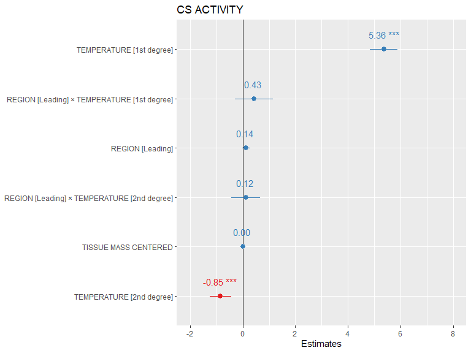<!-- -->

#### {-} 

#### Model investigation {.tabset .tabset-faded}

##### summary 
<table class=" lightable-paper" style='font-family: "Arial Narrow", arial, helvetica, sans-serif; margin-left: auto; margin-right: auto;'>
 <thead>
  <tr>
   <th style="text-align:left;">   </th>
   <th style="text-align:right;"> Estimate </th>
   <th style="text-align:right;"> StdError </th>
   <th style="text-align:right;"> Zvalue </th>
   <th style="text-align:right;"> Pvalue </th>
  </tr>
 </thead>
<tbody>
  <tr>
   <td style="text-align:left;"> (Intercept) </td>
   <td style="text-align:right;"> 1.1984073 </td>
   <td style="text-align:right;"> 0.0564498 </td>
   <td style="text-align:right;"> 21.2295969 </td>
   <td style="text-align:right;"> 0.0000000 </td>
  </tr>
  <tr>
   <td style="text-align:left;"> REGIONLeading </td>
   <td style="text-align:right;"> 0.1356647 </td>
   <td style="text-align:right;"> 0.0820867 </td>
   <td style="text-align:right;"> 1.6526997 </td>
   <td style="text-align:right;"> 0.0983920 </td>
  </tr>
  <tr>
   <td style="text-align:left;"> poly(TEMPERATURE, 2)1 </td>
   <td style="text-align:right;"> 5.3642867 </td>
   <td style="text-align:right;"> 0.2711131 </td>
   <td style="text-align:right;"> 19.7861598 </td>
   <td style="text-align:right;"> 0.0000000 </td>
  </tr>
  <tr>
   <td style="text-align:left;"> poly(TEMPERATURE, 2)2 </td>
   <td style="text-align:right;"> -0.8451058 </td>
   <td style="text-align:right;"> 0.2110951 </td>
   <td style="text-align:right;"> -4.0034360 </td>
   <td style="text-align:right;"> 0.0000624 </td>
  </tr>
  <tr>
   <td style="text-align:left;"> TISSUE_MASS_CENTERED </td>
   <td style="text-align:right;"> 0.0024962 </td>
   <td style="text-align:right;"> 0.0082421 </td>
   <td style="text-align:right;"> 0.3028589 </td>
   <td style="text-align:right;"> 0.7619974 </td>
  </tr>
  <tr>
   <td style="text-align:left;"> REGIONLeading:poly(TEMPERATURE, 2)1 </td>
   <td style="text-align:right;"> 0.4346926 </td>
   <td style="text-align:right;"> 0.3715558 </td>
   <td style="text-align:right;"> 1.1699254 </td>
   <td style="text-align:right;"> 0.2420310 </td>
  </tr>
  <tr>
   <td style="text-align:left;"> REGIONLeading:poly(TEMPERATURE, 2)2 </td>
   <td style="text-align:right;"> 0.1150385 </td>
   <td style="text-align:right;"> 0.2844006 </td>
   <td style="text-align:right;"> 0.4044947 </td>
   <td style="text-align:right;"> 0.6858490 </td>
  </tr>
</tbody>
</table>

##### Anova 
<table class=" lightable-paper" style='font-family: "Arial Narrow", arial, helvetica, sans-serif; margin-left: auto; margin-right: auto;'>
 <thead>
  <tr>
   <th style="text-align:left;">   </th>
   <th style="text-align:right;"> Chisq </th>
   <th style="text-align:right;"> Df </th>
   <th style="text-align:right;"> Pr(&gt;Chisq) </th>
  </tr>
 </thead>
<tbody>
  <tr>
   <td style="text-align:left;"> REGION </td>
   <td style="text-align:right;"> 4.3163842 </td>
   <td style="text-align:right;"> 1 </td>
   <td style="text-align:right;"> 0.0377470 </td>
  </tr>
  <tr>
   <td style="text-align:left;"> poly(TEMPERATURE, 2) </td>
   <td style="text-align:right;"> 1234.7927952 </td>
   <td style="text-align:right;"> 2 </td>
   <td style="text-align:right;"> 0.0000000 </td>
  </tr>
  <tr>
   <td style="text-align:left;"> TISSUE_MASS_CENTERED </td>
   <td style="text-align:right;"> 0.0917235 </td>
   <td style="text-align:right;"> 1 </td>
   <td style="text-align:right;"> 0.7619974 </td>
  </tr>
  <tr>
   <td style="text-align:left;"> REGION:poly(TEMPERATURE, 2) </td>
   <td style="text-align:right;"> 3.5245189 </td>
   <td style="text-align:right;"> 2 </td>
   <td style="text-align:right;"> 0.1716566 </td>
  </tr>
</tbody>
</table>

##### confint 
<table class=" lightable-paper" style='font-family: "Arial Narrow", arial, helvetica, sans-serif; margin-left: auto; margin-right: auto;'>
 <thead>
  <tr>
   <th style="text-align:left;">   </th>
   <th style="text-align:right;"> 2.5 % </th>
   <th style="text-align:right;"> 97.5 % </th>
   <th style="text-align:right;"> Estimate </th>
  </tr>
 </thead>
<tbody>
  <tr>
   <td style="text-align:left;"> (Intercept) </td>
   <td style="text-align:right;"> 1.0877676 </td>
   <td style="text-align:right;"> 1.3090469 </td>
   <td style="text-align:right;"> 1.1984073 </td>
  </tr>
  <tr>
   <td style="text-align:left;"> REGIONLeading </td>
   <td style="text-align:right;"> -0.0252223 </td>
   <td style="text-align:right;"> 0.2965517 </td>
   <td style="text-align:right;"> 0.1356647 </td>
  </tr>
  <tr>
   <td style="text-align:left;"> poly(TEMPERATURE, 2)1 </td>
   <td style="text-align:right;"> 4.8329148 </td>
   <td style="text-align:right;"> 5.8956585 </td>
   <td style="text-align:right;"> 5.3642867 </td>
  </tr>
  <tr>
   <td style="text-align:left;"> poly(TEMPERATURE, 2)2 </td>
   <td style="text-align:right;"> -1.2588446 </td>
   <td style="text-align:right;"> -0.4313670 </td>
   <td style="text-align:right;"> -0.8451058 </td>
  </tr>
  <tr>
   <td style="text-align:left;"> TISSUE_MASS_CENTERED </td>
   <td style="text-align:right;"> -0.0136580 </td>
   <td style="text-align:right;"> 0.0186503 </td>
   <td style="text-align:right;"> 0.0024962 </td>
  </tr>
  <tr>
   <td style="text-align:left;"> REGIONLeading:poly(TEMPERATURE, 2)1 </td>
   <td style="text-align:right;"> -0.2935434 </td>
   <td style="text-align:right;"> 1.1629285 </td>
   <td style="text-align:right;"> 0.4346926 </td>
  </tr>
  <tr>
   <td style="text-align:left;"> REGIONLeading:poly(TEMPERATURE, 2)2 </td>
   <td style="text-align:right;"> -0.4423764 </td>
   <td style="text-align:right;"> 0.6724535 </td>
   <td style="text-align:right;"> 0.1150385 </td>
  </tr>
  <tr>
   <td style="text-align:left;"> Std.Dev.(Intercept)|FISH_ID </td>
   <td style="text-align:right;"> 0.1678718 </td>
   <td style="text-align:right;"> 0.2807799 </td>
   <td style="text-align:right;"> 0.2171060 </td>
  </tr>
</tbody>
</table>

##### r-squared
<table class=" lightable-paper" style='font-family: "Arial Narrow", arial, helvetica, sans-serif; margin-left: auto; margin-right: auto;'>
 <thead>
  <tr>
   <th style="text-align:right;"> R2_conditional </th>
   <th style="text-align:right;"> R2_marginal </th>
   <th style="text-align:left;"> optional </th>
  </tr>
 </thead>
<tbody>
  <tr>
   <td style="text-align:right;"> 0.551021 </td>
   <td style="text-align:right;"> 0.4639599 </td>
   <td style="text-align:left;"> FALSE </td>
  </tr>
</tbody>
</table>

#### {-} 

#### Pairwise comparisons {.tabset .tabset-faded} 

##### emtrends [latitudes]


```r
cs.model.1a.log.p2  %>% emtrends(var = "TEMPERATURE", type = "response") %>% pairs(by = "TEMPERATURE") %>% summary(by = NULL, adjust = "tukey", infer=TRUE)
```

<div data-pagedtable="false">
  <script data-pagedtable-source type="application/json">
{"columns":[{"label":[""],"name":["_rn_"],"type":[""],"align":["left"]},{"label":["contrast"],"name":[1],"type":["fct"],"align":["left"]},{"label":["TEMPERATURE"],"name":[2],"type":["dbl"],"align":["right"]},{"label":["estimate"],"name":[3],"type":["dbl"],"align":["right"]},{"label":["SE"],"name":[4],"type":["dbl"],"align":["right"]},{"label":["df"],"name":[5],"type":["dbl"],"align":["right"]},{"label":["lower.CL"],"name":[6],"type":["dbl"],"align":["right"]},{"label":["upper.CL"],"name":[7],"type":["dbl"],"align":["right"]},{"label":["t.ratio"],"name":[8],"type":["dbl"],"align":["right"]},{"label":["p.value"],"name":[9],"type":["dbl"],"align":["right"]}],"data":[{"1":"Core TISSUE_MASS_CENTERED0.179148467370874 - Leading TISSUE_MASS_CENTERED0.179148467370874","2":"34.61538","3":"-0.003406712","4":"0.003029412","5":"121","6":"-0.009404232","7":"0.002590808","8":"-1.124546","9":"0.2630075","_rn_":"1"}],"options":{"columns":{"min":{},"max":[10]},"rows":{"min":[10],"max":[10]},"pages":{}}}
  </script>
</div>
SCROLL TO THE RIGHT -->

The numbers in the left most column in the table just mention that the slopes are assuming mean **TISSUE_MASS_CENTERED** values when looking at differences between latitudinal slopes.

##### emmeans [latitudes]

```r
cs.model.1a.log.p2  %>% emmeans(pairwise ~ TEMPERATURE*REGION, type = "response") %>% pairs(by = "TEMPERATURE") %>% summary(by = NULL, adjust = "tukey", infer=TRUE)
```

<div data-pagedtable="false">
  <script data-pagedtable-source type="application/json">
{"columns":[{"label":[""],"name":["_rn_"],"type":[""],"align":["left"]},{"label":["contrast"],"name":[1],"type":["fct"],"align":["left"]},{"label":["TEMPERATURE"],"name":[2],"type":["fct"],"align":["left"]},{"label":["ratio"],"name":[3],"type":["dbl"],"align":["right"]},{"label":["SE"],"name":[4],"type":["dbl"],"align":["right"]},{"label":["df"],"name":[5],"type":["dbl"],"align":["right"]},{"label":["lower.CL"],"name":[6],"type":["dbl"],"align":["right"]},{"label":["upper.CL"],"name":[7],"type":["dbl"],"align":["right"]},{"label":["null"],"name":[8],"type":["dbl"],"align":["right"]},{"label":["t.ratio"],"name":[9],"type":["dbl"],"align":["right"]},{"label":["p.value"],"name":[10],"type":["dbl"],"align":["right"]}],"data":[{"1":"Core / Leading","2":"34.6153846153846","3":"0.8839391","4":"0.07367654","5":"121","6":"0.749476","7":"1.042526","8":"1","9":"-1.480105","10":"0.1414442","_rn_":"1"}],"options":{"columns":{"min":{},"max":[10]},"rows":{"min":[10],"max":[10]},"pages":{}}}
  </script>
</div>

##### TEMPERATURE 

```r
cs.model.1a.log.p2  %>% emmeans(~ TEMPERATURE*REGION, type = "response")  %>% summary(infer=TRUE)
```

<div data-pagedtable="false">
  <script data-pagedtable-source type="application/json">
{"columns":[{"label":[""],"name":["_rn_"],"type":[""],"align":["left"]},{"label":["TEMPERATURE"],"name":[1],"type":["dbl"],"align":["right"]},{"label":["REGION"],"name":[2],"type":["fct"],"align":["left"]},{"label":["response"],"name":[3],"type":["dbl"],"align":["right"]},{"label":["SE"],"name":[4],"type":["dbl"],"align":["right"]},{"label":["df"],"name":[5],"type":["dbl"],"align":["right"]},{"label":["lower.CL"],"name":[6],"type":["dbl"],"align":["right"]},{"label":["upper.CL"],"name":[7],"type":["dbl"],"align":["right"]},{"label":["null"],"name":[8],"type":["dbl"],"align":["right"]},{"label":["t.ratio"],"name":[9],"type":["dbl"],"align":["right"]},{"label":["p.value"],"name":[10],"type":["dbl"],"align":["right"]}],"data":[{"1":"34.61538","2":"Core","3":"3.629866","4":"0.2085430","5":"121","6":"3.239615","7":"4.067128","8":"1","9":"22.43954","10":"6.067269e-45","_rn_":"1"},{"1":"34.61538","2":"Leading","3":"4.106466","4":"0.2439527","5":"121","6":"3.650817","7":"4.618983","8":"1","9":"23.77773","10":"1.983143e-47","_rn_":"2"}],"options":{"columns":{"min":{},"max":[10]},"rows":{"min":[10],"max":[10]},"pages":{}}}
  </script>
</div>


##### Means - f(TEMPERATURE)

```r
cs.model.1a.log.p2  %>% update(.~1+ REGION * as.factor(TEMPERATURE) + TISSUE_MASS_CENTERED + (1|FISH_ID)) %>% 
  emmeans(~REGION*TEMPERATURE, type = "response") %>% summary(infer=TRUE)
```

<div data-pagedtable="false">
  <script data-pagedtable-source type="application/json">
{"columns":[{"label":[""],"name":["_rn_"],"type":[""],"align":["left"]},{"label":["REGION"],"name":[1],"type":["fct"],"align":["left"]},{"label":["TEMPERATURE"],"name":[2],"type":["dbl"],"align":["right"]},{"label":["response"],"name":[3],"type":["dbl"],"align":["right"]},{"label":["SE"],"name":[4],"type":["dbl"],"align":["right"]},{"label":["df"],"name":[5],"type":["dbl"],"align":["right"]},{"label":["lower.CL"],"name":[6],"type":["dbl"],"align":["right"]},{"label":["upper.CL"],"name":[7],"type":["dbl"],"align":["right"]},{"label":["null"],"name":[8],"type":["dbl"],"align":["right"]},{"label":["t.ratio"],"name":[9],"type":["dbl"],"align":["right"]},{"label":["p.value"],"name":[10],"type":["dbl"],"align":["right"]}],"data":[{"1":"Core","2":"20","3":"1.626756","4":"0.1410920","5":"119","6":"1.370053","7":"1.931557","8":"1","9":"5.610239","10":"1.337513e-07","_rn_":"1"},{"1":"Leading","2":"20","3":"1.855927","4":"0.1555226","5":"119","6":"1.572169","7":"2.190900","8":"1","9":"7.379486","10":"2.346705e-11","_rn_":"2"},{"1":"Core","2":"30","3":"2.970544","4":"0.1899169","5":"119","6":"2.617319","7":"3.371438","8":"1","9":"17.029362","10":"1.081474e-33","_rn_":"3"},{"1":"Leading","2":"30","3":"3.205020","4":"0.2123027","5":"119","6":"2.811042","7":"3.654216","8":"1","9":"17.583129","10":"7.025666e-35","_rn_":"4"},{"1":"Core","2":"40","3":"4.448890","4":"0.2589903","5":"119","6":"3.964516","7":"4.992442","8":"1","9":"25.640554","10":"2.706591e-50","_rn_":"5"},{"1":"Leading","2":"40","3":"5.216029","4":"0.3112840","5":"119","6":"4.634680","7":"5.870298","8":"1","9":"27.677308","10":"1.109172e-53","_rn_":"6"},{"1":"Core","2":"50","3":"5.911525","4":"0.3339349","5":"119","6":"5.285940","7":"6.611148","8":"1","9":"31.455863","10":"1.665035e-59","_rn_":"7"},{"1":"Leading","2":"50","3":"7.195226","4":"0.4168537","5":"119","6":"6.415399","7":"8.069846","8":"1","9":"34.062758","10":"3.272283e-63","_rn_":"8"}],"options":{"columns":{"min":{},"max":[10]},"rows":{"min":[10],"max":[10]},"pages":{}}}
  </script>
</div>

##### Abs. diff - f(TEMPERATURE)

```r
cs.model.1a.log.p2  %>% update(.~1+ REGION * as.factor(TEMPERATURE) + TISSUE_MASS_CENTERED + (1|FISH_ID)) %>% 
  emmeans(~REGION*TEMPERATURE, type = "response") %>% pairs(by ="REGION") %>% summary(infer=TRUE)
```

<div data-pagedtable="false">
  <script data-pagedtable-source type="application/json">
{"columns":[{"label":[""],"name":["_rn_"],"type":[""],"align":["left"]},{"label":["contrast"],"name":[1],"type":["fct"],"align":["left"]},{"label":["REGION"],"name":[2],"type":["fct"],"align":["left"]},{"label":["ratio"],"name":[3],"type":["dbl"],"align":["right"]},{"label":["SE"],"name":[4],"type":["dbl"],"align":["right"]},{"label":["df"],"name":[5],"type":["dbl"],"align":["right"]},{"label":["lower.CL"],"name":[6],"type":["dbl"],"align":["right"]},{"label":["upper.CL"],"name":[7],"type":["dbl"],"align":["right"]},{"label":["null"],"name":[8],"type":["dbl"],"align":["right"]},{"label":["t.ratio"],"name":[9],"type":["dbl"],"align":["right"]},{"label":["p.value"],"name":[10],"type":["dbl"],"align":["right"]}],"data":[{"1":"TEMPERATURE20 / TEMPERATURE30","2":"Core","3":"0.5476292","4":"0.04310668","5":"119","6":"0.4460763","7":"0.6723014","8":"1","9":"-7.649828","10":"3.473200e-11","_rn_":"1"},{"1":"TEMPERATURE20 / TEMPERATURE40","2":"Core","3":"0.3656545","4":"0.02712213","5":"119","6":"0.3013923","7":"0.4436185","8":"1","9":"-13.563564","10":"3.119727e-14","_rn_":"2"},{"1":"TEMPERATURE20 / TEMPERATURE50","2":"Core","3":"0.2751839","4":"0.02010091","5":"119","6":"0.2274896","7":"0.3328774","8":"1","9":"-17.664580","10":"3.108624e-14","_rn_":"3"},{"1":"TEMPERATURE30 / TEMPERATURE40","2":"Core","3":"0.6677045","4":"0.03025795","5":"119","6":"0.5933382","7":"0.7513915","8":"1","9":"-8.913103","10":"1.127987e-13","_rn_":"4"},{"1":"TEMPERATURE30 / TEMPERATURE50","2":"Core","3":"0.5025004","4":"0.02172228","5":"119","6":"0.4489699","7":"0.5624132","8":"1","9":"-15.919142","10":"3.108624e-14","_rn_":"5"},{"1":"TEMPERATURE40 / TEMPERATURE50","2":"Core","3":"0.7525790","4":"0.02566300","5":"119","6":"0.6885936","7":"0.8225101","8":"1","9":"-8.335739","10":"9.998669e-13","_rn_":"6"},{"1":"TEMPERATURE20 / TEMPERATURE30","2":"Leading","3":"0.5790688","4":"0.04218861","5":"119","6":"0.4789423","7":"0.7001276","8":"1","9":"-7.498824","10":"7.602163e-11","_rn_":"7"},{"1":"TEMPERATURE20 / TEMPERATURE40","2":"Leading","3":"0.3558123","4":"0.02382165","5":"119","6":"0.2988528","7":"0.4236279","8":"1","9":"-15.434674","10":"3.108624e-14","_rn_":"8"},{"1":"TEMPERATURE20 / TEMPERATURE50","2":"Leading","3":"0.2579387","4":"0.01686823","5":"119","6":"0.2175260","7":"0.3058594","8":"1","9":"-20.720340","10":"3.108624e-14","_rn_":"9"},{"1":"TEMPERATURE30 / TEMPERATURE40","2":"Leading","3":"0.6144560","4":"0.02633506","5":"119","6":"0.5495276","7":"0.6870559","8":"1","9":"-11.363221","10":"4.574119e-14","_rn_":"10"},{"1":"TEMPERATURE30 / TEMPERATURE50","2":"Leading","3":"0.4454370","4":"0.01798442","5":"119","6":"0.4009557","7":"0.4948530","8":"1","9":"-20.029816","10":"3.108624e-14","_rn_":"11"},{"1":"TEMPERATURE40 / TEMPERATURE50","2":"Leading","3":"0.7249291","4":"0.02046325","5":"119","6":"0.6735217","7":"0.7802603","8":"1","9":"-11.395853","10":"4.474199e-14","_rn_":"12"}],"options":{"columns":{"min":{},"max":[10]},"rows":{"min":[10],"max":[10]},"pages":{}}}
  </script>
</div>

##### Effect size

```r
cs.emm <- cs.model.1a.log.p2 %>% emmeans(~REGION*TEMPERATURE)
eff_size(cs.emm, sigma = sigma(cs.model.1a.log.p2), edf=df.residual(cs.model.1a.log.p2))
```

```
##  contrast                                                              
##  Core TEMPERATURE34.6153846153846 - Leading TEMPERATURE34.6153846153846
##  effect.size   SE  df lower.CL upper.CL
##        -0.25 0.17 121   -0.586    0.086
## 
## sigma used for effect sizes: 0.493 
## Confidence level used: 0.95
```
#### {-}

#### Summary figure 

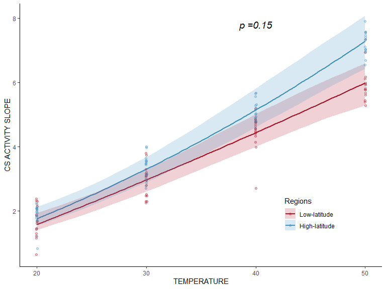<!-- -->

#### Conclusion 

* In conclusion CS enzyme activity has a **significantly** positively correlated with temperature, however, there is no significant difference in the relationship between temperature and CS activity when comparing fish from low- and high-latitudes.


 
 
 
### Lactate dehydrogenase: citrate synthase 

Before beginning always make sure that you are working in the correct directory 


```r
knitr::opts_knit$set(root.dir=working.dir)
```

Now we can import that data. Two different data frames are being imported. The first has all the enzyme wave length absorption data for each sample and the tissue.mass data file contained information pertaining to the tissue samples that was used for each sample. Later on these two data frames will be merged. 

#### Load data 


#### Data manipulation 

Both LDH and CS dataframes have been previously cleaned and manipulated, therefore, the only remaining step is to join the data frames together and then make another column that has the LDH:CS ratio


```r
#--- data preparation/manipulation ---# 
ldh.cs.data <- ldh.data %>% 
  inner_join(select(cs.data, c("UNIQUE_SAMPLE_ID","CS_ACTIVITY")), by = "UNIQUE_SAMPLE_ID") %>% 
  mutate(LCr = LDH_ACTIVITY/CS_ACTIVITY)
```

#### Exploratory data analysis {.tabset}

##### LDH-CS v TEMPERATURE [LATITUDE]

```r
ggplot(ldh.cs.data, aes(x =as.numeric(temperature), y= LCr, color = REGION)) + 
  geom_point() + geom_smooth(method = "lm", se=FALSE)
```

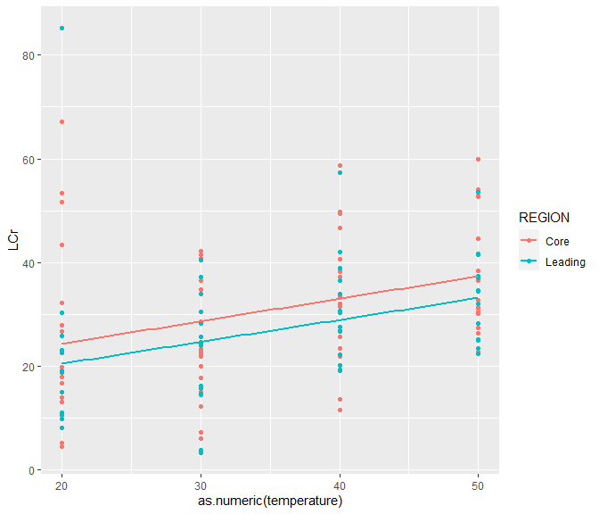<!-- -->

##### LDH-CS V TEMPERATURE [DENSITY]

```r
ggplot(ldh.cs.data, aes(x = LCr)) + 
  geom_density(alpha =0.5, position = "identity") 
```

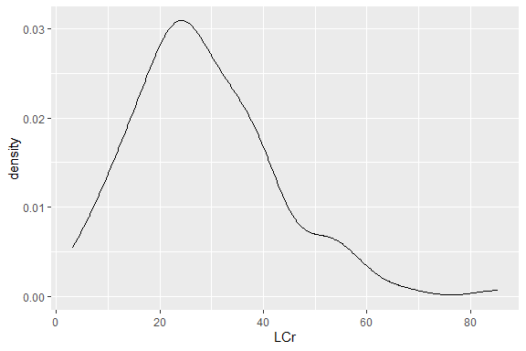<!-- -->

##### LDH-CS v TISSUE MASS (LATITUDE)

```r
ggplot(ldh.cs.data, aes(x =TISSUE_MASS_CENTERED, y= LCr, color = REGION)) + 
  geom_point() + geom_smooth(method = "lm", se=FALSE)
```

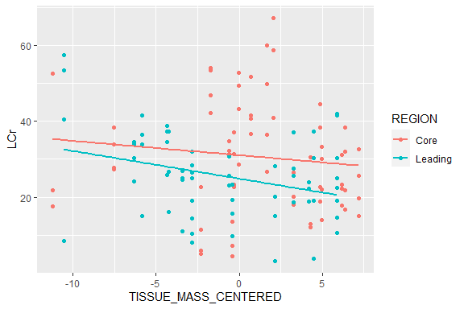<!-- -->

#### Fit the model 

The model was fit using the **glm** and later **glmmTMB** package in R. A number of different models were tested to determine which hypothesis and associated variables best predicted resting oxygen consumption. Model fit was examined using AICc, BIC, and r-squared values. Additional model were examined via the validation diagnostics provided by the **performance** and **dHARMA** packages in R. 

##### Fixed factors (linear regression models)

###### model 1

```r
#--- base model ---#
ldh.cs.model.1 <- glm(LCr~ 1 + REGION*temperature + TISSUE_MASS_CENTERED, 
                       family=gaussian(), 
                       data = ldh.cs.data)  
```
####### summary
<table class=" lightable-paper" style='font-family: "Arial Narrow", arial, helvetica, sans-serif; margin-left: auto; margin-right: auto;'>
 <thead>
  <tr>
   <th style="text-align:left;">   </th>
   <th style="text-align:right;"> Estimate </th>
   <th style="text-align:right;"> Std. Error </th>
   <th style="text-align:right;"> t value </th>
   <th style="text-align:right;"> Pr(&gt;|t|) </th>
  </tr>
 </thead>
<tbody>
  <tr>
   <td style="text-align:left;"> (Intercept) </td>
   <td style="text-align:right;"> 17.0639389 </td>
   <td style="text-align:right;"> 5.1189094 </td>
   <td style="text-align:right;"> 3.3335106 </td>
   <td style="text-align:right;"> 0.0011310 </td>
  </tr>
  <tr>
   <td style="text-align:left;"> REGIONLeading </td>
   <td style="text-align:right;"> -5.5908886 </td>
   <td style="text-align:right;"> 7.4105238 </td>
   <td style="text-align:right;"> -0.7544526 </td>
   <td style="text-align:right;"> 0.4520079 </td>
  </tr>
  <tr>
   <td style="text-align:left;"> temperature </td>
   <td style="text-align:right;"> 0.4182537 </td>
   <td style="text-align:right;"> 0.1410369 </td>
   <td style="text-align:right;"> 2.9655625 </td>
   <td style="text-align:right;"> 0.0036250 </td>
  </tr>
  <tr>
   <td style="text-align:left;"> TISSUE_MASS_CENTERED </td>
   <td style="text-align:right;"> -0.7838687 </td>
   <td style="text-align:right;"> 0.2388626 </td>
   <td style="text-align:right;"> -3.2816715 </td>
   <td style="text-align:right;"> 0.0013405 </td>
  </tr>
  <tr>
   <td style="text-align:left;"> REGIONLeading:temperature </td>
   <td style="text-align:right;"> -0.0009074 </td>
   <td style="text-align:right;"> 0.2026775 </td>
   <td style="text-align:right;"> -0.0044771 </td>
   <td style="text-align:right;"> 0.9964350 </td>
  </tr>
</tbody>
</table>

###### model 2

```r
ldh.cs.model.2 <- glm(LCr ~ 1 + REGION*temperature, 
                       family=gaussian(), 
                       data = ldh.cs.data) 
```

####### summary
<table class=" lightable-paper" style='font-family: "Arial Narrow", arial, helvetica, sans-serif; margin-left: auto; margin-right: auto;'>
 <thead>
  <tr>
   <th style="text-align:left;">   </th>
   <th style="text-align:right;"> Estimate </th>
   <th style="text-align:right;"> Std. Error </th>
   <th style="text-align:right;"> t value </th>
   <th style="text-align:right;"> Pr(&gt;|t|) </th>
  </tr>
 </thead>
<tbody>
  <tr>
   <td style="text-align:left;"> (Intercept) </td>
   <td style="text-align:right;"> 15.6040768 </td>
   <td style="text-align:right;"> 5.2950718 </td>
   <td style="text-align:right;"> 2.9469056 </td>
   <td style="text-align:right;"> 0.0038303 </td>
  </tr>
  <tr>
   <td style="text-align:left;"> REGIONLeading </td>
   <td style="text-align:right;"> -3.6272090 </td>
   <td style="text-align:right;"> 7.6695352 </td>
   <td style="text-align:right;"> -0.4729373 </td>
   <td style="text-align:right;"> 0.6370827 </td>
  </tr>
  <tr>
   <td style="text-align:left;"> temperature </td>
   <td style="text-align:right;"> 0.4343827 </td>
   <td style="text-align:right;"> 0.1463556 </td>
   <td style="text-align:right;"> 2.9679943 </td>
   <td style="text-align:right;"> 0.0035934 </td>
  </tr>
  <tr>
   <td style="text-align:left;"> REGIONLeading:temperature </td>
   <td style="text-align:right;"> -0.0114299 </td>
   <td style="text-align:right;"> 0.2104223 </td>
   <td style="text-align:right;"> -0.0543190 </td>
   <td style="text-align:right;"> 0.9567677 </td>
  </tr>
</tbody>
</table>

###### model comparison table
<table class=" lightable-paper" style='font-family: "Arial Narrow", arial, helvetica, sans-serif; margin-left: auto; margin-right: auto;'>
 <thead>
  <tr>
   <th style="text-align:left;"> model </th>
   <th style="text-align:right;"> df </th>
   <th style="text-align:right;"> AICc </th>
   <th style="text-align:right;"> BIC </th>
   <th style="text-align:right;"> r2 </th>
  </tr>
 </thead>
<tbody>
  <tr>
   <td style="text-align:left;"> ldh.cs.model.1 </td>
   <td style="text-align:right;"> 6 </td>
   <td style="text-align:right;"> 1028.425 </td>
   <td style="text-align:right;"> 1044.895 </td>
   <td style="text-align:right;"> 0.1980466 </td>
  </tr>
  <tr>
   <td style="text-align:left;"> ldh.cs.model.2 </td>
   <td style="text-align:right;"> 5 </td>
   <td style="text-align:right;"> 1036.968 </td>
   <td style="text-align:right;"> 1050.779 </td>
   <td style="text-align:right;"> 0.1312030 </td>
  </tr>
</tbody>
</table>

The model that contains **TISSUE_MASS_CENTERED** seems to do better than the model that leaves TISSUE_MASS_CENTERED out. Therefore we will move ahead with the model that contains **TISSUE_MASS_CENTERED** as a co-variate.  

##### Polynomials 

###### polynomial models 

Note that the linear model has already been created via model _ldh.cs.model.1_ in the previous section.


```r
#--- second order polynomial ---# 
ldh.cs.model.1.p2 <- glm(LCr ~ 1 + REGION*poly(temperature, 2) + TISSUE_MASS_CENTERED, 
                      family=gaussian(), 
                      data = ldh.cs.data)  

#--- third order polynomial ---# 
ldh.cs.model.1.p3 <- glm(LCr ~ 1 + REGION*poly(temperature, 3) + TISSUE_MASS_CENTERED, 
                      family=gaussian(), 
                      data = ldh.cs.data)  
```

####### polynomial model comparisons
<table class=" lightable-paper" style='font-family: "Arial Narrow", arial, helvetica, sans-serif; margin-left: auto; margin-right: auto;'>
 <thead>
  <tr>
   <th style="text-align:left;"> model </th>
   <th style="text-align:right;"> df </th>
   <th style="text-align:right;"> AICc </th>
   <th style="text-align:right;"> BIC </th>
   <th style="text-align:right;"> r2 </th>
  </tr>
 </thead>
<tbody>
  <tr>
   <td style="text-align:left;"> ldh.cs.model.1 </td>
   <td style="text-align:right;"> 6 </td>
   <td style="text-align:right;"> 1028.425 </td>
   <td style="text-align:right;"> 1044.895 </td>
   <td style="text-align:right;"> 0.2031374 </td>
  </tr>
  <tr>
   <td style="text-align:left;"> ldh.cs.model.1.p2 </td>
   <td style="text-align:right;"> 8 </td>
   <td style="text-align:right;"> 1031.479 </td>
   <td style="text-align:right;"> 1053.157 </td>
   <td style="text-align:right;"> 0.2120904 </td>
  </tr>
  <tr>
   <td style="text-align:left;"> ldh.cs.model.1.p3 </td>
   <td style="text-align:right;"> 10 </td>
   <td style="text-align:right;"> 1034.187 </td>
   <td style="text-align:right;"> 1060.921 </td>
   <td style="text-align:right;"> 0.2239472 </td>
  </tr>
</tbody>
</table>

From our model comparison we can see that the model that runs temperature as a linear model performs the best. Therefore, moving forward we will use the linear model. 

##### Random factors 

Fish were repeatedly sampled over four different temperatures, therefore repeated sampling needs to be accounted for. To do this random factors will be included within the model. There are a number of options that can be used for random factors including 1) accounting for repeated sampling of individuals, 2) accounting for repeated sampling of individuals nested within population, 3) account for repeated sampling of individuals and populations without nesting. All three models will be run and compared. 

###### random factor models


```r
ldh.cs.model.1a <- glmmTMB(LCr ~ 1 + REGION*temperature + TISSUE_MASS_CENTERED + (1|fish_id), 
                       family=gaussian(), 
                       data = ldh.cs.data, 
                       REML = TRUE) 

ldh.cs.model.1b <- glmmTMB(LCr ~ 1 + REGION*temperature + TISSUE_MASS_CENTERED + (1|POPULATION/fish_id), 
                       family=gaussian(), 
                       data = ldh.cs.data,
                       REML = TRUE) 

ldh.cs.model.1c <- glmmTMB(LCr ~ 1 + REGION*temperature + TISSUE_MASS_CENTERED + (1|fish_id) + (1 + REGION|POPULATION), 
                       family=gaussian(), 
                       data = ldh.cs.data,
                       REML = TRUE) # convergnece problem
```

####### random factor model comparisons 

<table class=" lightable-paper" style='font-family: "Arial Narrow", arial, helvetica, sans-serif; margin-left: auto; margin-right: auto;'>
 <thead>
  <tr>
   <th style="text-align:left;"> model </th>
   <th style="text-align:right;"> df </th>
   <th style="text-align:right;"> AICc </th>
   <th style="text-align:right;"> BIC </th>
   <th style="text-align:right;"> r2m </th>
   <th style="text-align:right;"> r2c </th>
  </tr>
 </thead>
<tbody>
  <tr>
   <td style="text-align:left;"> ldh.cs.model.1a </td>
   <td style="text-align:right;"> 7 </td>
   <td style="text-align:right;"> 971.2014 </td>
   <td style="text-align:right;"> 990.2944 </td>
   <td style="text-align:right;"> 0.1892872 </td>
   <td style="text-align:right;"> 0.1892872 </td>
  </tr>
  <tr>
   <td style="text-align:left;"> ldh.cs.model.1b </td>
   <td style="text-align:right;"> 8 </td>
   <td style="text-align:right;"> 973.4758 </td>
   <td style="text-align:right;"> 995.1543 </td>
   <td style="text-align:right;"> 0.1892883 </td>
   <td style="text-align:right;"> 0.1892883 </td>
  </tr>
  <tr>
   <td style="text-align:left;"> ldh.cs.model.1c </td>
   <td style="text-align:right;"> 10 </td>
   <td style="text-align:right;"> NA </td>
   <td style="text-align:right;"> NA </td>
   <td style="text-align:right;"> 0.1892663 </td>
   <td style="text-align:right;"> 0.1892663 </td>
  </tr>
</tbody>
</table>

Model _ldh.cs.model.1a_ appears to be the best model, however, there seems to be little difference in how the models change depending on how the random factors are arranged.

#### Model validation {.tabset .tabset-faded}

##### performance {.tabset .tabset-faded}

###### ldh.cs.model.1a (linear)
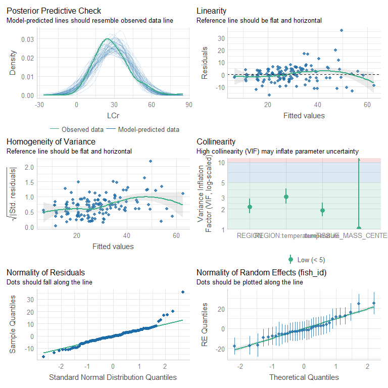<!-- -->

##### DHARMa residuals {.tabset .tabset-faded}

###### ldh.cs.model.1a (linear)

```r
ldh.cs.model.1a %>% simulateResiduals(plot=TRUE)
```

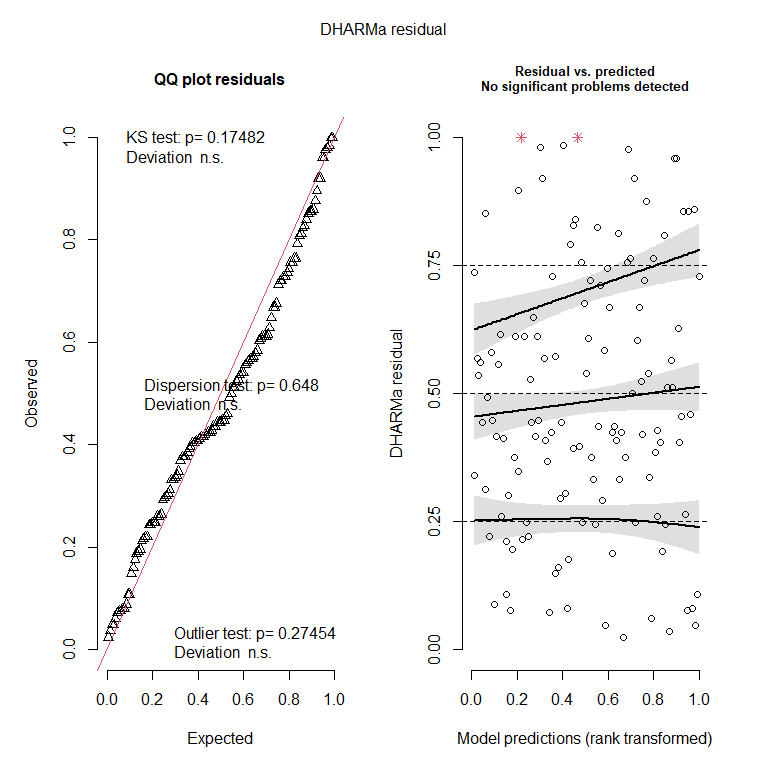<!-- -->

```
## Object of Class DHARMa with simulated residuals based on 250 simulations with refit = FALSE . See ?DHARMa::simulateResiduals for help. 
##  
## Scaled residual values: 0.08 0.024 0.036 0.08 0.92 0.436 0.876 0.856 0.728 0.668 0.384 0.612 0.756 0.92 0.96 0.3 0.16 0.404 1 0.84 ...
```

```r
ldh.cs.model.1a %>% DHARMa::testResiduals(plot=TRUE)
```

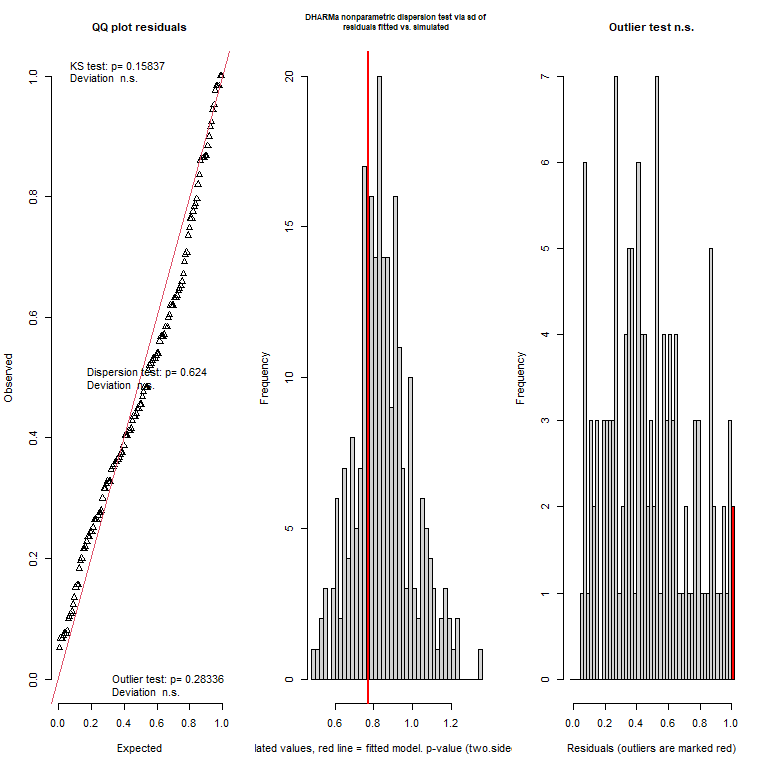<!-- -->

```
## $uniformity
## 
## 	Asymptotic one-sample Kolmogorov-Smirnov test
## 
## data:  simulationOutput$scaledResiduals
## D = 0.097178, p-value = 0.1748
## alternative hypothesis: two-sided
## 
## 
## $dispersion
## 
## 	DHARMa nonparametric dispersion test via sd of residuals fitted vs.
## 	simulated
## 
## data:  simulationOutput
## dispersion = 0.9217, p-value = 0.648
## alternative hypothesis: two.sided
## 
## 
## $outliers
## 
## 	DHARMa outlier test based on exact binomial test with approximate
## 	expectations
## 
## data:  simulationOutput
## outliers at both margin(s) = 2, observations = 129, p-value = 0.2745
## alternative hypothesis: true probability of success is not equal to 0.007968127
## 95 percent confidence interval:
##  0.001883137 0.054882570
## sample estimates:
## frequency of outliers (expected: 0.00796812749003984 ) 
##                                             0.01550388
```

```
## $uniformity
## 
## 	Asymptotic one-sample Kolmogorov-Smirnov test
## 
## data:  simulationOutput$scaledResiduals
## D = 0.097178, p-value = 0.1748
## alternative hypothesis: two-sided
## 
## 
## $dispersion
## 
## 	DHARMa nonparametric dispersion test via sd of residuals fitted vs.
## 	simulated
## 
## data:  simulationOutput
## dispersion = 0.9217, p-value = 0.648
## alternative hypothesis: two.sided
## 
## 
## $outliers
## 
## 	DHARMa outlier test based on exact binomial test with approximate
## 	expectations
## 
## data:  simulationOutput
## outliers at both margin(s) = 2, observations = 129, p-value = 0.2745
## alternative hypothesis: true probability of success is not equal to 0.007968127
## 95 percent confidence interval:
##  0.001883137 0.054882570
## sample estimates:
## frequency of outliers (expected: 0.00796812749003984 ) 
##                                             0.01550388
```

##### {-}

#### {-}

The _ldh.cs.model.1a_ model looks good, and there seem to be no major violations of assumptions. 

#### Partial plots {.tabset .tabset-faded}

##### ggemmeans 

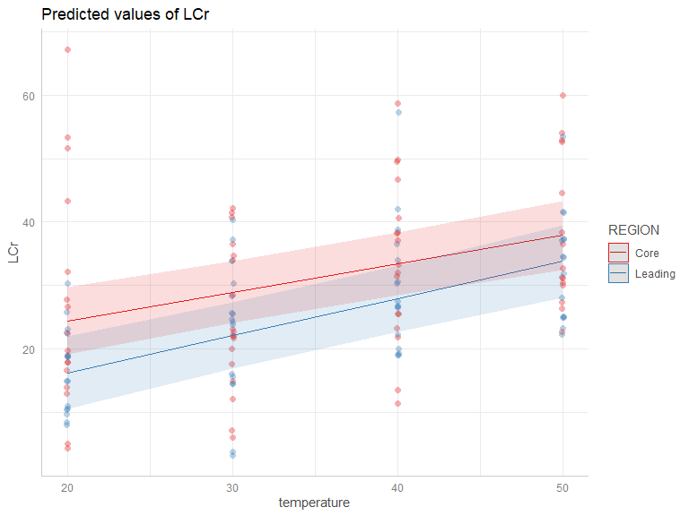<!-- -->

##### plot_model 

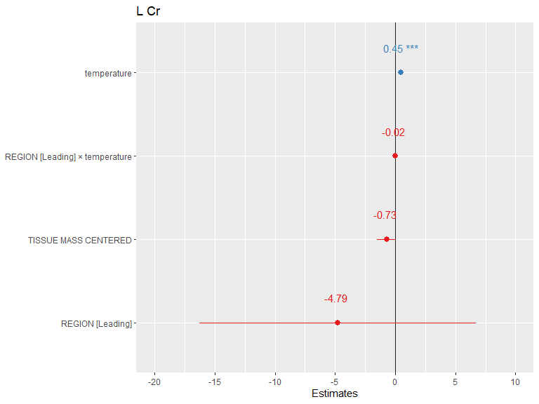<!-- -->

#### {-} 

#### Model investigation {.tabset .tabset-faded}

##### summary 
<table class=" lightable-paper" style='font-family: "Arial Narrow", arial, helvetica, sans-serif; margin-left: auto; margin-right: auto;'>
 <thead>
  <tr>
   <th style="text-align:left;">   </th>
   <th style="text-align:right;"> Estimate </th>
   <th style="text-align:right;"> StdError </th>
   <th style="text-align:right;"> Zvalue </th>
   <th style="text-align:right;"> Pvalue </th>
  </tr>
 </thead>
<tbody>
  <tr>
   <td style="text-align:left;"> (Intercept) </td>
   <td style="text-align:right;"> 15.8739308 </td>
   <td style="text-align:right;"> 4.0215424 </td>
   <td style="text-align:right;"> 3.9472245 </td>
   <td style="text-align:right;"> 0.0000791 </td>
  </tr>
  <tr>
   <td style="text-align:left;"> REGIONLeading </td>
   <td style="text-align:right;"> -4.7918249 </td>
   <td style="text-align:right;"> 5.8522314 </td>
   <td style="text-align:right;"> -0.8188030 </td>
   <td style="text-align:right;"> 0.4128988 </td>
  </tr>
  <tr>
   <td style="text-align:left;"> temperature </td>
   <td style="text-align:right;"> 0.4469781 </td>
   <td style="text-align:right;"> 0.0868763 </td>
   <td style="text-align:right;"> 5.1449970 </td>
   <td style="text-align:right;"> 0.0000003 </td>
  </tr>
  <tr>
   <td style="text-align:left;"> TISSUE_MASS_CENTERED </td>
   <td style="text-align:right;"> -0.7277932 </td>
   <td style="text-align:right;"> 0.4117470 </td>
   <td style="text-align:right;"> -1.7675738 </td>
   <td style="text-align:right;"> 0.0771322 </td>
  </tr>
  <tr>
   <td style="text-align:left;"> REGIONLeading:temperature </td>
   <td style="text-align:right;"> -0.0180225 </td>
   <td style="text-align:right;"> 0.1244268 </td>
   <td style="text-align:right;"> -0.1448444 </td>
   <td style="text-align:right;"> 0.8848338 </td>
  </tr>
</tbody>
</table>

##### Anova 
<table class=" lightable-paper" style='font-family: "Arial Narrow", arial, helvetica, sans-serif; margin-left: auto; margin-right: auto;'>
 <thead>
  <tr>
   <th style="text-align:left;">   </th>
   <th style="text-align:right;"> Chisq </th>
   <th style="text-align:right;"> Df </th>
   <th style="text-align:right;"> Pr(&gt;Chisq) </th>
  </tr>
 </thead>
<tbody>
  <tr>
   <td style="text-align:left;"> REGION </td>
   <td style="text-align:right;"> 1.8860596 </td>
   <td style="text-align:right;"> 1 </td>
   <td style="text-align:right;"> 0.1696470 </td>
  </tr>
  <tr>
   <td style="text-align:left;"> temperature </td>
   <td style="text-align:right;"> 49.6220472 </td>
   <td style="text-align:right;"> 1 </td>
   <td style="text-align:right;"> 0.0000000 </td>
  </tr>
  <tr>
   <td style="text-align:left;"> TISSUE_MASS_CENTERED </td>
   <td style="text-align:right;"> 3.1243173 </td>
   <td style="text-align:right;"> 1 </td>
   <td style="text-align:right;"> 0.0771322 </td>
  </tr>
  <tr>
   <td style="text-align:left;"> REGION:temperature </td>
   <td style="text-align:right;"> 0.0209799 </td>
   <td style="text-align:right;"> 1 </td>
   <td style="text-align:right;"> 0.8848338 </td>
  </tr>
</tbody>
</table>

##### confint 
<table class=" lightable-paper" style='font-family: "Arial Narrow", arial, helvetica, sans-serif; margin-left: auto; margin-right: auto;'>
 <thead>
  <tr>
   <th style="text-align:left;">   </th>
   <th style="text-align:right;"> 2.5 % </th>
   <th style="text-align:right;"> 97.5 % </th>
   <th style="text-align:right;"> Estimate </th>
  </tr>
 </thead>
<tbody>
  <tr>
   <td style="text-align:left;"> (Intercept) </td>
   <td style="text-align:right;"> 7.9918525 </td>
   <td style="text-align:right;"> 23.7560091 </td>
   <td style="text-align:right;"> 15.8739308 </td>
  </tr>
  <tr>
   <td style="text-align:left;"> REGIONLeading </td>
   <td style="text-align:right;"> -16.2619877 </td>
   <td style="text-align:right;"> 6.6783379 </td>
   <td style="text-align:right;"> -4.7918249 </td>
  </tr>
  <tr>
   <td style="text-align:left;"> temperature </td>
   <td style="text-align:right;"> 0.2767037 </td>
   <td style="text-align:right;"> 0.6172524 </td>
   <td style="text-align:right;"> 0.4469781 </td>
  </tr>
  <tr>
   <td style="text-align:left;"> TISSUE_MASS_CENTERED </td>
   <td style="text-align:right;"> -1.5348025 </td>
   <td style="text-align:right;"> 0.0792161 </td>
   <td style="text-align:right;"> -0.7277932 </td>
  </tr>
  <tr>
   <td style="text-align:left;"> REGIONLeading:temperature </td>
   <td style="text-align:right;"> -0.2618946 </td>
   <td style="text-align:right;"> 0.2258496 </td>
   <td style="text-align:right;"> -0.0180225 </td>
  </tr>
  <tr>
   <td style="text-align:left;"> Std.Dev.(Intercept)|fish_id </td>
   <td style="text-align:right;"> 7.8985911 </td>
   <td style="text-align:right;"> 14.0163425 </td>
   <td style="text-align:right;"> 10.5218514 </td>
  </tr>
</tbody>
</table>

##### r-squared
<table class=" lightable-paper" style='font-family: "Arial Narrow", arial, helvetica, sans-serif; margin-left: auto; margin-right: auto;'>
 <thead>
  <tr>
   <th style="text-align:right;"> R2_conditional </th>
   <th style="text-align:right;"> R2_marginal </th>
   <th style="text-align:left;"> optional </th>
  </tr>
 </thead>
<tbody>
  <tr>
   <td style="text-align:right;"> 0.7184249 </td>
   <td style="text-align:right;"> 0.1892872 </td>
   <td style="text-align:left;"> FALSE </td>
  </tr>
</tbody>
</table>

#### {-} 

#### Pairwise comparisons {.tabset .tabset-faded} 

##### emtrends [latitudes]


```r
ldh.cs.model.1a  %>% emtrends(var = "temperature", type = "response") %>% pairs(by = "temperature") %>% summary(by = NULL, adjust = "tukey", infer=TRUE)
```

<div data-pagedtable="false">
  <script data-pagedtable-source type="application/json">
{"columns":[{"label":[""],"name":["_rn_"],"type":[""],"align":["left"]},{"label":["contrast"],"name":[1],"type":["fct"],"align":["left"]},{"label":["temperature"],"name":[2],"type":["dbl"],"align":["right"]},{"label":["estimate"],"name":[3],"type":["dbl"],"align":["right"]},{"label":["SE"],"name":[4],"type":["dbl"],"align":["right"]},{"label":["df"],"name":[5],"type":["dbl"],"align":["right"]},{"label":["lower.CL"],"name":[6],"type":["dbl"],"align":["right"]},{"label":["upper.CL"],"name":[7],"type":["dbl"],"align":["right"]},{"label":["t.ratio"],"name":[8],"type":["dbl"],"align":["right"]},{"label":["p.value"],"name":[9],"type":["dbl"],"align":["right"]}],"data":[{"1":"Core TISSUE_MASS_CENTERED0.16960253979996 - Leading TISSUE_MASS_CENTERED0.16960253979996","2":"34.72868","3":"0.01802252","4":"0.1244268","5":"127","6":"-0.2281957","7":"0.2642407","8":"0.1448444","9":"0.8850634","_rn_":"1"}],"options":{"columns":{"min":{},"max":[10]},"rows":{"min":[10],"max":[10]},"pages":{}}}
  </script>
</div>
SCROLL TO THE RIGHT -->

The numbers in the left most column in the table just mention that the slopes are assuming mean **TISSUE_MASS_CENTERED** values when looking at differences between latitudinal slopes.

##### emmeans [latitudes]

```r
ldh.cs.model.1a  %>% emmeans(pairwise ~ temperature*REGION, type = "response") %>% pairs(by = "temperature") %>% summary(by = NULL, adjust = "tukey", infer=TRUE)
```

<div data-pagedtable="false">
  <script data-pagedtable-source type="application/json">
{"columns":[{"label":[""],"name":["_rn_"],"type":[""],"align":["left"]},{"label":["contrast"],"name":[1],"type":["fct"],"align":["left"]},{"label":["temperature"],"name":[2],"type":["dbl"],"align":["right"]},{"label":["estimate"],"name":[3],"type":["dbl"],"align":["right"]},{"label":["SE"],"name":[4],"type":["dbl"],"align":["right"]},{"label":["df"],"name":[5],"type":["dbl"],"align":["right"]},{"label":["lower.CL"],"name":[6],"type":["dbl"],"align":["right"]},{"label":["upper.CL"],"name":[7],"type":["dbl"],"align":["right"]},{"label":["t.ratio"],"name":[8],"type":["dbl"],"align":["right"]},{"label":["p.value"],"name":[9],"type":["dbl"],"align":["right"]}],"data":[{"1":"Core - Leading","2":"34.72868","3":"5.417723","4":"3.94508","5":"127","6":"-2.388877","7":"13.22432","8":"1.373286","9":"0.172083","_rn_":"1"}],"options":{"columns":{"min":{},"max":[10]},"rows":{"min":[10],"max":[10]},"pages":{}}}
  </script>
</div>

##### TEMPERATURE 

```r
ldh.cs.model.1a  %>% emmeans(~ temperature*REGION, type = "response")  %>% summary(infer=TRUE)
```

<div data-pagedtable="false">
  <script data-pagedtable-source type="application/json">
{"columns":[{"label":[""],"name":["_rn_"],"type":[""],"align":["left"]},{"label":["temperature"],"name":[1],"type":["dbl"],"align":["right"]},{"label":["REGION"],"name":[2],"type":["fct"],"align":["left"]},{"label":["emmean"],"name":[3],"type":["dbl"],"align":["right"]},{"label":["SE"],"name":[4],"type":["dbl"],"align":["right"]},{"label":["df"],"name":[5],"type":["dbl"],"align":["right"]},{"label":["lower.CL"],"name":[6],"type":["dbl"],"align":["right"]},{"label":["upper.CL"],"name":[7],"type":["dbl"],"align":["right"]},{"label":["t.ratio"],"name":[8],"type":["dbl"],"align":["right"]},{"label":["p.value"],"name":[9],"type":["dbl"],"align":["right"]}],"data":[{"1":"34.72868","2":"Core","3":"31.27345","4":"2.676637","5":"127","6":"25.97687","7":"36.57004","8":"11.683860","9":"7.237193e-22","_rn_":"1"},{"1":"34.72868","2":"Leading","3":"25.85573","4":"2.843161","5":"127","6":"20.22963","7":"31.48183","8":"9.094009","9":"1.644770e-15","_rn_":"2"}],"options":{"columns":{"min":{},"max":[10]},"rows":{"min":[10],"max":[10]},"pages":{}}}
  </script>
</div>


##### Means - f(TEMPERATURE)

```r
ldh.cs.model.1a  %>% update(.~1+ REGION * as.factor(temperature) + TISSUE_MASS_CENTERED + (1|fish_id)) %>% 
  emmeans(~REGION*temperature, type = "response") %>% summary(infer=TRUE)
```

<div data-pagedtable="false">
  <script data-pagedtable-source type="application/json">
{"columns":[{"label":[""],"name":["_rn_"],"type":[""],"align":["left"]},{"label":["REGION"],"name":[1],"type":["fct"],"align":["left"]},{"label":["temperature"],"name":[2],"type":["dbl"],"align":["right"]},{"label":["emmean"],"name":[3],"type":["dbl"],"align":["right"]},{"label":["SE"],"name":[4],"type":["dbl"],"align":["right"]},{"label":["df"],"name":[5],"type":["dbl"],"align":["right"]},{"label":["lower.CL"],"name":[6],"type":["dbl"],"align":["right"]},{"label":["upper.CL"],"name":[7],"type":["dbl"],"align":["right"]},{"label":["t.ratio"],"name":[8],"type":["dbl"],"align":["right"]},{"label":["p.value"],"name":[9],"type":["dbl"],"align":["right"]}],"data":[{"1":"Core","2":"20","3":"27.21733","4":"3.111540","5":"127","6":"21.06016","7":"33.37451","8":"8.747223","9":"1.127194e-14","_rn_":"1"},{"1":"Leading","2":"20","3":"20.65256","4":"3.310502","5":"127","6":"14.10168","7":"27.20345","8":"6.238499","9":"6.051043e-09","_rn_":"2"},{"1":"Core","2":"30","3":"25.50068","4":"3.068094","5":"127","6":"19.42948","7":"31.57189","8":"8.311571","9":"1.234365e-13","_rn_":"3"},{"1":"Leading","2":"30","3":"21.80277","4":"3.266376","5":"127","6":"15.33920","7":"28.26634","8":"6.674911","9":"6.915573e-10","_rn_":"4"},{"1":"Core","2":"40","3":"33.96180","4":"3.105229","5":"127","6":"27.81711","7":"40.10649","8":"10.936972","9":"5.021447e-20","_rn_":"5"},{"1":"Leading","2":"40","3":"28.98798","4":"3.266376","5":"127","6":"22.52441","7":"35.45155","8":"8.874662","9":"5.566809e-15","_rn_":"6"},{"1":"Core","2":"50","3":"39.38557","4":"3.197487","5":"127","6":"33.05832","7":"45.71281","8":"12.317664","9":"2.001470e-23","_rn_":"7"},{"1":"Leading","2":"50","3":"32.47390","4":"3.312480","5":"127","6":"25.91910","7":"39.02871","8":"9.803501","9":"3.079395e-17","_rn_":"8"}],"options":{"columns":{"min":{},"max":[10]},"rows":{"min":[10],"max":[10]},"pages":{}}}
  </script>
</div>

##### Abs. diff - f(TEMPERATURE)

```r
ldh.cs.model.1a  %>% update(.~1+ REGION * as.factor(temperature) + TISSUE_MASS_CENTERED + (1|fish_id)) %>% 
  emmeans(~REGION*temperature, type = "response") %>% pairs(by ="REGION") %>% summary(infer=TRUE)
```

<div data-pagedtable="false">
  <script data-pagedtable-source type="application/json">
{"columns":[{"label":[""],"name":["_rn_"],"type":[""],"align":["left"]},{"label":["contrast"],"name":[1],"type":["fct"],"align":["left"]},{"label":["REGION"],"name":[2],"type":["fct"],"align":["left"]},{"label":["estimate"],"name":[3],"type":["dbl"],"align":["right"]},{"label":["SE"],"name":[4],"type":["dbl"],"align":["right"]},{"label":["df"],"name":[5],"type":["dbl"],"align":["right"]},{"label":["lower.CL"],"name":[6],"type":["dbl"],"align":["right"]},{"label":["upper.CL"],"name":[7],"type":["dbl"],"align":["right"]},{"label":["t.ratio"],"name":[8],"type":["dbl"],"align":["right"]},{"label":["p.value"],"name":[9],"type":["dbl"],"align":["right"]}],"data":[{"1":"temperature20 - temperature30","2":"Core","3":"1.716648","4":"2.549340","5":"127","6":"-4.920236","7":"8.35353220","8":"0.6733698","9":"9.069843e-01","_rn_":"1"},{"1":"temperature20 - temperature40","2":"Core","3":"-6.744466","4":"2.596930","5":"127","6":"-13.505244","7":"0.01631195","8":"-2.5970923","9":"5.080492e-02","_rn_":"2"},{"1":"temperature20 - temperature50","2":"Core","3":"-12.168233","4":"2.708125","5":"127","6":"-19.218495","7":"-5.11797038","8":"-4.4932307","9":"9.117170e-05","_rn_":"3"},{"1":"temperature30 - temperature40","2":"Core","3":"-8.461114","4":"2.548971","5":"127","6":"-15.097037","7":"-1.82519148","8":"-3.3194240","9":"6.392717e-03","_rn_":"4"},{"1":"temperature30 - temperature50","2":"Core","3":"-13.884881","4":"2.658330","5":"127","6":"-20.805507","7":"-6.96425512","8":"-5.2231594","9":"4.150271e-06","_rn_":"5"},{"1":"temperature40 - temperature50","2":"Core","3":"-5.423767","4":"2.707844","5":"127","6":"-12.473296","7":"1.62576222","8":"-2.0029836","9":"1.923267e-01","_rn_":"6"},{"1":"temperature20 - temperature30","2":"Leading","3":"-1.150203","4":"2.710030","5":"127","6":"-8.205423","7":"5.90501764","8":"-0.4244244","9":"9.742089e-01","_rn_":"7"},{"1":"temperature20 - temperature40","2":"Leading","3":"-8.335418","4":"2.710030","5":"127","6":"-15.390639","7":"-1.28019765","8":"-3.0757660","9":"1.354173e-02","_rn_":"8"},{"1":"temperature20 - temperature50","2":"Leading","3":"-11.821340","4":"2.767261","5":"127","6":"-19.025555","7":"-4.61712565","8":"-4.2718556","9":"2.186211e-04","_rn_":"9"},{"1":"temperature30 - temperature40","2":"Leading","3":"-7.185215","4":"2.653709","5":"127","6":"-14.093812","7":"-0.27661887","8":"-2.7076121","9":"3.814853e-02","_rn_":"10"},{"1":"temperature30 - temperature50","2":"Leading","3":"-10.671138","4":"2.709979","5":"127","6":"-17.726225","7":"-3.61604976","8":"-3.9377196","9":"7.699516e-04","_rn_":"11"},{"1":"temperature40 - temperature50","2":"Leading","3":"-3.485922","4":"2.709979","5":"127","6":"-10.541010","7":"3.56916553","8":"-1.2863281","9":"5.733049e-01","_rn_":"12"}],"options":{"columns":{"min":{},"max":[10]},"rows":{"min":[10],"max":[10]},"pages":{}}}
  </script>
</div>
##### Effect size

```r
ldh.cs.emm <- ldh.cs.model.1a %>% emmeans(~REGION*temperature)
eff_size(ldh.cs.emm, sigma = sigma(ldh.cs.model.1a), edf=df.residual(ldh.cs.model.1a))
```

```
##  contrast                                                              
##  Core temperature34.7286821705426 - Leading temperature34.7286821705426
##  effect.size    SE  df lower.CL upper.CL
##        0.706 0.516 127   -0.315     1.73
## 
## sigma used for effect sizes: 7.675 
## Confidence level used: 0.95
```
#### {-}

#### Summary figure 

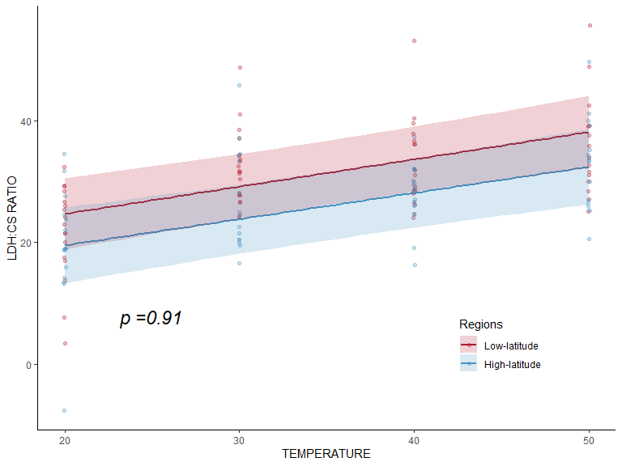<!-- -->

#### Conclusion 

* In conclusion the LDH:CS ratio has a **significantly** positively correlated with temperature, however, there is no significant difference in the relationship between temperature and LDH:CS when comparing fish from low- and high-latitudes.


## Immunocompetence 

### Scenario 

For initial details on the experiment performed please read the **ReadMe** file. In breif, _Acanthochromis polyacanthus_ from two different regions on the Great Barrier Reef (GBR) were tested for metabolic performance at four different temperatures, 27$^\circ$C, 28.5$^\circ$C, 30$^\circ$C, and 31.5$^\circ$C. Fish used in this study were collected from two different regions, low- (i.e. Cairns) and high-latitude (i.e., Mackay), within each region fish were collected from a total of three different populations. 

Immunocompetence was tested via phytohaemaglutinin (PHA) swelling assays at the same four experimental temperatures metabolic performance was tested at. To perform the assay fish were injected with 0.03 mL of PHA subcutaneously in the caudal peduncle. Thickness of injection site was measured pre-injection as well as 18-24hour post-injection. PHA produces a localized, cell-mediated response (e.g., inflammation, T-cell proliferation, etc).  The change in thickness between measurement periods was used as an proxy for immunocompetence.


### Read in the data

Before beginning always make sure that you are working in the correct directory 


```r
knitr::opts_knit$set(root.dir=working.dir)
```

Now we can import that data. Replace import data with the PATH to your data file. I have secretly labelled my PATH import.data (i.e. import.data = "PATH TO MY FILE")

#### Load data 


```r
pha <- import.data
```

### Data manipulation 

Before the data can be analysed it is important to clean up the data file. Below a number of adjustments are made, primarily making sure that columns are being treated appropriately as either factors, numeric, or as time, as well as the renaming of some columns.  


```{.r .style}
pha2 <- pha %>% 
  dplyr::rename(PHA_28.5 = PHA_285) %>%
  mutate(FISH_ID = factor(FISH_ID), 
         POPULATION = factor(POPULATION), 
         REGION = factor(REGION), 
         TANK = factor(TANK), 
         PHA_28.5 = as.numeric(PHA_28.5), 
         MASS_CENTERED = scale(MASS, center = TRUE, scale = FALSE)) %>% 
  pivot_longer(cols = c(PHA_27, 
                        PHA_28.5, 
                        PHA_30, 
                        PHA_31.5), 
               names_to = 'PHA', 
               values_to = 'IMMUNE_RESPONSE') %>% 
  separate(col = PHA, 
           into = c('TEST','TEMPERATURE'), sep = '_') %>% 
  filter(IMMUNE_RESPONSE >= 0.01) %>% # removing negative values greater than -0.05
  mutate(TEMPERATURE = as.numeric(TEMPERATURE))
```

Great! That is everything for data manipulation 

### Exploratory data analysis {.tabset}

#### PHA V TEMP


```r
ggplot(pha2, aes(x=TEMPERATURE, y=IMMUNE_RESPONSE)) + 
  geom_violin(alpha = 0.5) +  # four potential outliers but will keep for now 
  geom_point() 
```

<!-- -->

#### PHA v TEMP (LATITUDE)

```r
ggplot(pha2, aes(x=TEMPERATURE, y=IMMUNE_RESPONSE, fill = REGION, color = REGION)) + 
  geom_violin(alpha = 0.5) + 
  geom_point(position = position_jitterdodge(dodge.width = 0.9, jitter.width = 0), color = "black")
```

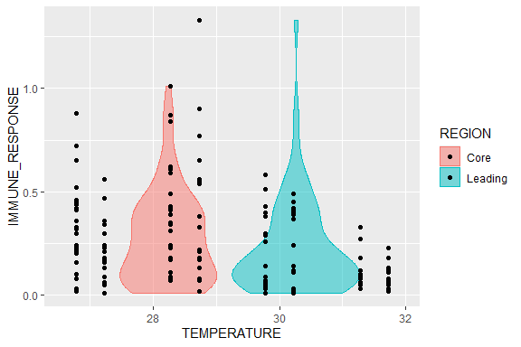<!-- -->


#### PHA v MASS (LATITUDE)

```r
ggplot(pha2, aes(x=MASS_CENTERED, y=IMMUNE_RESPONSE, fill = REGION, color = REGION)) +
  geom_point() + geom_smooth(method = "lm")
```

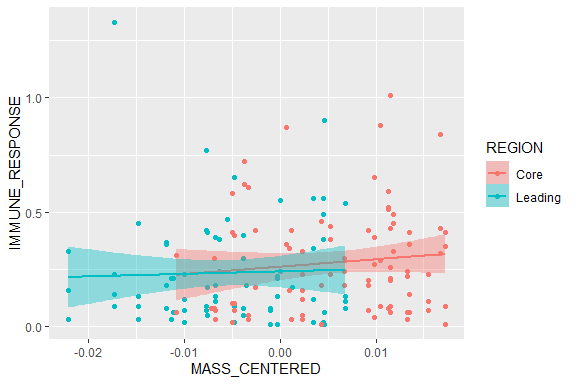<!-- -->

#### {-}

### Fit the model 

The model was fit using the **glm** and later **glmmTMB** package in R. A number of different models were tested to determine which hypothesis and associated variables best predicted resting oxygen consumption. Model fit was examined using AICc, BIC, and r-squared values. Additional model were examined via the validation diagnostics provided by the **performance** and **dHARMA** packages in R. 

#### Fixed factors (linear regression models)

##### model 1

```r
#--- base model ---#
pha.1 <- glm(IMMUNE_RESPONSE ~ 1 + REGION * TEMPERATURE + MASS_CENTERED, 
                     family=gaussian(), 
                     data = pha2) 
```
###### summary
<table class=" lightable-paper" style='font-family: "Arial Narrow", arial, helvetica, sans-serif; margin-left: auto; margin-right: auto;'>
 <thead>
  <tr>
   <th style="text-align:left;">   </th>
   <th style="text-align:right;"> Estimate </th>
   <th style="text-align:right;"> Std. Error </th>
   <th style="text-align:right;"> t value </th>
   <th style="text-align:right;"> Pr(&gt;|t|) </th>
  </tr>
 </thead>
<tbody>
  <tr>
   <td style="text-align:left;"> (Intercept) </td>
   <td style="text-align:right;"> 1.7185981 </td>
   <td style="text-align:right;"> 0.4222908 </td>
   <td style="text-align:right;"> 4.0697030 </td>
   <td style="text-align:right;"> 0.0000750 </td>
  </tr>
  <tr>
   <td style="text-align:left;"> REGIONLeading </td>
   <td style="text-align:right;"> -0.6055925 </td>
   <td style="text-align:right;"> 0.6198923 </td>
   <td style="text-align:right;"> -0.9769318 </td>
   <td style="text-align:right;"> 0.3301350 </td>
  </tr>
  <tr>
   <td style="text-align:left;"> TEMPERATURE </td>
   <td style="text-align:right;"> -0.0504956 </td>
   <td style="text-align:right;"> 0.0146466 </td>
   <td style="text-align:right;"> -3.4476083 </td>
   <td style="text-align:right;"> 0.0007294 </td>
  </tr>
  <tr>
   <td style="text-align:left;"> MASS_CENTERED </td>
   <td style="text-align:right;"> 3.0066564 </td>
   <td style="text-align:right;"> 2.2817687 </td>
   <td style="text-align:right;"> 1.3176868 </td>
   <td style="text-align:right;"> 0.1895654 </td>
  </tr>
  <tr>
   <td style="text-align:left;"> REGIONLeading:TEMPERATURE </td>
   <td style="text-align:right;"> 0.0207950 </td>
   <td style="text-align:right;"> 0.0213983 </td>
   <td style="text-align:right;"> 0.9718052 </td>
   <td style="text-align:right;"> 0.3326714 </td>
  </tr>
</tbody>
</table>

##### model 2

```r
#--- experimental rmr equipment hypothesis ---#
pha.2 <- glm(IMMUNE_RESPONSE ~ 1 + REGION * TEMPERATURE, 
                     family=gaussian(), 
                     data = pha2)  
```

###### summary
<table class=" lightable-paper" style='font-family: "Arial Narrow", arial, helvetica, sans-serif; margin-left: auto; margin-right: auto;'>
 <thead>
  <tr>
   <th style="text-align:left;">   </th>
   <th style="text-align:right;"> Estimate </th>
   <th style="text-align:right;"> Std. Error </th>
   <th style="text-align:right;"> t value </th>
   <th style="text-align:right;"> Pr(&gt;|t|) </th>
  </tr>
 </thead>
<tbody>
  <tr>
   <td style="text-align:left;"> (Intercept) </td>
   <td style="text-align:right;"> 1.6908547 </td>
   <td style="text-align:right;"> 0.4227662 </td>
   <td style="text-align:right;"> 3.9995034 </td>
   <td style="text-align:right;"> 0.0000980 </td>
  </tr>
  <tr>
   <td style="text-align:left;"> REGIONLeading </td>
   <td style="text-align:right;"> -0.6042622 </td>
   <td style="text-align:right;"> 0.6213620 </td>
   <td style="text-align:right;"> -0.9724801 </td>
   <td style="text-align:right;"> 0.3323269 </td>
  </tr>
  <tr>
   <td style="text-align:left;"> TEMPERATURE </td>
   <td style="text-align:right;"> -0.0489398 </td>
   <td style="text-align:right;"> 0.0146335 </td>
   <td style="text-align:right;"> -3.3443600 </td>
   <td style="text-align:right;"> 0.0010344 </td>
  </tr>
  <tr>
   <td style="text-align:left;"> REGIONLeading:TEMPERATURE </td>
   <td style="text-align:right;"> 0.0195688 </td>
   <td style="text-align:right;"> 0.0214288 </td>
   <td style="text-align:right;"> 0.9132038 </td>
   <td style="text-align:right;"> 0.3625536 </td>
  </tr>
</tbody>
</table>

##### model comparison table
<table class=" lightable-paper" style='font-family: "Arial Narrow", arial, helvetica, sans-serif; margin-left: auto; margin-right: auto;'>
 <thead>
  <tr>
   <th style="text-align:left;"> model </th>
   <th style="text-align:right;"> df </th>
   <th style="text-align:right;"> AICc </th>
   <th style="text-align:right;"> BIC </th>
   <th style="text-align:right;"> r2 </th>
  </tr>
 </thead>
<tbody>
  <tr>
   <td style="text-align:left;"> pha.1 </td>
   <td style="text-align:right;"> 6 </td>
   <td style="text-align:right;"> -22.05659 </td>
   <td style="text-align:right;"> -4.195801 </td>
   <td style="text-align:right;"> 0.1032647 </td>
  </tr>
  <tr>
   <td style="text-align:left;"> pha.2 </td>
   <td style="text-align:right;"> 5 </td>
   <td style="text-align:right;"> -22.43443 </td>
   <td style="text-align:right;"> -7.482064 </td>
   <td style="text-align:right;"> 0.0939358 </td>
  </tr>
</tbody>
</table>

There is little difference between the two initial models, therefore, we will move forward with the model that has less terms. 

It looks like the third model is better than the previous two. Next we will test to see if the variable temperature performs best as a 1^st^ (linear), 2^nd^ (quadratic), or 3^rd^ (cubic) order polynomial. As the relationship between temperature and resting oxygen consumption is predicted to be non-linear. 

#### Polynomials 

##### polynomial models 

Note that the linear model has already been created via model _pha.2_ in the previous section.


```r
pha.2.p2 <- glm(IMMUNE_RESPONSE ~ 1 + REGION * poly(TEMPERATURE, 2), 
                 family=gaussian(),
                 data = pha2)  

pha.2.p3 <- glm(IMMUNE_RESPONSE ~ 1 + REGION * poly(TEMPERATURE, 3), 
                 family=gaussian(),
                 data = pha2)
```

###### polynomial model comparisons
<table class=" lightable-paper" style='font-family: "Arial Narrow", arial, helvetica, sans-serif; margin-left: auto; margin-right: auto;'>
 <thead>
  <tr>
   <th style="text-align:left;"> model </th>
   <th style="text-align:right;"> df </th>
   <th style="text-align:right;"> AICc </th>
   <th style="text-align:right;"> BIC </th>
   <th style="text-align:right;"> r2 </th>
  </tr>
 </thead>
<tbody>
  <tr>
   <td style="text-align:left;"> pha.2 </td>
   <td style="text-align:right;"> 5 </td>
   <td style="text-align:right;"> -22.43443 </td>
   <td style="text-align:right;"> -7.482064 </td>
   <td style="text-align:right;"> 0.0955802 </td>
  </tr>
  <tr>
   <td style="text-align:left;"> pha.2.p2 </td>
   <td style="text-align:right;"> 7 </td>
   <td style="text-align:right;"> -33.95206 </td>
   <td style="text-align:right;"> -13.211452 </td>
   <td style="text-align:right;"> 0.1814782 </td>
  </tr>
  <tr>
   <td style="text-align:left;"> pha.2.p3 </td>
   <td style="text-align:right;"> 9 </td>
   <td style="text-align:right;"> -36.46535 </td>
   <td style="text-align:right;"> -10.053268 </td>
   <td style="text-align:right;"> 0.2166317 </td>
  </tr>
</tbody>
</table>

From our model comparison we can see that the model improves when TEMPERATURE is modeled as 2$^nd$ or 3$^rd$ order polynomial. The model that implements a 3$^rd$ order polynomial performs the best, and therefore, we will be moving forward with this model.

#### Random factors 

Fish were repeatedly sampled over four different temperatures, therefore repeated sampling needs to be accounted for. To do this random factors will be included within the model. There are a number of options that can be used for random factors including 1) accounting for repeated sampling of individuals, 2) accounting for repeated sampling of individuals nested within population, 3) account for repeated sampling of individuals and populations without nesting. All three models will be run and compared. 

##### random factor models


```r
pha.2.p3a <- glmmTMB(IMMUNE_RESPONSE ~ 1 + REGION * poly(TEMPERATURE, 3) + (1|FISH_ID), 
                  family=gaussian(),
                  data = pha2,
                  REML = TRUE) 


pha.2.p3b <- glmmTMB(IMMUNE_RESPONSE ~ 1 + REGION * poly(TEMPERATURE, 3) + (1|POPULATION/FISH_ID), 
                  family=gaussian(),
                  data = pha2,
                  REML = TRUE)

pha.2.p3c <- glmmTMB(IMMUNE_RESPONSE ~ 1 + REGION * poly(TEMPERATURE, 3) + (1|FISH_ID) + (1|POPULATION), 
                  family=gaussian(),
                  data = pha2,
                  REML = TRUE)
```

###### random factor model comparisons 

<table class=" lightable-paper" style='font-family: "Arial Narrow", arial, helvetica, sans-serif; margin-left: auto; margin-right: auto;'>
 <thead>
  <tr>
   <th style="text-align:left;"> model </th>
   <th style="text-align:right;"> df </th>
   <th style="text-align:right;"> AICc </th>
   <th style="text-align:right;"> BIC </th>
   <th style="text-align:right;"> r2m </th>
   <th style="text-align:right;"> r2c </th>
  </tr>
 </thead>
<tbody>
  <tr>
   <td style="text-align:left;"> pha.2.p3a </td>
   <td style="text-align:right;"> 10 </td>
   <td style="text-align:right;"> -19.04376 </td>
   <td style="text-align:right;"> 10.15879 </td>
   <td style="text-align:right;"> 0.2090404 </td>
   <td style="text-align:right;"> 0.2090404 </td>
  </tr>
  <tr>
   <td style="text-align:left;"> pha.2.p3b </td>
   <td style="text-align:right;"> 11 </td>
   <td style="text-align:right;"> -18.95044 </td>
   <td style="text-align:right;"> 13.01158 </td>
   <td style="text-align:right;"> 0.2022862 </td>
   <td style="text-align:right;"> 0.2517016 </td>
  </tr>
  <tr>
   <td style="text-align:left;"> pha.2.p3c </td>
   <td style="text-align:right;"> 11 </td>
   <td style="text-align:right;"> -18.95044 </td>
   <td style="text-align:right;"> 13.01158 </td>
   <td style="text-align:right;"> 0.2022862 </td>
   <td style="text-align:right;"> 0.2517016 </td>
  </tr>
</tbody>
</table>

There is little difference between the models, however, the nest model does seem to a bit better than the none nested model that only includes (1|FISH_ID) for this variable. There no difference between the second and third model, either could be used. Moving forward the second model with the nested random effects will be used. 

### Model validation {.tabset .tabset-faded}

#### performance {.tabset .tabset-faded}

##### pha.2.p3b 
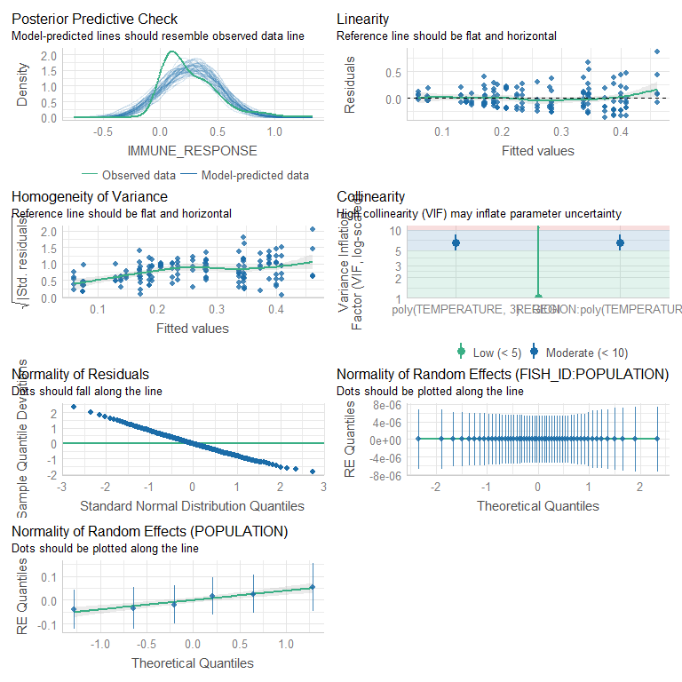<!-- -->

#### DHARMa residuals {.tabset .tabset-faded}

##### pha.2.p3b 

```r
pha.2.p3b %>% simulateResiduals(plot=TRUE)
```

<!-- -->

```
## Object of Class DHARMa with simulated residuals based on 250 simulations with refit = FALSE . See ?DHARMa::simulateResiduals for help. 
##  
## Scaled residual values: 0.336 0.116 0.828 0.4 0.232 0.192 0.504 0.036 0.284 0.42 0.42 0.52 0.476 0.648 0.536 0.192 0.172 0.52 0.44 0.74 ...
```

```r
pha.2.p3b %>% DHARMa::testResiduals(plot=TRUE)
```

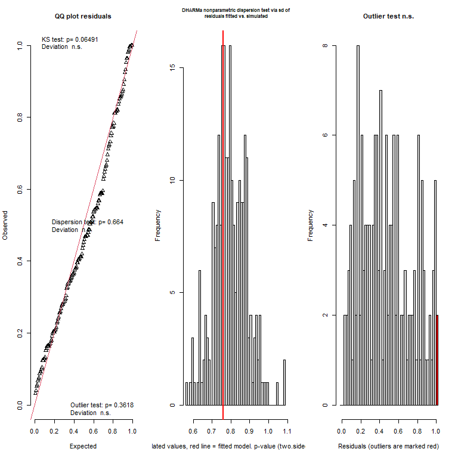<!-- -->

```
## $uniformity
## 
## 	Asymptotic one-sample Kolmogorov-Smirnov test
## 
## data:  simulationOutput$scaledResiduals
## D = 0.10325, p-value = 0.06743
## alternative hypothesis: two-sided
## 
## 
## $dispersion
## 
## 	DHARMa nonparametric dispersion test via sd of residuals fitted vs.
## 	simulated
## 
## data:  simulationOutput
## dispersion = 0.94119, p-value = 0.656
## alternative hypothesis: two.sided
## 
## 
## $outliers
## 
## 	DHARMa outlier test based on exact binomial test with approximate
## 	expectations
## 
## data:  simulationOutput
## outliers at both margin(s) = 2, observations = 159, p-value = 0.3618
## alternative hypothesis: true probability of success is not equal to 0.007968127
## 95 percent confidence interval:
##  0.001526975 0.044697834
## sample estimates:
## frequency of outliers (expected: 0.00796812749003984 ) 
##                                             0.01257862
```

```
## $uniformity
## 
## 	Asymptotic one-sample Kolmogorov-Smirnov test
## 
## data:  simulationOutput$scaledResiduals
## D = 0.10325, p-value = 0.06743
## alternative hypothesis: two-sided
## 
## 
## $dispersion
## 
## 	DHARMa nonparametric dispersion test via sd of residuals fitted vs.
## 	simulated
## 
## data:  simulationOutput
## dispersion = 0.94119, p-value = 0.656
## alternative hypothesis: two.sided
## 
## 
## $outliers
## 
## 	DHARMa outlier test based on exact binomial test with approximate
## 	expectations
## 
## data:  simulationOutput
## outliers at both margin(s) = 2, observations = 159, p-value = 0.3618
## alternative hypothesis: true probability of success is not equal to 0.007968127
## 95 percent confidence interval:
##  0.001526975 0.044697834
## sample estimates:
## frequency of outliers (expected: 0.00796812749003984 ) 
##                                             0.01257862
```

#### {-}

### {-}

The _pha.2.p3b_ model performs well, however, in the model validation performed by the **performance** package our modeled predictive lines aren't matching up with our observed data as well as we might hope. There are also some issues with the residuals within our DHARMa validations. Let's see if we can fix this by including some different link functions within out model. 

### Fit the model (link transformations)


```r
pha.2.p3b <- glmmTMB(IMMUNE_RESPONSE ~ 1 + REGION * poly(TEMPERATURE, 3) + (1|POPULATION/FISH_ID), 
                  family=gaussian(),
                  data = pha2,
                  REML = FALSE)

pha.2.p3b.log <- glmmTMB(IMMUNE_RESPONSE ~ 1 + REGION * poly(TEMPERATURE, 3) + (1|POPULATION/FISH_ID), 
                  family=gaussian(link="log"),
                  data = pha2,
                  REML = FALSE) 

pha.2.p3b.inv <- glmmTMB(IMMUNE_RESPONSE ~ 1 + REGION * poly(TEMPERATURE, 3) + (1|POPULATION/FISH_ID), 
                  family=gaussian(link="inverse"),
                  data = pha2,
                  REML = FALSE)
```

### Model re-validation {.tabset .tabset-faded}

#### performance {.tabset .tabset-faded}

##### Gaussian (identity)

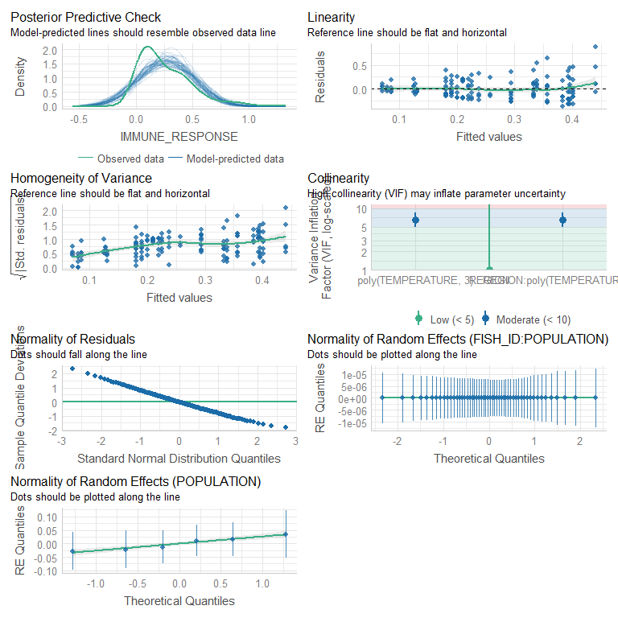<!-- -->

##### Gaussian (log)
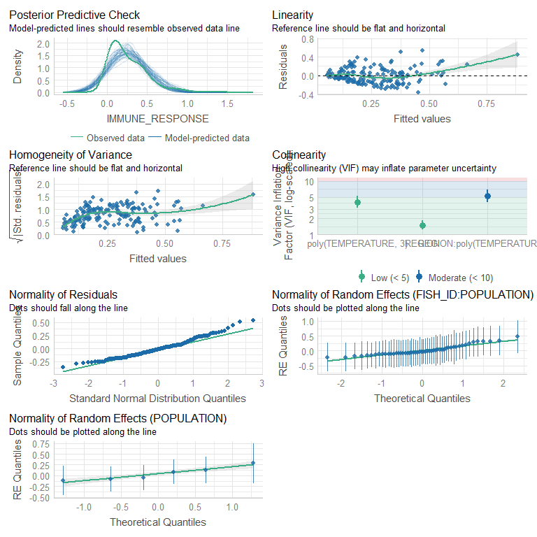<!-- -->

##### Gaussian (inverse)
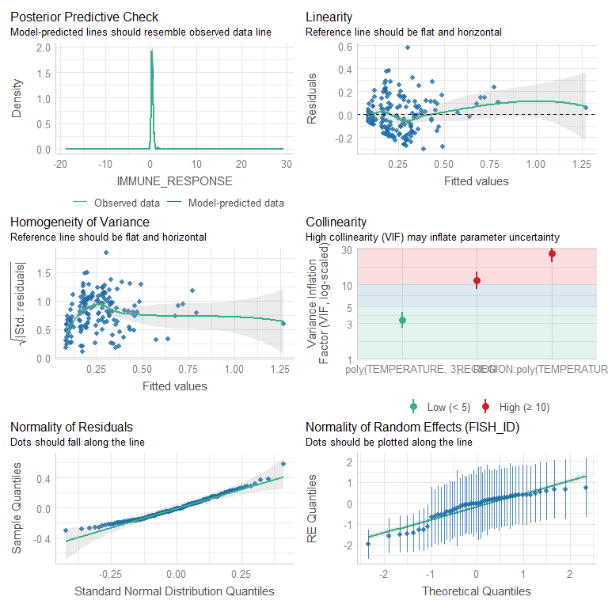<!-- -->

#### DHARMa {.tabset .tabset-faded}

##### Gaussian (identity)

```r
pha.2.p3b %>% simulateResiduals(plot=TRUE)
```

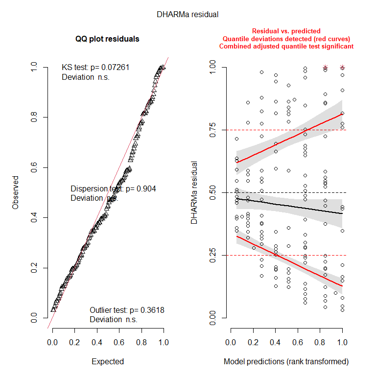<!-- -->

```
## Object of Class DHARMa with simulated residuals based on 250 simulations with refit = FALSE . See ?DHARMa::simulateResiduals for help. 
##  
## Scaled residual values: 0.34 0.104 0.84 0.396 0.228 0.192 0.496 0.032 0.284 0.428 0.408 0.536 0.464 0.652 0.544 0.188 0.172 0.536 0.44 0.748 ...
```

```r
pha.2.p3b %>% DHARMa::testResiduals(plot=TRUE)
```

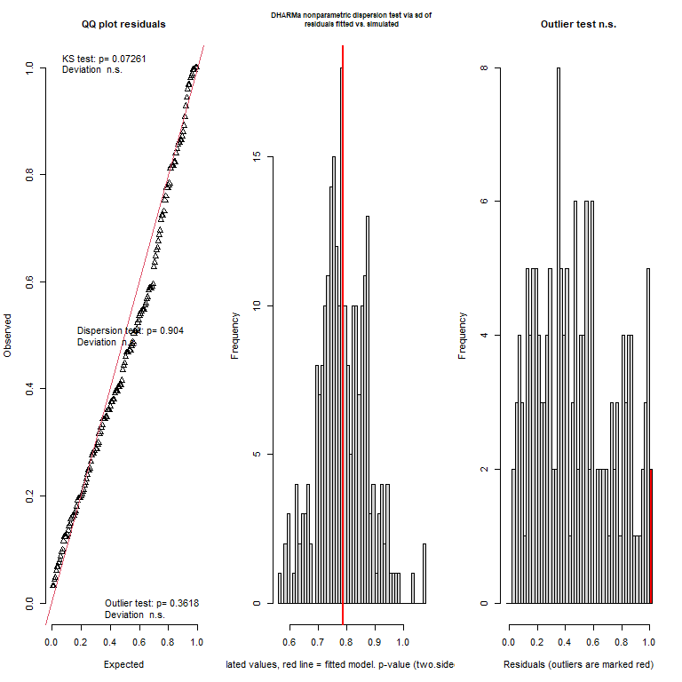<!-- -->

```
## $uniformity
## 
## 	Asymptotic one-sample Kolmogorov-Smirnov test
## 
## data:  simulationOutput$scaledResiduals
## D = 0.096377, p-value = 0.1043
## alternative hypothesis: two-sided
## 
## 
## $dispersion
## 
## 	DHARMa nonparametric dispersion test via sd of residuals fitted vs.
## 	simulated
## 
## data:  simulationOutput
## dispersion = 1.0064, p-value = 0.912
## alternative hypothesis: two.sided
## 
## 
## $outliers
## 
## 	DHARMa outlier test based on exact binomial test with approximate
## 	expectations
## 
## data:  simulationOutput
## outliers at both margin(s) = 2, observations = 159, p-value = 0.3618
## alternative hypothesis: true probability of success is not equal to 0.007968127
## 95 percent confidence interval:
##  0.001526975 0.044697834
## sample estimates:
## frequency of outliers (expected: 0.00796812749003984 ) 
##                                             0.01257862
```

```
## $uniformity
## 
## 	Asymptotic one-sample Kolmogorov-Smirnov test
## 
## data:  simulationOutput$scaledResiduals
## D = 0.096377, p-value = 0.1043
## alternative hypothesis: two-sided
## 
## 
## $dispersion
## 
## 	DHARMa nonparametric dispersion test via sd of residuals fitted vs.
## 	simulated
## 
## data:  simulationOutput
## dispersion = 1.0064, p-value = 0.912
## alternative hypothesis: two.sided
## 
## 
## $outliers
## 
## 	DHARMa outlier test based on exact binomial test with approximate
## 	expectations
## 
## data:  simulationOutput
## outliers at both margin(s) = 2, observations = 159, p-value = 0.3618
## alternative hypothesis: true probability of success is not equal to 0.007968127
## 95 percent confidence interval:
##  0.001526975 0.044697834
## sample estimates:
## frequency of outliers (expected: 0.00796812749003984 ) 
##                                             0.01257862
```

##### Gaussian (log)

```r
pha.2.p3b.log %>% simulateResiduals(plot=TRUE)
```

<!-- -->

```
## Object of Class DHARMa with simulated residuals based on 250 simulations with refit = FALSE . See ?DHARMa::simulateResiduals for help. 
##  
## Scaled residual values: 0.34 0.096 0.856 0.384 0.28 0.172 0.564 0.024 0.324 0.448 0.376 0.568 0.524 0.692 0.632 0.188 0.18 0.556 0.532 0.82 ...
```

```r
pha.2.p3b.log %>% DHARMa::testResiduals(plot=TRUE)
```

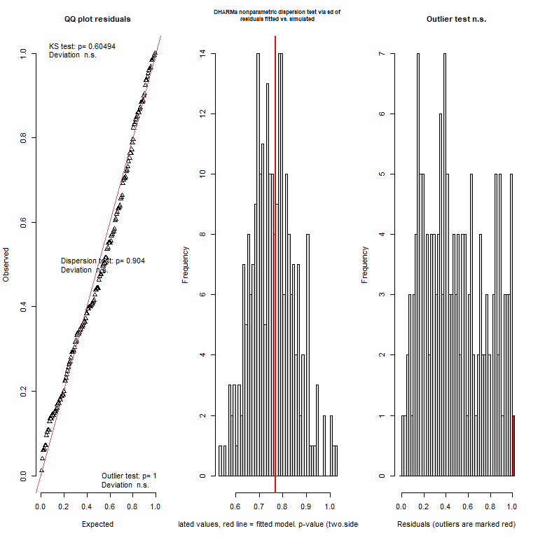<!-- -->

```
## $uniformity
## 
## 	Asymptotic one-sample Kolmogorov-Smirnov test
## 
## data:  simulationOutput$scaledResiduals
## D = 0.070591, p-value = 0.4065
## alternative hypothesis: two-sided
## 
## 
## $dispersion
## 
## 	DHARMa nonparametric dispersion test via sd of residuals fitted vs.
## 	simulated
## 
## data:  simulationOutput
## dispersion = 1.0116, p-value = 0.88
## alternative hypothesis: two.sided
## 
## 
## $outliers
## 
## 	DHARMa outlier test based on exact binomial test with approximate
## 	expectations
## 
## data:  simulationOutput
## outliers at both margin(s) = 1, observations = 159, p-value = 1
## alternative hypothesis: true probability of success is not equal to 0.007968127
## 95 percent confidence interval:
##  0.0001592188 0.0345421401
## sample estimates:
## frequency of outliers (expected: 0.00796812749003984 ) 
##                                            0.006289308
```

```
## $uniformity
## 
## 	Asymptotic one-sample Kolmogorov-Smirnov test
## 
## data:  simulationOutput$scaledResiduals
## D = 0.070591, p-value = 0.4065
## alternative hypothesis: two-sided
## 
## 
## $dispersion
## 
## 	DHARMa nonparametric dispersion test via sd of residuals fitted vs.
## 	simulated
## 
## data:  simulationOutput
## dispersion = 1.0116, p-value = 0.88
## alternative hypothesis: two.sided
## 
## 
## $outliers
## 
## 	DHARMa outlier test based on exact binomial test with approximate
## 	expectations
## 
## data:  simulationOutput
## outliers at both margin(s) = 1, observations = 159, p-value = 1
## alternative hypothesis: true probability of success is not equal to 0.007968127
## 95 percent confidence interval:
##  0.0001592188 0.0345421401
## sample estimates:
## frequency of outliers (expected: 0.00796812749003984 ) 
##                                            0.006289308
```

##### Gaussian (inverse)

```r
pha.2.p3b.inv %>% simulateResiduals(plot=TRUE)
```

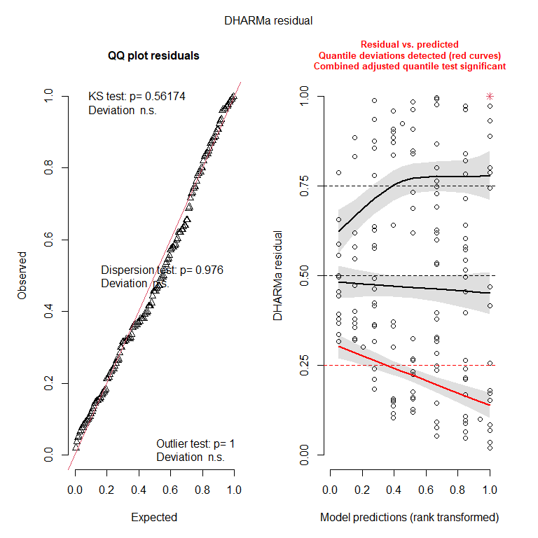<!-- -->

```
## Object of Class DHARMa with simulated residuals based on 250 simulations with refit = FALSE . See ?DHARMa::simulateResiduals for help. 
##  
## Scaled residual values: 0.352 0.128 0.9 0.372 0.236 0.212 0.596 0.032 0.312 0.424 0.42 0.596 0.54 0.688 0.636 0.208 0.196 0.548 0.484 0.84 ...
```

```r
pha.2.p3b.inv %>% DHARMa::testResiduals(plot=TRUE)
```

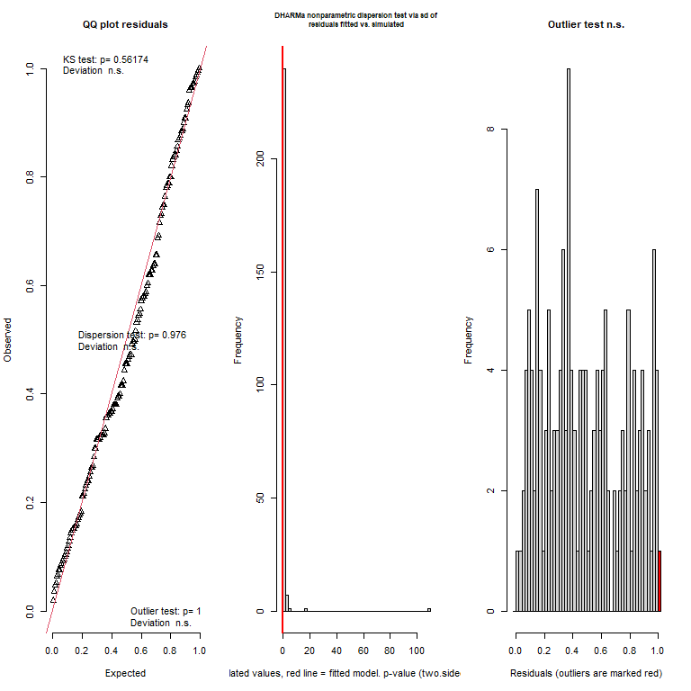<!-- -->

```
## $uniformity
## 
## 	Asymptotic one-sample Kolmogorov-Smirnov test
## 
## data:  simulationOutput$scaledResiduals
## D = 0.080302, p-value = 0.2568
## alternative hypothesis: two-sided
## 
## 
## $dispersion
## 
## 	DHARMa nonparametric dispersion test via sd of residuals fitted vs.
## 	simulated
## 
## data:  simulationOutput
## dispersion = 0.099362, p-value = 0.872
## alternative hypothesis: two.sided
## 
## 
## $outliers
## 
## 	DHARMa outlier test based on exact binomial test with approximate
## 	expectations
## 
## data:  simulationOutput
## outliers at both margin(s) = 0, observations = 159, p-value = 0.6421
## alternative hypothesis: true probability of success is not equal to 0.007968127
## 95 percent confidence interval:
##  0.00000000 0.02293344
## sample estimates:
## frequency of outliers (expected: 0.00796812749003984 ) 
##                                                      0
```

```
## $uniformity
## 
## 	Asymptotic one-sample Kolmogorov-Smirnov test
## 
## data:  simulationOutput$scaledResiduals
## D = 0.080302, p-value = 0.2568
## alternative hypothesis: two-sided
## 
## 
## $dispersion
## 
## 	DHARMa nonparametric dispersion test via sd of residuals fitted vs.
## 	simulated
## 
## data:  simulationOutput
## dispersion = 0.099362, p-value = 0.872
## alternative hypothesis: two.sided
## 
## 
## $outliers
## 
## 	DHARMa outlier test based on exact binomial test with approximate
## 	expectations
## 
## data:  simulationOutput
## outliers at both margin(s) = 0, observations = 159, p-value = 0.6421
## alternative hypothesis: true probability of success is not equal to 0.007968127
## 95 percent confidence interval:
##  0.00000000 0.02293344
## sample estimates:
## frequency of outliers (expected: 0.00796812749003984 ) 
##                                                      0
```
#### {-}

### {-}

Adding **log** or **inverse** link functions to the model does not help. In fact, it seems to make the model worse! From here we can try to experiment with different distributions. The first distribution that comes to mind is the **Gamma** distribution, as it can be helpful when dealing with skewed data when the data set contains no zeros and all positive values. 

### Fit model - alternative distributions 


```r
pha.2.p3b <- glmmTMB(IMMUNE_RESPONSE ~ 1 + REGION * poly(TEMPERATURE, 3) + (1|POPULATION/FISH_ID), 
                  family=gaussian(),
                  data = pha2,
                  REML = FALSE) 

pha.2.p3b.gamma <- glmmTMB(IMMUNE_RESPONSE~ 1 + REGION* poly(TEMPERATURE, 3) + (1|POPULATION/FISH_ID), 
                       family=Gamma(link="log"), # default option
                       data = pha2, 
                       REML = FALSE)
```

<table class=" lightable-paper" style='font-family: "Arial Narrow", arial, helvetica, sans-serif; margin-left: auto; margin-right: auto;'>
 <thead>
  <tr>
   <th style="text-align:left;"> model </th>
   <th style="text-align:right;"> df </th>
   <th style="text-align:right;"> AICc </th>
   <th style="text-align:right;"> BIC </th>
   <th style="text-align:right;"> r2m </th>
   <th style="text-align:right;"> r2c </th>
  </tr>
 </thead>
<tbody>
  <tr>
   <td style="text-align:left;"> pha.2.p3b </td>
   <td style="text-align:right;"> 11 </td>
   <td style="text-align:right;"> -32.7787 </td>
   <td style="text-align:right;"> -0.8166702 </td>
   <td style="text-align:right;"> 0.2153506 </td>
   <td style="text-align:right;"> 0.2153506 </td>
  </tr>
  <tr>
   <td style="text-align:left;"> pha.2.p3b.gamma </td>
   <td style="text-align:right;"> 11 </td>
   <td style="text-align:right;"> -136.0719 </td>
   <td style="text-align:right;"> -104.1099081 </td>
   <td style="text-align:right;"> 0.2635317 </td>
   <td style="text-align:right;"> 0.2635317 </td>
  </tr>
</tbody>
</table>

From this model comparison we can see that the model fitted with the **Gamma** distribution performs much better than the model fitted with the **gaussian** distribution. Let's look at the model validation plots for out **Gamma** model. 

### Model re-re-validation {.tabset .tabset-faded}

#### performance {.tabset .tabset-faded}

##### Gamma distribution
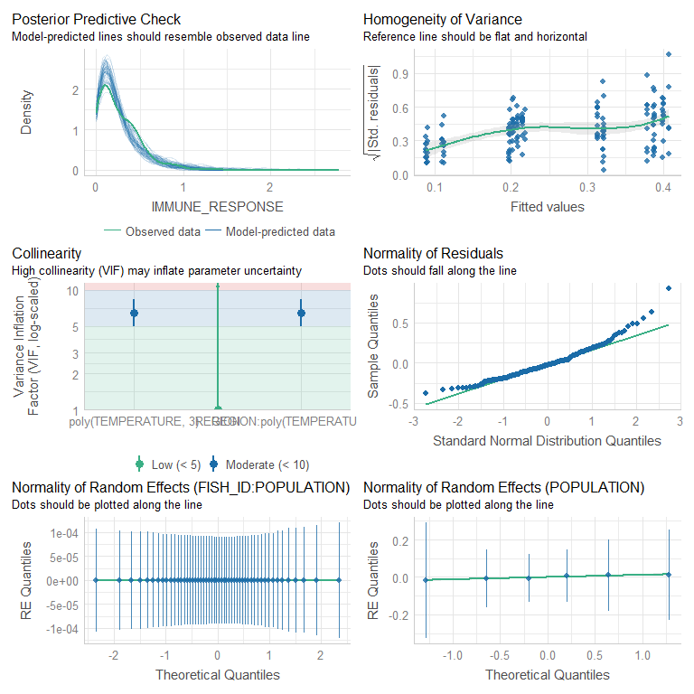<!-- -->

Looks better

#### DHARMa {.tabset .tabset-faded}

##### Gamma distribution


```r
pha.2.p3b.gamma %>% simulateResiduals(plot=TRUE)
```

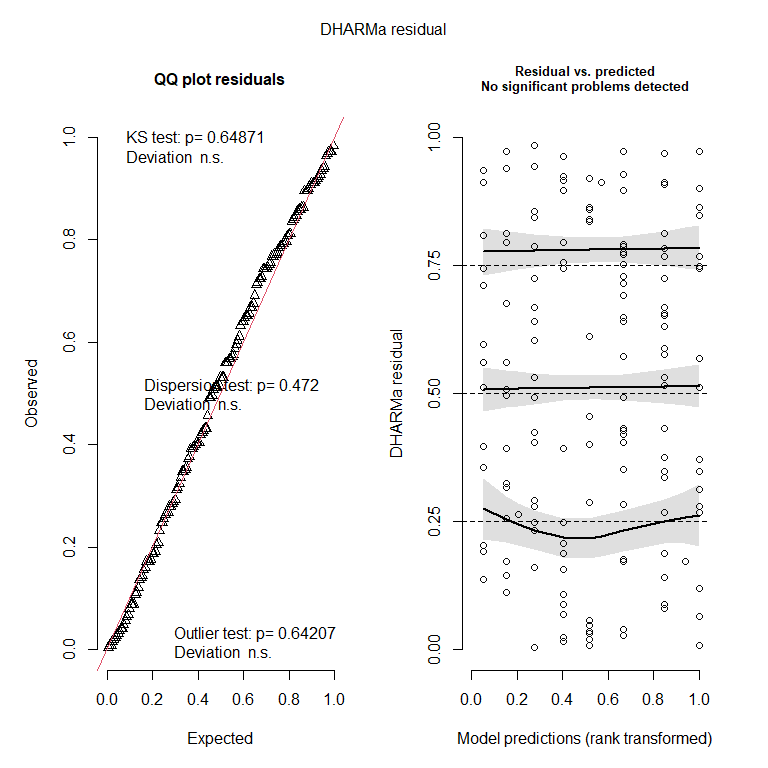<!-- -->

```
## Object of Class DHARMa with simulated residuals based on 250 simulations with refit = FALSE . See ?DHARMa::simulateResiduals for help. 
##  
## Scaled residual values: 0.288 0.176 0.888 0.212 0.16 0.3 0.664 0.008 0.388 0.504 0.6 0.676 0.6 0.888 0.656 0.368 0.012 0.736 0.552 0.86 ...
```

```r
pha.2.p3b.gamma %>% DHARMa::testResiduals(plot=TRUE)
```

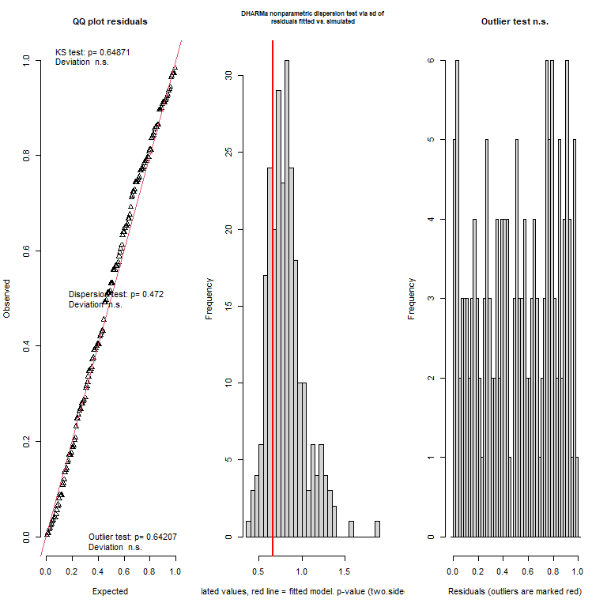<!-- -->

```
## $uniformity
## 
## 	Asymptotic one-sample Kolmogorov-Smirnov test
## 
## data:  simulationOutput$scaledResiduals
## D = 0.059044, p-value = 0.6364
## alternative hypothesis: two-sided
## 
## 
## $dispersion
## 
## 	DHARMa nonparametric dispersion test via sd of residuals fitted vs.
## 	simulated
## 
## data:  simulationOutput
## dispersion = 0.7999, p-value = 0.4
## alternative hypothesis: two.sided
## 
## 
## $outliers
## 
## 	DHARMa outlier test based on exact binomial test with approximate
## 	expectations
## 
## data:  simulationOutput
## outliers at both margin(s) = 0, observations = 159, p-value = 0.6421
## alternative hypothesis: true probability of success is not equal to 0.007968127
## 95 percent confidence interval:
##  0.00000000 0.02293344
## sample estimates:
## frequency of outliers (expected: 0.00796812749003984 ) 
##                                                      0
```

```
## $uniformity
## 
## 	Asymptotic one-sample Kolmogorov-Smirnov test
## 
## data:  simulationOutput$scaledResiduals
## D = 0.059044, p-value = 0.6364
## alternative hypothesis: two-sided
## 
## 
## $dispersion
## 
## 	DHARMa nonparametric dispersion test via sd of residuals fitted vs.
## 	simulated
## 
## data:  simulationOutput
## dispersion = 0.7999, p-value = 0.4
## alternative hypothesis: two.sided
## 
## 
## $outliers
## 
## 	DHARMa outlier test based on exact binomial test with approximate
## 	expectations
## 
## data:  simulationOutput
## outliers at both margin(s) = 0, observations = 159, p-value = 0.6421
## alternative hypothesis: true probability of success is not equal to 0.007968127
## 95 percent confidence interval:
##  0.00000000 0.02293344
## sample estimates:
## frequency of outliers (expected: 0.00796812749003984 ) 
##                                                      0
```
Looks much better!

The **Gamma** does a decent job of modelling our data and we can move forward with it and start to investigate the model.
#### {-}

### {-}

### Partial plots {.tabset .tabset-faded}

#### ggemmeans 

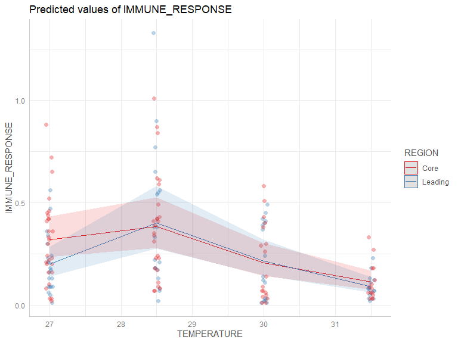<!-- -->

#### plot_model 

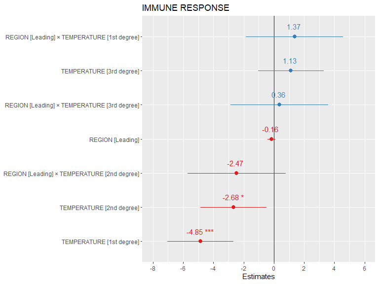<!-- -->

### {-} 

### Model investigation {.tabset .tabset-faded}

#### summary 
<table class=" lightable-paper" style='font-family: "Arial Narrow", arial, helvetica, sans-serif; margin-left: auto; margin-right: auto;'>
 <thead>
  <tr>
   <th style="text-align:left;">   </th>
   <th style="text-align:right;"> Estimate </th>
   <th style="text-align:right;"> StdError </th>
   <th style="text-align:right;"> Zvalue </th>
   <th style="text-align:right;"> Pvalue </th>
  </tr>
 </thead>
<tbody>
  <tr>
   <td style="text-align:left;"> (Intercept) </td>
   <td style="text-align:right;"> -1.3847661 </td>
   <td style="text-align:right;"> 0.0907111 </td>
   <td style="text-align:right;"> -15.2656703 </td>
   <td style="text-align:right;"> 0.0000000 </td>
  </tr>
  <tr>
   <td style="text-align:left;"> REGIONLeading </td>
   <td style="text-align:right;"> -0.1636031 </td>
   <td style="text-align:right;"> 0.1348218 </td>
   <td style="text-align:right;"> -1.2134770 </td>
   <td style="text-align:right;"> 0.2249475 </td>
  </tr>
  <tr>
   <td style="text-align:left;"> poly(TEMPERATURE, 3)1 </td>
   <td style="text-align:right;"> -4.8549609 </td>
   <td style="text-align:right;"> 1.1206614 </td>
   <td style="text-align:right;"> -4.3322281 </td>
   <td style="text-align:right;"> 0.0000148 </td>
  </tr>
  <tr>
   <td style="text-align:left;"> poly(TEMPERATURE, 3)2 </td>
   <td style="text-align:right;"> -2.6825503 </td>
   <td style="text-align:right;"> 1.1140906 </td>
   <td style="text-align:right;"> -2.4078385 </td>
   <td style="text-align:right;"> 0.0160473 </td>
  </tr>
  <tr>
   <td style="text-align:left;"> poly(TEMPERATURE, 3)3 </td>
   <td style="text-align:right;"> 1.1279198 </td>
   <td style="text-align:right;"> 1.1107719 </td>
   <td style="text-align:right;"> 1.0154378 </td>
   <td style="text-align:right;"> 0.3098972 </td>
  </tr>
  <tr>
   <td style="text-align:left;"> REGIONLeading:poly(TEMPERATURE, 3)1 </td>
   <td style="text-align:right;"> 1.3686326 </td>
   <td style="text-align:right;"> 1.6384364 </td>
   <td style="text-align:right;"> 0.8353285 </td>
   <td style="text-align:right;"> 0.4035328 </td>
  </tr>
  <tr>
   <td style="text-align:left;"> REGIONLeading:poly(TEMPERATURE, 3)2 </td>
   <td style="text-align:right;"> -2.4701223 </td>
   <td style="text-align:right;"> 1.6562860 </td>
   <td style="text-align:right;"> -1.4913622 </td>
   <td style="text-align:right;"> 0.1358664 </td>
  </tr>
  <tr>
   <td style="text-align:left;"> REGIONLeading:poly(TEMPERATURE, 3)3 </td>
   <td style="text-align:right;"> 0.3600876 </td>
   <td style="text-align:right;"> 1.6536806 </td>
   <td style="text-align:right;"> 0.2177492 </td>
   <td style="text-align:right;"> 0.8276245 </td>
  </tr>
</tbody>
</table>

#### Anova 
<table class=" lightable-paper" style='font-family: "Arial Narrow", arial, helvetica, sans-serif; margin-left: auto; margin-right: auto;'>
 <thead>
  <tr>
   <th style="text-align:left;">   </th>
   <th style="text-align:right;"> Chisq </th>
   <th style="text-align:right;"> Df </th>
   <th style="text-align:right;"> Pr(&gt;Chisq) </th>
  </tr>
 </thead>
<tbody>
  <tr>
   <td style="text-align:left;"> REGION </td>
   <td style="text-align:right;"> 1.421053 </td>
   <td style="text-align:right;"> 1 </td>
   <td style="text-align:right;"> 0.2332302 </td>
  </tr>
  <tr>
   <td style="text-align:left;"> poly(TEMPERATURE, 3) </td>
   <td style="text-align:right;"> 50.414204 </td>
   <td style="text-align:right;"> 3 </td>
   <td style="text-align:right;"> 0.0000000 </td>
  </tr>
  <tr>
   <td style="text-align:left;"> REGION:poly(TEMPERATURE, 3) </td>
   <td style="text-align:right;"> 2.933305 </td>
   <td style="text-align:right;"> 3 </td>
   <td style="text-align:right;"> 0.4020230 </td>
  </tr>
</tbody>
</table>

#### confint 
<table class=" lightable-paper" style='font-family: "Arial Narrow", arial, helvetica, sans-serif; margin-left: auto; margin-right: auto;'>
 <thead>
  <tr>
   <th style="text-align:left;">   </th>
   <th style="text-align:right;"> 2.5 % </th>
   <th style="text-align:right;"> 97.5 % </th>
   <th style="text-align:right;"> Estimate </th>
  </tr>
 </thead>
<tbody>
  <tr>
   <td style="text-align:left;"> (Intercept) </td>
   <td style="text-align:right;"> -1.5625566 </td>
   <td style="text-align:right;"> -1.2069755 </td>
   <td style="text-align:right;"> -1.3847661 </td>
  </tr>
  <tr>
   <td style="text-align:left;"> REGIONLeading </td>
   <td style="text-align:right;"> -0.4278489 </td>
   <td style="text-align:right;"> 0.1006427 </td>
   <td style="text-align:right;"> -0.1636031 </td>
  </tr>
  <tr>
   <td style="text-align:left;"> poly(TEMPERATURE, 3)1 </td>
   <td style="text-align:right;"> -7.0514170 </td>
   <td style="text-align:right;"> -2.6585049 </td>
   <td style="text-align:right;"> -4.8549609 </td>
  </tr>
  <tr>
   <td style="text-align:left;"> poly(TEMPERATURE, 3)2 </td>
   <td style="text-align:right;"> -4.8661279 </td>
   <td style="text-align:right;"> -0.4989728 </td>
   <td style="text-align:right;"> -2.6825503 </td>
  </tr>
  <tr>
   <td style="text-align:left;"> poly(TEMPERATURE, 3)3 </td>
   <td style="text-align:right;"> -1.0491531 </td>
   <td style="text-align:right;"> 3.3049927 </td>
   <td style="text-align:right;"> 1.1279198 </td>
  </tr>
  <tr>
   <td style="text-align:left;"> REGIONLeading:poly(TEMPERATURE, 3)1 </td>
   <td style="text-align:right;"> -1.8426438 </td>
   <td style="text-align:right;"> 4.5799090 </td>
   <td style="text-align:right;"> 1.3686326 </td>
  </tr>
  <tr>
   <td style="text-align:left;"> REGIONLeading:poly(TEMPERATURE, 3)2 </td>
   <td style="text-align:right;"> -5.7163832 </td>
   <td style="text-align:right;"> 0.7761385 </td>
   <td style="text-align:right;"> -2.4701223 </td>
  </tr>
  <tr>
   <td style="text-align:left;"> REGIONLeading:poly(TEMPERATURE, 3)3 </td>
   <td style="text-align:right;"> -2.8810668 </td>
   <td style="text-align:right;"> 3.6012420 </td>
   <td style="text-align:right;"> 0.3600876 </td>
  </tr>
  <tr>
   <td style="text-align:left;"> Std.Dev.(Intercept)|FISH_ID:POPULATION </td>
   <td style="text-align:right;"> 0.0000000 </td>
   <td style="text-align:right;"> Inf </td>
   <td style="text-align:right;"> 0.0000462 </td>
  </tr>
  <tr>
   <td style="text-align:left;"> Std.Dev.(Intercept)|POPULATION </td>
   <td style="text-align:right;"> 0.0000024 </td>
   <td style="text-align:right;"> 691.9123188 </td>
   <td style="text-align:right;"> 0.0410140 </td>
  </tr>
</tbody>
</table>

#### r-squared
<table class=" lightable-paper" style='font-family: "Arial Narrow", arial, helvetica, sans-serif; margin-left: auto; margin-right: auto;'>
 <thead>
  <tr>
   <th style="text-align:right;"> R2_conditional </th>
   <th style="text-align:right;"> R2_marginal </th>
   <th style="text-align:left;"> optional </th>
  </tr>
 </thead>
<tbody>
  <tr>
   <td style="text-align:right;"> 0.265392 </td>
   <td style="text-align:right;"> 0.2635317 </td>
   <td style="text-align:left;"> FALSE </td>
  </tr>
</tbody>
</table>

Note that the random effects within this model are explaining very little variance, and are largely non-informative. 

### {-} 

### Pairwise comparisons {.tabset .tabset-faded} 

#### emtrends [latitudes]


```r
pha.2.p3b.gamma %>% emtrends(var = "TEMPERATURE", type = "response") %>% pairs(by = "TEMPERATURE") %>% summary(by = NULL, adjust = "tukey", infer=TRUE)
```

<div data-pagedtable="false">
  <script data-pagedtable-source type="application/json">
{"columns":[{"label":[""],"name":["_rn_"],"type":[""],"align":["left"]},{"label":["contrast"],"name":[1],"type":["fct"],"align":["left"]},{"label":["TEMPERATURE"],"name":[2],"type":["dbl"],"align":["right"]},{"label":["estimate"],"name":[3],"type":["dbl"],"align":["right"]},{"label":["SE"],"name":[4],"type":["dbl"],"align":["right"]},{"label":["df"],"name":[5],"type":["dbl"],"align":["right"]},{"label":["asymp.LCL"],"name":[6],"type":["dbl"],"align":["right"]},{"label":["asymp.UCL"],"name":[7],"type":["dbl"],"align":["right"]},{"label":["z.ratio"],"name":[8],"type":["dbl"],"align":["right"]},{"label":["p.value"],"name":[9],"type":["dbl"],"align":["right"]}],"data":[{"1":"Core - Leading","2":"28.93396","3":"-0.04913999","4":"0.2681054","5":"Inf","6":"-0.5746169","7":"0.476337","8":"-0.1832861","9":"0.8545736","_rn_":"1"}],"options":{"columns":{"min":{},"max":[10]},"rows":{"min":[10],"max":[10]},"pages":{}}}
  </script>
</div>
SCROLL TO THE RIGHT -->

The numbers in the left most column in the table just mention that the slopes are assuming mean **MASS_CENTERED** and **RESTING_TIME_SEONDS** values when looking at differences between latitudinal slopes.

#### emmeans [latitudes]

```r
pha.2.p3b.gamma %>% emmeans(pairwise ~ TEMPERATURE*REGION, type = "response") %>% pairs(by = "TEMPERATURE") %>% summary(by = NULL, adjust = "tukey", infer=TRUE)
```

<div data-pagedtable="false">
  <script data-pagedtable-source type="application/json">
{"columns":[{"label":[""],"name":["_rn_"],"type":[""],"align":["left"]},{"label":["contrast"],"name":[1],"type":["fct"],"align":["left"]},{"label":["TEMPERATURE"],"name":[2],"type":["fct"],"align":["left"]},{"label":["ratio"],"name":[3],"type":["dbl"],"align":["right"]},{"label":["SE"],"name":[4],"type":["dbl"],"align":["right"]},{"label":["df"],"name":[5],"type":["dbl"],"align":["right"]},{"label":["asymp.LCL"],"name":[6],"type":["dbl"],"align":["right"]},{"label":["asymp.UCL"],"name":[7],"type":["dbl"],"align":["right"]},{"label":["null"],"name":[8],"type":["dbl"],"align":["right"]},{"label":["z.ratio"],"name":[9],"type":["dbl"],"align":["right"]},{"label":["p.value"],"name":[10],"type":["dbl"],"align":["right"]}],"data":[{"1":"Core / Leading","2":"28.9339622641509","3":"0.9176346","4":"0.1984969","5":"Inf","6":"0.6005418","7":"1.402156","8":"1","9":"-0.3973676","10":"0.6910964","_rn_":"1"}],"options":{"columns":{"min":{},"max":[10]},"rows":{"min":[10],"max":[10]},"pages":{}}}
  </script>
</div>

#### temperature 

```r
pha.2.p3b.gamma %>% emmeans(~ TEMPERATURE*REGION, type = "response")  %>% summary(infer=TRUE)
```

<div data-pagedtable="false">
  <script data-pagedtable-source type="application/json">
{"columns":[{"label":[""],"name":["_rn_"],"type":[""],"align":["left"]},{"label":["TEMPERATURE"],"name":[1],"type":["dbl"],"align":["right"]},{"label":["REGION"],"name":[2],"type":["fct"],"align":["left"]},{"label":["response"],"name":[3],"type":["dbl"],"align":["right"]},{"label":["SE"],"name":[4],"type":["dbl"],"align":["right"]},{"label":["df"],"name":[5],"type":["dbl"],"align":["right"]},{"label":["asymp.LCL"],"name":[6],"type":["dbl"],"align":["right"]},{"label":["asymp.UCL"],"name":[7],"type":["dbl"],"align":["right"]},{"label":["null"],"name":[8],"type":["dbl"],"align":["right"]},{"label":["z.ratio"],"name":[9],"type":["dbl"],"align":["right"]},{"label":["p.value"],"name":[10],"type":["dbl"],"align":["right"]}],"data":[{"1":"28.93396","2":"Core","3":"0.3367694","4":"0.04797364","5":"Inf","6":"0.2547281","7":"0.4452341","8":"1","9":"-7.640139","10":"2.169876e-14","_rn_":"1"},{"1":"28.93396","2":"Leading","3":"0.3669973","4":"0.05954336","5":"Inf","6":"0.2670299","7":"0.5043892","8":"1","9":"-6.178327","10":"6.478437e-10","_rn_":"2"}],"options":{"columns":{"min":{},"max":[10]},"rows":{"min":[10],"max":[10]},"pages":{}}}
  </script>
</div>


#### Means - f(temperature)

```r
pha.2.p3b.gamma %>% update(.~ 1 + REGION* as.factor(TEMPERATURE) + (1|POPULATION/FISH_ID)) %>% 
  emmeans(~REGION*TEMPERATURE, type = "response") %>% summary(infer=TRUE)
```

<div data-pagedtable="false">
  <script data-pagedtable-source type="application/json">
{"columns":[{"label":[""],"name":["_rn_"],"type":[""],"align":["left"]},{"label":["REGION"],"name":[1],"type":["fct"],"align":["left"]},{"label":["TEMPERATURE"],"name":[2],"type":["dbl"],"align":["right"]},{"label":["response"],"name":[3],"type":["dbl"],"align":["right"]},{"label":["SE"],"name":[4],"type":["dbl"],"align":["right"]},{"label":["df"],"name":[5],"type":["dbl"],"align":["right"]},{"label":["asymp.LCL"],"name":[6],"type":["dbl"],"align":["right"]},{"label":["asymp.UCL"],"name":[7],"type":["dbl"],"align":["right"]},{"label":["null"],"name":[8],"type":["dbl"],"align":["right"]},{"label":["z.ratio"],"name":[9],"type":["dbl"],"align":["right"]},{"label":["p.value"],"name":[10],"type":["dbl"],"align":["right"]}],"data":[{"1":"Core","2":"27.0","3":"0.31811370","4":"0.04976138","5":"Inf","6":"0.23411648","7":"0.4322478","8":"1","9":"-7.321952","10":"2.443902e-13","_rn_":"1"},{"1":"Leading","2":"27.0","3":"0.19903012","4":"0.03599538","5":"Inf","6":"0.13962900","7":"0.2837017","8":"1","9":"-8.925982","10":"4.417632e-19","_rn_":"2"},{"1":"Core","2":"28.5","3":"0.38414670","4":"0.06214783","5":"Inf","6":"0.27976181","7":"0.5274797","8":"1","9":"-5.913722","10":"3.344631e-09","_rn_":"3"},{"1":"Leading","2":"28.5","3":"0.40179582","4":"0.07619105","5":"Inf","6":"0.27707365","7":"0.5826605","8":"1","9":"-4.808464","10":"1.520941e-06","_rn_":"4"},{"1":"Core","2":"30.0","3":"0.20691033","4":"0.04012277","5":"Inf","6":"0.14148892","7":"0.3025812","8":"1","9":"-8.124587","10":"4.488865e-16","_rn_":"5"},{"1":"Leading","2":"30.0","3":"0.21593152","4":"0.04348070","5":"Inf","6":"0.14551750","7":"0.3204180","8":"1","9":"-7.612080","10":"2.697202e-14","_rn_":"6"},{"1":"Core","2":"31.5","3":"0.11131630","4":"0.02358177","5":"Inf","6":"0.07349134","7":"0.1686092","8":"1","9":"-10.363153","10":"3.647367e-25","_rn_":"7"},{"1":"Leading","2":"31.5","3":"0.08948455","4":"0.01900812","5":"Inf","6":"0.05901163","7":"0.1356933","8":"1","9":"-11.362929","10":"6.396337e-30","_rn_":"8"}],"options":{"columns":{"min":{},"max":[10]},"rows":{"min":[10],"max":[10]},"pages":{}}}
  </script>
</div>

#### Abs. diff - f(temperature)

```r
pha.2.p3b.gamma %>% update(.~ 1 + REGION* as.factor(TEMPERATURE) + (1|POPULATION/FISH_ID)) %>% 
  emmeans(~REGION*TEMPERATURE, type = "response") %>% pairs(by ="REGION") %>% summary(infer=TRUE)
```

<div data-pagedtable="false">
  <script data-pagedtable-source type="application/json">
{"columns":[{"label":[""],"name":["_rn_"],"type":[""],"align":["left"]},{"label":["contrast"],"name":[1],"type":["fct"],"align":["left"]},{"label":["REGION"],"name":[2],"type":["fct"],"align":["left"]},{"label":["ratio"],"name":[3],"type":["dbl"],"align":["right"]},{"label":["SE"],"name":[4],"type":["dbl"],"align":["right"]},{"label":["df"],"name":[5],"type":["dbl"],"align":["right"]},{"label":["asymp.LCL"],"name":[6],"type":["dbl"],"align":["right"]},{"label":["asymp.UCL"],"name":[7],"type":["dbl"],"align":["right"]},{"label":["null"],"name":[8],"type":["dbl"],"align":["right"]},{"label":["z.ratio"],"name":[9],"type":["dbl"],"align":["right"]},{"label":["p.value"],"name":[10],"type":["dbl"],"align":["right"]}],"data":[{"1":"TEMPERATURE27 / TEMPERATURE28.5","2":"Core","3":"0.8281047","4":"0.1846585","5":"Inf","6":"0.4669737","7":"1.4685140","8":"1","9":"-0.8458506","10":"8.324967e-01","_rn_":"1"},{"1":"TEMPERATURE27 / TEMPERATURE30","2":"Core","3":"1.5374472","4":"0.3805116","5":"Inf","6":"0.8140764","7":"2.9035897","8":"1","9":"1.7379021","10":"3.039604e-01","_rn_":"2"},{"1":"TEMPERATURE27 / TEMPERATURE31.5","2":"Core","3":"2.8577459","4":"0.7462501","5":"Inf","6":"1.4610796","7":"5.5895047","8":"1","9":"4.0210752","10":"3.375427e-04","_rn_":"3"},{"1":"TEMPERATURE28.5 / TEMPERATURE30","2":"Core","3":"1.8565854","4":"0.4640655","5":"Inf","6":"0.9768648","7":"3.5285430","8":"1","9":"2.4753873","10":"6.379280e-02","_rn_":"4"},{"1":"TEMPERATURE28.5 / TEMPERATURE31.5","2":"Core","3":"3.4509474","4":"0.9125589","5":"Inf","6":"1.7494496","7":"6.8073054","8":"1","9":"4.6840944","10":"1.670431e-05","_rn_":"5"},{"1":"TEMPERATURE30 / TEMPERATURE31.5","2":"Core","3":"1.8587604","4":"0.5303305","5":"Inf","6":"0.8930871","7":"3.8685926","8":"1","9":"2.1727275","10":"1.308508e-01","_rn_":"6"},{"1":"TEMPERATURE27 / TEMPERATURE28.5","2":"Leading","3":"0.4953514","4":"0.1295781","5":"Inf","6":"0.2529620","7":"0.9699996","8":"1","9":"-2.6854727","10":"3.642552e-02","_rn_":"7"},{"1":"TEMPERATURE27 / TEMPERATURE30","2":"Leading","3":"0.9217280","4":"0.2452159","5":"Inf","6":"0.4653485","7":"1.8256907","8":"1","9":"-0.3063650","10":"9.900277e-01","_rn_":"8"},{"1":"TEMPERATURE27 / TEMPERATURE31.5","2":"Leading","3":"2.2241843","4":"0.6131252","5":"Inf","6":"1.0954917","7":"4.5157765","8":"1","9":"2.8998826","10":"1.953965e-02","_rn_":"9"},{"1":"TEMPERATURE28.5 / TEMPERATURE30","2":"Leading","3":"1.8607558","4":"0.5146272","5":"Inf","6":"0.9143594","7":"3.7867080","8":"1","9":"2.2453093","10":"1.112159e-01","_rn_":"10"},{"1":"TEMPERATURE28.5 / TEMPERATURE31.5","2":"Leading","3":"4.4901141","4":"1.2750342","5":"Inf","6":"2.1648771","7":"9.3128265","8":"1","9":"5.2889592","10":"7.356377e-07","_rn_":"11"},{"1":"TEMPERATURE30 / TEMPERATURE31.5","2":"Leading","3":"2.4130593","4":"0.6979188","5":"Inf","6":"1.1478210","7":"5.0729647","8":"1","9":"3.0457022","10":"1.242853e-02","_rn_":"12"}],"options":{"columns":{"min":{},"max":[10]},"rows":{"min":[10],"max":[10]},"pages":{}}}
  </script>
</div>

#### effect size [latitudes]

```r
immuno.emm <- pha.2.p3b.gamma %>% emmeans(~REGION*TEMPERATURE)
eff_size(immuno.emm, sigma = sigma(pha.2.p3b.gamma), edf=df.residual(pha.2.p3b.gamma))
```

```
##  contrast                                                              
##  Core TEMPERATURE28.9339622641509 - Leading TEMPERATURE28.9339622641509
##  effect.size    SE  df asymp.LCL asymp.UCL
##       -0.105 0.265 Inf    -0.626     0.415
## 
## sigma used for effect sizes: 0.815 
## Confidence level used: 0.95
```

### {-}

### Summary figure 

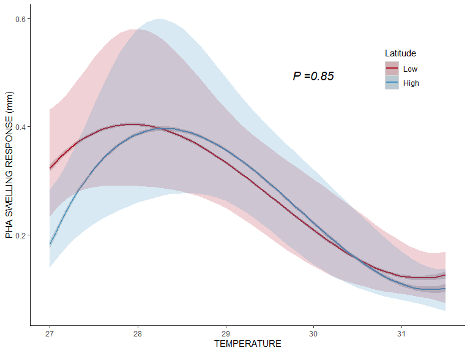<!-- -->

### Conclusion 

* In conclusion while immunocompetence is **significantly** positively correlated with temperature, there is no significant difference in immunocompetence between fish from the low- and high-latitude regions. 


## Hematocrit 

### Scenario 

For initial details on the experiment performed please read the **ReadMe** file. In breif, _Acanthochromis polyacanthus_ from two different regions on the Great Barrier Reef (GBR) were tested for metabolic performance at four different temperatures, 27$^\circ$C, 28.5$^\circ$C, 30$^\circ$C, and 31.5$^\circ$C. Fish used in this study were collected from two different regions, low- (i.e. Cairns) and high-latitude (i.e., Mackay), within each region fish were collected from a total of three different populations. 

Blood samples for hematocrit sampling were collected 2-weeks after fish underwent  respiormetry testing at the final experimental temperature (31.5$^\circ$C). Hematocrit ratios were measured by comparing the amount of packed red blood cells to blood plasma, after blood samples collected via capillary tubes. 


### Read in the data

Before beginning always make sure that you are working in the correct directory 


```r
knitr::opts_knit$set(root.dir=working.dir)
```

Now we can import that data. Replace import data with the PATH to your data file. I have secretly labelled my PATH import.data (i.e. import.data = "PATH TO MY FILE")

#### Load data 


```r
hema <- import.data
```

### Data manipulation 

Before the data can be analysed it is important to clean up the data file. Below a number of adjustments are made, primarily making sure that columns are being treated appropriately as either factors, numeric, or as time, as well as the renaming of some columns.  


```{.r .style}
hema <-  hema %>% 
  mutate(PERC_RBC = as.numeric(PERC_RBC), 
         MASS = as.numeric(MASS),
         MASS_CENTERED = scale(MASS, center = TRUE, scale = FALSE)) %>% 
  drop_na(PERC_RBC)
```

Great! That is everything for data manipulation 

### Exploratory data analysis {.tabset}

#### HEMATOCRIT V LATITUDE


```r
ggplot(hema, aes(y=PERC_RBC, x=REGION)) + 
  geom_boxplot() + 
  theme_classic() 
```

<!-- -->

#### HEMATOCRIT V LATITUDE (distr)

```r
hema %>% ggplot(aes(x=PERC_RBC)) + 
  geom_density() +
  facet_wrap(~REGION)
```

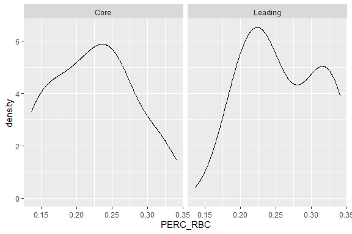<!-- -->

#### {-}

### Fit the model 

The model was fit using the **glm** and later **glmmTMB** package in R. A number of different models were tested to determine which hypothesis and associated variables best predicted resting oxygen consumption. Model fit was examined using AICc, BIC, and r-squared values. Additional model were examined via the validation diagnostics provided by the **performance** and **dHARMA** packages in R. 

#### Fixed factors (linear regression models)

##### model 1

```r
#--- base model ---#
hema.1 <- glm(PERC_RBC ~ REGION, 
                family = gaussian(),  
                data = hema) 
```
###### summary
<table class=" lightable-paper" style='font-family: "Arial Narrow", arial, helvetica, sans-serif; margin-left: auto; margin-right: auto;'>
 <thead>
  <tr>
   <th style="text-align:left;">   </th>
   <th style="text-align:right;"> Estimate </th>
   <th style="text-align:right;"> Std. Error </th>
   <th style="text-align:right;"> t value </th>
   <th style="text-align:right;"> Pr(&gt;|t|) </th>
  </tr>
 </thead>
<tbody>
  <tr>
   <td style="text-align:left;"> (Intercept) </td>
   <td style="text-align:right;"> 0.2236353 </td>
   <td style="text-align:right;"> 0.0121433 </td>
   <td style="text-align:right;"> 18.41628 </td>
   <td style="text-align:right;"> 0.0000000 </td>
  </tr>
  <tr>
   <td style="text-align:left;"> REGIONLeading </td>
   <td style="text-align:right;"> 0.0355744 </td>
   <td style="text-align:right;"> 0.0181554 </td>
   <td style="text-align:right;"> 1.95944 </td>
   <td style="text-align:right;"> 0.0578398 </td>
  </tr>
</tbody>
</table>

##### model 2

```r
#--- experimental rmr equipment hypothesis ---#
hema.2 <- glm(PERC_RBC ~ REGION + MASS_CENTERED, 
                 family = gaussian(), 
                 data = hema)  
```

###### summary
<table class=" lightable-paper" style='font-family: "Arial Narrow", arial, helvetica, sans-serif; margin-left: auto; margin-right: auto;'>
 <thead>
  <tr>
   <th style="text-align:left;">   </th>
   <th style="text-align:right;"> Estimate </th>
   <th style="text-align:right;"> Std. Error </th>
   <th style="text-align:right;"> t value </th>
   <th style="text-align:right;"> Pr(&gt;|t|) </th>
  </tr>
 </thead>
<tbody>
  <tr>
   <td style="text-align:left;"> (Intercept) </td>
   <td style="text-align:right;"> 0.2251300 </td>
   <td style="text-align:right;"> 0.0137982 </td>
   <td style="text-align:right;"> 16.3159093 </td>
   <td style="text-align:right;"> 0.0000000 </td>
  </tr>
  <tr>
   <td style="text-align:left;"> REGIONLeading </td>
   <td style="text-align:right;"> 0.0322334 </td>
   <td style="text-align:right;"> 0.0230904 </td>
   <td style="text-align:right;"> 1.3959651 </td>
   <td style="text-align:right;"> 0.1715176 </td>
  </tr>
  <tr>
   <td style="text-align:left;"> MASS_CENTERED </td>
   <td style="text-align:right;"> -0.0003688 </td>
   <td style="text-align:right;"> 0.0015402 </td>
   <td style="text-align:right;"> -0.2394485 </td>
   <td style="text-align:right;"> 0.8121545 </td>
  </tr>
</tbody>
</table>

##### model comparison table
<table class=" lightable-paper" style='font-family: "Arial Narrow", arial, helvetica, sans-serif; margin-left: auto; margin-right: auto;'>
 <thead>
  <tr>
   <th style="text-align:left;"> model </th>
   <th style="text-align:right;"> df </th>
   <th style="text-align:right;"> AICc </th>
   <th style="text-align:right;"> BIC </th>
   <th style="text-align:right;"> r2 </th>
  </tr>
 </thead>
<tbody>
  <tr>
   <td style="text-align:left;"> hema.1 </td>
   <td style="text-align:right;"> 3 </td>
   <td style="text-align:right;"> -107.0515 </td>
   <td style="text-align:right;"> -102.84462 </td>
   <td style="text-align:right;"> 0.0940123 </td>
  </tr>
  <tr>
   <td style="text-align:left;"> hema.2 </td>
   <td style="text-align:right;"> 4 </td>
   <td style="text-align:right;"> -104.6075 </td>
   <td style="text-align:right;"> -99.26924 </td>
   <td style="text-align:right;"> 0.0930529 </td>
  </tr>
</tbody>
</table>

There is little difference between the two initial models, however, the model that does **not** include **MASS_CENTERED** prefers better via the model comparisons scores, therefore, we will move forward with the first and most simple model. 

#### Random factors 

Fish were only sampled once, therefore, there is no need to include individual as a random factor. However, we will test how the inclusion of **POPULATION** influences the model.  

##### random factor models


```r
hema.1 <- glmmTMB(PERC_RBC ~ REGION, 
                   family = gaussian(), 
                   REML = TRUE, 
                   data = hema) 

hema.1b <- glmmTMB(PERC_RBC ~ REGION + (1|POPULATION), 
                    family = gaussian(), 
                    REML = TRUE, 
                    data = hema) 

hema.1c <- glmmTMB(PERC_RBC ~ REGION + (REGION|POPULATION), 
                    family = gaussian(), 
                    REML = TRUE, 
                    data = hema) # convergence problem
```

```
## Warning in finalizeTMB(TMBStruc, obj, fit, h, data.tmb.old): Model convergence
## problem; singular convergence (7). See vignette('troubleshooting'),
## help('diagnose')
```

###### random factor model comparisons 

<table class=" lightable-paper" style='font-family: "Arial Narrow", arial, helvetica, sans-serif; margin-left: auto; margin-right: auto;'>
 <thead>
  <tr>
   <th style="text-align:left;"> model </th>
   <th style="text-align:right;"> df </th>
   <th style="text-align:right;"> AICc </th>
   <th style="text-align:right;"> BIC </th>
   <th style="text-align:right;"> r2m </th>
   <th style="text-align:right;"> r2c </th>
  </tr>
 </thead>
<tbody>
  <tr>
   <td style="text-align:left;"> hema.1 </td>
   <td style="text-align:right;"> 3 </td>
   <td style="text-align:right;"> -93.24011 </td>
   <td style="text-align:right;"> -89.03324 </td>
   <td style="text-align:right;"> 0.0940123 </td>
   <td style="text-align:right;"> 0.0940123 </td>
  </tr>
  <tr>
   <td style="text-align:left;"> hema.1b </td>
   <td style="text-align:right;"> 4 </td>
   <td style="text-align:right;"> -90.73388 </td>
   <td style="text-align:right;"> -85.39565 </td>
   <td style="text-align:right;"> 0.0940123 </td>
   <td style="text-align:right;"> 0.0940123 </td>
  </tr>
  <tr>
   <td style="text-align:left;"> hema.1c </td>
   <td style="text-align:right;"> 6 </td>
   <td style="text-align:right;"> -85.58393 </td>
   <td style="text-align:right;"> -78.46809 </td>
   <td style="text-align:right;"> 0.0958933 </td>
   <td style="text-align:right;"> 0.1526837 </td>
  </tr>
</tbody>
</table>

The inclusion of random effects does help explain additional variation and therefore will not be included in the model. Note the final model will be run using **glm** and not **glmmmTMB** because we are not using a mixed model. 


### Model validation {.tabset .tabset-faded}


#### performance {.tabset .tabset-faded}

### hema.1
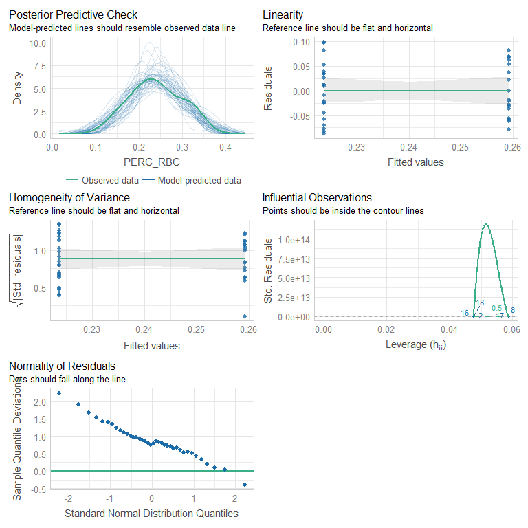<!-- -->

#### DHARMa residuals {.tabset .tabset-faded}

##### hema.1 

```r
hema.1 %>% simulateResiduals(plot=TRUE)
```

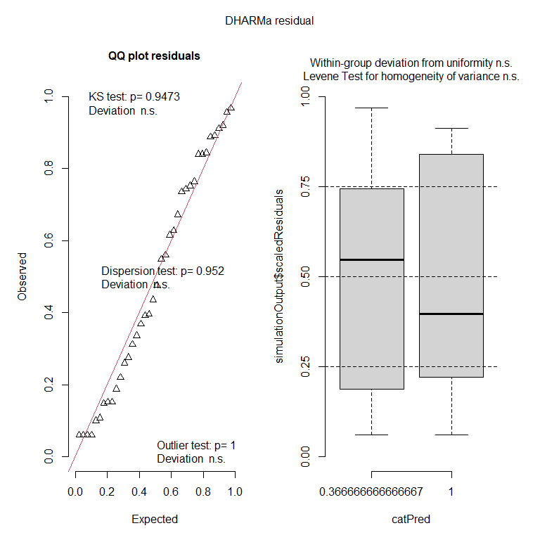<!-- -->

```
## Object of Class DHARMa with simulated residuals based on 250 simulations with refit = FALSE . See ?DHARMa::simulateResiduals for help. 
##  
## Scaled residual values: 0.892 0.956 0.616 0.744 0.06 0.548 0.1 0.06 0.108 0.148 0.188 0.06 0.628 0.392 0.396 0.06 0.912 0.968 0.84 0.276 ...
```

```r
hema.1 %>% DHARMa::testResiduals(plot=TRUE)
```

<!-- -->

```
## $uniformity
## 
## 	Asymptotic one-sample Kolmogorov-Smirnov test
## 
## data:  simulationOutput$scaledResiduals
## D = 0.084842, p-value = 0.9473
## alternative hypothesis: two-sided
## 
## 
## $dispersion
## 
## 	DHARMa nonparametric dispersion test via sd of residuals fitted vs.
## 	simulated
## 
## data:  simulationOutput
## dispersion = 0.97134, p-value = 0.952
## alternative hypothesis: two.sided
## 
## 
## $outliers
## 
## 	DHARMa outlier test based on exact binomial test with approximate
## 	expectations
## 
## data:  simulationOutput
## outliers at both margin(s) = 0, observations = 38, p-value = 1
## alternative hypothesis: true probability of success is not equal to 0.007968127
## 95 percent confidence interval:
##  0.00000000 0.09251276
## sample estimates:
## frequency of outliers (expected: 0.00796812749003984 ) 
##                                                      0
```

```
## $uniformity
## 
## 	Asymptotic one-sample Kolmogorov-Smirnov test
## 
## data:  simulationOutput$scaledResiduals
## D = 0.084842, p-value = 0.9473
## alternative hypothesis: two-sided
## 
## 
## $dispersion
## 
## 	DHARMa nonparametric dispersion test via sd of residuals fitted vs.
## 	simulated
## 
## data:  simulationOutput
## dispersion = 0.97134, p-value = 0.952
## alternative hypothesis: two.sided
## 
## 
## $outliers
## 
## 	DHARMa outlier test based on exact binomial test with approximate
## 	expectations
## 
## data:  simulationOutput
## outliers at both margin(s) = 0, observations = 38, p-value = 1
## alternative hypothesis: true probability of success is not equal to 0.007968127
## 95 percent confidence interval:
##  0.00000000 0.09251276
## sample estimates:
## frequency of outliers (expected: 0.00796812749003984 ) 
##                                                      0
```

#### {-}

### {-}

The basic looks good and passes the validation checks. 

### Partial plots {.tabset .tabset-faded}

#### ggemmeans 

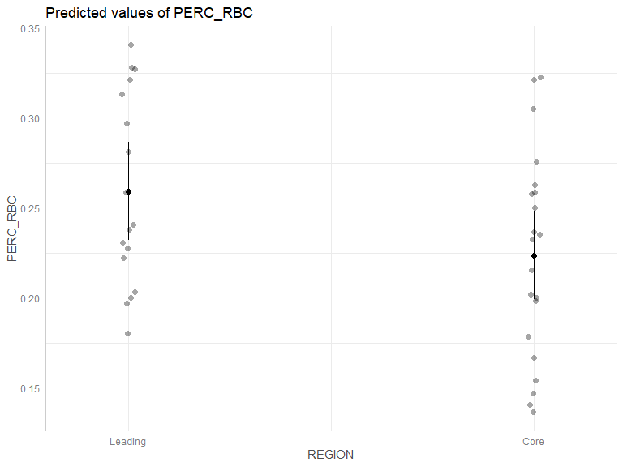<!-- -->

#### plot_model 

<!-- -->

### {-} 

### Model investigation {.tabset .tabset-faded}

#### summary 
<table class=" lightable-paper" style='font-family: "Arial Narrow", arial, helvetica, sans-serif; margin-left: auto; margin-right: auto;'>
 <thead>
  <tr>
   <th style="text-align:left;">   </th>
   <th style="text-align:right;"> Estimate </th>
   <th style="text-align:right;"> Std. Error </th>
   <th style="text-align:right;"> t value </th>
   <th style="text-align:right;"> Pr(&gt;|t|) </th>
  </tr>
 </thead>
<tbody>
  <tr>
   <td style="text-align:left;"> (Intercept) </td>
   <td style="text-align:right;"> 0.2236353 </td>
   <td style="text-align:right;"> 0.0121433 </td>
   <td style="text-align:right;"> 18.41628 </td>
   <td style="text-align:right;"> 0.0000000 </td>
  </tr>
  <tr>
   <td style="text-align:left;"> REGIONLeading </td>
   <td style="text-align:right;"> 0.0355744 </td>
   <td style="text-align:right;"> 0.0181554 </td>
   <td style="text-align:right;"> 1.95944 </td>
   <td style="text-align:right;"> 0.0578398 </td>
  </tr>
</tbody>
</table>

#### Anova 
<table class=" lightable-paper" style='font-family: "Arial Narrow", arial, helvetica, sans-serif; margin-left: auto; margin-right: auto;'>
 <thead>
  <tr>
   <th style="text-align:left;">   </th>
   <th style="text-align:right;"> LR Chisq </th>
   <th style="text-align:right;"> Df </th>
   <th style="text-align:right;"> Pr(&gt;Chisq) </th>
  </tr>
 </thead>
<tbody>
  <tr>
   <td style="text-align:left;"> REGION </td>
   <td style="text-align:right;"> 3.839405 </td>
   <td style="text-align:right;"> 1 </td>
   <td style="text-align:right;"> 0.0500613 </td>
  </tr>
</tbody>
</table>

#### confint 

```
## Waiting for profiling to be done...
```

<table class=" lightable-paper" style='font-family: "Arial Narrow", arial, helvetica, sans-serif; margin-left: auto; margin-right: auto;'>
 <thead>
  <tr>
   <th style="text-align:left;">   </th>
   <th style="text-align:right;"> 2.5 % </th>
   <th style="text-align:right;"> 97.5 % </th>
  </tr>
 </thead>
<tbody>
  <tr>
   <td style="text-align:left;"> (Intercept) </td>
   <td style="text-align:right;"> 0.1998348 </td>
   <td style="text-align:right;"> 0.2474358 </td>
  </tr>
  <tr>
   <td style="text-align:left;"> REGIONLeading </td>
   <td style="text-align:right;"> -0.0000095 </td>
   <td style="text-align:right;"> 0.0711583 </td>
  </tr>
</tbody>
</table>

#### r-squared
<table class=" lightable-paper" style='font-family: "Arial Narrow", arial, helvetica, sans-serif; margin-left: auto; margin-right: auto;'>
 <thead>
  <tr>
   <th style="text-align:left;">   </th>
   <th style="text-align:right;"> R2 </th>
  </tr>
 </thead>
<tbody>
  <tr>
   <td style="text-align:left;"> R2 </td>
   <td style="text-align:right;"> 0.0963721 </td>
  </tr>
</tbody>
</table>

### {-} 

### Pairwise comparisons {.tabset .tabset-faded} 

#### emmeans [latitudes]

```r
hema.1 %>% emmeans(pairwise ~ REGION, type = "response")
```

```
## $emmeans
##  REGION  emmean     SE df lower.CL upper.CL
##  Core     0.224 0.0121 36    0.199    0.248
##  Leading  0.259 0.0135 36    0.232    0.287
## 
## Confidence level used: 0.95 
## 
## $contrasts
##  contrast       estimate     SE df t.ratio p.value
##  Core - Leading  -0.0356 0.0182 36  -1.959  0.0578
```

#### effect size [latitudes]

```r
hema.emm <- emmeans(hema.1, "REGION")
eff_size(hema.emm, sigma = sigma(hema.1), edf=df.residual(hema.1))
```

```
##  contrast       effect.size    SE df lower.CL upper.CL
##  Core - Leading      -0.639 0.335 36    -1.32   0.0398
## 
## sigma used for effect sizes: 0.05565 
## Confidence level used: 0.95
```

### {-}

### Summary figure 

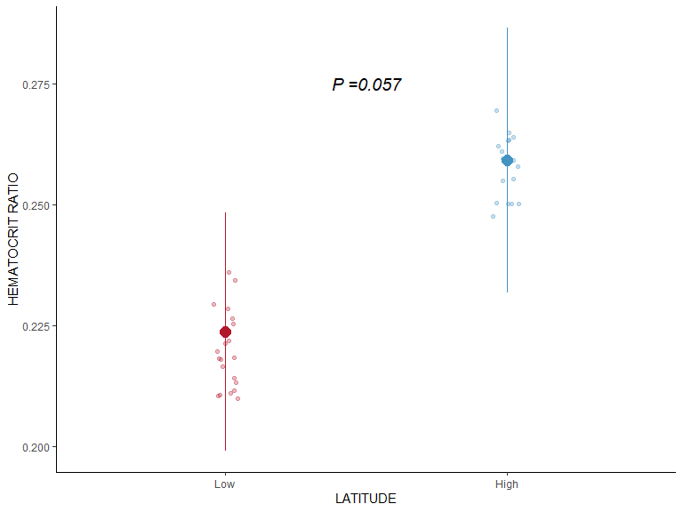<!-- -->

### Conclusion 

* In conclusion there is no significant difference in hematocrit ratios between _A. polyacanthus_ from low- and high-latitude at 31.5$^\circ$C. 


# General summary 

**MAXIMUM METABOLIC RATE** and **ABSOLUTE AEROBIC SCOPE** showed <span style="color:red">**significant differences**</span> within the temperature response curve between fish collected from the low latitude region of the Great Barrier Reef and the sampled high-latitude (Mackay region) of the Great Barrier Reef. However **no significant difference** was seen in **RESTING METABOLIC RATE**. All oxygen consumption metrics showed <span style="color:red">**significant positive relationships**</span> with temperature. 

Similarly, the two enzymes that were analysed in this study showed <span style="color:red">**significant positive relationships**</span> with temperature, however **no significant** differences between low- and high-latitude regions. Immunocompetence displayed a hill shape relationship with temperature, represented via a third order polynomial model. Immunocompetence was also <span style="color:red">**significantly**</span> related to temperature but, once again **no significant differences** were observed between low- and high-latitude regions. 

**No significant** differences were observed between low- and high-latitude regions in respect to hematocrit ratios, however, the difference between regions was marginally significant, _pvalue_ =0.057, and deserves frther investigation in future research. 

Further analysis of results can be see within the paper titled "[INSERT TITLE HERE]", doi: XXXX

# Figures

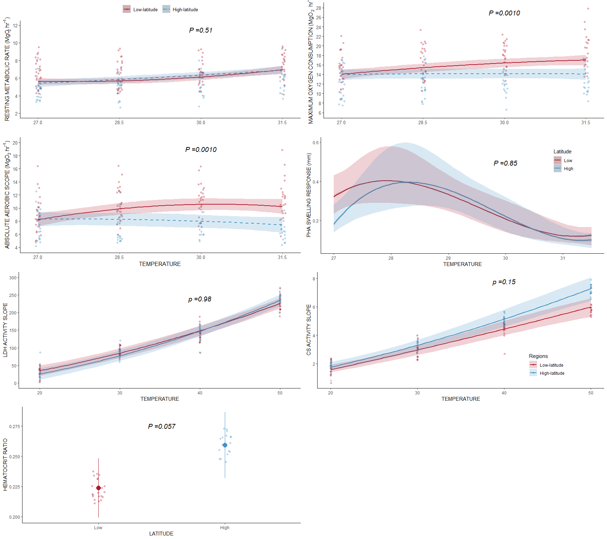<!-- -->

# Figure for manuscript {.tabset .tabset-pills}

## Figure 2


```r
rmr.g2 <- ggplot(rmr.emm.df, aes(y=emmean, x=TEMPERATURE, color=REGION, linetype=REGION))+
  geom_jitter(data=rmr.obs, aes(y=Fit, color=REGION), width=0.05, alpha = 0.3) +
  stat_smooth(method = "lm", 
              formula =y ~ poly(x, 2, raw=TRUE)) + 
  geom_ribbon(aes(x=TEMPERATURE, ymin= lower.CL, ymax= upper.CL, fill = REGION), 
              alpha = 0.2, color=NA)+ 
  scale_x_continuous(limits = c(26.9, 31.6), breaks = seq(27, 31.5, by = 1.5))+ 
  scale_y_continuous(limits = c(2,12), breaks = seq(2, 12, by = 2)) +
  theme_classic() + ylab(expression("RESTING METABOLIC RATE (MgO "[2]* " hr"^{-1} * ")")) + xlab("")+
  scale_linetype_manual(values = c("solid", "dashed"), labels = c("Low-latitude","High-latitude")) +
  scale_color_manual(values=c("#B2182B", "#4393C3"), labels = c("Low-latitude","High-latitude")) +
  scale_fill_manual(values=c("#B2182B", "#4393C3"), labels = c("Low-latitude","High-latitude")) + 
  theme(legend.position = "top", 
        legend.text = element_text(size = 10), 
        legend.title = element_blank(), 
        axis.title = element_text(size =12), 
        axis.text = element_text(size=10)) + 
  annotate("text", x=30, y= 11.5, label="P =0.51", fontface="italic", size=5)

mmr.g2 <- ggplot(mmr.emm.df, aes(y=emmean, x=TEMPERATURE, color=REGION, linetype=REGION))+
  geom_jitter(data=mmr.obs, aes(y=Fit, color=REGION), width=0.05, alpha = 0.3) + 
  stat_smooth(method = "lm", 
              formula =y ~ poly(x, 2, raw=TRUE)) + 
  geom_ribbon(aes(x=TEMPERATURE, ymin= lower.CL, ymax= upper.CL, fill = REGION), 
              alpha = 0.2, color=NA) +
  scale_x_continuous(limits = c(26.9, 31.6), breaks = seq(27, 31.5, by = 1.5))+ 
  scale_y_continuous(limits = c(6,28), breaks = seq(6, 28, by = 2)) +
  theme_classic() + ylab(expression("MAXIMUM OXYGEN CONSUMPTION (MgO   " [2]* "  hr"^{-1} * ")"))  + xlab("")+
  scale_linetype_manual(values = c("solid", "dashed"), labels = c("Low-latitude","High-latitude")) +
  scale_color_manual(values=c("#B2182B", "#4393C3"), labels = c("Low-latitude","High-latitude")) + 
  scale_fill_manual(values=c("#B2182B", "#4393C3"), labels = c("Low-latitude","High-latitude")) + 
  theme(legend.position = 'none', 
        legend.text = element_text(size = 10), 
        legend.title = element_blank(), 
        axis.title = element_text(size =12), 
        axis.text = element_text(size=10))+
  annotate("text", x=30, y= 27, label="P =0.0010", fontface="italic", size=5) 

nas.g2 <- ggplot(nas.emm.df, aes(y=emmean, x=TEMPERATURE, color=REGION, linetype=REGION)) + 
  geom_jitter(data=nas.obs, aes(y=Fit, color=REGION), width=0.05, alpha = 0.3) +
  stat_smooth(method = "lm", 
              formula =y ~ poly(x, 2, raw=TRUE)) + 
  geom_ribbon(aes(x=TEMPERATURE, ymin= lower.CL, ymax= upper.CL, fill = REGION), 
              alpha = 0.2, color=NA)+
  scale_y_continuous(limits = c(4,20), breaks = seq(4, 20, by = 2)) + 
  scale_x_continuous(limits = c(26.9, 31.6), breaks = seq(27, 31.5, by = 1.5))+
  theme_classic() + ylab(expression("ABSOLUTE AEROBIC SCOPE (MgO "[2]* " hr"^{-1} * ")")) +
  scale_linetype_manual(values = c("solid", "dashed"), labels = c("Low-latitude","High-latitude")) +
  scale_color_manual(values=c("#B2182B", "#4393C3"), labels = c("Low-latitude","High-latitude")) +
  scale_fill_manual(values=c("#B2182B", "#4393C3"), labels = c("Low-latitude","High-latitude")) + 
  theme(legend.position = "none", 
        legend.text = element_text(size = 10), 
        legend.title = element_blank(), 
        axis.title = element_text(size =12), 
        axis.text = element_text(size=10)) + 
  annotate("text", x=30, y= 19, label="P =0.0010", fontface="italic", size=5)
```
  

```r
fig2 <- ggarrange(rmr.g2, mmr.g2, nas.g2, 
          nrow = 3, 
          ncol=1, 
          align = "v",
          labels = c("A","B","C"),
          common.legend = TRUE); fig2
```

```
## Warning: Removed 4 rows containing missing values (`geom_point()`).
```


```r
ggsave("C:/Users/jc527762/OneDrive - James Cook University/PhD dissertation/Data/Chapter1_LocalAdaptation/figures/Figure2.pdf", fig2, device="pdf", width=6.6, height = 19.86, units = "in", dpi=1200)
```

## Figure 3


```r
pha.emm <- emmeans(pha.2.p3b.gamma, ~ TEMPERATURE*REGION, 
               at = list(TEMPERATURE = seq(from=27, to = 31.5, by=.1)), 
               type='response')
pha.emm.df=as.data.frame(pha.emm)

pha.obs <-  pha2 %>% 
  mutate(Pred=predict(pha.2.p3b.gamma, re.form=NA),
         Resid = residuals(pha.2.p3b.gamma, type='response'),
         Fit = Pred + Resid)

pha.g2 <- ggplot(pha.emm.df, aes(y=response, x=TEMPERATURE, color = REGION, linetype=REGION)) + 
  stat_smooth(method = "lm", se=FALSE,
              formula =y ~ poly(x, 3, raw=TRUE)) +  
  geom_ribbon(aes(x=TEMPERATURE, ymin= asymp.LCL, ymax= asymp.UCL, fill = REGION), 
              alpha = 0.2, color=NA) + 
  #scale_y_continuous(limits = c(0,0.9), breaks = seq(0, 0.9, by =0.15)) + 
  theme_classic() + ylab("PHA RESPONSE (mm)") + 
  scale_linetype_manual(values = c("solid", "dashed"), labels = c("Low-latitude","High-latitude")) +
  scale_color_manual(values=c("#B2182B", "#4393C3"), labels = c("Low-latitude","High-latitude")) + 
  scale_fill_manual(values=c("#B2182B", "#4393C3"), labels = c("Low-latitude","High-latitude")) +
  theme(legend.position = c(0.855,0.8), 
        legend.text = element_text(size = 10), 
        legend.title = element_blank(), 
        axis.title = element_text(size =12), 
        axis.text = element_text(size=10)) + 
  annotate("text", x=30, y=0.495, fontface="italic", size=5, label="P =0.85")
```


```r
pha.g2
```


```r
ggsave("C:/Users/jc527762/OneDrive - James Cook University/PhD dissertation/Data/Chapter1_LocalAdaptation/figures/Figure3.pdf", pha.g2, device="pdf", width=6.6, height = 5, units = "in", dpi=1200)
```

## Figure 4


```r
#---ldh---#
ldh.emm <- emmeans(ldh.model.1.p2a, ~ temperature*REGION, 
                   at = list(temperature = seq(from=20, to = 50, by=1)))
ldh.emm.df=as.data.frame(ldh.emm)

ldh.obs <- ldh.data %>% 
  mutate(Pred = predict(ldh.model.1.p2a, re.form=NA), 
         Resid = residuals(ldh.model.1.p2a, type = 'response'), 
         Fit = Pred - Resid)

cldh2 <- ggplot(ldh.emm.df, aes(y=emmean, x=temperature, color=REGION, fill=REGION, linetype=REGION)) + 
  stat_smooth(method = "lm", se=FALSE, 
              formula =y ~ poly(x, 3, raw=TRUE)) + 
  geom_ribbon(aes(x=temperature, ymin= lower.CL, ymax= upper.CL, fill = REGION), 
              alpha = 0.2, color=NA) +
  geom_jitter(data=ldh.obs, aes(y=Fit, color=REGION), width=0.05, alpha = 0.3) +
  scale_y_continuous(limits = c(0,250), breaks = seq(0, 250, by =50)) + 
  theme_classic() + ylab(expression("LDH ACTIVITY (U mg "^{-1}*" tissue)")) + xlab("TEMPERATURE") +
  scale_linetype_manual(values = c("solid", "dashed"), labels = c("Low-latitude","High-latitude")) + 
  scale_color_manual(values=c("#B2182B", "#4393C3"), labels = c("Low-latitude","High-latitude")) +
  scale_fill_manual(values=c("#B2182B", "#4393C3"), labels = c("Low-latitude","High-latitude")) +
  theme(legend.position = c(0.80,0.2), 
        legend.text = element_text(size = 10), 
        legend.title = element_blank(), 
        axis.title = element_text(size =12), 
        axis.text = element_text(size=10)) + 
  annotate("text", x=40, y=240, label="p =0.98", fontface = 'italic', size = 5)

#--- cs ---#
cs.emm <- emmeans(cs.model.1a.log.p2, ~ TEMPERATURE*REGION, type='response',
                   at = list(TEMPERATURE = seq(from=20, to = 50, by=1)), 
                  )
cs.emm.df=as.data.frame(cs.emm)

cs.obs <- CS.data %>% 
  mutate(Pred = predict(cs.model.1a.log.p2, re.form=NA, type= 'response'), 
         Resid = residuals(cs.model.1a.log.p2, type = 'response'), 
         Fit = Pred - Resid)

cs.plot2 <- ggplot(cs.emm.df, aes(y=response, x=TEMPERATURE, color=REGION, fill=REGION, linetype=REGION)) + 
  stat_smooth(method = "lm", se=FALSE, 
              formula =y ~ poly(x, 2, raw=TRUE)) +  
  geom_jitter(data=cs.obs, aes(y=Fit, color=REGION), width=0.05, alpha = 0.3) +
  geom_ribbon(aes(x=TEMPERATURE, ymin= lower.CL, ymax= upper.CL, fill = REGION), 
              alpha = 0.2, color=NA) +
  scale_y_continuous(limits = c(0,10), breaks = seq(0, 10, by =2)) + 
  theme_classic() + ylab(expression("CS ACTIVITY (U mg "^{-1}*" tissue)")) + xlab("TEMPERATURE") +
  scale_linetype_manual(values = c("solid", "dashed"), labels = c("Low-latitude","High-latitude")) +
  scale_color_manual(values=c("#B2182B", "#4393C3"), labels = c("Low-latitude","High-latitude")) +
  scale_fill_manual(values=c("#B2182B", "#4393C3"), labels = c("Low-latitude","High-latitude"))+
  theme(legend.position = 'none', 
        legend.text = element_text(size = 10), 
        legend.title = element_blank(), 
        axis.title = element_text(size =12), 
        axis.text = element_text(size=10))+
  annotate("text", x=40, y=9.8, label="p =0.15", fontface = 'italic', size = 5)

#--- ldh:cs ratio ---#
ldh.cs.emm <- emmeans(ldh.cs.model.1a, ~ temperature*REGION, type='response',
                   at = list(temperature = seq(from=20, to = 50, by=1)), 
                  )
ldh.cs.emm.df=as.data.frame(ldh.cs.emm)

ldh.cs.obs <- ldh.cs.data %>% 
  mutate(Pred = predict(ldh.cs.model.1a, re.form=NA, type= 'response'), 
         Resid = residuals(ldh.cs.model.1a, type = 'response'), 
         Fit = Pred - Resid)

ldh.cs.plot2 <- ggplot(ldh.cs.emm.df, aes(y=emmean, x=temperature, color=REGION, fill=REGION, linetype=REGION)) + 
  stat_smooth(method = "lm", se=FALSE, 
              formula =y ~ poly(x, 2, raw=TRUE)) +  
  geom_jitter(data=ldh.cs.obs, aes(y=Fit, color=REGION), width=0.05, alpha = 0.3) +
  geom_ribbon(aes(x=temperature, ymin= lower.CL, ymax= upper.CL, fill = REGION), 
              alpha = 0.2, color=NA) +
  scale_y_continuous(limits = c(0,50), breaks = seq(0, 50, by =10)) + 
  theme_classic() + ylab("LDH:CS RATIO") + xlab("TEMPERATURE") +
  scale_linetype_manual(values = c("solid", "dashed"), labels = c("Low-latitude","High-latitude")) +
  scale_color_manual(values=c("#B2182B", "#4393C3"), labels = c("Low-latitude","High-latitude")) +
  scale_fill_manual(values=c("#B2182B", "#4393C3"), labels = c("Low-latitude","High-latitude"))+
  theme(legend.position = 'none', 
        legend.text = element_text(size = 10), 
        legend.title = element_blank(), 
        axis.title = element_text(size =12), 
        axis.text = element_text(size=10))+
  annotate("text", x=40, y=48, label="p =0.91", fontface = 'italic', size = 5)
```


```r
fig4 <- ggarrange(cldh2, cs.plot2, ldh.cs.plot2, 
          nrow = 3, 
          ncol=1, 
          align = "v",
          labels = c("A","B","C"),
          common.legend = TRUE)

fig4
```


```r
ggsave("C:/Users/jc527762/OneDrive - James Cook University/PhD dissertation/Data/Chapter1_LocalAdaptation/figures/Figure4.pdf", fig4, device="pdf", width=6.6, height = 19.86, units = "in", dpi=1200)
```

# Supplemental figures for manuscript {.tabset .tabset-pills}

## Supplemental figure 4

```r
hema.newdata <-  hema.1 %>% ggemmeans(~REGION) %>% 
  as.data.frame() %>% 
  dplyr::rename(REGION = x)

obs <- hema %>% 
  mutate(Pred = predict(hema.1, re.form=NA), 
         Resid = residuals(hema.1, type = "response"), 
         Fit = Pred + Resid)

hema.plot <- ggplot(hema.newdata, aes(y=predicted, x=REGION, color=REGION, linetype=REGION))  + 
  geom_jitter(data=obs, aes(y=Pred, x=REGION, color =REGION), 
              width = 0.05, alpha=0.3)+
  geom_pointrange(aes(ymin=conf.low, 
                      ymax=conf.high), 
                  shape = 19, 
                  size = 1, 
                  position = position_dodge(0.2)) + 
  scale_linetype_manual(values = c("solid", "dashed"), labels = c("Low-latitude","High-latitude")) +
  scale_color_manual(values=c("#B2182B", "#4393C3"), labels = c("Low-latitude","High-latitude")) +
  ylab("HEMATOCRIT RATIO") +
  scale_x_discrete(name = "", 
                   labels = c("Low-latitude","High-latitude"))+
  theme_classic() + 
  theme(legend.position = 'top', 
        legend.text = element_text(size = 10), 
        legend.title = element_blank(), 
        axis.title = element_text(size =12), 
        axis.text = element_text(size=10))  + 
  annotate("text", x=1.5, y=0.275, fontface="italic", size=5, label="P =0.057")
```


```r
hema.plot
```


```r
ggsave("C:/Users/jc527762/OneDrive - James Cook University/PhD dissertation/Data/Chapter1_LocalAdaptation/supplemental_figures/Supplemental_figure4.pdf", hema.plot, device="pdf", width=6.6, height = 5, units = "in", dpi=1200)
```

## Supplemental figure 3

```r
library(ggridges)
mass.distr <- resp4 %>% distinct(FISH_ID, .keep_all = TRUE) %>% 
  mutate(CHAMBER_RATIO = 1.5/DRY_WEIGHT) %>%
  ggplot(aes(x=CHAMBER_RATIO, y=REGION, fill=REGION)) + 
  scale_fill_manual(values=c("#B2182B", "#4393C3"), labels = c("Low-latitude","High-latitude")) +
  ylab("")+ scale_x_continuous(limits = c(20,150), breaks = seq(20, 150, by =20)) + 
  geom_density_ridges(scale = 2, jittered_points=TRUE, position = position_points_jitter(height = 0),
                      point_shape = '|', point_size = 3, point_alpha = 1, alpha = 0.7) + 
  theme_classic() + 
  theme(axis.title.y=element_blank(),
        axis.text.y=element_blank(), 
        axis.ticks.y=element_blank())
```


```r
mass.distr
```

```
## Picking joint bandwidth of 5.99
```


```r
ggsave("C:/Users/jc527762/OneDrive - James Cook University/PhD dissertation/Data/Chapter1_LocalAdaptation/supplemental_figures/Supplemental_figure3.pdf",mass.distr, device="pdf", width=6.6, height = 5, units = "in", dpi=1200)
```

```
## Picking joint bandwidth of 5.99
```
