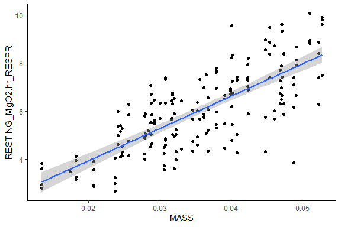
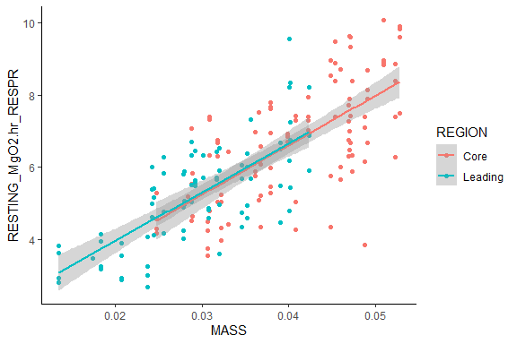
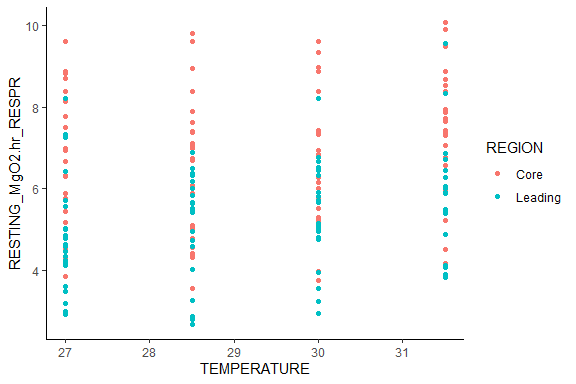

---
title: "Resting Oxygen Consumption"
author: "Elliott Schmidt"
date: "05 December, 2023"
output:
  html_document:
    keep_md: yes
    code_folding: show
    collapse: no
    df_print: paged
    fig_caption: yes
    fig_height: 4
    fig_width: 6
    highlight: monochrome
    theme: flatly
    latex_engine: xelatex
    toc: yes
    toc_float: yes
    css: styles.css
  pdf_document:
    df_print: default
    fig_caption: yes
    fig_height: 4
    fig_width: 4
    highlight: tango
    latex_engine: xelatex
    number_sections: yes
    toc_depth: 2
documentclass: article
fontsize: 12pt
mainfont: Arial
mathfont: LiberationMono
classoption: a4paper
--- 

# Scenario 

For initial details on the experiment performed please read the **ReadMe** file. In breif, _Acanthochromis polyacanthus_ from two different regions on the Great Barrier Reef (GBR) were tested for metabolic performance at four different temperatures, 27$^\circ$C, 28.5$^\circ$C, 30$^\circ$C, and 31.5$^\circ$C. Individuals were tested at each temperature, resting oxygen consumption, maximum oxygen consumption. Absolute aerboic scope was calulated by using the following formula: 

Absolute aerobic scope = (maximum oxygen consumption - resting oxygen consumption)

Individuals were first tested at 27$^\circ$C. Water temperature was then increased at a rate of 0.5$^\circ$C Day^-1 until the next temperature was reached. Fish were then provided with an additional 5 day to adjust to the new temperature before aerobic physiology was tested again. 

Three traits are included within the aerobic physiology analysis, resting oxygen consumption, maximum oxygen consumption, and absoulte aerboic scope. Data for each metric was collect from respiratory experiments that had data recorded via a combination of programs including, AquaResp and PyroScience. Slopes (i.e., resting and maximum oxygen consumption values) were then calculated via the **RespR** [https://januarharianto.github.io/respR/articles/respR.html] package.  


# Read in the data

Before beginning always make sure that you are working in the correct directory 


```r
knitr::opts_knit$set(root.dir=working.dir)
```

Lets start by loading the packages that are needed 

## Load packages 


```r
library(tidyverse) # data manipulation
library(plyr) # data manipulation
library(dplyr) # data manipulation
library(lubridate) # data manipulation - specifically time data
library(ggplot2) # plotting figures
library(glmmTMB) # running models
library(performance) # model validation
library(car) # dependent
library(DHARMa) # model validation
library(MuMIn) # model validation
library(kableExtra) # creating tables
library(broom) # dependent
library(emmeans) # post-hoc analysis
library(ggeffects) # plotting models/model validation
library(vtable) # creating tables
library(modelr) # model validation
library(kableExtra) # formatting output tables
```


Now we can import that data. Replace import data with the PATH to your data file. I have secretly labelled my PATH import.data (i.e. import.data = "PATH TO MY FILE")

## Load data 


```r
resp <- import.data
```

# Data manipulation 

Before the data can be analysed it is important to clean up the data file. Below a number of adjustments are made, primarily making sure that columns are being treated appropriately as either factors, numeric, or as time, as well as the renaming of some columns. Once these changes are made the data is being saved into a new dataframe called **resp2** 


```{.r .style}
resp2 = resp %>% 
  dplyr::rename(EXP_FISH_ID = FISH_ID) %>%
  separate(EXP_FISH_ID, c("FISH_ID"), remove = FALSE) %>%
  mutate(FISH_ID = factor(FISH_ID), 
         POPULATION = factor(POPULATION), 
         REGION = factor(REGION), 
         TEMPERATURE = as.numeric(TEMPERATURE), #run with temperature as a factor
         RESTING_DATE = factor(RESTING_DATE), 
         RESTING_CHAMBER = factor(RESTING_CHAMBER), 
         RESTING_SYSTEM = factor(RESTING_SYSTEM), 
         RESTING_SUMP = factor(RESTING_SUMP), 
         RESTING_AM_PM = factor(RESTING_AM_PM), 
         RESTING_START_TIME = hms(RESTING_START_TIME),
         RESTING_END_TIME = hms(RESTING_ENDTIME),
         MAX_DATE = factor(MAX_DATE), 
         MAX_CHAMBER = factor(MAX_CHAMBER), 
         MAX_SYSTEM = factor(MAX_SYSTEM), 
         MAX_SUMP = factor(MAX_SUMP), 
         MAX_AM_PM = factor(MAX_AM_PM), 
         MAX_START_TIME = hms(MAX_START_TIME), 
         Swim.performance = factor(Swim.performance), 
         NAS = as.numeric(NAS), 
         FAS = as.numeric(FAS), 
         MgO2.hr_Net = as.numeric(MgO2.hr_Net), 
         RESTING_RUNTIME_SECONDS = as.numeric(hms(RESTING_RUNTIME))) %>% 
  dplyr::rename(MASS = WEIGHT) %>% 
  mutate(MASS_CENTERED = scale(MASS, scale = FALSE, center = TRUE))
```

Next select data points will be removed. Beside the removed data points I have provided reasoning for their exclusion, such as fish died during the experiment, or data quailty was poor - which likely indicated that there was an issue with the equipment during the trial. 


```r
resp3 <- resp2 %>% 
  subset(  
    EXP_FISH_ID !="LCHA127_27" & # deceased during experiment
      EXP_FISH_ID !="LCHA132_27" & # deceased during experiment
      EXP_FISH_ID !="LKES168_27" # poor data quality
  ) 
```

Great! That is everything for data manipulation 

# Exploratory data analysis {.tabset}

## Mass v Rest


```r
ggplot(resp3, aes(MASS, RESTING_MgO2.hr_RESPR)) + 
  geom_point() + 
  geom_smooth(method = "lm") + 
  theme_classic()
```

<!-- -->

## Mass v REST (LATITUDE)

```r
ggplot(resp3, aes(MASS, RESTING_MgO2.hr_RESPR, color = REGION)) + 
  geom_point() +
  theme_classic() + 
  geom_smooth(method = "lm")
```

<!-- -->

## TEMPERTURE v REST (LATITUDE)

```r
ggplot(resp3, aes(TEMPERATURE, RESTING_MgO2.hr_RESPR, color = REGION)) + 
  geom_point() +
  theme_classic()
```

<!-- -->

## {-}

# Fit the model 

The model was fit using the **glmmTMB** package in R. A number of different models were tested to determine which hypothesis and associated variables best predicted resting oxygen consumption. Model fit was examined using AICc, BIC, and r-squared values. Additional model were examined via the validation diagonistics provided by the **performance** and **dHARMA** packages in R. 

The first set of models tested looked at three different hypotheses including 1) that mass has a major impact of resting oxygen consumption of fish (this has been documented in the literature), 2) if variables related to time have an important impact on the resting oxygen consumption of fish. 

## Fixed factors (linear regression models)

### model 1

```r
#--- base model ---#
rmr.1 <- lm(RESTING_MgO2.hr_RESPR ~ 1+ REGION * TEMPERATURE + MASS_CENTERED, 
                 family=gaussian(),
                 data = resp3,
                 REML = FALSE) 
```
#### summary
<table class=" lightable-paper" style='font-family: "Arial Narrow", arial, helvetica, sans-serif; margin-left: auto; margin-right: auto;'>
 <thead>
  <tr>
   <th style="text-align:left;">   </th>
   <th style="text-align:right;"> Estimate </th>
   <th style="text-align:right;"> Std.Error </th>
   <th style="text-align:right;"> t.value </th>
   <th style="text-align:right;"> Pvalue </th>
  </tr>
 </thead>
<tbody>
  <tr>
   <td style="text-align:left;"> (Intercept) </td>
   <td style="text-align:right;"> 0.9071699 </td>
   <td style="text-align:right;"> 1.8396670 </td>
   <td style="text-align:right;"> 0.4931164 </td>
   <td style="text-align:right;"> 0.6225248 </td>
  </tr>
  <tr>
   <td style="text-align:left;"> REGIONLeading </td>
   <td style="text-align:right;"> -1.0631773 </td>
   <td style="text-align:right;"> 2.7553334 </td>
   <td style="text-align:right;"> -0.3858616 </td>
   <td style="text-align:right;"> 0.7000498 </td>
  </tr>
  <tr>
   <td style="text-align:left;"> TEMPERATURE </td>
   <td style="text-align:right;"> 0.1759916 </td>
   <td style="text-align:right;"> 0.0632351 </td>
   <td style="text-align:right;"> 2.7831307 </td>
   <td style="text-align:right;"> 0.0059520 </td>
  </tr>
  <tr>
   <td style="text-align:left;"> MASS_CENTERED </td>
   <td style="text-align:right;"> 133.8254357 </td>
   <td style="text-align:right;"> 9.9843605 </td>
   <td style="text-align:right;"> 13.4035060 </td>
   <td style="text-align:right;"> 0.0000000 </td>
  </tr>
  <tr>
   <td style="text-align:left;"> REGIONLeading:TEMPERATURE </td>
   <td style="text-align:right;"> 0.0376457 </td>
   <td style="text-align:right;"> 0.0946023 </td>
   <td style="text-align:right;"> 0.3979365 </td>
   <td style="text-align:right;"> 0.6911434 </td>
  </tr>
</tbody>
</table>

### model 2

```r
#--- experimental rmr equipment hypothesis ---#
rmr.2 <- lm(RESTING_MgO2.hr_RESPR ~ 1+ REGION * TEMPERATURE + RESTING_SUMP + 
                   RESTING_AM_PM + RESTING_RUNTIME_SECONDS, 
                 family=gaussian(),
                 data = resp3,
                 REML = FALSE) 
```

#### summary
<table class=" lightable-paper" style='font-family: "Arial Narrow", arial, helvetica, sans-serif; margin-left: auto; margin-right: auto;'>
 <thead>
  <tr>
   <th style="text-align:left;">   </th>
   <th style="text-align:right;"> Estimate </th>
   <th style="text-align:right;"> Std.Error </th>
   <th style="text-align:right;"> t.value </th>
   <th style="text-align:right;"> Pvalue </th>
  </tr>
 </thead>
<tbody>
  <tr>
   <td style="text-align:left;"> (Intercept) </td>
   <td style="text-align:right;"> 0.0417266 </td>
   <td style="text-align:right;"> 2.5593818 </td>
   <td style="text-align:right;"> 0.0163034 </td>
   <td style="text-align:right;"> 0.9870104 </td>
  </tr>
  <tr>
   <td style="text-align:left;"> REGIONLeading </td>
   <td style="text-align:right;"> -1.8177666 </td>
   <td style="text-align:right;"> 3.7681132 </td>
   <td style="text-align:right;"> -0.4824077 </td>
   <td style="text-align:right;"> 0.6301025 </td>
  </tr>
  <tr>
   <td style="text-align:left;"> TEMPERATURE </td>
   <td style="text-align:right;"> 0.3212288 </td>
   <td style="text-align:right;"> 0.0949708 </td>
   <td style="text-align:right;"> 3.3823948 </td>
   <td style="text-align:right;"> 0.0008816 </td>
  </tr>
  <tr>
   <td style="text-align:left;"> RESTING_SUMP2 </td>
   <td style="text-align:right;"> -0.0016294 </td>
   <td style="text-align:right;"> 0.2215833 </td>
   <td style="text-align:right;"> -0.0073533 </td>
   <td style="text-align:right;"> 0.9941411 </td>
  </tr>
  <tr>
   <td style="text-align:left;"> RESTING_AM_PMPM </td>
   <td style="text-align:right;"> -0.4196626 </td>
   <td style="text-align:right;"> 0.2161103 </td>
   <td style="text-align:right;"> -1.9418904 </td>
   <td style="text-align:right;"> 0.0537114 </td>
  </tr>
  <tr>
   <td style="text-align:left;"> RESTING_RUNTIME_SECONDS </td>
   <td style="text-align:right;"> -0.0001616 </td>
   <td style="text-align:right;"> 0.0000513 </td>
   <td style="text-align:right;"> -3.1477047 </td>
   <td style="text-align:right;"> 0.0019264 </td>
  </tr>
  <tr>
   <td style="text-align:left;"> REGIONLeading:TEMPERATURE </td>
   <td style="text-align:right;"> 0.0125324 </td>
   <td style="text-align:right;"> 0.1293602 </td>
   <td style="text-align:right;"> 0.0968801 </td>
   <td style="text-align:right;"> 0.9229294 </td>
  </tr>
</tbody>
</table>

### model comparison table
<table class=" lightable-paper" style='font-family: "Arial Narrow", arial, helvetica, sans-serif; margin-left: auto; margin-right: auto;'>
 <thead>
  <tr>
   <th style="text-align:left;"> model </th>
   <th style="text-align:right;"> df </th>
   <th style="text-align:right;"> AICc </th>
   <th style="text-align:right;"> BIC </th>
   <th style="text-align:right;"> r2 </th>
  </tr>
 </thead>
<tbody>
  <tr>
   <td style="text-align:left;"> rmr.1 </td>
   <td style="text-align:right;"> 6 </td>
   <td style="text-align:right;"> 561.9094 </td>
   <td style="text-align:right;"> 580.8294 </td>
   <td style="text-align:right;"> 0.6058512 </td>
  </tr>
  <tr>
   <td style="text-align:left;"> rmr.2 </td>
   <td style="text-align:right;"> 8 </td>
   <td style="text-align:right;"> 680.4894 </td>
   <td style="text-align:right;"> 705.5293 </td>
   <td style="text-align:right;"> 0.2768734 </td>
  </tr>
</tbody>
</table>
The model that contains **MASS_CENTERED** seems to do better than the model that incorporates variables that are associated with the time that experiments are performed.This is demonstrated by the lower AIC and BIC scores, as well as higher r-squared value. However, **RESTING_RUNTIME_SECONDS** was a significant variable in model 2. Let's see what a third model looks like if we both **MASS_CENTERED** and **RESTING_RUNTIME_SECONDS**. 

### model 3

```r
rmr.3 <- glmmTMB(RESTING_MgO2.hr_RESPR ~ 1+ REGION * TEMPERATURE + MASS_CENTERED + RESTING_RUNTIME_SECONDS, 
                 family=gaussian(),
                 data = resp3,
                 REML = FALSE)
```

### model comparison table 2
<table class=" lightable-paper" style='font-family: "Arial Narrow", arial, helvetica, sans-serif; margin-left: auto; margin-right: auto;'>
 <thead>
  <tr>
   <th style="text-align:left;"> model </th>
   <th style="text-align:right;"> df </th>
   <th style="text-align:right;"> AICc </th>
   <th style="text-align:right;"> BIC </th>
   <th style="text-align:right;"> r2 </th>
  </tr>
 </thead>
<tbody>
  <tr>
   <td style="text-align:left;"> rmr.1 </td>
   <td style="text-align:right;"> 6 </td>
   <td style="text-align:right;"> 561.9094 </td>
   <td style="text-align:right;"> 580.8294 </td>
   <td style="text-align:right;"> 0.6058512 </td>
  </tr>
  <tr>
   <td style="text-align:left;"> rmr.2 </td>
   <td style="text-align:right;"> 8 </td>
   <td style="text-align:right;"> 680.4894 </td>
   <td style="text-align:right;"> 705.5293 </td>
   <td style="text-align:right;"> 0.2768734 </td>
  </tr>
  <tr>
   <td style="text-align:left;"> rmr.3 </td>
   <td style="text-align:right;"> 7 </td>
   <td style="text-align:right;"> 544.9015 </td>
   <td style="text-align:right;"> 566.8936 </td>
   <td style="text-align:right;"> 0.6501441 </td>
  </tr>
</tbody>
</table>

It looks like the third model is better than the previous two. Next we will test to see if the variable temperature performs best as a 1^st (linear), 2^nd (quadratic), or 3^rd (cubic) order polynomial. As the relationship between temperature and resting oxygen consumption is predicted to be non-linear. 

## Polynomials 

