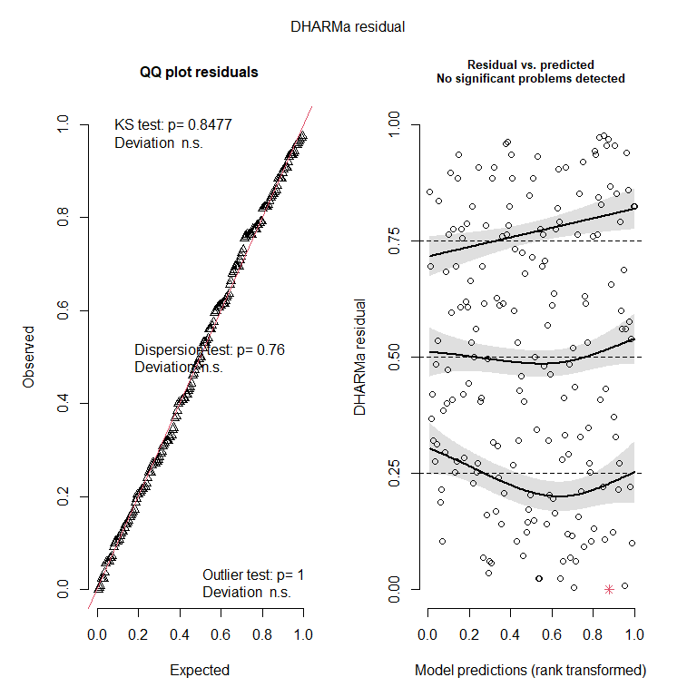

---
title: "Resting Oxygen Consumption"
author: "Elliott Schmidt"
date: "05 December, 2023"
output:
  html_document:
    keep_md: yes
    code_folding: show
    collapse: no
    df_print: paged
    fig_caption: yes
    fig_height: 4
    fig_width: 6
    highlight: monochrome
    theme: flatly
    latex_engine: xelatex
    toc: yes
    toc_float: yes
    css: styles.css
  pdf_document:
    df_print: default
    fig_caption: yes
    fig_height: 4
    fig_width: 4
    highlight: tango
    latex_engine: xelatex
    number_sections: yes
    toc_depth: 2
documentclass: article
fontsize: 12pt
mainfont: Arial
mathfont: LiberationMono
classoption: a4paper
--- 

# Scenario 

For initial details on the experiment performed please read the **ReadMe** file. In breif, _Acanthochromis polyacanthus_ from two different regions on the Great Barrier Reef (GBR) were tested for metabolic performance at four different temperatures, 27$^\circ$C, 28.5$^\circ$C, 30$^\circ$C, and 31.5$^\circ$C. Fish used in this study were collected from two different regions, low- (i.e. Cairns) and high-latitude (i.e., Mackay), within each region fish were collected from a total of three different populations. Individuals were tested at each temperature, resting oxygen consumption, maximum oxygen consumption. Absolute aerboic scope was calculated by using the following formula: 

Absolute aerobic scope = (maximum oxygen consumption - resting oxygen consumption)

Individuals were first tested at 27$^\circ$C. Water temperature was then increased at a rate of 0.5$^\circ$C Day^-1 until the next temperature was reached. Fish were then provided with an additional 5 day to adjust to the new temperature before aerobic physiology was tested again. 

Three traits are included within the aerobic physiology analysis, resting oxygen consumption, maximum oxygen consumption, and absoulte aerboic scope. Data for each metric was collect from respiratory experiments that had data recorded via a combination of programs including, AquaResp and PyroScience. Slopes (i.e., resting and maximum oxygen consumption values) were then calculated via the **RespR** [https://januarharianto.github.io/respR/articles/respR.html] package.  


# Read in the data

Before beginning always make sure that you are working in the correct directory 


```r
knitr::opts_knit$set(root.dir=working.dir)
```

Lets start by loading the packages that are needed 

## Load packages 


```r
library(tidyverse) # data manipulation
library(plyr) # data manipulation
library(dplyr) # data manipulation
library(lubridate) # data manipulation - specifically time data
library(ggplot2) # plotting figures
library(glmmTMB) # running models
library(performance) # model validation
library(car) # dependent
library(DHARMa) # model validation
library(MuMIn) # model validation
library(kableExtra) # creating tables
library(broom) # dependent
library(emmeans) # post-hoc analysis
library(ggeffects) # plotting models/model validation
library(vtable) # creating tables
library(modelr) # model validation
library(kableExtra) # formatting output tables
library(sjPlot) # plotting models
```


Now we can import that data. Replace import data with the PATH to your data file. I have secretly labelled my PATH import.data (i.e. import.data = "PATH TO MY FILE")

## Load data 


```r
resp <- import.data
```

# Data manipulation 

Before the data can be analysed it is important to clean up the data file. Below a number of adjustments are made, primarily making sure that columns are being treated appropriately as either factors, numeric, or as time, as well as the renaming of some columns. Once these changes are made the data is being saved into a new dataframe called **resp2** 


```{.r .style}
resp2 = resp %>% 
  dplyr::rename(EXP_FISH_ID = FISH_ID) %>%
  separate(EXP_FISH_ID, c("FISH_ID"), remove = FALSE) %>%
  mutate(FISH_ID = factor(FISH_ID), 
         POPULATION = factor(POPULATION), 
         REGION = factor(REGION), 
         TEMPERATURE = as.numeric(TEMPERATURE), #run with temperature as a factor
         RESTING_DATE = factor(RESTING_DATE), 
         RESTING_CHAMBER = factor(RESTING_CHAMBER), 
         RESTING_SYSTEM = factor(RESTING_SYSTEM), 
         RESTING_SUMP = factor(RESTING_SUMP), 
         RESTING_AM_PM = factor(RESTING_AM_PM), 
         RESTING_START_TIME = hms(RESTING_START_TIME),
         RESTING_END_TIME = hms(RESTING_ENDTIME),
         MAX_DATE = factor(MAX_DATE), 
         MAX_CHAMBER = factor(MAX_CHAMBER), 
         MAX_SYSTEM = factor(MAX_SYSTEM), 
         MAX_SUMP = factor(MAX_SUMP), 
         MAX_AM_PM = factor(MAX_AM_PM), 
         MAX_START_TIME = hms(MAX_START_TIME), 
         Swim.performance = factor(Swim.performance), 
         NAS = as.numeric(NAS), 
         FAS = as.numeric(FAS), 
         MgO2.hr_Net = as.numeric(MgO2.hr_Net), 
         RESTING_RUNTIME_SECONDS = as.numeric(hms(RESTING_RUNTIME))) %>% 
  dplyr::rename(MASS = WEIGHT) %>% 
  mutate(MASS_CENTERED = scale(MASS, scale = FALSE, center = TRUE))
```

Next select data points will be removed. Beside the removed data points I have provided reasoning for their exclusion, such as fish died during the experiment, or data quailty was poor - which likely indicated that there was an issue with the equipment during the trial. 


```r
resp3 <- resp2 %>% 
  subset(  
    EXP_FISH_ID !="LCHA127_27" & # deceased during experiment
      EXP_FISH_ID !="LCHA132_27" & # deceased during experiment
      EXP_FISH_ID !="LKES168_27" # poor data quality
  ) 
```

Great! That is everything for data manipulation 

# Exploratory data analysis {.tabset}

## Mass v Rest


```r
ggplot(resp3, aes(MASS, RESTING_MgO2.hr_RESPR)) + 
  geom_point() + 
  geom_smooth(method = "lm") + 
  theme_classic()
```

<!-- -->

## Mass v REST (LATITUDE)

```r
ggplot(resp3, aes(MASS, RESTING_MgO2.hr_RESPR, color = REGION)) + 
  geom_point() +
  theme_classic() + 
  geom_smooth(method = "lm")
```

<!-- -->

## TEMPERTURE v REST (LATITUDE)

```r
ggplot(resp3, aes(TEMPERATURE, RESTING_MgO2.hr_RESPR, color = REGION)) + 
  geom_point() +
  theme_classic()
```

<!-- -->

## {-}

# Fit the model 

The model was fit using the **glmmTMB** package in R. A number of different models were tested to determine which hypothesis and associated variables best predicted resting oxygen consumption. Model fit was examined using AICc, BIC, and r-squared values. Additional model were examined via the validation diagonistics provided by the **performance** and **dHARMA** packages in R. 

The first set of models tested looked at three different hypotheses including 1) that mass has a major impact of resting oxygen consumption of fish (this has been documented in the literature), 2) if variables related to time have an important impact on the resting oxygen consumption of fish. 

## Fixed factors (linear regression models)

### model 1

```r
#--- base model ---#
rmr.1 <- glm(RESTING_MgO2.hr_RESPR ~ 1+ REGION * TEMPERATURE + MASS_CENTERED, 
                 family=gaussian(),
                 data = resp3) 
```
#### summary
<table class=" lightable-paper" style='font-family: "Arial Narrow", arial, helvetica, sans-serif; margin-left: auto; margin-right: auto;'>
 <thead>
  <tr>
   <th style="text-align:left;">   </th>
   <th style="text-align:right;"> Estimate </th>
   <th style="text-align:right;"> Std. Error </th>
   <th style="text-align:right;"> t value </th>
   <th style="text-align:right;"> Pr(&gt;|t|) </th>
  </tr>
 </thead>
<tbody>
  <tr>
   <td style="text-align:left;"> (Intercept) </td>
   <td style="text-align:right;"> 0.9071699 </td>
   <td style="text-align:right;"> 1.8396670 </td>
   <td style="text-align:right;"> 0.4931164 </td>
   <td style="text-align:right;"> 0.6225248 </td>
  </tr>
  <tr>
   <td style="text-align:left;"> REGIONLeading </td>
   <td style="text-align:right;"> -1.0631773 </td>
   <td style="text-align:right;"> 2.7553334 </td>
   <td style="text-align:right;"> -0.3858616 </td>
   <td style="text-align:right;"> 0.7000498 </td>
  </tr>
  <tr>
   <td style="text-align:left;"> TEMPERATURE </td>
   <td style="text-align:right;"> 0.1759916 </td>
   <td style="text-align:right;"> 0.0632351 </td>
   <td style="text-align:right;"> 2.7831307 </td>
   <td style="text-align:right;"> 0.0059520 </td>
  </tr>
  <tr>
   <td style="text-align:left;"> MASS_CENTERED </td>
   <td style="text-align:right;"> 133.8254357 </td>
   <td style="text-align:right;"> 9.9843605 </td>
   <td style="text-align:right;"> 13.4035060 </td>
   <td style="text-align:right;"> 0.0000000 </td>
  </tr>
  <tr>
   <td style="text-align:left;"> REGIONLeading:TEMPERATURE </td>
   <td style="text-align:right;"> 0.0376457 </td>
   <td style="text-align:right;"> 0.0946023 </td>
   <td style="text-align:right;"> 0.3979365 </td>
   <td style="text-align:right;"> 0.6911434 </td>
  </tr>
</tbody>
</table>

### model 2

```r
#--- experimental rmr equipment hypothesis ---#
rmr.2 <- glm(RESTING_MgO2.hr_RESPR ~ 1+ REGION * TEMPERATURE + RESTING_SUMP + 
                   RESTING_AM_PM + RESTING_RUNTIME_SECONDS, 
                 family=gaussian(),
                 data = resp3) 
```

#### summary
<table class=" lightable-paper" style='font-family: "Arial Narrow", arial, helvetica, sans-serif; margin-left: auto; margin-right: auto;'>
 <thead>
  <tr>
   <th style="text-align:left;">   </th>
   <th style="text-align:right;"> Estimate </th>
   <th style="text-align:right;"> Std. Error </th>
   <th style="text-align:right;"> t value </th>
   <th style="text-align:right;"> Pr(&gt;|t|) </th>
  </tr>
 </thead>
<tbody>
  <tr>
   <td style="text-align:left;"> (Intercept) </td>
   <td style="text-align:right;"> 0.0417266 </td>
   <td style="text-align:right;"> 2.5593818 </td>
   <td style="text-align:right;"> 0.0163034 </td>
   <td style="text-align:right;"> 0.9870104 </td>
  </tr>
  <tr>
   <td style="text-align:left;"> REGIONLeading </td>
   <td style="text-align:right;"> -1.8177666 </td>
   <td style="text-align:right;"> 3.7681132 </td>
   <td style="text-align:right;"> -0.4824077 </td>
   <td style="text-align:right;"> 0.6301025 </td>
  </tr>
  <tr>
   <td style="text-align:left;"> TEMPERATURE </td>
   <td style="text-align:right;"> 0.3212288 </td>
   <td style="text-align:right;"> 0.0949708 </td>
   <td style="text-align:right;"> 3.3823948 </td>
   <td style="text-align:right;"> 0.0008816 </td>
  </tr>
  <tr>
   <td style="text-align:left;"> RESTING_SUMP2 </td>
   <td style="text-align:right;"> -0.0016294 </td>
   <td style="text-align:right;"> 0.2215833 </td>
   <td style="text-align:right;"> -0.0073533 </td>
   <td style="text-align:right;"> 0.9941411 </td>
  </tr>
  <tr>
   <td style="text-align:left;"> RESTING_AM_PMPM </td>
   <td style="text-align:right;"> -0.4196626 </td>
   <td style="text-align:right;"> 0.2161103 </td>
   <td style="text-align:right;"> -1.9418904 </td>
   <td style="text-align:right;"> 0.0537114 </td>
  </tr>
  <tr>
   <td style="text-align:left;"> RESTING_RUNTIME_SECONDS </td>
   <td style="text-align:right;"> -0.0001616 </td>
   <td style="text-align:right;"> 0.0000513 </td>
   <td style="text-align:right;"> -3.1477047 </td>
   <td style="text-align:right;"> 0.0019264 </td>
  </tr>
  <tr>
   <td style="text-align:left;"> REGIONLeading:TEMPERATURE </td>
   <td style="text-align:right;"> 0.0125324 </td>
   <td style="text-align:right;"> 0.1293602 </td>
   <td style="text-align:right;"> 0.0968801 </td>
   <td style="text-align:right;"> 0.9229294 </td>
  </tr>
</tbody>
</table>

### model comparison table
<table class=" lightable-paper" style='font-family: "Arial Narrow", arial, helvetica, sans-serif; margin-left: auto; margin-right: auto;'>
 <thead>
  <tr>
   <th style="text-align:left;"> model </th>
   <th style="text-align:right;"> df </th>
   <th style="text-align:right;"> AICc </th>
   <th style="text-align:right;"> BIC </th>
   <th style="text-align:right;"> r2 </th>
  </tr>
 </thead>
<tbody>
  <tr>
   <td style="text-align:left;"> rmr.1 </td>
   <td style="text-align:right;"> 6 </td>
   <td style="text-align:right;"> 561.9094 </td>
   <td style="text-align:right;"> 580.8294 </td>
   <td style="text-align:right;"> 0.6058512 </td>
  </tr>
  <tr>
   <td style="text-align:left;"> rmr.2 </td>
   <td style="text-align:right;"> 8 </td>
   <td style="text-align:right;"> 680.4894 </td>
   <td style="text-align:right;"> 705.5293 </td>
   <td style="text-align:right;"> 0.2768734 </td>
  </tr>
</tbody>
</table>
The model that contains **MASS_CENTERED** seems to do better than the model that incorporates variables that are associated with the time that experiments are performed.This is demonstrated by the lower AIC and BIC scores, as well as higher r-squared value. However, **RESTING_RUNTIME_SECONDS** was a significant variable in model 2. Let's see what a third model looks like if we both **MASS_CENTERED** and **RESTING_RUNTIME_SECONDS**. 

### model 3

```r
rmr.3 <- glm(RESTING_MgO2.hr_RESPR ~ 1+ REGION * TEMPERATURE + MASS_CENTERED + RESTING_RUNTIME_SECONDS, 
                 family=gaussian(),
                 data = resp3)
```

### model comparison table 2
<table class=" lightable-paper" style='font-family: "Arial Narrow", arial, helvetica, sans-serif; margin-left: auto; margin-right: auto;'>
 <thead>
  <tr>
   <th style="text-align:left;"> model </th>
   <th style="text-align:right;"> df </th>
   <th style="text-align:right;"> AICc </th>
   <th style="text-align:right;"> BIC </th>
   <th style="text-align:right;"> r2 </th>
  </tr>
 </thead>
<tbody>
  <tr>
   <td style="text-align:left;"> rmr.1 </td>
   <td style="text-align:right;"> 6 </td>
   <td style="text-align:right;"> 561.9094 </td>
   <td style="text-align:right;"> 580.8294 </td>
   <td style="text-align:right;"> 0.6058512 </td>
  </tr>
  <tr>
   <td style="text-align:left;"> rmr.2 </td>
   <td style="text-align:right;"> 8 </td>
   <td style="text-align:right;"> 680.4894 </td>
   <td style="text-align:right;"> 705.5293 </td>
   <td style="text-align:right;"> 0.2768734 </td>
  </tr>
  <tr>
   <td style="text-align:left;"> rmr.3 </td>
   <td style="text-align:right;"> 7 </td>
   <td style="text-align:right;"> 544.9015 </td>
   <td style="text-align:right;"> 566.8936 </td>
   <td style="text-align:right;"> 0.6426906 </td>
  </tr>
</tbody>
</table>

It looks like the third model is better than the previous two. Next we will test to see if the variable temperature performs best as a 1^st (linear), 2^nd (quadratic), or 3^rd (cubic) order polynomial. As the relationship between temperature and resting oxygen consumption is predicted to be non-linear. 

## Polynomials 

### polynomial models 

Note that the linear model has already been created via model _rmr.3_ in the previous section.


```r
rmr.3.p2 <- glm(RESTING_MgO2.hr_RESPR ~ 1+ REGION * poly(TEMPERATURE, 2) + MASS_CENTERED + RESTING_RUNTIME_SECONDS, 
                 family=gaussian(),
                 data = resp3)  

rmr.3.p3 <- glm(RESTING_MgO2.hr_RESPR ~ 1+ REGION * poly(TEMPERATURE, 3) + MASS_CENTERED + RESTING_RUNTIME_SECONDS, 
                 family=gaussian(),
                 data = resp3)
```

#### polynomial model comparisons
<table class=" lightable-paper" style='font-family: "Arial Narrow", arial, helvetica, sans-serif; margin-left: auto; margin-right: auto;'>
 <thead>
  <tr>
   <th style="text-align:left;"> model </th>
   <th style="text-align:right;"> df </th>
   <th style="text-align:right;"> AICc </th>
   <th style="text-align:right;"> BIC </th>
   <th style="text-align:right;"> r2 </th>
  </tr>
 </thead>
<tbody>
  <tr>
   <td style="text-align:left;"> rmr.3 </td>
   <td style="text-align:right;"> 7 </td>
   <td style="text-align:right;"> 544.9015 </td>
   <td style="text-align:right;"> 566.8936 </td>
   <td style="text-align:right;"> 0.6489236 </td>
  </tr>
  <tr>
   <td style="text-align:left;"> rmr.3.p2 </td>
   <td style="text-align:right;"> 9 </td>
   <td style="text-align:right;"> 545.1143 </td>
   <td style="text-align:right;"> 573.1773 </td>
   <td style="text-align:right;"> 0.6566813 </td>
  </tr>
  <tr>
   <td style="text-align:left;"> rmr.3.p3 </td>
   <td style="text-align:right;"> 11 </td>
   <td style="text-align:right;"> 548.8463 </td>
   <td style="text-align:right;"> 582.8799 </td>
   <td style="text-align:right;"> 0.6580731 </td>
  </tr>
</tbody>
</table>

From our model comparison we can see the there is no additional benefit to the model by including temperature as a 2^nd or 3^rd order polynomial. However, the linear and quadratic model both perform well. 

## Random factors 

Fish were repeatedly sampled over four different temperatures, therefore repeated sampling needs to be accounted for. To do this random factors will be included within the model. There are a number of options that can be used for random factors including 1) accounting for repeated sampling of individuals, 2) accounting for repeated sampling of individuals nested within population, 3) account for repeated sampling of individuals and populations without nesting. All three models will be run a compaired. 

### random factor models


```r
rmr.3a <- glmmTMB(RESTING_MgO2.hr_RESPR ~ 1+ REGION * TEMPERATURE + MASS_CENTERED + RESTING_RUNTIME_SECONDS + RESTING_AM_PM + (1|FISH_ID), 
                  family=gaussian(),
                  data = resp3,
                  REML = TRUE) 


rmr.3b <- glmmTMB(RESTING_MgO2.hr_RESPR ~ 1+ REGION * TEMPERATURE + MASS_CENTERED + RESTING_RUNTIME_SECONDS + RESTING_AM_PM + (1|POPULATION/FISH_ID), 
                  family=gaussian(),
                  data = resp3,
                  REML = TRUE)

rmr.3c <- glmmTMB(RESTING_MgO2.hr_RESPR ~ 1+ REGION * TEMPERATURE + MASS_CENTERED + RESTING_RUNTIME_SECONDS + RESTING_AM_PM + (1|FISH_ID) + (1|POPULATION), 
                  family=gaussian(),
                  data = resp3,
                  REML = TRUE)
```

#### random factor model comparisons 

<table class=" lightable-paper" style='font-family: "Arial Narrow", arial, helvetica, sans-serif; margin-left: auto; margin-right: auto;'>
 <thead>
  <tr>
   <th style="text-align:left;"> model </th>
   <th style="text-align:right;"> df </th>
   <th style="text-align:right;"> AICc </th>
   <th style="text-align:right;"> BIC </th>
   <th style="text-align:right;"> r2m </th>
   <th style="text-align:right;"> r2c </th>
  </tr>
 </thead>
<tbody>
  <tr>
   <td style="text-align:left;"> rmr.3a </td>
   <td style="text-align:right;"> 9 </td>
   <td style="text-align:right;"> 559.5705 </td>
   <td style="text-align:right;"> 587.6335 </td>
   <td style="text-align:right;"> 0.6508181 </td>
   <td style="text-align:right;"> 0.7311944 </td>
  </tr>
  <tr>
   <td style="text-align:left;"> rmr.3b </td>
   <td style="text-align:right;"> 10 </td>
   <td style="text-align:right;"> 561.8036 </td>
   <td style="text-align:right;"> 592.8646 </td>
   <td style="text-align:right;"> 0.6508181 </td>
   <td style="text-align:right;"> 0.7311944 </td>
  </tr>
  <tr>
   <td style="text-align:left;"> rmr.3c </td>
   <td style="text-align:right;"> 10 </td>
   <td style="text-align:right;"> 561.8036 </td>
   <td style="text-align:right;"> 592.8646 </td>
   <td style="text-align:right;"> 0.6508181 </td>
   <td style="text-align:right;"> 0.7311944 </td>
  </tr>
</tbody>
</table>

Model _rmr.3a_ appears to be the best model, however, there seems to be no difference in how the models change depending on how the random factors are arranged.

# Model validation {.tabset .tabset-faded}

## performance {.tabset .tabset-faded}

### rmr.3a (linear)
<!-- -->

The _rmr.3a_ model performs well, however, in the model validation performed by the **performance** model it looks like there are two variables that are highly correlated. If we expand the figure we can see that the highly correlated variables are REGION and REGION:TEMPERATURE. Perhaps this is unsurprising  but lets see what happens when we run the quadratic (2^nd polynomial) model to see if this helps deal with the high correlation between these two variables, as it performed very similarly to _rmr.3a_, and even had a higher r2 value. 

### rmr.3.p2a (quadratic)

First we need to update the model by adding in the missing random factor

```r
rmr.3.p2a <- glmmTMB(RESTING_MgO2.hr_RESPR ~ 1+ REGION * poly(TEMPERATURE, 2) + MASS_CENTERED + RESTING_RUNTIME_SECONDS + (1|FISH_ID), 
                 family=gaussian(),
                 data = resp3, 
                 REML = TRUE) 
```

<!-- -->

## DHARMa residuals {.tabset .tabset-faded}

### rmr.3a (linear)

```r
rmr.3a %>% simulateResiduals(plot=TRUE)
```

<!-- -->

```
## Object of Class DHARMa with simulated residuals based on 250 simulations with refit = FALSE . See ?DHARMa::simulateResiduals for help. 
##  
## Scaled residual values: 0.464 0.76 0.164 0.916 0.844 0.804 0.772 0.816 0.748 0.848 0.328 0.152 0.096 0.14 0 0.308 0.236 0.304 0.372 0.028 ...
```

```r
rmr.3a %>% DHARMa::testResiduals(plot=TRUE)
```

<!-- -->

```
## $uniformity
## 
## 	Asymptotic one-sample Kolmogorov-Smirnov test
## 
## data:  simulationOutput$scaledResiduals
## D = 0.040898, p-value = 0.9132
## alternative hypothesis: two-sided
## 
## 
## $dispersion
## 
## 	DHARMa nonparametric dispersion test via sd of residuals fitted vs.
## 	simulated
## 
## data:  simulationOutput
## dispersion = 0.96366, p-value = 0.744
## alternative hypothesis: two.sided
## 
## 
## $outliers
## 
## 	DHARMa outlier test based on exact binomial test with approximate
## 	expectations
## 
## data:  simulationOutput
## outliers at both margin(s) = 1, observations = 187, p-value = 1
## alternative hypothesis: true probability of success is not equal to 0.007968127
## 95 percent confidence interval:
##  0.0001353802 0.0294332214
## sample estimates:
## frequency of outliers (expected: 0.00796812749003984 ) 
##                                            0.005347594
```

```
## $uniformity
## 
## 	Asymptotic one-sample Kolmogorov-Smirnov test
## 
## data:  simulationOutput$scaledResiduals
## D = 0.040898, p-value = 0.9132
## alternative hypothesis: two-sided
## 
## 
## $dispersion
## 
## 	DHARMa nonparametric dispersion test via sd of residuals fitted vs.
## 	simulated
## 
## data:  simulationOutput
## dispersion = 0.96366, p-value = 0.744
## alternative hypothesis: two.sided
## 
## 
## $outliers
## 
## 	DHARMa outlier test based on exact binomial test with approximate
## 	expectations
## 
## data:  simulationOutput
## outliers at both margin(s) = 1, observations = 187, p-value = 1
## alternative hypothesis: true probability of success is not equal to 0.007968127
## 95 percent confidence interval:
##  0.0001353802 0.0294332214
## sample estimates:
## frequency of outliers (expected: 0.00796812749003984 ) 
##                                            0.005347594
```

### rmr.3.p2 (quadratic)

First we need to update the model by adding in the missing random factor

```r
rmr.3.p2a <- glmmTMB(RESTING_MgO2.hr_RESPR ~ 1+ REGION * poly(TEMPERATURE, 2) + MASS_CENTERED + RESTING_RUNTIME_SECONDS + (1|FISH_ID), 
                 family=gaussian(),
                 data = resp3, 
                 REML = TRUE) 
```


```r
rmr.3.p2a %>% simulateResiduals(plot=TRUE) 
```

<!-- -->

```
## Object of Class DHARMa with simulated residuals based on 250 simulations with refit = FALSE . See ?DHARMa::simulateResiduals for help. 
##  
## Scaled residual values: 0.444 0.784 0.164 0.932 0.884 0.764 0.688 0.852 0.792 0.824 0.308 0.168 0.16 0.06 0 0.408 0.212 0.272 0.272 0.036 ...
```

```r
rmr.3.p2a %>% DHARMa::testResiduals(plot=TRUE)
```

<!-- -->

```
## $uniformity
## 
## 	Asymptotic one-sample Kolmogorov-Smirnov test
## 
## data:  simulationOutput$scaledResiduals
## D = 0.04477, p-value = 0.8477
## alternative hypothesis: two-sided
## 
## 
## $dispersion
## 
## 	DHARMa nonparametric dispersion test via sd of residuals fitted vs.
## 	simulated
## 
## data:  simulationOutput
## dispersion = 0.96383, p-value = 0.76
## alternative hypothesis: two.sided
## 
## 
## $outliers
## 
## 	DHARMa outlier test based on exact binomial test with approximate
## 	expectations
## 
## data:  simulationOutput
## outliers at both margin(s) = 1, observations = 187, p-value = 1
## alternative hypothesis: true probability of success is not equal to 0.007968127
## 95 percent confidence interval:
##  0.0001353802 0.0294332214
## sample estimates:
## frequency of outliers (expected: 0.00796812749003984 ) 
##                                            0.005347594
```

```
## $uniformity
## 
## 	Asymptotic one-sample Kolmogorov-Smirnov test
## 
## data:  simulationOutput$scaledResiduals
## D = 0.04477, p-value = 0.8477
## alternative hypothesis: two-sided
## 
## 
## $dispersion
## 
## 	DHARMa nonparametric dispersion test via sd of residuals fitted vs.
## 	simulated
## 
## data:  simulationOutput
## dispersion = 0.96383, p-value = 0.76
## alternative hypothesis: two.sided
## 
## 
## $outliers
## 
## 	DHARMa outlier test based on exact binomial test with approximate
## 	expectations
## 
## data:  simulationOutput
## outliers at both margin(s) = 1, observations = 187, p-value = 1
## alternative hypothesis: true probability of success is not equal to 0.007968127
## 95 percent confidence interval:
##  0.0001353802 0.0294332214
## sample estimates:
## frequency of outliers (expected: 0.00796812749003984 ) 
##                                            0.005347594
```

## {-}

# {-}

It looks like the model that treats temperature as a second order polynomial does a better job at avoiding high levels of collinearity within the model. The quadratic model will be used moving forward because it: 

* The **quadratic model** performs just as well as the linear model based on the model validation scores (i.e., AIC, BIC, and r2) 
* The **quadratic model** does a **better** job at dealing with collinearity that appeared in the model 

# Partial plots {.tabset .tabset-faded}

## ggemmeans 

<!-- -->

## plot_model 

<!-- -->

# {-} 

# Model investigation {.tabset .tabset-faded}

## summary 
<table class=" lightable-paper" style='font-family: "Arial Narrow", arial, helvetica, sans-serif; margin-left: auto; margin-right: auto;'>
 <thead>
  <tr>
   <th style="text-align:left;">   </th>
   <th style="text-align:right;"> Estimate </th>
   <th style="text-align:right;"> StdError </th>
   <th style="text-align:right;"> Zvalue </th>
   <th style="text-align:right;"> Pvalue </th>
  </tr>
 </thead>
<tbody>
  <tr>
   <td style="text-align:left;"> (Intercept) </td>
   <td style="text-align:right;"> 8.3165021 </td>
   <td style="text-align:right;"> 0.5180504 </td>
   <td style="text-align:right;"> 16.0534626 </td>
   <td style="text-align:right;"> 0.0000000 </td>
  </tr>
  <tr>
   <td style="text-align:left;"> REGIONLeading </td>
   <td style="text-align:right;"> 0.0172115 </td>
   <td style="text-align:right;"> 0.2341284 </td>
   <td style="text-align:right;"> 0.0735129 </td>
   <td style="text-align:right;"> 0.9413980 </td>
  </tr>
  <tr>
   <td style="text-align:left;"> poly(TEMPERATURE, 2)1 </td>
   <td style="text-align:right;"> 6.5820041 </td>
   <td style="text-align:right;"> 1.3078841 </td>
   <td style="text-align:right;"> 5.0325592 </td>
   <td style="text-align:right;"> 0.0000005 </td>
  </tr>
  <tr>
   <td style="text-align:left;"> poly(TEMPERATURE, 2)2 </td>
   <td style="text-align:right;"> 2.7374223 </td>
   <td style="text-align:right;"> 1.1855357 </td>
   <td style="text-align:right;"> 2.3090171 </td>
   <td style="text-align:right;"> 0.0209426 </td>
  </tr>
  <tr>
   <td style="text-align:left;"> MASS_CENTERED </td>
   <td style="text-align:right;"> 133.3083220 </td>
   <td style="text-align:right;"> 12.2781446 </td>
   <td style="text-align:right;"> 10.8573670 </td>
   <td style="text-align:right;"> 0.0000000 </td>
  </tr>
  <tr>
   <td style="text-align:left;"> RESTING_RUNTIME_SECONDS </td>
   <td style="text-align:right;"> -0.0001467 </td>
   <td style="text-align:right;"> 0.0000321 </td>
   <td style="text-align:right;"> -4.5683146 </td>
   <td style="text-align:right;"> 0.0000049 </td>
  </tr>
  <tr>
   <td style="text-align:left;"> REGIONLeading:poly(TEMPERATURE, 2)1 </td>
   <td style="text-align:right;"> 0.8398236 </td>
   <td style="text-align:right;"> 1.7827144 </td>
   <td style="text-align:right;"> 0.4710926 </td>
   <td style="text-align:right;"> 0.6375746 </td>
  </tr>
  <tr>
   <td style="text-align:left;"> REGIONLeading:poly(TEMPERATURE, 2)2 </td>
   <td style="text-align:right;"> -2.2347739 </td>
   <td style="text-align:right;"> 1.7668476 </td>
   <td style="text-align:right;"> -1.2648368 </td>
   <td style="text-align:right;"> 0.2059298 </td>
  </tr>
</tbody>
</table>

## Anova 
<table class=" lightable-paper" style='font-family: "Arial Narrow", arial, helvetica, sans-serif; margin-left: auto; margin-right: auto;'>
 <thead>
  <tr>
   <th style="text-align:left;">   </th>
   <th style="text-align:right;"> Chisq </th>
   <th style="text-align:right;"> Df </th>
   <th style="text-align:right;"> Pr(&gt;Chisq) </th>
  </tr>
 </thead>
<tbody>
  <tr>
   <td style="text-align:left;"> REGION </td>
   <td style="text-align:right;"> 0.003263 </td>
   <td style="text-align:right;"> 1 </td>
   <td style="text-align:right;"> 0.9544475 </td>
  </tr>
  <tr>
   <td style="text-align:left;"> poly(TEMPERATURE, 2) </td>
   <td style="text-align:right;"> 51.567789 </td>
   <td style="text-align:right;"> 2 </td>
   <td style="text-align:right;"> 0.0000000 </td>
  </tr>
  <tr>
   <td style="text-align:left;"> MASS_CENTERED </td>
   <td style="text-align:right;"> 117.882419 </td>
   <td style="text-align:right;"> 1 </td>
   <td style="text-align:right;"> 0.0000000 </td>
  </tr>
  <tr>
   <td style="text-align:left;"> RESTING_RUNTIME_SECONDS </td>
   <td style="text-align:right;"> 20.869498 </td>
   <td style="text-align:right;"> 1 </td>
   <td style="text-align:right;"> 0.0000049 </td>
  </tr>
  <tr>
   <td style="text-align:left;"> REGION:poly(TEMPERATURE, 2) </td>
   <td style="text-align:right;"> 1.823912 </td>
   <td style="text-align:right;"> 2 </td>
   <td style="text-align:right;"> 0.4017376 </td>
  </tr>
</tbody>
</table>

## confint 
<table class=" lightable-paper" style='font-family: "Arial Narrow", arial, helvetica, sans-serif; margin-left: auto; margin-right: auto;'>
 <thead>
  <tr>
   <th style="text-align:left;">   </th>
   <th style="text-align:right;"> 2.5 % </th>
   <th style="text-align:right;"> 97.5 % </th>
   <th style="text-align:right;"> Estimate </th>
  </tr>
 </thead>
<tbody>
  <tr>
   <td style="text-align:left;"> (Intercept) </td>
   <td style="text-align:right;"> 7.3011420 </td>
   <td style="text-align:right;"> 9.3318621 </td>
   <td style="text-align:right;"> 8.3165021 </td>
  </tr>
  <tr>
   <td style="text-align:left;"> REGIONLeading </td>
   <td style="text-align:right;"> -0.4416717 </td>
   <td style="text-align:right;"> 0.4760947 </td>
   <td style="text-align:right;"> 0.0172115 </td>
  </tr>
  <tr>
   <td style="text-align:left;"> poly(TEMPERATURE, 2)1 </td>
   <td style="text-align:right;"> 4.0185984 </td>
   <td style="text-align:right;"> 9.1454098 </td>
   <td style="text-align:right;"> 6.5820041 </td>
  </tr>
  <tr>
   <td style="text-align:left;"> poly(TEMPERATURE, 2)2 </td>
   <td style="text-align:right;"> 0.4138150 </td>
   <td style="text-align:right;"> 5.0610297 </td>
   <td style="text-align:right;"> 2.7374223 </td>
  </tr>
  <tr>
   <td style="text-align:left;"> MASS_CENTERED </td>
   <td style="text-align:right;"> 109.2436009 </td>
   <td style="text-align:right;"> 157.3730432 </td>
   <td style="text-align:right;"> 133.3083220 </td>
  </tr>
  <tr>
   <td style="text-align:left;"> RESTING_RUNTIME_SECONDS </td>
   <td style="text-align:right;"> -0.0002096 </td>
   <td style="text-align:right;"> -0.0000837 </td>
   <td style="text-align:right;"> -0.0001467 </td>
  </tr>
  <tr>
   <td style="text-align:left;"> REGIONLeading:poly(TEMPERATURE, 2)1 </td>
   <td style="text-align:right;"> -2.6542324 </td>
   <td style="text-align:right;"> 4.3338797 </td>
   <td style="text-align:right;"> 0.8398236 </td>
  </tr>
  <tr>
   <td style="text-align:left;"> REGIONLeading:poly(TEMPERATURE, 2)2 </td>
   <td style="text-align:right;"> -5.6977316 </td>
   <td style="text-align:right;"> 1.2281839 </td>
   <td style="text-align:right;"> -2.2347739 </td>
  </tr>
  <tr>
   <td style="text-align:left;"> Std.Dev.(Intercept)|FISH_ID </td>
   <td style="text-align:right;"> 0.3510707 </td>
   <td style="text-align:right;"> 0.7291319 </td>
   <td style="text-align:right;"> 0.5059415 </td>
  </tr>
</tbody>
</table>

## r-squared
<table class=" lightable-paper" style='font-family: "Arial Narrow", arial, helvetica, sans-serif; margin-left: auto; margin-right: auto;'>
 <thead>
  <tr>
   <th style="text-align:right;"> R2_conditional </th>
   <th style="text-align:right;"> R2_marginal </th>
   <th style="text-align:left;"> optional </th>
  </tr>
 </thead>
<tbody>
  <tr>
   <td style="text-align:right;"> 0.7370331 </td>
   <td style="text-align:right;"> 0.6487262 </td>
   <td style="text-align:left;"> FALSE </td>
  </tr>
</tbody>
</table>

# {-} 

# Pairwise comparisons {.tabset .tabset-faded} 

## emtrends [latitudes]


```r
rmr.3.p2a %>% emtrends(var = "TEMPERATURE", type = "response") %>% pairs(by = "TEMPERATURE") %>% summary(by = NULL, adjust = "tukey", infer=TRUE)
```

<div data-pagedtable="false">
  <script data-pagedtable-source type="application/json">
{"columns":[{"label":[""],"name":["_rn_"],"type":[""],"align":["left"]},{"label":["contrast"],"name":[1],"type":["fct"],"align":["left"]},{"label":["TEMPERATURE"],"name":[2],"type":["dbl"],"align":["right"]},{"label":["estimate"],"name":[3],"type":["dbl"],"align":["right"]},{"label":["SE"],"name":[4],"type":["dbl"],"align":["right"]},{"label":["df"],"name":[5],"type":["dbl"],"align":["right"]},{"label":["lower.CL"],"name":[6],"type":["dbl"],"align":["right"]},{"label":["upper.CL"],"name":[7],"type":["dbl"],"align":["right"]},{"label":["t.ratio"],"name":[8],"type":["dbl"],"align":["right"]},{"label":["p.value"],"name":[9],"type":["dbl"],"align":["right"]}],"data":[{"1":"(Core MASS_CENTERED7.75330706445238e-05 RESTING_RUNTIME_SECONDS15500.5240641711) - (Leading MASS_CENTERED7.75330706445238e-05 RESTING_RUNTIME_SECONDS15500.5240641711)","2":"29.08556","3":"-0.05310072","4":"0.07961835","5":"185","6":"-0.2101774","7":"0.1039759","8":"-0.6669407","9":"0.505641","_rn_":"1"}],"options":{"columns":{"min":{},"max":[10]},"rows":{"min":[10],"max":[10]},"pages":{}}}
  </script>
</div>
SCROLL TO THE RIGHT -->

The numbers in the left most column in the table just mention that the slopes are assuming mean **MASS_CENTERED** and **RESTING_TIME_SEONDS** values when looking at differences between latitudinal slopes.

## emmeans [latitudes]

```r
rmr.3.p2a %>% emmeans(pairwise ~ TEMPERATURE*REGION, type = "response") %>% pairs(by = "TEMPERATURE") %>% summary(by = NULL, adjust = "tukey", infer=TRUE)
```

<div data-pagedtable="false">
  <script data-pagedtable-source type="application/json">
{"columns":[{"label":[""],"name":["_rn_"],"type":[""],"align":["left"]},{"label":["contrast"],"name":[1],"type":["fct"],"align":["left"]},{"label":["TEMPERATURE"],"name":[2],"type":["dbl"],"align":["right"]},{"label":["estimate"],"name":[3],"type":["dbl"],"align":["right"]},{"label":["SE"],"name":[4],"type":["dbl"],"align":["right"]},{"label":["df"],"name":[5],"type":["dbl"],"align":["right"]},{"label":["lower.CL"],"name":[6],"type":["dbl"],"align":["right"]},{"label":["upper.CL"],"name":[7],"type":["dbl"],"align":["right"]},{"label":["t.ratio"],"name":[8],"type":["dbl"],"align":["right"]},{"label":["p.value"],"name":[9],"type":["dbl"],"align":["right"]}],"data":[{"1":"Core - Leading","2":"29.08556","3":"-0.2175183","4":"0.2828536","5":"185","6":"-0.7755517","7":"0.3405151","8":"-0.7690136","9":"0.4428659","_rn_":"1"}],"options":{"columns":{"min":{},"max":[10]},"rows":{"min":[10],"max":[10]},"pages":{}}}
  </script>
</div>

## temperature 

```r
rmr.3.p2a %>% emmeans(~ TEMPERATURE*REGION, type = "response")  %>% summary(infer=TRUE)
```

<div data-pagedtable="false">
  <script data-pagedtable-source type="application/json">
{"columns":[{"label":[""],"name":["_rn_"],"type":[""],"align":["left"]},{"label":["TEMPERATURE"],"name":[1],"type":["dbl"],"align":["right"]},{"label":["REGION"],"name":[2],"type":["fct"],"align":["left"]},{"label":["emmean"],"name":[3],"type":["dbl"],"align":["right"]},{"label":["SE"],"name":[4],"type":["dbl"],"align":["right"]},{"label":["df"],"name":[5],"type":["dbl"],"align":["right"]},{"label":["lower.CL"],"name":[6],"type":["dbl"],"align":["right"]},{"label":["upper.CL"],"name":[7],"type":["dbl"],"align":["right"]},{"label":["t.ratio"],"name":[8],"type":["dbl"],"align":["right"]},{"label":["p.value"],"name":[9],"type":["dbl"],"align":["right"]}],"data":[{"1":"29.08556","2":"Core","3":"5.807860","4":"0.1765530","5":"185","6":"5.459544","7":"6.156176","8":"32.89584","9":"3.190502e-79","_rn_":"1"},{"1":"29.08556","2":"Leading","3":"6.025378","4":"0.2004965","5":"185","6":"5.629825","7":"6.420932","8":"30.05229","9":"4.244126e-73","_rn_":"2"}],"options":{"columns":{"min":{},"max":[10]},"rows":{"min":[10],"max":[10]},"pages":{}}}
  </script>
</div>


## Means - f(temperature)

```r
rmr.3.p2a %>% update(.~1+ REGION * as.factor(TEMPERATURE) + MASS_CENTERED + RESTING_RUNTIME_SECONDS + (1|FISH_ID)) %>% 
  emmeans(~REGION*TEMPERATURE, type = "response") %>% summary(infer=TRUE)
```

<div data-pagedtable="false">
  <script data-pagedtable-source type="application/json">
{"columns":[{"label":[""],"name":["_rn_"],"type":[""],"align":["left"]},{"label":["REGION"],"name":[1],"type":["fct"],"align":["left"]},{"label":["TEMPERATURE"],"name":[2],"type":["dbl"],"align":["right"]},{"label":["emmean"],"name":[3],"type":["dbl"],"align":["right"]},{"label":["SE"],"name":[4],"type":["dbl"],"align":["right"]},{"label":["df"],"name":[5],"type":["dbl"],"align":["right"]},{"label":["lower.CL"],"name":[6],"type":["dbl"],"align":["right"]},{"label":["upper.CL"],"name":[7],"type":["dbl"],"align":["right"]},{"label":["t.ratio"],"name":[8],"type":["dbl"],"align":["right"]},{"label":["p.value"],"name":[9],"type":["dbl"],"align":["right"]}],"data":[{"1":"Core","2":"27.0","3":"5.621100","4":"0.2035805","5":"185","6":"5.219462","7":"6.022738","8":"27.61120","9":"1.582540e-67","_rn_":"1"},{"1":"Leading","2":"27.0","3":"5.451700","4":"0.2294247","5":"185","6":"4.999075","7":"5.904325","8":"23.76248","9":"4.142217e-58","_rn_":"2"},{"1":"Core","2":"28.5","3":"5.665348","4":"0.1991892","5":"185","6":"5.272373","7":"6.058322","8":"28.44204","9":"1.858367e-69","_rn_":"3"},{"1":"Leading","2":"28.5","3":"5.704704","4":"0.2311045","5":"185","6":"5.248764","7":"6.160643","8":"24.68452","9":"1.941657e-60","_rn_":"4"},{"1":"Core","2":"30.0","3":"6.152914","4":"0.2146306","5":"185","6":"5.729476","7":"6.576352","8":"28.66746","9":"5.643319e-70","_rn_":"5"},{"1":"Leading","2":"30.0","3":"6.490145","4":"0.2432571","5":"185","6":"6.010231","7":"6.970060","8":"26.68019","9":"2.540523e-65","_rn_":"6"},{"1":"Core","2":"31.5","3":"6.985710","4":"0.2262840","5":"185","6":"6.539281","7":"7.432139","8":"30.87143","9":"6.675295e-75","_rn_":"7"},{"1":"Leading","2":"31.5","3":"6.861451","4":"0.2501101","5":"185","6":"6.368016","7":"7.354886","8":"27.43372","9":"4.133236e-67","_rn_":"8"}],"options":{"columns":{"min":{},"max":[10]},"rows":{"min":[10],"max":[10]},"pages":{}}}
  </script>
</div>

## Abs. diff - f(temperature)

```r
rmr.3.p2a %>% update(.~1+ REGION * as.factor(TEMPERATURE) + MASS_CENTERED + RESTING_RUNTIME_SECONDS + (1|FISH_ID)) %>% 
  emmeans(~REGION*TEMPERATURE, type = "response") %>% pairs(by ="REGION") %>% summary(infer=TRUE)
```

<div data-pagedtable="false">
  <script data-pagedtable-source type="application/json">
{"columns":[{"label":[""],"name":["_rn_"],"type":[""],"align":["left"]},{"label":["contrast"],"name":[1],"type":["fct"],"align":["left"]},{"label":["REGION"],"name":[2],"type":["fct"],"align":["left"]},{"label":["estimate"],"name":[3],"type":["dbl"],"align":["right"]},{"label":["SE"],"name":[4],"type":["dbl"],"align":["right"]},{"label":["df"],"name":[5],"type":["dbl"],"align":["right"]},{"label":["lower.CL"],"name":[6],"type":["dbl"],"align":["right"]},{"label":["upper.CL"],"name":[7],"type":["dbl"],"align":["right"]},{"label":["t.ratio"],"name":[8],"type":["dbl"],"align":["right"]},{"label":["p.value"],"name":[9],"type":["dbl"],"align":["right"]}],"data":[{"1":"TEMPERATURE27 - TEMPERATURE28.5","2":"Core","3":"-0.04424797","4":"0.2376907","5":"185","6":"-0.6604694","7":"0.57197349","8":"-0.1861578","9":"9.977040e-01","_rn_":"1"},{"1":"TEMPERATURE27 - TEMPERATURE30","2":"Core","3":"-0.53181439","4":"0.2609503","5":"185","6":"-1.2083371","7":"0.14470828","8":"-2.0379914","9":"1.779066e-01","_rn_":"2"},{"1":"TEMPERATURE27 - TEMPERATURE31.5","2":"Core","3":"-1.36461049","4":"0.2710400","5":"185","6":"-2.0672911","7":"-0.66192991","8":"-5.0347204","9":"6.711507e-06","_rn_":"3"},{"1":"TEMPERATURE28.5 - TEMPERATURE30","2":"Core","3":"-0.48756642","4":"0.2474277","5":"185","6":"-1.1290312","7":"0.15389840","8":"-1.9705413","9":"2.029323e-01","_rn_":"4"},{"1":"TEMPERATURE28.5 - TEMPERATURE31.5","2":"Core","3":"-1.32036252","4":"0.2575930","5":"185","6":"-1.9881814","7":"-0.65254366","8":"-5.1257700","9":"4.413068e-06","_rn_":"5"},{"1":"TEMPERATURE30 - TEMPERATURE31.5","2":"Core","3":"-0.83279610","4":"0.2571900","5":"185","6":"-1.4995700","7":"-0.16602219","8":"-3.2380585","9":"7.721839e-03","_rn_":"6"},{"1":"TEMPERATURE27 - TEMPERATURE28.5","2":"Leading","3":"-0.25300401","4":"0.2617729","5":"185","6":"-0.9316594","7":"0.42565136","8":"-0.9665019","9":"7.686398e-01","_rn_":"7"},{"1":"TEMPERATURE27 - TEMPERATURE30","2":"Leading","3":"-1.03844560","4":"0.2873344","5":"185","6":"-1.7833700","7":"-0.29352119","8":"-3.6140666","9":"2.181806e-03","_rn_":"8"},{"1":"TEMPERATURE27 - TEMPERATURE31.5","2":"Leading","3":"-1.40975145","4":"0.2911352","5":"185","6":"-2.1645295","7":"-0.65497341","8":"-4.8422578","9":"1.599379e-05","_rn_":"9"},{"1":"TEMPERATURE28.5 - TEMPERATURE30","2":"Leading","3":"-0.78544159","4":"0.2878777","5":"185","6":"-1.5317747","7":"-0.03910848","8":"-2.7283859","9":"3.489568e-02","_rn_":"10"},{"1":"TEMPERATURE28.5 - TEMPERATURE31.5","2":"Leading","3":"-1.15674744","4":"0.2918744","5":"185","6":"-1.9134421","7":"-0.40005282","8":"-3.9631682","9":"6.066498e-04","_rn_":"11"},{"1":"TEMPERATURE30 - TEMPERATURE31.5","2":"Leading","3":"-0.37130585","4":"0.2859663","5":"185","6":"-1.1126835","7":"0.37007176","8":"-1.2984252","9":"5.650944e-01","_rn_":"12"}],"options":{"columns":{"min":{},"max":[10]},"rows":{"min":[10],"max":[10]},"pages":{}}}
  </script>
</div>
# {-}

# Summary figure 

<!-- -->

# Conclusion 

* In conclusion while resting oxygen consumption is **significantly** positively correlated with temperature. However, there is no significant difference in the resting oxygen consumption between the low- and high-latitude regions. 
