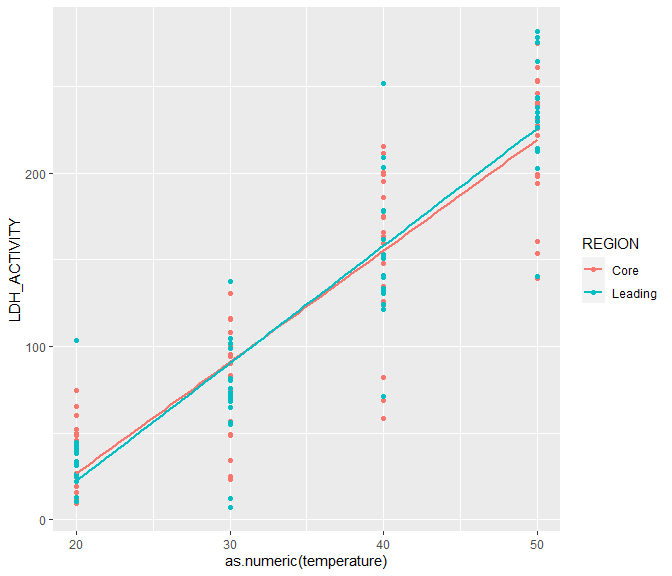
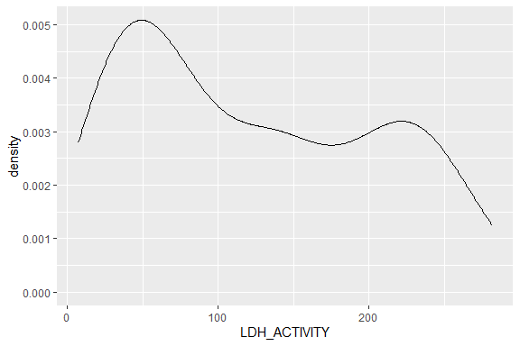
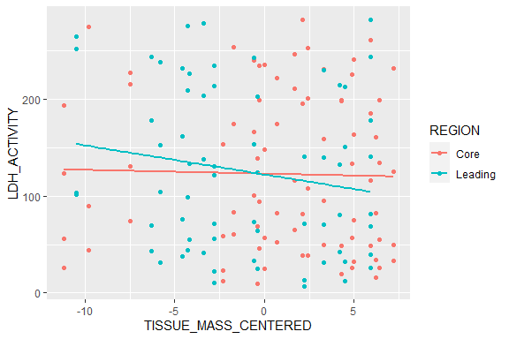
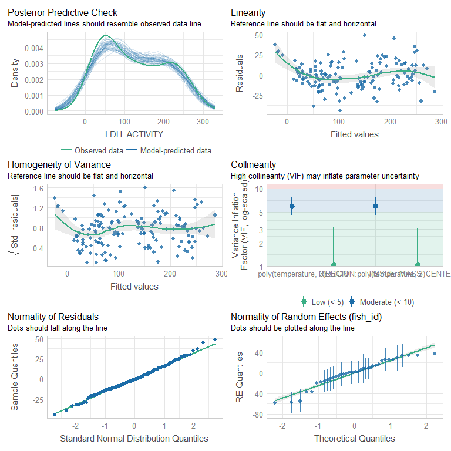
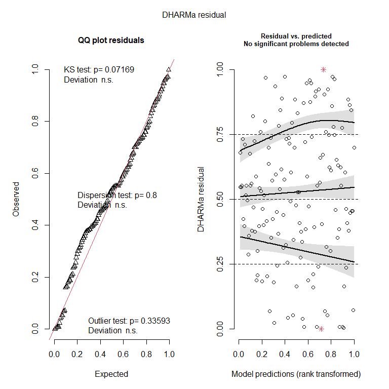
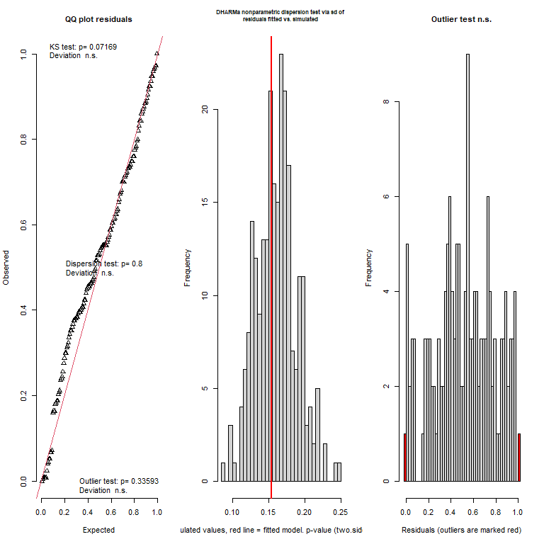
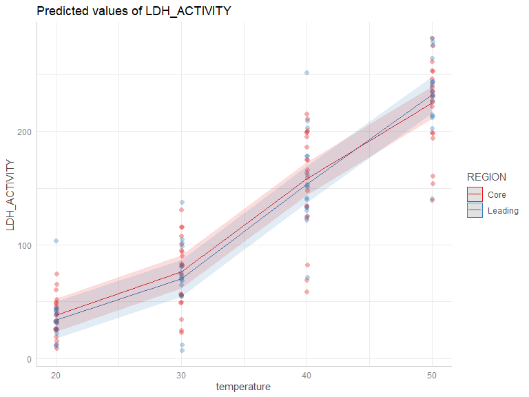
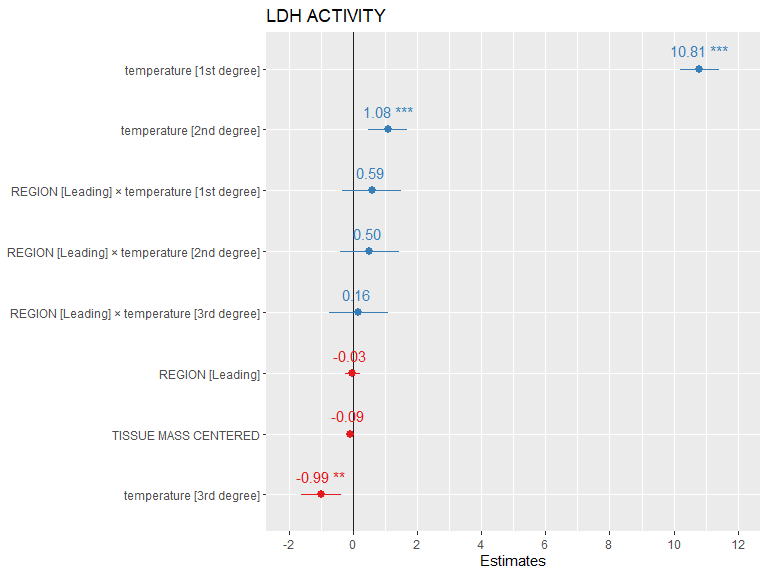
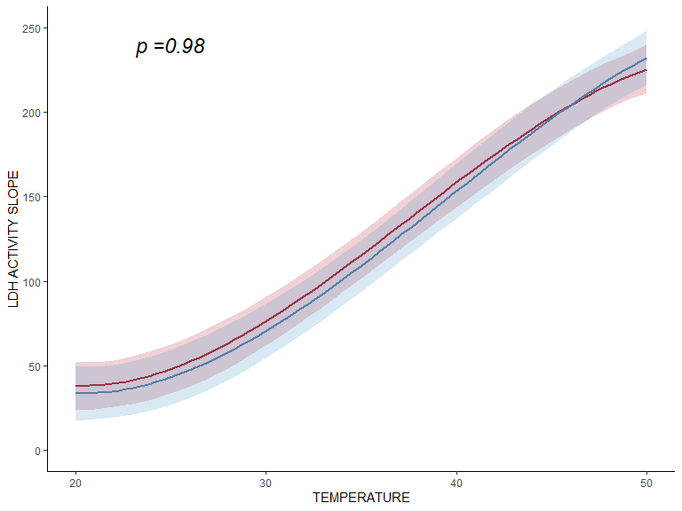

---
title: "Lactate dehydrogenase"
author: "Elliott Schmidt"
date: "07 December, 2023"
output:
  html_document:
    keep_md: yes
    code_folding: show
    collapse: no
    df_print: paged
    fig_caption: yes
    fig_height: 4
    fig_width: 6
    highlight: monochrome
    theme: flatly
    latex_engine: xelatex
    toc: yes
    toc_float: yes
    css: styles.css
  pdf_document:
    df_print: default
    fig_caption: yes
    fig_height: 4
    fig_width: 4
    highlight: tango
    latex_engine: xelatex
    number_sections: yes
    toc_depth: 2
documentclass: article
fontsize: 12pt
mainfont: Arial
mathfont: LiberationMono
classoption: a4paper
--- 

# Scenario 

For initial details on the experiment performed please read the **ReadMe** file. In brief, _Acanthochromis polyacanthus_ from two different regions on the Great Barrier Reef (GBR) were tested for metabolic performance at four different temperatures, 27$^\circ$C, 28.5$^\circ$C, 30$^\circ$C, and 31.5$^\circ$C. Fish used in this study were collected from two different regions, low- (i.e. Cairns) and high-latitude (i.e., Mackay), within each region fish were collected from a total of three different populations. After metabolic performance was tested blood and tissue samples were collected. White muscle tissue samples were used to look at the relationship between activity and temperature in two different enzymes, Lactate Dehydrogenase (LDH; anaerobic) and Citrate Synthase (CS: aerobic). Enzyme activity was measured over four different temperatures including 20$^\circ$C, 30$^\circ$C, 40$^\circ$C, and 50$^\circ$C. Enzyme activity was measured using a spectophotometer and wavelength absoprtion levels were recorded using the software program LabX. 

# Load packages 

Lets start by loading the packages that are needed 

```r
library(tidyverse) # data manipulation
library(janitor) # data manipulation
library(plyr) # data manipulation
library(dplyr) # data manipulation
library(lubridate) # data manipulation - specifically time data
library(ggplot2) # plotting figures
library(glmmTMB) # running models
library(performance) # model validation
library(chron) # data manipulation - specifically time data
library(DHARMa) # model validation
library(MuMIn) # model validation
library(kableExtra) # creating tables
library(broom) # dependent
library(emmeans) # post-hoc analysis
library(ggeffects) # plotting models/model validation
library(vtable) # creating tables
library(modelr) # model validation
library(kableExtra) # formatting output tables
library(sjPlot) # plotting models 
library(car) # used for Anova function
```

## Read in the data

Before beginning always make sure that you are working in the correct directory 


```r
knitr::opts_knit$set(root.dir=working.dir)
```

Now we can import that data. Two different data frames are being imported. The first has all the enzyme wave length absorption data for each sample and the tissue.mass data file contained information pertaining to the tissue samples that was used for each sample. Later on these two data frames will be merged. 

## Load data 

```r
ldh <- read_delim("./enzymes/LDH_LocalAdapt.txt", delim = "\t", 
                  escape_double = FALSE, col_types = cols(`Creation time` = col_datetime(format = "%d/%m/%Y %H:%M")), 
                  trim_ws = TRUE)
tissue.mass <- read.delim("C:/Users/jc527762/OneDrive - James Cook University/PhD dissertation/Data/Chapter1_LocalAdaptation/enzymes/tissue_mass.txt")
```

# Data manipulation 

Before the data can be analysed it is important to clean up the data file. I won't explain step, that can be figured out by examining the different functions. The main steps that are occurring below are columns being broken up to make new columns (this is the _separate_ function), or columns being combined to make a unique_sample_Id value. Time data can also be tricky to deal with in R, so there are a number of data manipulation steps being used to make sure that time is being read properly.


```r
#--- data preparation/manipulation ---# 
ldh2 <- ldh %>%
  clean_names() %>%
  mutate(muscle_type = str_replace(muscle_type, " ", ".")) %>%
  unite("UNIQUE_SAMPLE_ID", c(fish_id,temperature,sample_index), sep="_", remove = FALSE) %>% 
  separate(creation_time, into=c('DATE','TIME'), sep = " ", remove = FALSE) %>% 
  arrange(sample_id_1, DATE, TIME) 

ldh3 <- ldh2 %>% 
  mutate(TIME = hms(ldh2$TIME)) %>% 
  mutate(TIME = chron(times=ldh2$TIME)) %>% 
  arrange(TIME) %>%
  group_by(UNIQUE_SAMPLE_ID, sample_id_1) %>% 
  mutate(TIME_DIFF = TIME - first(TIME)) %>% 
  filter(TIME != first(TIME)) %>%
  ungroup() %>% 
  mutate(TIME_DIFF_SECS = period_to_seconds(hms(TIME_DIFF))) %>% 
  mutate(MINUTES = TIME_DIFF_SECS/60) %>% 
  mutate(MINUTES = round(MINUTES, digits = 2)) %>% 
  dplyr::rename(CUVETTE = sample_id_1) %>% 
  mutate(REGION = substr(fish_id, 1, 1 ), 
         POPULATION = substr(fish_id, 2, 4), 
         SAMPLE_NO = substr(fish_id, 5, 7)) %>% 
  mutate(REGION = case_when( REGION =="L"~ "Leading", 
                             REGION == "C" ~ "Core", 
                             TRUE ~ "na"))   
```

## Data cleaning

Next select data points will be removed. Data points have been checked using previously written app script that allows the user to look at the plotted points of samples that were run. Because we are interested in the slope, points that plateaued were removed from the analysis, as it signifies that the reaction ran out of 'fuel' to use. For LDH 'fuel' would refer to NADH, for CS 'fuel' would refer to Oxaloacetic acid. Samples that were removed were placed into one of five different groups, that can be found below: 

* **grp1**: removed last data point which was causing a plateau
* **grp2**: removed last 2 data points which was causing a plateau
* **grp3**: removed last 3 data points which was causing a plateau
* **grp4**: removed last 4 data points which was causing a plateau
* **grp5**: removed last 5 data points which was causing a plateau


```r
grp1 <- c("CSUD008_20_1","CSUD008_20_2","CSUD008_20_3","CSUD008_20_4","CSUD008_20_5","CSUD008_20_6", 
          "CVLA047_50_1","CVLA047_50_2","CVLA047_50_3","CVLA047_50_4","CVLA047_50_5","CVLA047_50_6", 
          "CVLA046_50_1","CVLA046_50_2","CVLA046_50_3","CVLA046_50_4","CVLA046_50_5","CVLA046_50_6") 
grp2 <- c("LCKM180_30_1","LCKM180_30_2","LCKM180_30_3","LCKM180_30_4","LCKM180_30_5","LCKM180_30_6", 
          "LKES172_50_1","LKES172_50_2","CLKES172_50_3","LKES172_50_4","LKES172_50_5","LKES172_50_6", 
          "LCHA114_50_1","LCHA114_50_2","LCHA114_50_3","LCHA114_50_4","LCHA114_50_5","LCHA114_50_6", 
          "CSUD074_50_1","CSUD074_50_2","CSUD074_50_3","CSUD074_50_4","CSUD074_50_5","CSUD074_50_6")
grp3 <- c("LCKM165_50_1","LCKM165_50_2","LCKM165_50_3","LCKM165_50_4","LCKM165_50_5","LCKM165_50_6", 
          "LCKM163_50_1","LCKM163_50_2","CLCKM163_50_3","LCKM163_50_4","LCKM163_50_5","LCKM163_50_6", 
          "CTON068_50_1","CTON068_50_2","CTON068_50_3","CTON068_50_4","CTON068_50_5","CTON068_50_6", 
          "CVLA104_50_1","CVLA104_50_2","CVLA104_50_3","CVLA104_50_4","CVLA104_50_5","CVLA104_50_6") 
grp4 <- c("LCHA135_50_1","LCHA135_50_2","LCHA135_50_3","LCHA135_50_4","LCHA135_50_5","LCHA135_50_6", 
          "CTON069_50_1","CTON069_50_2","CCTON069_50_3","CTON069_50_4","CTON069_50_5","CTON069_50_6", 
          "CVLA045_50_1","CVLA045_50_2","CVLA045_50_3","CVLA045_50_4","CVLA045_50_5","CVLA045_50_6") 
grp5 <- c("CSUD014_50_1","CSUD014_50_2","CSUD014_50_3","CSUD014_50_4","CSUD014_50_5","CSUD014_50_6", 
          "CTON110_50_1","CTON110_50_2","CCTON110_50_3","CTON110_50_4","CTON110_50_5","CTON110_50_6")  
```

For some samples entire runs on certain cuvettes were poor. These samples were removed below, as well as samples from each grp outlined above: 


```r
ldh3.filtered <- ldh3 %>% 
  filter(!(UNIQUE_SAMPLE_ID %in% c("LCKM154_20_1", 
                                   "LKES143_30_3", 
                                   "LKES143_20_2", 
                                   "CSUD010_40_2"))) %>% 
  group_by(UNIQUE_SAMPLE_ID) %>% 
  arrange(UNIQUE_SAMPLE_ID, TIME) %>% 
  filter(!(UNIQUE_SAMPLE_ID %in% grp1 & row_number() > (n() - 1))) %>% 
  filter(!(UNIQUE_SAMPLE_ID %in% grp2 & row_number() > (n() - 2))) %>% 
  filter(!(UNIQUE_SAMPLE_ID %in% grp3 & row_number() > (n() - 3))) %>% 
  filter(!(UNIQUE_SAMPLE_ID %in% grp4 & row_number() > (n() - 4))) %>% 
  filter(!(UNIQUE_SAMPLE_ID %in% grp5 & row_number() > (n() - 5))) %>% 
  ungroup() %>% 
  mutate(UNIQUE_SAMPLE_ID = str_sub(UNIQUE_SAMPLE_ID, end = -3)) 
```

Great! Now we have all the data points that we want to keep. However, the data needs to manipulated in a way that we can obtain and pull out slopes from the absorption readings, and the calculate enzyme activity based on these slopes. This will involve a number of steps. 

## Data calculations

### Step1: Extract slopes 

Step1 will produce a data frame that provides you with the slope that was obtained for cuvettes 1-3 for each sample run at each experimental temperature

```r
LDH_activity <- ldh3.filtered %>% 
  group_by(UNIQUE_SAMPLE_ID, CUVETTE) %>% 
  do({
    mod = lm(result ~ MINUTES, data = .)
    data.frame(Intercept = coef(mod)[1],
               Slope = coef(mod)[2], 
               r2 = summary(mod)$adj.r.squared)
  }) %>%
  ungroup() %>%
  filter(CUVETTE != ("6"))%>% 
  filter(CUVETTE != ("4"))%>% 
  filter(CUVETTE != ("5")) %>% 
  filter(Slope <= 0)
```

### Step2: Slope means

Step2 will calculate the mean slope for cuvette 1-3. 

```r
LDH_activity_means <- LDH_activity %>% 
  group_by(UNIQUE_SAMPLE_ID) %>% 
  dplyr::mutate(Mean = mean(Slope)) %>% 
  ungroup()
```

### Step3: Background activity level

Step3 will calculate background activity level by measuring the slope from cuvette 5 (postive control)

```r
LDH_background <- ldh3 %>% 
  group_by(UNIQUE_SAMPLE_ID, CUVETTE) %>% 
  do({
    mod = lm(result ~ MINUTES, data = .)
    data.frame(Intercept = coef(mod)[1],
               Slope = coef(mod)[2])
  }) %>%
  ungroup() %>%
  filter(CUVETTE == ("5")) %>% 
  dplyr::rename(Background = Slope) %>% 
  mutate(UNIQUE_SAMPLE_ID = str_sub(UNIQUE_SAMPLE_ID, end = -3)) 
```

### Step4: Merging dataframes

Step4 will merge the data frames that you created with the mean slopes and the background slopes.

```r
final_table <- LDH_activity %>% 
  full_join(distinct(LDH_activity_means[,c(1,6)]), by = "UNIQUE_SAMPLE_ID") %>% 
  full_join(LDH_background[,c(1,4)], by = "UNIQUE_SAMPLE_ID") 
final_table$Mean[duplicated(final_table$Mean)] <- ""
final_table$Background[duplicated(final_table$Background)] <- ""
final_table <- final_table %>% 
  mutate(Mean = as.numeric(Mean), 
         Background = as.numeric(Background), 
         Background_perc = Background/Mean) 
```

### Step5: Enzyme activity levels 

Step5 is where enzyme activity levels are calculated. See further details in manuscript (doi: xxx). Within this step background activity level is taken into account and subtracted from slopes where background activity was >5% or more of the sample slope. 

```r
ldh.data <- final_table %>% 
  select(c(UNIQUE_SAMPLE_ID, Mean, Background, Background_perc)) %>% 
  mutate(Mean = as.numeric(Mean), 
         Background = as.numeric(Background), 
         Background_perc = as.numeric(Background_perc)) %>% 
  mutate(Background2 = case_when(Background_perc <= 0.05 ~ 0, 
                                    TRUE ~ Background), 
         LDH_ABSORBANCE = Mean - Background2) %>%
  drop_na() %>% 
  inner_join(select(ldh3.filtered, c(UNIQUE_SAMPLE_ID, REGION, POPULATION, temperature, fish_id)), by ="UNIQUE_SAMPLE_ID") %>% 
  inner_join(tissue.mass, by = "fish_id") %>% 
  mutate(TISSUE_MASS_CENTERED = scale(TISSUE_MASS, center = TRUE, scale = FALSE)) %>%
  distinct(UNIQUE_SAMPLE_ID, REGION, POPULATION, .keep_all = TRUE) %>% 
  mutate(PATH_LENGTH = 1, 
         EXTINCTION_COEFFICIENT = 6.22, 
         TISSUE_CONCENTRATION = 0.005, 
         ASSAY_VOL = 2.975, 
         SAMPLE_VOL = 0.025, 
         LDH_ACTIVITY = ((LDH_ABSORBANCE/(PATH_LENGTH*EXTINCTION_COEFFICIENT*TISSUE_CONCENTRATION))*(ASSAY_VOL/SAMPLE_VOL))*-1) %>% 
  filter(LDH_ACTIVITY >=0)
```

By the end of this stage you should have a data frame that included a column called **LDH_ACTIVITY** along with necessary metadata - this data frame will be used to perform the statistical analysis. 

# Exploratory data analysis {.tabset}

## LDH v TEMPERATURE [LATITUDE]

```r
ggplot(ldh.data, aes(x =as.numeric(temperature), y= LDH_ACTIVITY, color = REGION)) + 
  geom_point() + geom_smooth(method = "lm", se=FALSE)
```

<!-- -->

## LDH V TEMPERATURE [DENSITY]

```r
ggplot(ldh.data, aes(x = LDH_ACTIVITY, fill = temperature, color = temperature)) + 
  geom_density(alpha =0.5, position = "identity") 
```

<!-- -->

## LDH v TISSUE MASS (LATITUDE)

```r
ggplot(ldh.data, aes(x =TISSUE_MASS_CENTERED, y= LDH_ACTIVITY, color = REGION)) + 
  geom_point() + geom_smooth(method = "lm", se=FALSE)
```

<!-- -->


## {-}

# Fit the model 

The model was fit using the **glm** and later **glmmTMB** package in R. A number of different models were tested to determine which hypothesis and associated variables best predicted resting oxygen consumption. Model fit was examined using AICc, BIC, and r-squared values. Additional model were examined via the validation diagonistics provided by the **performance** and **dHARMA** packages in R. 

The first set of models tested looked at three different hypotheses including 1) that mass has a major impact of resting oxygen consumption of fish (this has been documented in the literature), 2) if variables related to time have an important impact on the resting oxygen consumption of fish. 

## Fixed factors (linear regression models)

### model 1

```r
#--- base model ---#
ldh.model.1 <- glm(LDH_ACTIVITY ~ 1 + REGION*temperature + TISSUE_MASS_CENTERED, 
                       family=gaussian(), 
                       data = ldh.data)  
```
#### summary
<table class=" lightable-paper" style='font-family: "Arial Narrow", arial, helvetica, sans-serif; margin-left: auto; margin-right: auto;'>
 <thead>
  <tr>
   <th style="text-align:left;">   </th>
   <th style="text-align:right;"> Estimate </th>
   <th style="text-align:right;"> Std. Error </th>
   <th style="text-align:right;"> t value </th>
   <th style="text-align:right;"> Pr(&gt;|t|) </th>
  </tr>
 </thead>
<tbody>
  <tr>
   <td style="text-align:left;"> (Intercept) </td>
   <td style="text-align:right;"> -100.7330611 </td>
   <td style="text-align:right;"> 12.3696296 </td>
   <td style="text-align:right;"> -8.1435794 </td>
   <td style="text-align:right;"> 0.0000000 </td>
  </tr>
  <tr>
   <td style="text-align:left;"> REGIONLeading </td>
   <td style="text-align:right;"> -13.9358312 </td>
   <td style="text-align:right;"> 18.7015018 </td>
   <td style="text-align:right;"> -0.7451718 </td>
   <td style="text-align:right;"> 0.4573740 </td>
  </tr>
  <tr>
   <td style="text-align:left;"> temperature </td>
   <td style="text-align:right;"> 6.4321810 </td>
   <td style="text-align:right;"> 0.3368483 </td>
   <td style="text-align:right;"> 19.0951868 </td>
   <td style="text-align:right;"> 0.0000000 </td>
  </tr>
  <tr>
   <td style="text-align:left;"> TISSUE_MASS_CENTERED </td>
   <td style="text-align:right;"> -1.4968191 </td>
   <td style="text-align:right;"> 0.5843444 </td>
   <td style="text-align:right;"> -2.5615359 </td>
   <td style="text-align:right;"> 0.0114421 </td>
  </tr>
  <tr>
   <td style="text-align:left;"> REGIONLeading:temperature </td>
   <td style="text-align:right;"> 0.3442058 </td>
   <td style="text-align:right;"> 0.5071223 </td>
   <td style="text-align:right;"> 0.6787431 </td>
   <td style="text-align:right;"> 0.4983825 </td>
  </tr>
</tbody>
</table>

### model 2

```r
ldh.model.2 <- glm(LDH_ACTIVITY ~ 1 + REGION*temperature, 
                       family=gaussian(), 
                       data = ldh.data)
```

#### summary
<table class=" lightable-paper" style='font-family: "Arial Narrow", arial, helvetica, sans-serif; margin-left: auto; margin-right: auto;'>
 <thead>
  <tr>
   <th style="text-align:left;">   </th>
   <th style="text-align:right;"> Estimate </th>
   <th style="text-align:right;"> Std. Error </th>
   <th style="text-align:right;"> t value </th>
   <th style="text-align:right;"> Pr(&gt;|t|) </th>
  </tr>
 </thead>
<tbody>
  <tr>
   <td style="text-align:left;"> (Intercept) </td>
   <td style="text-align:right;"> -101.8239560 </td>
   <td style="text-align:right;"> 12.5955494 </td>
   <td style="text-align:right;"> -8.0841218 </td>
   <td style="text-align:right;"> 0.0000000 </td>
  </tr>
  <tr>
   <td style="text-align:left;"> REGIONLeading </td>
   <td style="text-align:right;"> -11.4789921 </td>
   <td style="text-align:right;"> 19.0292884 </td>
   <td style="text-align:right;"> -0.6032276 </td>
   <td style="text-align:right;"> 0.5472932 </td>
  </tr>
  <tr>
   <td style="text-align:left;"> temperature </td>
   <td style="text-align:right;"> 6.4245334 </td>
   <td style="text-align:right;"> 0.3431905 </td>
   <td style="text-align:right;"> 18.7200209 </td>
   <td style="text-align:right;"> 0.0000000 </td>
  </tr>
  <tr>
   <td style="text-align:left;"> REGIONLeading:temperature </td>
   <td style="text-align:right;"> 0.3602315 </td>
   <td style="text-align:right;"> 0.5166515 </td>
   <td style="text-align:right;"> 0.6972429 </td>
   <td style="text-align:right;"> 0.4867596 </td>
  </tr>
</tbody>
</table>

### model comparison table
<table class=" lightable-paper" style='font-family: "Arial Narrow", arial, helvetica, sans-serif; margin-left: auto; margin-right: auto;'>
 <thead>
  <tr>
   <th style="text-align:left;"> model </th>
   <th style="text-align:right;"> df </th>
   <th style="text-align:right;"> AICc </th>
   <th style="text-align:right;"> BIC </th>
   <th style="text-align:right;"> r2 </th>
  </tr>
 </thead>
<tbody>
  <tr>
   <td style="text-align:left;"> ldh.model.1 </td>
   <td style="text-align:right;"> 6 </td>
   <td style="text-align:right;"> 1495.243 </td>
   <td style="text-align:right;"> 1512.719 </td>
   <td style="text-align:right;"> 0.8226257 </td>
  </tr>
  <tr>
   <td style="text-align:left;"> ldh.model.2 </td>
   <td style="text-align:right;"> 5 </td>
   <td style="text-align:right;"> 1499.711 </td>
   <td style="text-align:right;"> 1514.347 </td>
   <td style="text-align:right;"> 0.8156748 </td>
  </tr>
</tbody>
</table>

The model that contains **TISSUE_MASS_CENTERED** seems to do better than the model that leaves TISSUE_MASS_CENTERED out. Therefore we will move ahead with the model that contains **TISSUE_MASS_CENTERED** as a co-variate.  

## Polynomials 

### polynomial models 

Note that the linear model has already been created via model _ldh.model.1_ in the previous section.


```r
#--- second order polynomial ---# 
ldh.model.1.p2 <- glm(LDH_ACTIVITY ~ 1 + REGION*poly(temperature, 2) + TISSUE_MASS_CENTERED, 
                       family=gaussian(), 
                       data = ldh.data)  

#--- third order polynomial ---# 
ldh.model.1.p3 <- glm(LDH_ACTIVITY ~ 1 + REGION*poly(temperature, 3) + TISSUE_MASS_CENTERED, 
                          family=gaussian(), 
                          data = ldh.data)  
```

#### polynomial model comparisons
<table class=" lightable-paper" style='font-family: "Arial Narrow", arial, helvetica, sans-serif; margin-left: auto; margin-right: auto;'>
 <thead>
  <tr>
   <th style="text-align:left;"> model </th>
   <th style="text-align:right;"> df </th>
   <th style="text-align:right;"> AICc </th>
   <th style="text-align:right;"> BIC </th>
   <th style="text-align:right;"> r2 </th>
  </tr>
 </thead>
<tbody>
  <tr>
   <td style="text-align:left;"> ldh.model.1 </td>
   <td style="text-align:right;"> 6 </td>
   <td style="text-align:right;"> 1495.243 </td>
   <td style="text-align:right;"> 1512.719 </td>
   <td style="text-align:right;"> 0.8265616 </td>
  </tr>
  <tr>
   <td style="text-align:left;"> ldh.model.1.p2 </td>
   <td style="text-align:right;"> 8 </td>
   <td style="text-align:right;"> 1488.592 </td>
   <td style="text-align:right;"> 1511.656 </td>
   <td style="text-align:right;"> 0.8389161 </td>
  </tr>
  <tr>
   <td style="text-align:left;"> ldh.model.1.p3 </td>
   <td style="text-align:right;"> 10 </td>
   <td style="text-align:right;"> 1487.815 </td>
   <td style="text-align:right;"> 1516.338 </td>
   <td style="text-align:right;"> 0.8445486 </td>
  </tr>
</tbody>
</table>

From our model comparison we can see that the model that runs temperature as a third order polynomial performs the best. Therefore, moving forward we will use the third order polynomial model. 

## Random factors 

Fish were repeatedly sampled over four different temperatures, therefore repeated sampling needs to be accounted for. To do this random factors will be included within the model. There are a number of options that can be used for random factors including 1) accounting for repeated sampling of individuals, 2) accounting for repeated sampling of individuals nested within population, 3) account for repeated sampling of individuals and populations without nesting. All three models will be run a compaired. 

### random factor models


```r
ldh.model.1.p3a <- glmmTMB(LDH_ACTIVITY ~ 1 + REGION*poly(temperature, 3) + TISSUE_MASS_CENTERED + (1|fish_id), 
                       family=gaussian(), 
                       data = ldh.data, 
                       REML = TRUE) 

ldh.model.1.p3b <- glmmTMB(LDH_ACTIVITY ~ 1 + REGION*poly(temperature, 3) + TISSUE_MASS_CENTERED + (1|POPULATION/fish_id), 
                  family=gaussian(), 
                  data = ldh.data, 
                  REML = TRUE) 

ldh.model.1.p3c <- glmmTMB(LDH_ACTIVITY ~ 1 + REGION*poly(temperature, 3) + TISSUE_MASS_CENTERED + (1|fish_id) + (1 + REGION|POPULATION), 
                       family=gaussian(), 
                       data = ldh.data, 
                       REML = TRUE) # convergence problem
```

#### random factor model comparisons 

<table class=" lightable-paper" style='font-family: "Arial Narrow", arial, helvetica, sans-serif; margin-left: auto; margin-right: auto;'>
 <thead>
  <tr>
   <th style="text-align:left;"> model </th>
   <th style="text-align:right;"> df </th>
   <th style="text-align:right;"> AICc </th>
   <th style="text-align:right;"> BIC </th>
   <th style="text-align:right;"> r2m </th>
   <th style="text-align:right;"> r2c </th>
  </tr>
 </thead>
<tbody>
  <tr>
   <td style="text-align:left;"> ldh.model.1.p3a </td>
   <td style="text-align:right;"> 11 </td>
   <td style="text-align:right;"> 1344.532 </td>
   <td style="text-align:right;"> 1375.736 </td>
   <td style="text-align:right;"> 0.8365953 </td>
   <td style="text-align:right;"> 0.8365953 </td>
  </tr>
  <tr>
   <td style="text-align:left;"> ldh.model.1.p3b </td>
   <td style="text-align:right;"> 12 </td>
   <td style="text-align:right;"> 1346.897 </td>
   <td style="text-align:right;"> 1380.747 </td>
   <td style="text-align:right;"> 0.8365966 </td>
   <td style="text-align:right;"> 0.8365966 </td>
  </tr>
  <tr>
   <td style="text-align:left;"> ldh.model.1.p3c </td>
   <td style="text-align:right;"> 14 </td>
   <td style="text-align:right;"> 1351.730 </td>
   <td style="text-align:right;"> 1390.768 </td>
   <td style="text-align:right;"> 0.8365957 </td>
   <td style="text-align:right;"> 0.8365957 </td>
  </tr>
</tbody>
</table>

Model _ldh.model.1.p3a_ appears to be the best model, however, there seems to be little difference in how the models change depending on how the random factors are arranged.

# Model validation {.tabset .tabset-faded}

## performance {.tabset .tabset-faded}

### rmr.3a (linear)
<!-- -->

The _ldh.model.1.p3a_ model looks like it performs well.

## DHARMa residuals {.tabset .tabset-faded}

### nas.1a (linear)

```r
ldh.model.1.p3a %>% simulateResiduals(plot=TRUE)
```

<!-- -->

```
## Object of Class DHARMa with simulated residuals based on 250 simulations with refit = FALSE . See ?DHARMa::simulateResiduals for help. 
##  
## Scaled residual values: 0.184 0.052 0 0.008 0.376 0.324 0.392 0.652 0.396 0.716 0.552 0.624 0.82 0.888 0.948 0.78 0.36 0.244 0.948 0.3 ...
```

```r
ldh.model.1.p3a %>% DHARMa::testResiduals(plot=TRUE)
```

<!-- -->

```
## $uniformity
## 
## 	Asymptotic one-sample Kolmogorov-Smirnov test
## 
## data:  simulationOutput$scaledResiduals
## D = 0.10533, p-value = 0.07169
## alternative hypothesis: two-sided
## 
## 
## $dispersion
## 
## 	DHARMa nonparametric dispersion test via sd of residuals fitted vs.
## 	simulated
## 
## data:  simulationOutput
## dispersion = 0.95832, p-value = 0.8
## alternative hypothesis: two.sided
## 
## 
## $outliers
## 
## 	DHARMa outlier test based on exact binomial test with approximate
## 	expectations
## 
## data:  simulationOutput
## outliers at both margin(s) = 2, observations = 150, p-value = 0.3359
## alternative hypothesis: true probability of success is not equal to 0.007968127
## 95 percent confidence interval:
##  0.001618827 0.047333019
## sample estimates:
## frequency of outliers (expected: 0.00796812749003984 ) 
##                                             0.01333333
```

```
## $uniformity
## 
## 	Asymptotic one-sample Kolmogorov-Smirnov test
## 
## data:  simulationOutput$scaledResiduals
## D = 0.10533, p-value = 0.07169
## alternative hypothesis: two-sided
## 
## 
## $dispersion
## 
## 	DHARMa nonparametric dispersion test via sd of residuals fitted vs.
## 	simulated
## 
## data:  simulationOutput
## dispersion = 0.95832, p-value = 0.8
## alternative hypothesis: two.sided
## 
## 
## $outliers
## 
## 	DHARMa outlier test based on exact binomial test with approximate
## 	expectations
## 
## data:  simulationOutput
## outliers at both margin(s) = 2, observations = 150, p-value = 0.3359
## alternative hypothesis: true probability of success is not equal to 0.007968127
## 95 percent confidence interval:
##  0.001618827 0.047333019
## sample estimates:
## frequency of outliers (expected: 0.00796812749003984 ) 
##                                             0.01333333
```

## {-}

# {-}

The model performs well and passes validation checks. 

# Partial plots {.tabset .tabset-faded}

## ggemmeans 

<!-- -->

## plot_model 

<!-- -->

# {-} 

# Model investigation {.tabset .tabset-faded}

## summary 
<table class=" lightable-paper" style='font-family: "Arial Narrow", arial, helvetica, sans-serif; margin-left: auto; margin-right: auto;'>
 <thead>
  <tr>
   <th style="text-align:left;">   </th>
   <th style="text-align:right;"> Estimate </th>
   <th style="text-align:right;"> StdError </th>
   <th style="text-align:right;"> Zvalue </th>
   <th style="text-align:right;"> Pvalue </th>
  </tr>
 </thead>
<tbody>
  <tr>
   <td style="text-align:left;"> (Intercept) </td>
   <td style="text-align:right;"> 124.870515 </td>
   <td style="text-align:right;"> 6.3516685 </td>
   <td style="text-align:right;"> 19.6594823 </td>
   <td style="text-align:right;"> 0.0000000 </td>
  </tr>
  <tr>
   <td style="text-align:left;"> REGIONLeading </td>
   <td style="text-align:right;"> -2.072650 </td>
   <td style="text-align:right;"> 9.6125044 </td>
   <td style="text-align:right;"> -0.2156202 </td>
   <td style="text-align:right;"> 0.8292838 </td>
  </tr>
  <tr>
   <td style="text-align:left;"> poly(temperature, 3)1 </td>
   <td style="text-align:right;"> 882.397643 </td>
   <td style="text-align:right;"> 25.4584946 </td>
   <td style="text-align:right;"> 34.6602444 </td>
   <td style="text-align:right;"> 0.0000000 </td>
  </tr>
  <tr>
   <td style="text-align:left;"> poly(temperature, 3)2 </td>
   <td style="text-align:right;"> 88.450190 </td>
   <td style="text-align:right;"> 25.6181936 </td>
   <td style="text-align:right;"> 3.4526318 </td>
   <td style="text-align:right;"> 0.0005551 </td>
  </tr>
  <tr>
   <td style="text-align:left;"> poly(temperature, 3)3 </td>
   <td style="text-align:right;"> -80.670632 </td>
   <td style="text-align:right;"> 25.7830163 </td>
   <td style="text-align:right;"> -3.1288283 </td>
   <td style="text-align:right;"> 0.0017550 </td>
  </tr>
  <tr>
   <td style="text-align:left;"> TISSUE_MASS_CENTERED </td>
   <td style="text-align:right;"> -1.519811 </td>
   <td style="text-align:right;"> 0.9641605 </td>
   <td style="text-align:right;"> -1.5763054 </td>
   <td style="text-align:right;"> 0.1149554 </td>
  </tr>
  <tr>
   <td style="text-align:left;"> REGIONLeading:poly(temperature, 3)1 </td>
   <td style="text-align:right;"> 48.117770 </td>
   <td style="text-align:right;"> 38.4025660 </td>
   <td style="text-align:right;"> 1.2529832 </td>
   <td style="text-align:right;"> 0.2102118 </td>
  </tr>
  <tr>
   <td style="text-align:left;"> REGIONLeading:poly(temperature, 3)2 </td>
   <td style="text-align:right;"> 40.901232 </td>
   <td style="text-align:right;"> 38.3469874 </td>
   <td style="text-align:right;"> 1.0666088 </td>
   <td style="text-align:right;"> 0.2861485 </td>
  </tr>
  <tr>
   <td style="text-align:left;"> REGIONLeading:poly(temperature, 3)3 </td>
   <td style="text-align:right;"> 12.973651 </td>
   <td style="text-align:right;"> 38.2874780 </td>
   <td style="text-align:right;"> 0.3388484 </td>
   <td style="text-align:right;"> 0.7347239 </td>
  </tr>
</tbody>
</table>

## Anova 
<table class=" lightable-paper" style='font-family: "Arial Narrow", arial, helvetica, sans-serif; margin-left: auto; margin-right: auto;'>
 <thead>
  <tr>
   <th style="text-align:left;">   </th>
   <th style="text-align:right;"> Chisq </th>
   <th style="text-align:right;"> Df </th>
   <th style="text-align:right;"> Pr(&gt;Chisq) </th>
  </tr>
 </thead>
<tbody>
  <tr>
   <td style="text-align:left;"> REGION </td>
   <td style="text-align:right;"> 0.0456565 </td>
   <td style="text-align:right;"> 1 </td>
   <td style="text-align:right;"> 0.8308014 </td>
  </tr>
  <tr>
   <td style="text-align:left;"> poly(temperature, 3) </td>
   <td style="text-align:right;"> 2297.2292818 </td>
   <td style="text-align:right;"> 3 </td>
   <td style="text-align:right;"> 0.0000000 </td>
  </tr>
  <tr>
   <td style="text-align:left;"> TISSUE_MASS_CENTERED </td>
   <td style="text-align:right;"> 2.4847387 </td>
   <td style="text-align:right;"> 1 </td>
   <td style="text-align:right;"> 0.1149554 </td>
  </tr>
  <tr>
   <td style="text-align:left;"> REGION:poly(temperature, 3) </td>
   <td style="text-align:right;"> 2.8373979 </td>
   <td style="text-align:right;"> 3 </td>
   <td style="text-align:right;"> 0.4173805 </td>
  </tr>
</tbody>
</table>

## confint 
<table class=" lightable-paper" style='font-family: "Arial Narrow", arial, helvetica, sans-serif; margin-left: auto; margin-right: auto;'>
 <thead>
  <tr>
   <th style="text-align:left;">   </th>
   <th style="text-align:right;"> 2.5 % </th>
   <th style="text-align:right;"> 97.5 % </th>
   <th style="text-align:right;"> Estimate </th>
  </tr>
 </thead>
<tbody>
  <tr>
   <td style="text-align:left;"> (Intercept) </td>
   <td style="text-align:right;"> 112.421473 </td>
   <td style="text-align:right;"> 137.3195565 </td>
   <td style="text-align:right;"> 124.870515 </td>
  </tr>
  <tr>
   <td style="text-align:left;"> REGIONLeading </td>
   <td style="text-align:right;"> -20.912812 </td>
   <td style="text-align:right;"> 16.7675122 </td>
   <td style="text-align:right;"> -2.072650 </td>
  </tr>
  <tr>
   <td style="text-align:left;"> poly(temperature, 3)1 </td>
   <td style="text-align:right;"> 832.499911 </td>
   <td style="text-align:right;"> 932.2953755 </td>
   <td style="text-align:right;"> 882.397643 </td>
  </tr>
  <tr>
   <td style="text-align:left;"> poly(temperature, 3)2 </td>
   <td style="text-align:right;"> 38.239453 </td>
   <td style="text-align:right;"> 138.6609266 </td>
   <td style="text-align:right;"> 88.450190 </td>
  </tr>
  <tr>
   <td style="text-align:left;"> poly(temperature, 3)3 </td>
   <td style="text-align:right;"> -131.204416 </td>
   <td style="text-align:right;"> -30.1368487 </td>
   <td style="text-align:right;"> -80.670632 </td>
  </tr>
  <tr>
   <td style="text-align:left;"> TISSUE_MASS_CENTERED </td>
   <td style="text-align:right;"> -3.409531 </td>
   <td style="text-align:right;"> 0.3699084 </td>
   <td style="text-align:right;"> -1.519811 </td>
  </tr>
  <tr>
   <td style="text-align:left;"> REGIONLeading:poly(temperature, 3)1 </td>
   <td style="text-align:right;"> -27.149876 </td>
   <td style="text-align:right;"> 123.3854163 </td>
   <td style="text-align:right;"> 48.117770 </td>
  </tr>
  <tr>
   <td style="text-align:left;"> REGIONLeading:poly(temperature, 3)2 </td>
   <td style="text-align:right;"> -34.257482 </td>
   <td style="text-align:right;"> 116.0599465 </td>
   <td style="text-align:right;"> 40.901232 </td>
  </tr>
  <tr>
   <td style="text-align:left;"> REGIONLeading:poly(temperature, 3)3 </td>
   <td style="text-align:right;"> -62.068427 </td>
   <td style="text-align:right;"> 88.0157286 </td>
   <td style="text-align:right;"> 12.973651 </td>
  </tr>
  <tr>
   <td style="text-align:left;"> Std.Dev.(Intercept)|fish_id </td>
   <td style="text-align:right;"> 20.943652 </td>
   <td style="text-align:right;"> 35.4712452 </td>
   <td style="text-align:right;"> 27.256144 </td>
  </tr>
</tbody>
</table>

## r-squared
<table class=" lightable-paper" style='font-family: "Arial Narrow", arial, helvetica, sans-serif; margin-left: auto; margin-right: auto;'>
 <thead>
  <tr>
   <th style="text-align:right;"> R2_conditional </th>
   <th style="text-align:right;"> R2_marginal </th>
   <th style="text-align:left;"> optional </th>
  </tr>
 </thead>
<tbody>
  <tr>
   <td style="text-align:right;"> 0.9464824 </td>
   <td style="text-align:right;"> 0.8365953 </td>
   <td style="text-align:left;"> FALSE </td>
  </tr>
</tbody>
</table>

# {-} 

# Pairwise comparisons {.tabset .tabset-faded} 

## emtrends [latitudes]


```r
ldh.model.1.p3a  %>% emtrends(var = "temperature", type = "response") %>% pairs(by = "temperature") %>% summary(by = NULL, adjust = "tukey", infer=TRUE)
```

<div data-pagedtable="false">
  <script data-pagedtable-source type="application/json">
{"columns":[{"label":[""],"name":["_rn_"],"type":[""],"align":["left"]},{"label":["contrast"],"name":[1],"type":["fct"],"align":["left"]},{"label":["temperature"],"name":[2],"type":["dbl"],"align":["right"]},{"label":["estimate"],"name":[3],"type":["dbl"],"align":["right"]},{"label":["SE"],"name":[4],"type":["dbl"],"align":["right"]},{"label":["df"],"name":[5],"type":["dbl"],"align":["right"]},{"label":["lower.CL"],"name":[6],"type":["dbl"],"align":["right"]},{"label":["upper.CL"],"name":[7],"type":["dbl"],"align":["right"]},{"label":["t.ratio"],"name":[8],"type":["dbl"],"align":["right"]},{"label":["p.value"],"name":[9],"type":["dbl"],"align":["right"]}],"data":[{"1":"Core TISSUE_MASS_CENTERED0.00637773359840945 - Leading TISSUE_MASS_CENTERED0.00637773359840945","2":"35.06667","3":"-0.02959867","4":"0.995009","5":"148","6":"-1.995858","7":"1.936661","8":"-0.02974714","9":"0.9763088","_rn_":"1"}],"options":{"columns":{"min":{},"max":[10]},"rows":{"min":[10],"max":[10]},"pages":{}}}
  </script>
</div>
SCROLL TO THE RIGHT -->

The numbers in the left most column in the table just mention that the slopes are assuming mean **TISSUE_MASS_CENTERED** values when looking at differences between latitudinal slopes.

## emmeans [latitudes]

```r
ldh.model.1.p3a  %>% emmeans(pairwise ~ temperature*REGION, type = "response") %>% pairs(by = "temperature") %>% summary(by = NULL, adjust = "tukey", infer=TRUE)
```

<div data-pagedtable="false">
  <script data-pagedtable-source type="application/json">
{"columns":[{"label":[""],"name":["_rn_"],"type":[""],"align":["left"]},{"label":["contrast"],"name":[1],"type":["fct"],"align":["left"]},{"label":["temperature"],"name":[2],"type":["dbl"],"align":["right"]},{"label":["estimate"],"name":[3],"type":["dbl"],"align":["right"]},{"label":["SE"],"name":[4],"type":["dbl"],"align":["right"]},{"label":["df"],"name":[5],"type":["dbl"],"align":["right"]},{"label":["lower.CL"],"name":[6],"type":["dbl"],"align":["right"]},{"label":["upper.CL"],"name":[7],"type":["dbl"],"align":["right"]},{"label":["t.ratio"],"name":[8],"type":["dbl"],"align":["right"]},{"label":["p.value"],"name":[9],"type":["dbl"],"align":["right"]}],"data":[{"1":"Core - Leading","2":"35.06667","3":"6.289375","4":"10.38063","5":"148","6":"-14.22402","7":"26.80277","8":"0.605876","9":"0.5455252","_rn_":"1"}],"options":{"columns":{"min":{},"max":[10]},"rows":{"min":[10],"max":[10]},"pages":{}}}
  </script>
</div>

## temperature 

```r
ldh.model.1.p3a  %>% emmeans(~ temperature*REGION, type = "response")  %>% summary(infer=TRUE)
```

<div data-pagedtable="false">
  <script data-pagedtable-source type="application/json">
{"columns":[{"label":[""],"name":["_rn_"],"type":[""],"align":["left"]},{"label":["temperature"],"name":[1],"type":["dbl"],"align":["right"]},{"label":["REGION"],"name":[2],"type":["fct"],"align":["left"]},{"label":["emmean"],"name":[3],"type":["dbl"],"align":["right"]},{"label":["SE"],"name":[4],"type":["dbl"],"align":["right"]},{"label":["df"],"name":[5],"type":["dbl"],"align":["right"]},{"label":["lower.CL"],"name":[6],"type":["dbl"],"align":["right"]},{"label":["upper.CL"],"name":[7],"type":["dbl"],"align":["right"]},{"label":["t.ratio"],"name":[8],"type":["dbl"],"align":["right"]},{"label":["p.value"],"name":[9],"type":["dbl"],"align":["right"]}],"data":[{"1":"35.06667","2":"Core","3":"116.0949","4":"6.884292","5":"148","6":"102.49074","7":"129.6992","8":"16.86375","9":"2.821199e-36","_rn_":"1"},{"1":"35.06667","2":"Leading","3":"109.8056","4":"7.655082","5":"148","6":"94.67819","7":"124.9330","8":"14.34414","9":"8.455227e-30","_rn_":"2"}],"options":{"columns":{"min":{},"max":[10]},"rows":{"min":[10],"max":[10]},"pages":{}}}
  </script>
</div>


## Means - f(temperature)

```r
ldh.model.1.p3a  %>% update(.~1+ REGION * as.factor(temperature) + TISSUE_MASS_CENTERED + (1|fish_id)) %>% 
  emmeans(~REGION*temperature, type = "response") %>% summary(infer=TRUE)
```

<div data-pagedtable="false">
  <script data-pagedtable-source type="application/json">
{"columns":[{"label":[""],"name":["_rn_"],"type":[""],"align":["left"]},{"label":["REGION"],"name":[1],"type":["fct"],"align":["left"]},{"label":["temperature"],"name":[2],"type":["dbl"],"align":["right"]},{"label":["emmean"],"name":[3],"type":["dbl"],"align":["right"]},{"label":["SE"],"name":[4],"type":["dbl"],"align":["right"]},{"label":["df"],"name":[5],"type":["dbl"],"align":["right"]},{"label":["lower.CL"],"name":[6],"type":["dbl"],"align":["right"]},{"label":["upper.CL"],"name":[7],"type":["dbl"],"align":["right"]},{"label":["t.ratio"],"name":[8],"type":["dbl"],"align":["right"]},{"label":["p.value"],"name":[9],"type":["dbl"],"align":["right"]}],"data":[{"1":"Core","2":"20","3":"38.09140","4":"7.291177","5":"148","6":"23.68314","7":"52.49966","8":"5.224315","9":"5.836247e-07","_rn_":"1"},{"1":"Leading","2":"20","3":"33.63759","4":"8.239782","5":"148","6":"17.35477","7":"49.92041","8":"4.082340","9":"7.269476e-05","_rn_":"2"},{"1":"Core","2":"30","3":"76.30665","4":"7.291177","5":"148","6":"61.89839","7":"90.71491","8":"10.465614","9":"1.570789e-19","_rn_":"3"},{"1":"Leading","2":"30","3":"70.53414","4":"8.138599","5":"148","6":"54.45127","7":"86.61700","8":"8.666619","9":"7.175841e-15","_rn_":"4"},{"1":"Core","2":"40","3":"158.34758","4":"7.374367","5":"148","6":"143.77493","7":"172.92024","8":"21.472702","9":"2.565838e-47","_rn_":"5"},{"1":"Leading","2":"40","3":"153.21090","4":"8.138599","5":"148","6":"137.12803","7":"169.29377","8":"18.825217","9":"4.102661e-41","_rn_":"6"},{"1":"Core","2":"50","3":"225.29548","4":"7.291177","5":"148","6":"210.88722","7":"239.70374","8":"30.899739","9":"2.003111e-66","_rn_":"7"},{"1":"Leading","2":"50","3":"232.22460","4":"8.138599","5":"148","6":"216.14173","7":"248.30746","8":"28.533730","9":"4.902599e-62","_rn_":"8"}],"options":{"columns":{"min":{},"max":[10]},"rows":{"min":[10],"max":[10]},"pages":{}}}
  </script>
</div>

## Abs. diff - f(temperature)

```r
ldh.model.1.p3a  %>% update(.~1+ REGION * as.factor(temperature) + TISSUE_MASS_CENTERED + (1|fish_id)) %>% 
  emmeans(~REGION*temperature, type = "response") %>% pairs(by ="REGION") %>% summary(infer=TRUE)
```

<div data-pagedtable="false">
  <script data-pagedtable-source type="application/json">
{"columns":[{"label":[""],"name":["_rn_"],"type":[""],"align":["left"]},{"label":["contrast"],"name":[1],"type":["fct"],"align":["left"]},{"label":["REGION"],"name":[2],"type":["fct"],"align":["left"]},{"label":["estimate"],"name":[3],"type":["dbl"],"align":["right"]},{"label":["SE"],"name":[4],"type":["dbl"],"align":["right"]},{"label":["df"],"name":[5],"type":["dbl"],"align":["right"]},{"label":["lower.CL"],"name":[6],"type":["dbl"],"align":["right"]},{"label":["upper.CL"],"name":[7],"type":["dbl"],"align":["right"]},{"label":["t.ratio"],"name":[8],"type":["dbl"],"align":["right"]},{"label":["p.value"],"name":[9],"type":["dbl"],"align":["right"]}],"data":[{"1":"temperature20 - temperature30","2":"Core","3":"-38.21524","4":"5.870090","5":"148","6":"-53.46844","7":"-22.96205","8":"-6.510163","9":"6.563142e-09","_rn_":"1"},{"1":"temperature20 - temperature40","2":"Core","3":"-120.25618","4":"5.964207","5":"148","6":"-135.75393","7":"-104.75843","8":"-20.162980","9":"2.309264e-14","_rn_":"2"},{"1":"temperature20 - temperature50","2":"Core","3":"-187.20407","4":"5.870090","5":"148","6":"-202.45727","7":"-171.95088","8":"-31.891175","9":"2.309264e-14","_rn_":"3"},{"1":"temperature30 - temperature40","2":"Core","3":"-82.04094","4":"5.964207","5":"148","6":"-97.53869","7":"-66.54319","8":"-13.755549","9":"2.309264e-14","_rn_":"4"},{"1":"temperature30 - temperature50","2":"Core","3":"-148.98883","4":"5.870090","5":"148","6":"-164.24202","7":"-133.73564","8":"-25.381012","9":"2.309264e-14","_rn_":"5"},{"1":"temperature40 - temperature50","2":"Core","3":"-66.94789","4":"5.964207","5":"148","6":"-82.44564","7":"-51.45014","8":"-11.224945","9":"4.019007e-14","_rn_":"6"},{"1":"temperature20 - temperature30","2":"Leading","3":"-36.89654","4":"6.654339","5":"148","6":"-54.18758","7":"-19.60551","8":"-5.544735","9":"7.852473e-07","_rn_":"7"},{"1":"temperature20 - temperature40","2":"Leading","3":"-119.57331","4":"6.654339","5":"148","6":"-136.86434","7":"-102.28227","8":"-17.969224","9":"2.309264e-14","_rn_":"8"},{"1":"temperature20 - temperature50","2":"Leading","3":"-198.58701","4":"6.654339","5":"148","6":"-215.87804","7":"-181.29597","8":"-29.843236","9":"2.309264e-14","_rn_":"9"},{"1":"temperature30 - temperature40","2":"Leading","3":"-82.67676","4":"6.524241","5":"148","6":"-99.62974","7":"-65.72378","8":"-12.672243","9":"2.375877e-14","_rn_":"10"},{"1":"temperature30 - temperature50","2":"Leading","3":"-161.69046","4":"6.524241","5":"148","6":"-178.64344","7":"-144.73748","8":"-24.783032","9":"2.309264e-14","_rn_":"11"},{"1":"temperature40 - temperature50","2":"Leading","3":"-79.01370","4":"6.524241","5":"148","6":"-95.96668","7":"-62.06072","8":"-12.110789","9":"2.664535e-14","_rn_":"12"}],"options":{"columns":{"min":{},"max":[10]},"rows":{"min":[10],"max":[10]},"pages":{}}}
  </script>
</div>
# {-}

# Summary figure 

<!-- -->

# Conclusion 

* In conclusion while LDH enzyme activity has a **significantly** positively correlated with temperature, however, there is no significant difference in the relationship between temperature and LDH activity when comparing fish from low- and high-latitudes.


