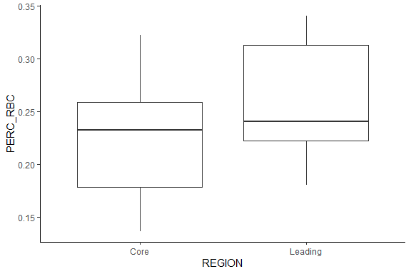
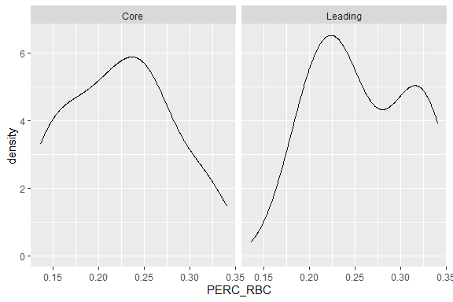
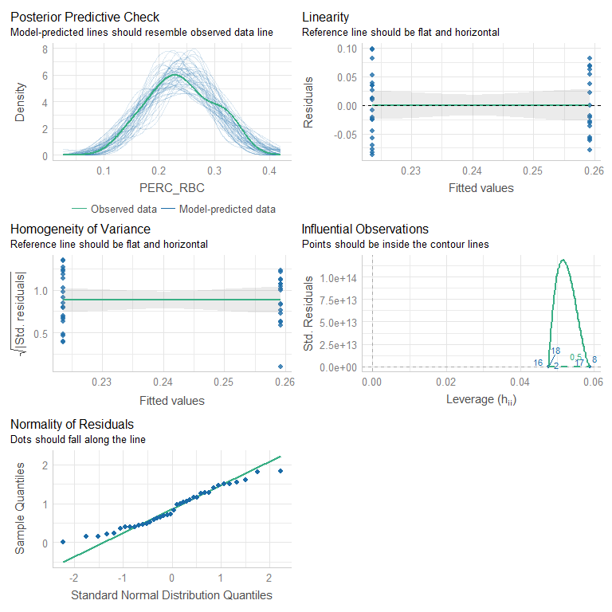
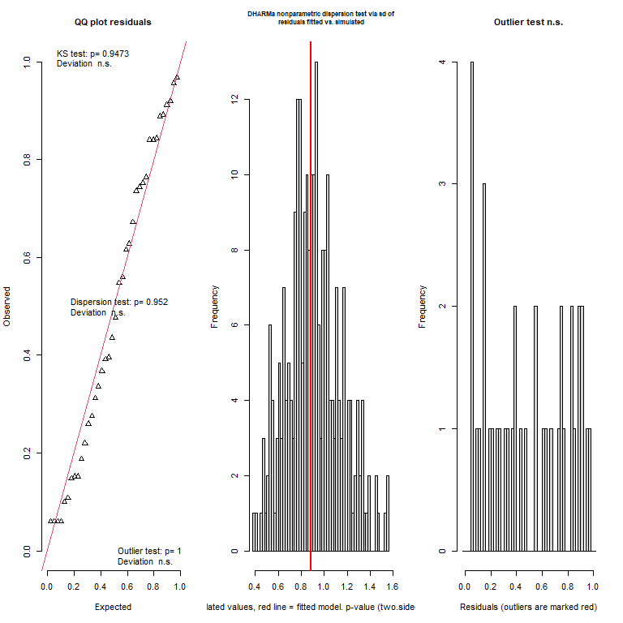
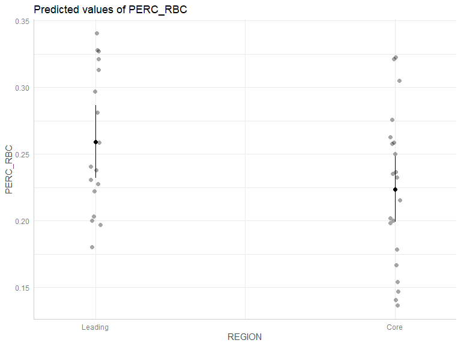
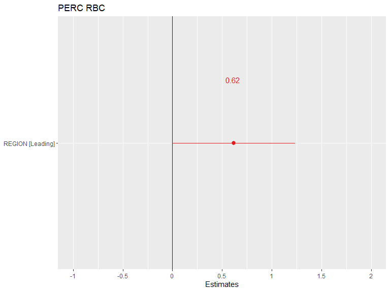
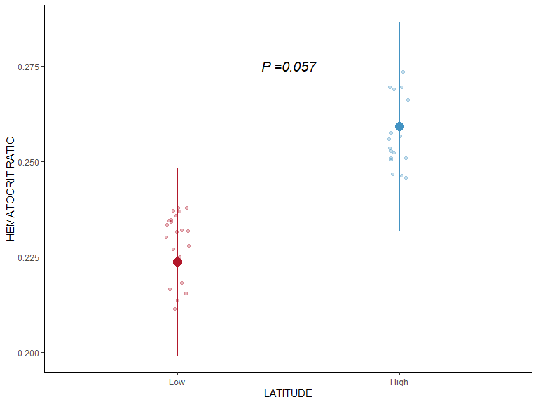

---
title: "Hematocrit"
author: "Elliott Schmidt"
date: "08 December, 2023"
output:
  html_document:
    keep_md: yes
    code_folding: show
    collapse: no
    df_print: paged
    fig_caption: yes
    fig_height: 4
    fig_width: 6
    highlight: monochrome
    theme: flatly
    latex_engine: xelatex
    toc: yes
    toc_float: yes
    css: styles.css
  pdf_document:
    df_print: default
    fig_caption: yes
    fig_height: 4
    fig_width: 4
    highlight: tango
    latex_engine: xelatex
    number_sections: yes
    toc_depth: 2
documentclass: article
fontsize: 12pt
mainfont: Arial
mathfont: LiberationMono
classoption: a4paper
--- 

# Scenario 

For initial details on the experiment performed please read the **ReadMe** file. In breif, _Acanthochromis polyacanthus_ from two different regions on the Great Barrier Reef (GBR) were tested for metabolic performance at four different temperatures, 27$^\circ$C, 28.5$^\circ$C, 30$^\circ$C, and 31.5$^\circ$C. Fish used in this study were collected from two different regions, low- (i.e. Cairns) and high-latitude (i.e., Mackay), within each region fish were collected from a total of three different populations. 

Blood samples for hematocrit sampling were collected 2-weeks after fish underwent  respiormetry testing at the final experimental temperature (31.5$^\circ$C). Hematocrit ratios were measured by comparing the amount of packed red blood cells to blood plasma, after blood samples collected via capillary tubes. 


# Read in the data

Before beginning always make sure that you are working in the correct directory 


```r
knitr::opts_knit$set(root.dir=working.dir)
```

Lets start by loading the packages that are needed 

## Load packages 


```r
library(tidyverse) # data manipulation
library(plyr) # data manipulation
library(dplyr) # data manipulation
library(lubridate) # data manipulation - specifically time data
library(ggplot2) # plotting figures
library(glmmTMB) # running models
library(performance) # model validation
library(car) # dependent
library(DHARMa) # model validation
library(MuMIn) # model validation
library(kableExtra) # creating tables
library(broom) # dependent
library(emmeans) # post-hoc analysis
library(ggeffects) # plotting models/model validation
library(vtable) # creating tables
library(modelr) # model validation
library(kableExtra) # formatting output tables
library(sjPlot) # plotting models
```


Now we can import that data. Replace import data with the PATH to your data file. I have secretly labelled my PATH import.data (i.e. import.data = "PATH TO MY FILE")

## Load data 


```r
hema <- import.data
```

# Data manipulation 

Before the data can be analysed it is important to clean up the data file. Below a number of adjustments are made, primarily making sure that columns are being treated appropriately as either factors, numeric, or as time, as well as the renaming of some columns.  


```{.r .style}
hema <-  hema %>% 
  mutate(PERC_RBC = as.numeric(PERC_RBC), 
         MASS = as.numeric(MASS),
         MASS_CENTERED = scale(MASS, center = TRUE, scale = FALSE)) %>% 
  drop_na(PERC_RBC)
```

Great! That is everything for data manipulation 

# Exploratory data analysis {.tabset}

## HEMATOCRIT V LATITUDE


```r
ggplot(hema, aes(y=PERC_RBC, x=REGION)) + 
  geom_boxplot() + 
  theme_classic() 
```

<!-- -->

## HEMATOCRIT V LATITUDE (distr)

```r
hema %>% ggplot(aes(x=PERC_RBC)) + 
  geom_density() +
  facet_wrap(~REGION)
```

<!-- -->

## {-}

# Fit the model 

The model was fit using the **glm** and later **glmmTMB** package in R. A number of different models were tested to determine which hypothesis and associated variables best predicted resting oxygen consumption. Model fit was examined using AICc, BIC, and r-squared values. Additional model were examined via the validation diagnostics provided by the **performance** and **dHARMA** packages in R. 

## Fixed factors (linear regression models)

### model 1

```r
#--- base model ---#
hema.1 <- glm(PERC_RBC ~ REGION, 
                family = gaussian(),  
                data = hema) 
```
#### summary
<table class=" lightable-paper" style='font-family: "Arial Narrow", arial, helvetica, sans-serif; margin-left: auto; margin-right: auto;'>
 <thead>
  <tr>
   <th style="text-align:left;">   </th>
   <th style="text-align:right;"> Estimate </th>
   <th style="text-align:right;"> Std. Error </th>
   <th style="text-align:right;"> t value </th>
   <th style="text-align:right;"> Pr(&gt;|t|) </th>
  </tr>
 </thead>
<tbody>
  <tr>
   <td style="text-align:left;"> (Intercept) </td>
   <td style="text-align:right;"> 0.2236353 </td>
   <td style="text-align:right;"> 0.0121433 </td>
   <td style="text-align:right;"> 18.41628 </td>
   <td style="text-align:right;"> 0.0000000 </td>
  </tr>
  <tr>
   <td style="text-align:left;"> REGIONLeading </td>
   <td style="text-align:right;"> 0.0355744 </td>
   <td style="text-align:right;"> 0.0181554 </td>
   <td style="text-align:right;"> 1.95944 </td>
   <td style="text-align:right;"> 0.0578398 </td>
  </tr>
</tbody>
</table>

### model 2

```r
#--- experimental rmr equipment hypothesis ---#
hema.2 <- glm(PERC_RBC ~ REGION + MASS_CENTERED, 
                 family = gaussian(), 
                 data = hema)  
```

#### summary
<table class=" lightable-paper" style='font-family: "Arial Narrow", arial, helvetica, sans-serif; margin-left: auto; margin-right: auto;'>
 <thead>
  <tr>
   <th style="text-align:left;">   </th>
   <th style="text-align:right;"> Estimate </th>
   <th style="text-align:right;"> Std. Error </th>
   <th style="text-align:right;"> t value </th>
   <th style="text-align:right;"> Pr(&gt;|t|) </th>
  </tr>
 </thead>
<tbody>
  <tr>
   <td style="text-align:left;"> (Intercept) </td>
   <td style="text-align:right;"> 0.2251300 </td>
   <td style="text-align:right;"> 0.0137982 </td>
   <td style="text-align:right;"> 16.3159093 </td>
   <td style="text-align:right;"> 0.0000000 </td>
  </tr>
  <tr>
   <td style="text-align:left;"> REGIONLeading </td>
   <td style="text-align:right;"> 0.0322334 </td>
   <td style="text-align:right;"> 0.0230904 </td>
   <td style="text-align:right;"> 1.3959651 </td>
   <td style="text-align:right;"> 0.1715176 </td>
  </tr>
  <tr>
   <td style="text-align:left;"> MASS_CENTERED </td>
   <td style="text-align:right;"> -0.0003688 </td>
   <td style="text-align:right;"> 0.0015402 </td>
   <td style="text-align:right;"> -0.2394485 </td>
   <td style="text-align:right;"> 0.8121545 </td>
  </tr>
</tbody>
</table>

### model comparison table
<table class=" lightable-paper" style='font-family: "Arial Narrow", arial, helvetica, sans-serif; margin-left: auto; margin-right: auto;'>
 <thead>
  <tr>
   <th style="text-align:left;"> model </th>
   <th style="text-align:right;"> df </th>
   <th style="text-align:right;"> AICc </th>
   <th style="text-align:right;"> BIC </th>
   <th style="text-align:right;"> r2 </th>
  </tr>
 </thead>
<tbody>
  <tr>
   <td style="text-align:left;"> hema.1 </td>
   <td style="text-align:right;"> 3 </td>
   <td style="text-align:right;"> -107.0515 </td>
   <td style="text-align:right;"> -102.84462 </td>
   <td style="text-align:right;"> 0.0940123 </td>
  </tr>
  <tr>
   <td style="text-align:left;"> hema.2 </td>
   <td style="text-align:right;"> 4 </td>
   <td style="text-align:right;"> -104.6075 </td>
   <td style="text-align:right;"> -99.26924 </td>
   <td style="text-align:right;"> 0.0930529 </td>
  </tr>
</tbody>
</table>

There is little difference between the two initial models, however, the model that does not include **MASS_CENTERED** prefers better via the model comparisons scores, therefore, we will move forward with the first and most simple model. 

## Random factors 

Fish were only sampled once, therefore, there is no need to include individual as a random factor. However, we will test how the inclusion of **POPULATION** influences the model.  

### random factor models


```r
hema.1 <- glmmTMB(PERC_RBC ~ REGION, 
                   family = gaussian(), 
                   REML = TRUE, 
                   data = hema) 

hema.1b <- glmmTMB(PERC_RBC ~ REGION + (1|POPULATION), 
                    family = gaussian(), 
                    REML = TRUE, 
                    data = hema) 

hema.1c <- glmmTMB(PERC_RBC ~ REGION + (REGION|POPULATION), 
                    family = gaussian(), 
                    REML = TRUE, 
                    data = hema) # convergence problem
```

```
## Warning in fitTMB(TMBStruc): Model convergence problem; singular convergence
## (7). See vignette('troubleshooting')
```

#### random factor model comparisons 

<table class=" lightable-paper" style='font-family: "Arial Narrow", arial, helvetica, sans-serif; margin-left: auto; margin-right: auto;'>
 <thead>
  <tr>
   <th style="text-align:left;"> model </th>
   <th style="text-align:right;"> df </th>
   <th style="text-align:right;"> AICc </th>
   <th style="text-align:right;"> BIC </th>
   <th style="text-align:right;"> r2m </th>
   <th style="text-align:right;"> r2c </th>
  </tr>
 </thead>
<tbody>
  <tr>
   <td style="text-align:left;"> hema.1 </td>
   <td style="text-align:right;"> 3 </td>
   <td style="text-align:right;"> -93.24011 </td>
   <td style="text-align:right;"> -89.03324 </td>
   <td style="text-align:right;"> 0.0940123 </td>
   <td style="text-align:right;"> 0.0940123 </td>
  </tr>
  <tr>
   <td style="text-align:left;"> hema.1b </td>
   <td style="text-align:right;"> 4 </td>
   <td style="text-align:right;"> -90.73388 </td>
   <td style="text-align:right;"> -85.39565 </td>
   <td style="text-align:right;"> 0.0940123 </td>
   <td style="text-align:right;"> 0.0940123 </td>
  </tr>
  <tr>
   <td style="text-align:left;"> hema.1c </td>
   <td style="text-align:right;"> 6 </td>
   <td style="text-align:right;"> -85.58393 </td>
   <td style="text-align:right;"> -78.46809 </td>
   <td style="text-align:right;"> 0.0958933 </td>
   <td style="text-align:right;"> 0.1526837 </td>
  </tr>
</tbody>
</table>

The inclusion of random effects does help explain additional variation and therefore will not be included in the model. Note the final model will be run using **glm** and not **glmmmTMB** because we are not using a mixed model. 


# Model validation {.tabset .tabset-faded}


## performance {.tabset .tabset-faded}

### hema.1
<!-- -->

## DHARMa residuals {.tabset .tabset-faded}

### hema.1 

```r
hema.1 %>% simulateResiduals(plot=TRUE)
```

<!-- -->

```
## Object of Class DHARMa with simulated residuals based on 250 simulations with refit = FALSE . See ?DHARMa::simulateResiduals for help. 
##  
## Scaled residual values: 0.892 0.956 0.616 0.744 0.06 0.548 0.1 0.06 0.108 0.148 0.188 0.06 0.628 0.392 0.396 0.06 0.912 0.968 0.84 0.276 ...
```

```r
hema.1 %>% DHARMa::testResiduals(plot=TRUE)
```

<!-- -->

```
## $uniformity
## 
## 	Asymptotic one-sample Kolmogorov-Smirnov test
## 
## data:  simulationOutput$scaledResiduals
## D = 0.084842, p-value = 0.9473
## alternative hypothesis: two-sided
## 
## 
## $dispersion
## 
## 	DHARMa nonparametric dispersion test via sd of residuals fitted vs.
## 	simulated
## 
## data:  simulationOutput
## dispersion = 0.97134, p-value = 0.952
## alternative hypothesis: two.sided
## 
## 
## $outliers
## 
## 	DHARMa outlier test based on exact binomial test with approximate
## 	expectations
## 
## data:  simulationOutput
## outliers at both margin(s) = 0, observations = 38, p-value = 1
## alternative hypothesis: true probability of success is not equal to 0.007968127
## 95 percent confidence interval:
##  0.00000000 0.09251276
## sample estimates:
## frequency of outliers (expected: 0.00796812749003984 ) 
##                                                      0
```

```
## $uniformity
## 
## 	Asymptotic one-sample Kolmogorov-Smirnov test
## 
## data:  simulationOutput$scaledResiduals
## D = 0.084842, p-value = 0.9473
## alternative hypothesis: two-sided
## 
## 
## $dispersion
## 
## 	DHARMa nonparametric dispersion test via sd of residuals fitted vs.
## 	simulated
## 
## data:  simulationOutput
## dispersion = 0.97134, p-value = 0.952
## alternative hypothesis: two.sided
## 
## 
## $outliers
## 
## 	DHARMa outlier test based on exact binomial test with approximate
## 	expectations
## 
## data:  simulationOutput
## outliers at both margin(s) = 0, observations = 38, p-value = 1
## alternative hypothesis: true probability of success is not equal to 0.007968127
## 95 percent confidence interval:
##  0.00000000 0.09251276
## sample estimates:
## frequency of outliers (expected: 0.00796812749003984 ) 
##                                                      0
```

## {-}

# {-}

The basic looks good and passes the validation checks. 

# Partial plots {.tabset .tabset-faded}

## ggemmeans 

<!-- -->

## plot_model 

<!-- -->

# {-} 

# Model investigation {.tabset .tabset-faded}

## summary 
<table class=" lightable-paper" style='font-family: "Arial Narrow", arial, helvetica, sans-serif; margin-left: auto; margin-right: auto;'>
 <thead>
  <tr>
   <th style="text-align:left;">   </th>
   <th style="text-align:right;"> Estimate </th>
   <th style="text-align:right;"> Std. Error </th>
   <th style="text-align:right;"> t value </th>
   <th style="text-align:right;"> Pr(&gt;|t|) </th>
  </tr>
 </thead>
<tbody>
  <tr>
   <td style="text-align:left;"> (Intercept) </td>
   <td style="text-align:right;"> 0.2236353 </td>
   <td style="text-align:right;"> 0.0121433 </td>
   <td style="text-align:right;"> 18.41628 </td>
   <td style="text-align:right;"> 0.0000000 </td>
  </tr>
  <tr>
   <td style="text-align:left;"> REGIONLeading </td>
   <td style="text-align:right;"> 0.0355744 </td>
   <td style="text-align:right;"> 0.0181554 </td>
   <td style="text-align:right;"> 1.95944 </td>
   <td style="text-align:right;"> 0.0578398 </td>
  </tr>
</tbody>
</table>

## Anova 
<table class=" lightable-paper" style='font-family: "Arial Narrow", arial, helvetica, sans-serif; margin-left: auto; margin-right: auto;'>
 <thead>
  <tr>
   <th style="text-align:left;">   </th>
   <th style="text-align:right;"> LR Chisq </th>
   <th style="text-align:right;"> Df </th>
   <th style="text-align:right;"> Pr(&gt;Chisq) </th>
  </tr>
 </thead>
<tbody>
  <tr>
   <td style="text-align:left;"> REGION </td>
   <td style="text-align:right;"> 3.839405 </td>
   <td style="text-align:right;"> 1 </td>
   <td style="text-align:right;"> 0.0500613 </td>
  </tr>
</tbody>
</table>

## confint 

```
## Waiting for profiling to be done...
```

<table class=" lightable-paper" style='font-family: "Arial Narrow", arial, helvetica, sans-serif; margin-left: auto; margin-right: auto;'>
 <thead>
  <tr>
   <th style="text-align:left;">   </th>
   <th style="text-align:right;"> 2.5 % </th>
   <th style="text-align:right;"> 97.5 % </th>
  </tr>
 </thead>
<tbody>
  <tr>
   <td style="text-align:left;"> (Intercept) </td>
   <td style="text-align:right;"> 0.1998348 </td>
   <td style="text-align:right;"> 0.2474358 </td>
  </tr>
  <tr>
   <td style="text-align:left;"> REGIONLeading </td>
   <td style="text-align:right;"> -0.0000095 </td>
   <td style="text-align:right;"> 0.0711583 </td>
  </tr>
</tbody>
</table>

## r-squared
<table class=" lightable-paper" style='font-family: "Arial Narrow", arial, helvetica, sans-serif; margin-left: auto; margin-right: auto;'>
 <thead>
  <tr>
   <th style="text-align:left;">   </th>
   <th style="text-align:right;"> R2 </th>
  </tr>
 </thead>
<tbody>
  <tr>
   <td style="text-align:left;"> R2 </td>
   <td style="text-align:right;"> 0.0963721 </td>
  </tr>
</tbody>
</table>


# {-} 

# Pairwise comparisons {.tabset .tabset-faded} 

## emmeans [latitudes]

```r
hema.1 %>% emmeans(pairwise ~ REGION, type = "response")
```

```
## $emmeans
##  REGION  emmean     SE df lower.CL upper.CL
##  Core     0.224 0.0121 36    0.199    0.248
##  Leading  0.259 0.0135 36    0.232    0.287
## 
## Confidence level used: 0.95 
## 
## $contrasts
##  contrast       estimate     SE df t.ratio p.value
##  Core - Leading  -0.0356 0.0182 36  -1.959  0.0578
```

# {-}

# Summary figure 

<!-- -->

# Conclusion 

* In conclusion there is no significant difference in hematocrit ratios between _A. polyacanthus_ from low- and high-latitude at 31.5$^\circ$C. 
