---
title: "Immunocompetence"
author: "Elliott Schmidt"
date: "08 December, 2023"
output:
  html_document:
    keep_md: yes
    code_folding: show
    collapse: no
    df_print: paged
    fig_caption: yes
    fig_height: 4
    fig_width: 6
    highlight: monochrome
    theme: flatly
    latex_engine: xelatex
    toc: yes
    toc_float: yes
    css: styles.css
  pdf_document:
    df_print: default
    fig_caption: yes
    fig_height: 4
    fig_width: 4
    highlight: tango
    latex_engine: xelatex
    number_sections: yes
    toc_depth: 2
documentclass: article
fontsize: 12pt
mainfont: Arial
mathfont: LiberationMono
classoption: a4paper
--- 

# Scenario 

For initial details on the experiment performed please read the **ReadMe** file. In breif, _Acanthochromis polyacanthus_ from two different regions on the Great Barrier Reef (GBR) were tested for metabolic performance at four different temperatures, 27$^\circ$C, 28.5$^\circ$C, 30$^\circ$C, and 31.5$^\circ$C. Fish used in this study were collected from two different regions, low- (i.e. Cairns) and high-latitude (i.e., Mackay), within each region fish were collected from a total of three different populations. 

Immunocompetence was tested via phytohaemaglutinin (PHA) swelling assays at the same four experimental temperatures metabolic performance was tested at. To perform the assyu fish were injected with 0.03 mL of PHA subcutaneously in the caudal peduncle. Thickness of injection site was measured pre-injection as well as 18-24hour post-injection. PHA produces a localized, cell-mediated response (e.g., inflammation, T-cell proliferation, etc).  The change in thickness between measurement periods was used as an proxy for immunocompetence.


# Read in the data

Before beginning always make sure that you are working in the correct directory 


```r
knitr::opts_knit$set(root.dir=working.dir)
```

Lets start by loading the packages that are needed 

## Load packages 


```r
library(tidyverse) # data manipulation
library(plyr) # data manipulation
library(dplyr) # data manipulation
library(lubridate) # data manipulation - specifically time data
library(ggplot2) # plotting figures
library(glmmTMB) # running models
library(performance) # model validation
library(car) # dependent
library(DHARMa) # model validation
library(MuMIn) # model validation
library(kableExtra) # creating tables
library(broom) # dependent
library(emmeans) # post-hoc analysis
library(ggeffects) # plotting models/model validation
library(vtable) # creating tables
library(modelr) # model validation
library(kableExtra) # formatting output tables
library(sjPlot) # plotting models
```


Now we can import that data. Replace import data with the PATH to your data file. I have secretly labelled my PATH import.data (i.e. import.data = "PATH TO MY FILE")

## Load data 


```r
pha <- import.data
```

# Data manipulation 

Before the data can be analysed it is important to clean up the data file. Below a number of adjustments are made, primarily making sure that columns are being treated appropriately as either factors, numeric, or as time, as well as the renaming of some columns.  


```{.r .style}
pha2 <- pha %>% 
  dplyr::rename(PHA_28.5 = PHA_285) %>%
  mutate(FISH_ID = factor(FISH_ID), 
         POPULATION = factor(POPULATION), 
         REGION = factor(REGION), 
         TANK = factor(TANK), 
         PHA_28.5 = as.numeric(PHA_28.5), 
         MASS_CENTERED = scale(MASS, center = TRUE, scale = FALSE)) %>% 
  pivot_longer(cols = c(PHA_27, 
                        PHA_28.5, 
                        PHA_30, 
                        PHA_31.5), 
               names_to = 'PHA', 
               values_to = 'IMMUNE_RESPONSE') %>% 
  separate(col = PHA, 
           into = c('TEST','TEMPERATURE'), sep = '_') %>% 
  filter(IMMUNE_RESPONSE >= 0.01) %>% # removing negative values greater than -0.05
  mutate(TEMPERATURE = as.numeric(TEMPERATURE))
```

Great! That is everything for data manipulation 

# Exploratory data analysis {.tabset}

## PHA V TEMP


```r
ggplot(pha2, aes(x=TEMPERATURE, y=IMMUNE_RESPONSE)) + 
  geom_violin(alpha = 0.5) +  # four potential outliers but will keep for now 
  geom_point() 
```

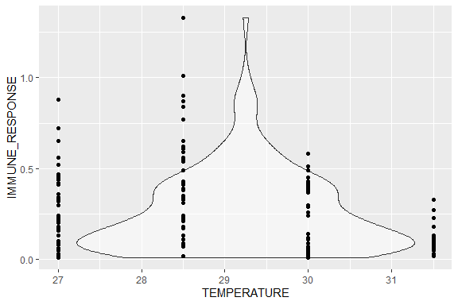<!-- -->

## PHA v TEMP (LATITUDE)

```r
ggplot(pha2, aes(x=TEMPERATURE, y=IMMUNE_RESPONSE, fill = REGION, color = REGION)) + 
  geom_violin(alpha = 0.5) + 
  geom_point(position = position_jitterdodge(dodge.width = 0.9, jitter.width = 0), color = "black")
```

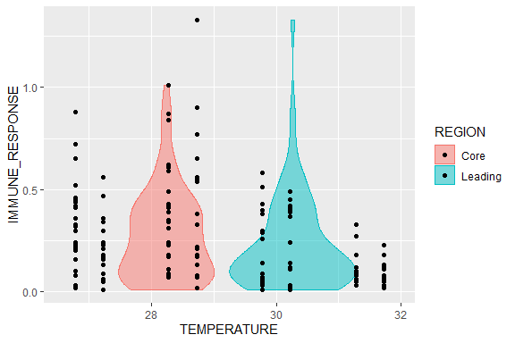<!-- -->


## PHA v MASS (LATITUDE)

```r
ggplot(pha2, aes(x=MASS_CENTERED, y=IMMUNE_RESPONSE, fill = REGION, color = REGION)) +
  geom_point() + geom_smooth(method = "lm")
```

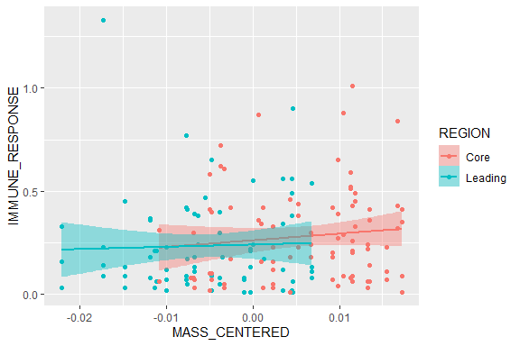<!-- -->

## {-}

# Fit the model 

The model was fit using the **glm** and later **glmmTMB** package in R. A number of different models were tested to determine which hypothesis and associated variables best predicted resting oxygen consumption. Model fit was examined using AICc, BIC, and r-squared values. Additional model were examined via the validation diagnostics provided by the **performance** and **dHARMA** packages in R. 

## Fixed factors (linear regression models)

### model 1

```r
#--- base model ---#
pha.1 <- glm(IMMUNE_RESPONSE ~ 1 + REGION * TEMPERATURE + MASS_CENTERED, 
                     family=gaussian(), 
                     data = pha2) 
```
#### summary
<table class=" lightable-paper" style='font-family: "Arial Narrow", arial, helvetica, sans-serif; margin-left: auto; margin-right: auto;'>
 <thead>
  <tr>
   <th style="text-align:left;">   </th>
   <th style="text-align:right;"> Estimate </th>
   <th style="text-align:right;"> Std. Error </th>
   <th style="text-align:right;"> t value </th>
   <th style="text-align:right;"> Pr(&gt;|t|) </th>
  </tr>
 </thead>
<tbody>
  <tr>
   <td style="text-align:left;"> (Intercept) </td>
   <td style="text-align:right;"> 1.7185981 </td>
   <td style="text-align:right;"> 0.4222908 </td>
   <td style="text-align:right;"> 4.0697030 </td>
   <td style="text-align:right;"> 0.0000750 </td>
  </tr>
  <tr>
   <td style="text-align:left;"> REGIONLeading </td>
   <td style="text-align:right;"> -0.6055925 </td>
   <td style="text-align:right;"> 0.6198923 </td>
   <td style="text-align:right;"> -0.9769318 </td>
   <td style="text-align:right;"> 0.3301350 </td>
  </tr>
  <tr>
   <td style="text-align:left;"> TEMPERATURE </td>
   <td style="text-align:right;"> -0.0504956 </td>
   <td style="text-align:right;"> 0.0146466 </td>
   <td style="text-align:right;"> -3.4476083 </td>
   <td style="text-align:right;"> 0.0007294 </td>
  </tr>
  <tr>
   <td style="text-align:left;"> MASS_CENTERED </td>
   <td style="text-align:right;"> 3.0066564 </td>
   <td style="text-align:right;"> 2.2817687 </td>
   <td style="text-align:right;"> 1.3176868 </td>
   <td style="text-align:right;"> 0.1895654 </td>
  </tr>
  <tr>
   <td style="text-align:left;"> REGIONLeading:TEMPERATURE </td>
   <td style="text-align:right;"> 0.0207950 </td>
   <td style="text-align:right;"> 0.0213983 </td>
   <td style="text-align:right;"> 0.9718052 </td>
   <td style="text-align:right;"> 0.3326714 </td>
  </tr>
</tbody>
</table>

### model 2

```r
#--- experimental rmr equipment hypothesis ---#
pha.2 <- glm(IMMUNE_RESPONSE ~ 1 + REGION * TEMPERATURE, 
                     family=gaussian(), 
                     data = pha2)  
```

#### summary
<table class=" lightable-paper" style='font-family: "Arial Narrow", arial, helvetica, sans-serif; margin-left: auto; margin-right: auto;'>
 <thead>
  <tr>
   <th style="text-align:left;">   </th>
   <th style="text-align:right;"> Estimate </th>
   <th style="text-align:right;"> Std. Error </th>
   <th style="text-align:right;"> t value </th>
   <th style="text-align:right;"> Pr(&gt;|t|) </th>
  </tr>
 </thead>
<tbody>
  <tr>
   <td style="text-align:left;"> (Intercept) </td>
   <td style="text-align:right;"> 1.6908547 </td>
   <td style="text-align:right;"> 0.4227662 </td>
   <td style="text-align:right;"> 3.9995034 </td>
   <td style="text-align:right;"> 0.0000980 </td>
  </tr>
  <tr>
   <td style="text-align:left;"> REGIONLeading </td>
   <td style="text-align:right;"> -0.6042622 </td>
   <td style="text-align:right;"> 0.6213620 </td>
   <td style="text-align:right;"> -0.9724801 </td>
   <td style="text-align:right;"> 0.3323269 </td>
  </tr>
  <tr>
   <td style="text-align:left;"> TEMPERATURE </td>
   <td style="text-align:right;"> -0.0489398 </td>
   <td style="text-align:right;"> 0.0146335 </td>
   <td style="text-align:right;"> -3.3443600 </td>
   <td style="text-align:right;"> 0.0010344 </td>
  </tr>
  <tr>
   <td style="text-align:left;"> REGIONLeading:TEMPERATURE </td>
   <td style="text-align:right;"> 0.0195688 </td>
   <td style="text-align:right;"> 0.0214288 </td>
   <td style="text-align:right;"> 0.9132038 </td>
   <td style="text-align:right;"> 0.3625536 </td>
  </tr>
</tbody>
</table>

### model comparison table
<table class=" lightable-paper" style='font-family: "Arial Narrow", arial, helvetica, sans-serif; margin-left: auto; margin-right: auto;'>
 <thead>
  <tr>
   <th style="text-align:left;"> model </th>
   <th style="text-align:right;"> df </th>
   <th style="text-align:right;"> AICc </th>
   <th style="text-align:right;"> BIC </th>
   <th style="text-align:right;"> r2 </th>
  </tr>
 </thead>
<tbody>
  <tr>
   <td style="text-align:left;"> pha.1 </td>
   <td style="text-align:right;"> 6 </td>
   <td style="text-align:right;"> -22.05659 </td>
   <td style="text-align:right;"> -4.195801 </td>
   <td style="text-align:right;"> 0.1032647 </td>
  </tr>
  <tr>
   <td style="text-align:left;"> pha.2 </td>
   <td style="text-align:right;"> 5 </td>
   <td style="text-align:right;"> -22.43443 </td>
   <td style="text-align:right;"> -7.482064 </td>
   <td style="text-align:right;"> 0.0939358 </td>
  </tr>
</tbody>
</table>

There is little difference between the two initial models, therefore, we will move forward with the model that has less terms. 

It looks like the third model is better than the previous two. Next we will test to see if the variable temperature performs best as a 1^st (linear), 2^nd (quadratic), or 3^rd (cubic) order polynomial. As the relationship between temperature and resting oxygen consumption is predicted to be non-linear. 

## Polynomials 

### polynomial models 

Note that the linear model has already been created via model _pha.2_ in the previous section.


```r
pha.2.p2 <- glm(IMMUNE_RESPONSE ~ 1 + REGION * poly(TEMPERATURE, 2), 
                 family=gaussian(),
                 data = pha2)  

pha.2.p3 <- glm(IMMUNE_RESPONSE ~ 1 + REGION * poly(TEMPERATURE, 3), 
                 family=gaussian(),
                 data = pha2)
```

#### polynomial model comparisons
<table class=" lightable-paper" style='font-family: "Arial Narrow", arial, helvetica, sans-serif; margin-left: auto; margin-right: auto;'>
 <thead>
  <tr>
   <th style="text-align:left;"> model </th>
   <th style="text-align:right;"> df </th>
   <th style="text-align:right;"> AICc </th>
   <th style="text-align:right;"> BIC </th>
   <th style="text-align:right;"> r2 </th>
  </tr>
 </thead>
<tbody>
  <tr>
   <td style="text-align:left;"> pha.2 </td>
   <td style="text-align:right;"> 5 </td>
   <td style="text-align:right;"> -22.43443 </td>
   <td style="text-align:right;"> -7.482064 </td>
   <td style="text-align:right;"> 0.0955802 </td>
  </tr>
  <tr>
   <td style="text-align:left;"> pha.2.p2 </td>
   <td style="text-align:right;"> 7 </td>
   <td style="text-align:right;"> -33.95206 </td>
   <td style="text-align:right;"> -13.211452 </td>
   <td style="text-align:right;"> 0.1814782 </td>
  </tr>
  <tr>
   <td style="text-align:left;"> pha.2.p3 </td>
   <td style="text-align:right;"> 9 </td>
   <td style="text-align:right;"> -36.46535 </td>
   <td style="text-align:right;"> -10.053268 </td>
   <td style="text-align:right;"> 0.2166317 </td>
  </tr>
</tbody>
</table>

From our model comparison we can see that the model improves when TEMPERATURE is modeled as 2$^nd$ or 3$^rd$ order polynomial. The model that implements a 3$^rd$ order polynomial performs the best, and therefore, we will be moving forward with this model.

## Random factors 

Fish were repeatedly sampled over four different temperatures, therefore repeated sampling needs to be accounted for. To do this random factors will be included within the model. There are a number of options that can be used for random factors including 1) accounting for repeated sampling of individuals, 2) accounting for repeated sampling of individuals nested within population, 3) account for repeated sampling of individuals and populations without nesting. All three models will be run a compaired. 

### random factor models


```r
pha.2.p3a <- glmmTMB(IMMUNE_RESPONSE ~ 1 + REGION * poly(TEMPERATURE, 3) + (1|FISH_ID), 
                  family=gaussian(),
                  data = pha2,
                  REML = TRUE) 


pha.2.p3b <- glmmTMB(IMMUNE_RESPONSE ~ 1 + REGION * poly(TEMPERATURE, 3) + (1|POPULATION/FISH_ID), 
                  family=gaussian(),
                  data = pha2,
                  REML = TRUE)

pha.2.p3c <- glmmTMB(IMMUNE_RESPONSE ~ 1 + REGION * poly(TEMPERATURE, 3) + (1|FISH_ID) + (1|POPULATION), 
                  family=gaussian(),
                  data = pha2,
                  REML = TRUE)
```

#### random factor model comparisons 

<table class=" lightable-paper" style='font-family: "Arial Narrow", arial, helvetica, sans-serif; margin-left: auto; margin-right: auto;'>
 <thead>
  <tr>
   <th style="text-align:left;"> model </th>
   <th style="text-align:right;"> df </th>
   <th style="text-align:right;"> AICc </th>
   <th style="text-align:right;"> BIC </th>
   <th style="text-align:right;"> r2m </th>
   <th style="text-align:right;"> r2c </th>
  </tr>
 </thead>
<tbody>
  <tr>
   <td style="text-align:left;"> pha.2.p3a </td>
   <td style="text-align:right;"> 10 </td>
   <td style="text-align:right;"> -19.04376 </td>
   <td style="text-align:right;"> 10.15879 </td>
   <td style="text-align:right;"> 0.2090404 </td>
   <td style="text-align:right;"> 0.2090404 </td>
  </tr>
  <tr>
   <td style="text-align:left;"> pha.2.p3b </td>
   <td style="text-align:right;"> 11 </td>
   <td style="text-align:right;"> -18.95044 </td>
   <td style="text-align:right;"> 13.01158 </td>
   <td style="text-align:right;"> 0.2022862 </td>
   <td style="text-align:right;"> 0.2517016 </td>
  </tr>
  <tr>
   <td style="text-align:left;"> pha.2.p3c </td>
   <td style="text-align:right;"> 11 </td>
   <td style="text-align:right;"> -18.95044 </td>
   <td style="text-align:right;"> 13.01158 </td>
   <td style="text-align:right;"> 0.2022862 </td>
   <td style="text-align:right;"> 0.2517016 </td>
  </tr>
</tbody>
</table>

There is little difference between the models, however, the nest model does seem to a bit better than the none nested model that only includes (1|FISH_ID) for this variable. There no difference between the second and third model, either could be used. Moving forward the second model with the nested random effects will be used. 

# Model validation {.tabset .tabset-faded}

## performance {.tabset .tabset-faded}

### pha.2.p3b 
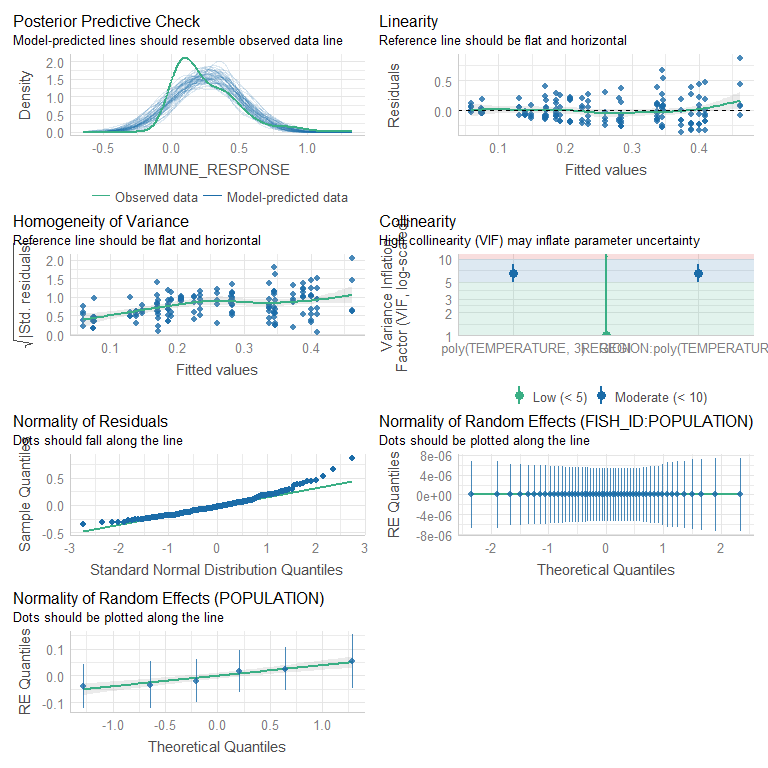<!-- -->

## DHARMa residuals {.tabset .tabset-faded}

### pha.2.p3b 

```r
pha.2.p3b %>% simulateResiduals(plot=TRUE)
```

<!-- -->

```
## Object of Class DHARMa with simulated residuals based on 250 simulations with refit = FALSE . See ?DHARMa::simulateResiduals for help. 
##  
## Scaled residual values: 0.336 0.116 0.828 0.4 0.232 0.192 0.504 0.036 0.284 0.42 0.42 0.52 0.476 0.648 0.536 0.192 0.172 0.52 0.44 0.74 ...
```

```r
pha.2.p3b %>% DHARMa::testResiduals(plot=TRUE)
```

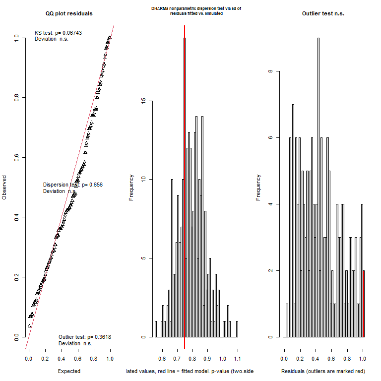<!-- -->

```
## $uniformity
## 
## 	Asymptotic one-sample Kolmogorov-Smirnov test
## 
## data:  simulationOutput$scaledResiduals
## D = 0.10325, p-value = 0.06743
## alternative hypothesis: two-sided
## 
## 
## $dispersion
## 
## 	DHARMa nonparametric dispersion test via sd of residuals fitted vs.
## 	simulated
## 
## data:  simulationOutput
## dispersion = 0.94119, p-value = 0.656
## alternative hypothesis: two.sided
## 
## 
## $outliers
## 
## 	DHARMa outlier test based on exact binomial test with approximate
## 	expectations
## 
## data:  simulationOutput
## outliers at both margin(s) = 2, observations = 159, p-value = 0.3618
## alternative hypothesis: true probability of success is not equal to 0.007968127
## 95 percent confidence interval:
##  0.001526975 0.044697834
## sample estimates:
## frequency of outliers (expected: 0.00796812749003984 ) 
##                                             0.01257862
```

```
## $uniformity
## 
## 	Asymptotic one-sample Kolmogorov-Smirnov test
## 
## data:  simulationOutput$scaledResiduals
## D = 0.10325, p-value = 0.06743
## alternative hypothesis: two-sided
## 
## 
## $dispersion
## 
## 	DHARMa nonparametric dispersion test via sd of residuals fitted vs.
## 	simulated
## 
## data:  simulationOutput
## dispersion = 0.94119, p-value = 0.656
## alternative hypothesis: two.sided
## 
## 
## $outliers
## 
## 	DHARMa outlier test based on exact binomial test with approximate
## 	expectations
## 
## data:  simulationOutput
## outliers at both margin(s) = 2, observations = 159, p-value = 0.3618
## alternative hypothesis: true probability of success is not equal to 0.007968127
## 95 percent confidence interval:
##  0.001526975 0.044697834
## sample estimates:
## frequency of outliers (expected: 0.00796812749003984 ) 
##                                             0.01257862
```

## {-}

# {-}

The _pha.2.p3b_ model performs well, however, in the model validation performed by the **performance** package our modeled predictive lines aren't matching up with our observed data as well as we might hope. There are also some issues with the residuals within our DHARMa validations. Let's see if we can fix this by including some different link functions within out model. 

# Fit the model (link transformations)


```r
pha.2.p3b <- glmmTMB(IMMUNE_RESPONSE ~ 1 + REGION * poly(TEMPERATURE, 3) + (1|POPULATION/FISH_ID), 
                  family=gaussian(),
                  data = pha2,
                  REML = FALSE)

pha.2.p3b.log <- glmmTMB(IMMUNE_RESPONSE ~ 1 + REGION * poly(TEMPERATURE, 3) + (1|POPULATION/FISH_ID), 
                  family=gaussian(link="log"),
                  data = pha2,
                  REML = FALSE) 

pha.2.p3b.inv <- glmmTMB(IMMUNE_RESPONSE ~ 1 + REGION * poly(TEMPERATURE, 3) + (1|POPULATION/FISH_ID), 
                  family=gaussian(link="inverse"),
                  data = pha2,
                  REML = FALSE)
```

# Model re-validation {.tabset .tabset-faded}

## performance {.tabset .tabset-faded}

### Gaussian (identity)

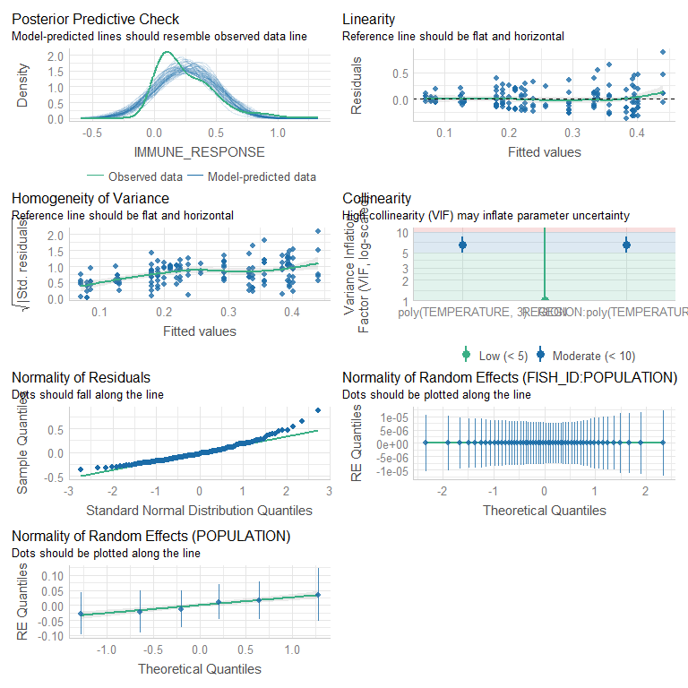<!-- -->

### Gaussian (log)
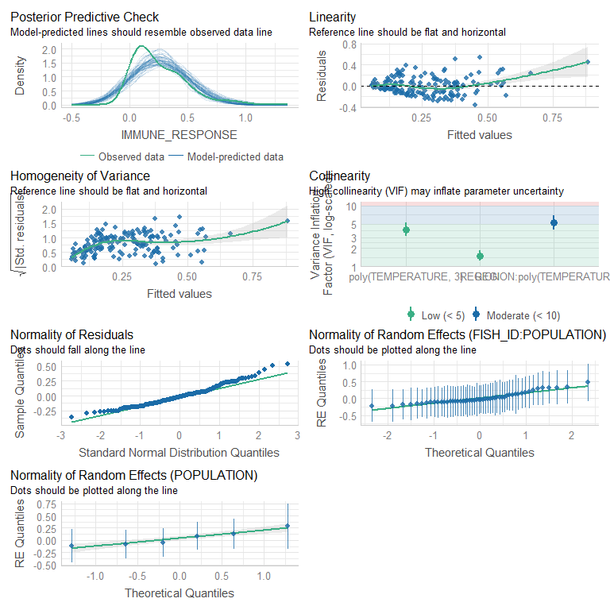<!-- -->

### Gaussian (inverse)
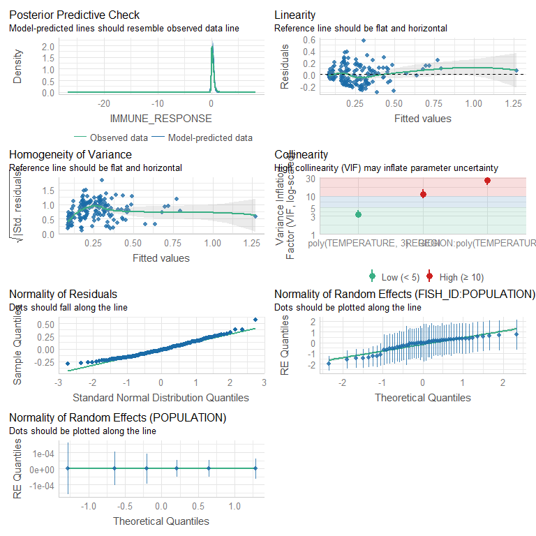<!-- -->

## DHARMa {.tabset .tabset-faded}

### Gaussian (identity)

```r
pha.2.p3b %>% simulateResiduals(plot=TRUE)
```

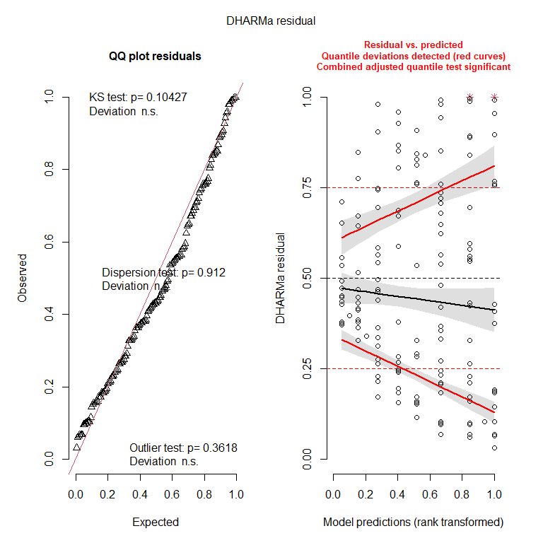<!-- -->

```
## Object of Class DHARMa with simulated residuals based on 250 simulations with refit = FALSE . See ?DHARMa::simulateResiduals for help. 
##  
## Scaled residual values: 0.34 0.104 0.84 0.396 0.228 0.192 0.496 0.032 0.284 0.428 0.408 0.536 0.464 0.652 0.544 0.188 0.172 0.536 0.44 0.748 ...
```

```r
pha.2.p3b %>% DHARMa::testResiduals(plot=TRUE)
```

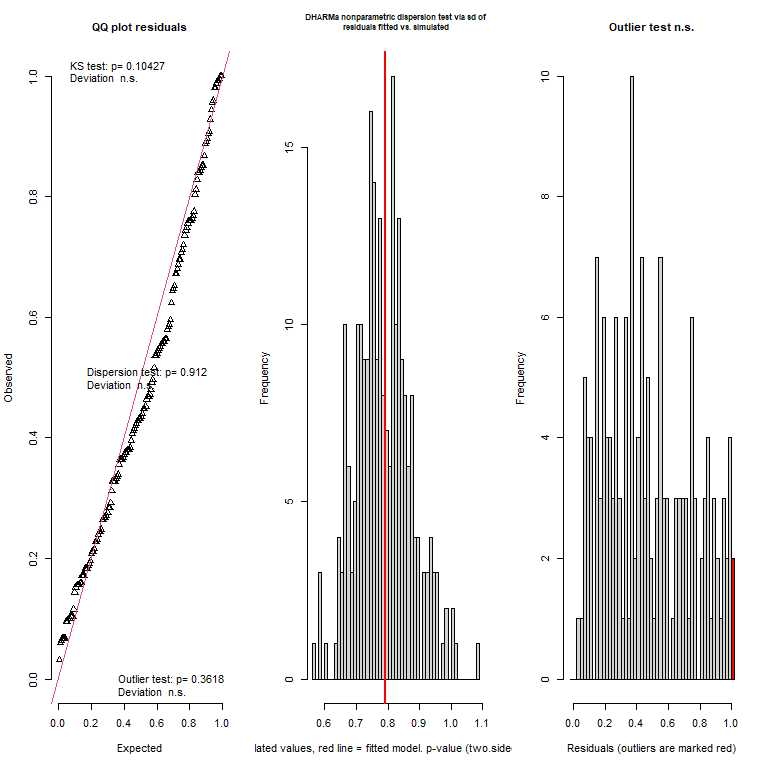<!-- -->

```
## $uniformity
## 
## 	Asymptotic one-sample Kolmogorov-Smirnov test
## 
## data:  simulationOutput$scaledResiduals
## D = 0.096377, p-value = 0.1043
## alternative hypothesis: two-sided
## 
## 
## $dispersion
## 
## 	DHARMa nonparametric dispersion test via sd of residuals fitted vs.
## 	simulated
## 
## data:  simulationOutput
## dispersion = 1.0064, p-value = 0.912
## alternative hypothesis: two.sided
## 
## 
## $outliers
## 
## 	DHARMa outlier test based on exact binomial test with approximate
## 	expectations
## 
## data:  simulationOutput
## outliers at both margin(s) = 2, observations = 159, p-value = 0.3618
## alternative hypothesis: true probability of success is not equal to 0.007968127
## 95 percent confidence interval:
##  0.001526975 0.044697834
## sample estimates:
## frequency of outliers (expected: 0.00796812749003984 ) 
##                                             0.01257862
```

```
## $uniformity
## 
## 	Asymptotic one-sample Kolmogorov-Smirnov test
## 
## data:  simulationOutput$scaledResiduals
## D = 0.096377, p-value = 0.1043
## alternative hypothesis: two-sided
## 
## 
## $dispersion
## 
## 	DHARMa nonparametric dispersion test via sd of residuals fitted vs.
## 	simulated
## 
## data:  simulationOutput
## dispersion = 1.0064, p-value = 0.912
## alternative hypothesis: two.sided
## 
## 
## $outliers
## 
## 	DHARMa outlier test based on exact binomial test with approximate
## 	expectations
## 
## data:  simulationOutput
## outliers at both margin(s) = 2, observations = 159, p-value = 0.3618
## alternative hypothesis: true probability of success is not equal to 0.007968127
## 95 percent confidence interval:
##  0.001526975 0.044697834
## sample estimates:
## frequency of outliers (expected: 0.00796812749003984 ) 
##                                             0.01257862
```

### Gaussian (log)

```r
pha.2.p3b.log %>% simulateResiduals(plot=TRUE)
```

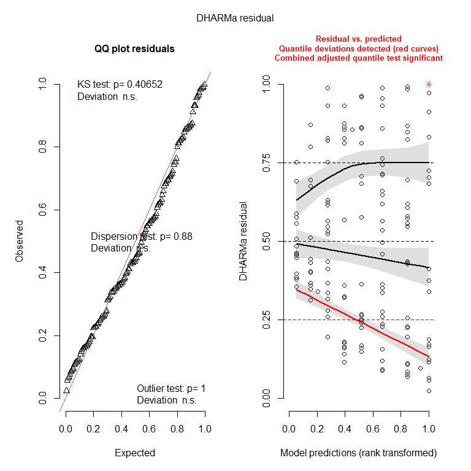<!-- -->

```
## Object of Class DHARMa with simulated residuals based on 250 simulations with refit = FALSE . See ?DHARMa::simulateResiduals for help. 
##  
## Scaled residual values: 0.34 0.096 0.856 0.384 0.28 0.172 0.564 0.024 0.324 0.448 0.376 0.568 0.524 0.692 0.632 0.188 0.18 0.556 0.532 0.82 ...
```

```r
pha.2.p3b.log %>% DHARMa::testResiduals(plot=TRUE)
```

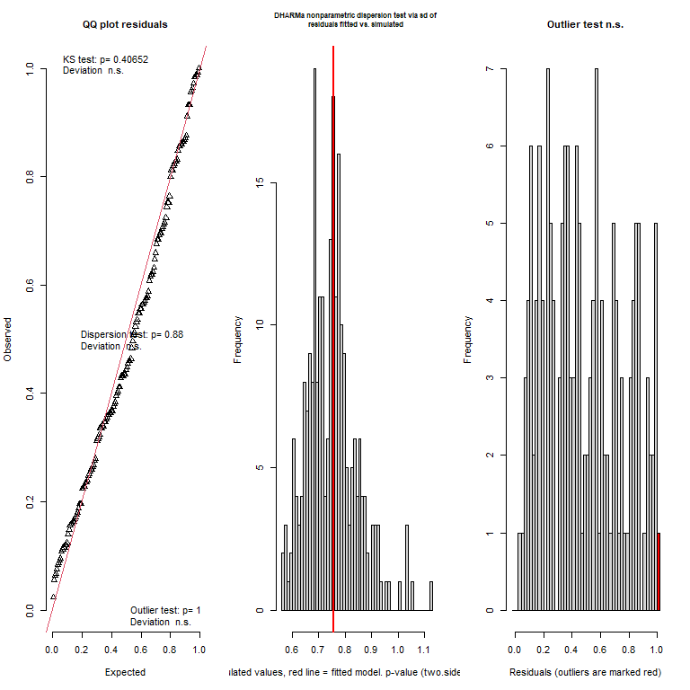<!-- -->

```
## $uniformity
## 
## 	Asymptotic one-sample Kolmogorov-Smirnov test
## 
## data:  simulationOutput$scaledResiduals
## D = 0.070591, p-value = 0.4065
## alternative hypothesis: two-sided
## 
## 
## $dispersion
## 
## 	DHARMa nonparametric dispersion test via sd of residuals fitted vs.
## 	simulated
## 
## data:  simulationOutput
## dispersion = 1.0116, p-value = 0.88
## alternative hypothesis: two.sided
## 
## 
## $outliers
## 
## 	DHARMa outlier test based on exact binomial test with approximate
## 	expectations
## 
## data:  simulationOutput
## outliers at both margin(s) = 1, observations = 159, p-value = 1
## alternative hypothesis: true probability of success is not equal to 0.007968127
## 95 percent confidence interval:
##  0.0001592188 0.0345421401
## sample estimates:
## frequency of outliers (expected: 0.00796812749003984 ) 
##                                            0.006289308
```

```
## $uniformity
## 
## 	Asymptotic one-sample Kolmogorov-Smirnov test
## 
## data:  simulationOutput$scaledResiduals
## D = 0.070591, p-value = 0.4065
## alternative hypothesis: two-sided
## 
## 
## $dispersion
## 
## 	DHARMa nonparametric dispersion test via sd of residuals fitted vs.
## 	simulated
## 
## data:  simulationOutput
## dispersion = 1.0116, p-value = 0.88
## alternative hypothesis: two.sided
## 
## 
## $outliers
## 
## 	DHARMa outlier test based on exact binomial test with approximate
## 	expectations
## 
## data:  simulationOutput
## outliers at both margin(s) = 1, observations = 159, p-value = 1
## alternative hypothesis: true probability of success is not equal to 0.007968127
## 95 percent confidence interval:
##  0.0001592188 0.0345421401
## sample estimates:
## frequency of outliers (expected: 0.00796812749003984 ) 
##                                            0.006289308
```

### Gaussian (inverse)

```r
pha.2.p3b.inv %>% simulateResiduals(plot=TRUE)
```

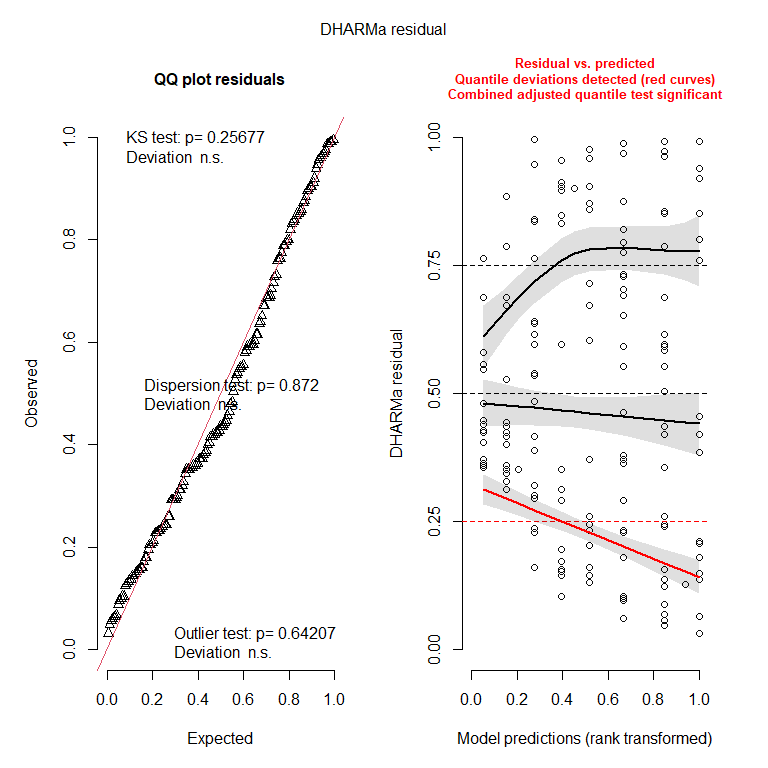<!-- -->

```
## Object of Class DHARMa with simulated residuals based on 250 simulations with refit = FALSE . See ?DHARMa::simulateResiduals for help. 
##  
## Scaled residual values: 0.352 0.128 0.9 0.372 0.236 0.212 0.596 0.032 0.312 0.424 0.42 0.596 0.54 0.688 0.636 0.208 0.196 0.548 0.484 0.84 ...
```

```r
pha.2.p3b.inv %>% DHARMa::testResiduals(plot=TRUE)
```

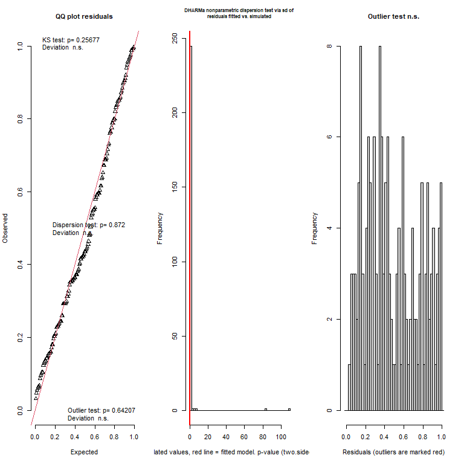<!-- -->

```
## $uniformity
## 
## 	Asymptotic one-sample Kolmogorov-Smirnov test
## 
## data:  simulationOutput$scaledResiduals
## D = 0.080302, p-value = 0.2568
## alternative hypothesis: two-sided
## 
## 
## $dispersion
## 
## 	DHARMa nonparametric dispersion test via sd of residuals fitted vs.
## 	simulated
## 
## data:  simulationOutput
## dispersion = 0.099362, p-value = 0.872
## alternative hypothesis: two.sided
## 
## 
## $outliers
## 
## 	DHARMa outlier test based on exact binomial test with approximate
## 	expectations
## 
## data:  simulationOutput
## outliers at both margin(s) = 0, observations = 159, p-value = 0.6421
## alternative hypothesis: true probability of success is not equal to 0.007968127
## 95 percent confidence interval:
##  0.00000000 0.02293344
## sample estimates:
## frequency of outliers (expected: 0.00796812749003984 ) 
##                                                      0
```

```
## $uniformity
## 
## 	Asymptotic one-sample Kolmogorov-Smirnov test
## 
## data:  simulationOutput$scaledResiduals
## D = 0.080302, p-value = 0.2568
## alternative hypothesis: two-sided
## 
## 
## $dispersion
## 
## 	DHARMa nonparametric dispersion test via sd of residuals fitted vs.
## 	simulated
## 
## data:  simulationOutput
## dispersion = 0.099362, p-value = 0.872
## alternative hypothesis: two.sided
## 
## 
## $outliers
## 
## 	DHARMa outlier test based on exact binomial test with approximate
## 	expectations
## 
## data:  simulationOutput
## outliers at both margin(s) = 0, observations = 159, p-value = 0.6421
## alternative hypothesis: true probability of success is not equal to 0.007968127
## 95 percent confidence interval:
##  0.00000000 0.02293344
## sample estimates:
## frequency of outliers (expected: 0.00796812749003984 ) 
##                                                      0
```
## {-}

# {-}

Adding **log** or **inverse** link functions to the model does not help. In fact, it seems to make the model worse! From here we can try to experiment with different distributions. The first distribution that comes to mind is the **Gamma** distribution, as it can be helpful when dealing with skewed data when the data set contains no zeros and all positive values. 

# Fit model - alternative distributions 


```r
pha.2.p3b <- glmmTMB(IMMUNE_RESPONSE ~ 1 + REGION * poly(TEMPERATURE, 3) + (1|POPULATION/FISH_ID), 
                  family=gaussian(),
                  data = pha2,
                  REML = FALSE) 

pha.2.p3b.gamma <- glmmTMB(IMMUNE_RESPONSE~ 1 + REGION* poly(TEMPERATURE, 3) + (1|POPULATION/FISH_ID), 
                       family=Gamma(link="log"), # default option
                       data = pha2, 
                       REML = FALSE)
```

<table class=" lightable-paper" style='font-family: "Arial Narrow", arial, helvetica, sans-serif; margin-left: auto; margin-right: auto;'>
 <thead>
  <tr>
   <th style="text-align:left;"> model </th>
   <th style="text-align:right;"> df </th>
   <th style="text-align:right;"> AICc </th>
   <th style="text-align:right;"> BIC </th>
   <th style="text-align:right;"> r2m </th>
   <th style="text-align:right;"> r2c </th>
  </tr>
 </thead>
<tbody>
  <tr>
   <td style="text-align:left;"> pha.2.p3b </td>
   <td style="text-align:right;"> 11 </td>
   <td style="text-align:right;"> -32.7787 </td>
   <td style="text-align:right;"> -0.8166702 </td>
   <td style="text-align:right;"> 0.2153506 </td>
   <td style="text-align:right;"> 0.2153506 </td>
  </tr>
  <tr>
   <td style="text-align:left;"> pha.2.p3b.gamma </td>
   <td style="text-align:right;"> 11 </td>
   <td style="text-align:right;"> -136.0719 </td>
   <td style="text-align:right;"> -104.1099081 </td>
   <td style="text-align:right;"> 0.2635317 </td>
   <td style="text-align:right;"> 0.2635317 </td>
  </tr>
</tbody>
</table>

From this model comparison we can see that the model fitted with the **Gamma** distribution performs much better than the model fitted with the **gaussian** distribution. Let's look at the model validation plots for out **Gamma** model. 

# Model re-re-validation {.tabset .tabset-faded}

## performance {.tabset .tabset-faded}

### Gamma distribution
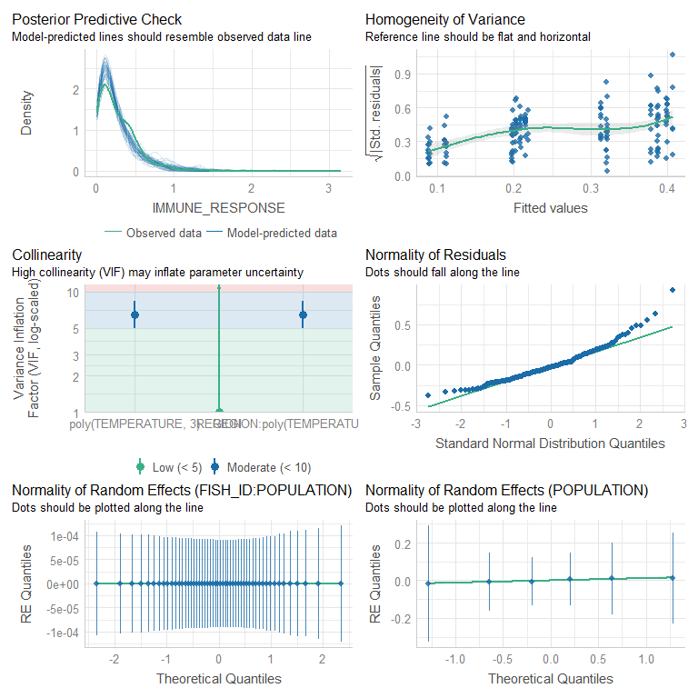<!-- -->

Looks better

## DHARMa {.tabset .tabset-faded}

### Gaussian (identity)


```r
pha.2.p3b.gamma %>% simulateResiduals(plot=TRUE)
```

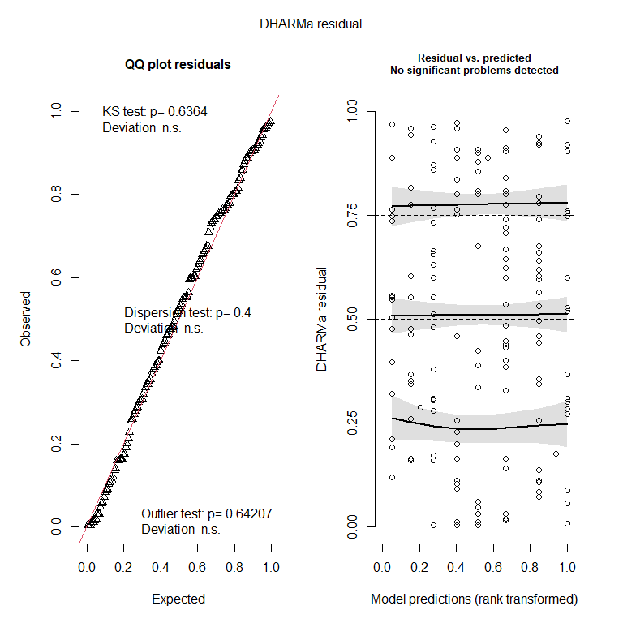<!-- -->

```
## Object of Class DHARMa with simulated residuals based on 250 simulations with refit = FALSE . See ?DHARMa::simulateResiduals for help. 
##  
## Scaled residual values: 0.288 0.176 0.888 0.212 0.16 0.3 0.664 0.008 0.388 0.504 0.6 0.676 0.6 0.888 0.656 0.368 0.012 0.736 0.552 0.86 ...
```

```r
pha.2.p3b.gamma %>% DHARMa::testResiduals(plot=TRUE)
```

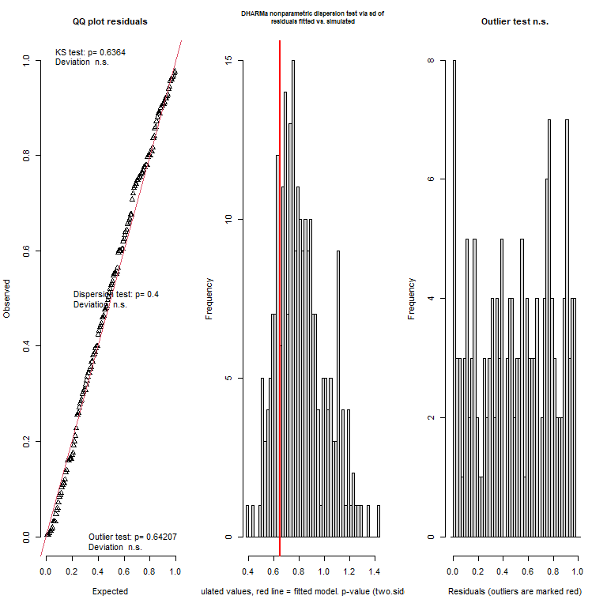<!-- -->

```
## $uniformity
## 
## 	Asymptotic one-sample Kolmogorov-Smirnov test
## 
## data:  simulationOutput$scaledResiduals
## D = 0.059044, p-value = 0.6364
## alternative hypothesis: two-sided
## 
## 
## $dispersion
## 
## 	DHARMa nonparametric dispersion test via sd of residuals fitted vs.
## 	simulated
## 
## data:  simulationOutput
## dispersion = 0.7999, p-value = 0.4
## alternative hypothesis: two.sided
## 
## 
## $outliers
## 
## 	DHARMa outlier test based on exact binomial test with approximate
## 	expectations
## 
## data:  simulationOutput
## outliers at both margin(s) = 0, observations = 159, p-value = 0.6421
## alternative hypothesis: true probability of success is not equal to 0.007968127
## 95 percent confidence interval:
##  0.00000000 0.02293344
## sample estimates:
## frequency of outliers (expected: 0.00796812749003984 ) 
##                                                      0
```

```
## $uniformity
## 
## 	Asymptotic one-sample Kolmogorov-Smirnov test
## 
## data:  simulationOutput$scaledResiduals
## D = 0.059044, p-value = 0.6364
## alternative hypothesis: two-sided
## 
## 
## $dispersion
## 
## 	DHARMa nonparametric dispersion test via sd of residuals fitted vs.
## 	simulated
## 
## data:  simulationOutput
## dispersion = 0.7999, p-value = 0.4
## alternative hypothesis: two.sided
## 
## 
## $outliers
## 
## 	DHARMa outlier test based on exact binomial test with approximate
## 	expectations
## 
## data:  simulationOutput
## outliers at both margin(s) = 0, observations = 159, p-value = 0.6421
## alternative hypothesis: true probability of success is not equal to 0.007968127
## 95 percent confidence interval:
##  0.00000000 0.02293344
## sample estimates:
## frequency of outliers (expected: 0.00796812749003984 ) 
##                                                      0
```
Looks much better!

The **Gamma** does a decent job of modelling our data and we can move forward with it and start to investigate the model.
## {-}

# {-}

# Partial plots {.tabset .tabset-faded}

## ggemmeans 

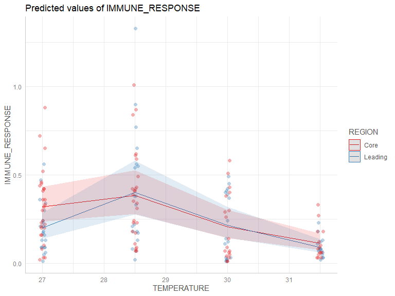<!-- -->

## plot_model 

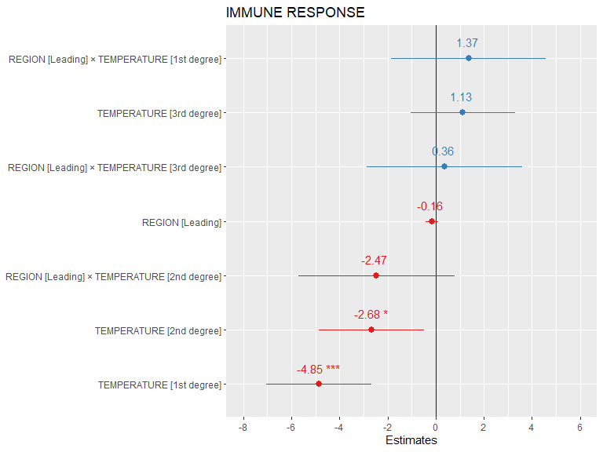<!-- -->

# {-} 

# Model investigation {.tabset .tabset-faded}

## summary 
<table class=" lightable-paper" style='font-family: "Arial Narrow", arial, helvetica, sans-serif; margin-left: auto; margin-right: auto;'>
 <thead>
  <tr>
   <th style="text-align:left;">   </th>
   <th style="text-align:right;"> Estimate </th>
   <th style="text-align:right;"> StdError </th>
   <th style="text-align:right;"> Zvalue </th>
   <th style="text-align:right;"> Pvalue </th>
  </tr>
 </thead>
<tbody>
  <tr>
   <td style="text-align:left;"> (Intercept) </td>
   <td style="text-align:right;"> -1.3847661 </td>
   <td style="text-align:right;"> 0.0907111 </td>
   <td style="text-align:right;"> -15.2656703 </td>
   <td style="text-align:right;"> 0.0000000 </td>
  </tr>
  <tr>
   <td style="text-align:left;"> REGIONLeading </td>
   <td style="text-align:right;"> -0.1636031 </td>
   <td style="text-align:right;"> 0.1348218 </td>
   <td style="text-align:right;"> -1.2134770 </td>
   <td style="text-align:right;"> 0.2249475 </td>
  </tr>
  <tr>
   <td style="text-align:left;"> poly(TEMPERATURE, 3)1 </td>
   <td style="text-align:right;"> -4.8549609 </td>
   <td style="text-align:right;"> 1.1206614 </td>
   <td style="text-align:right;"> -4.3322281 </td>
   <td style="text-align:right;"> 0.0000148 </td>
  </tr>
  <tr>
   <td style="text-align:left;"> poly(TEMPERATURE, 3)2 </td>
   <td style="text-align:right;"> -2.6825503 </td>
   <td style="text-align:right;"> 1.1140906 </td>
   <td style="text-align:right;"> -2.4078385 </td>
   <td style="text-align:right;"> 0.0160473 </td>
  </tr>
  <tr>
   <td style="text-align:left;"> poly(TEMPERATURE, 3)3 </td>
   <td style="text-align:right;"> 1.1279198 </td>
   <td style="text-align:right;"> 1.1107719 </td>
   <td style="text-align:right;"> 1.0154378 </td>
   <td style="text-align:right;"> 0.3098972 </td>
  </tr>
  <tr>
   <td style="text-align:left;"> REGIONLeading:poly(TEMPERATURE, 3)1 </td>
   <td style="text-align:right;"> 1.3686326 </td>
   <td style="text-align:right;"> 1.6384364 </td>
   <td style="text-align:right;"> 0.8353285 </td>
   <td style="text-align:right;"> 0.4035328 </td>
  </tr>
  <tr>
   <td style="text-align:left;"> REGIONLeading:poly(TEMPERATURE, 3)2 </td>
   <td style="text-align:right;"> -2.4701223 </td>
   <td style="text-align:right;"> 1.6562860 </td>
   <td style="text-align:right;"> -1.4913622 </td>
   <td style="text-align:right;"> 0.1358664 </td>
  </tr>
  <tr>
   <td style="text-align:left;"> REGIONLeading:poly(TEMPERATURE, 3)3 </td>
   <td style="text-align:right;"> 0.3600876 </td>
   <td style="text-align:right;"> 1.6536806 </td>
   <td style="text-align:right;"> 0.2177492 </td>
   <td style="text-align:right;"> 0.8276245 </td>
  </tr>
</tbody>
</table>

## Anova 
<table class=" lightable-paper" style='font-family: "Arial Narrow", arial, helvetica, sans-serif; margin-left: auto; margin-right: auto;'>
 <thead>
  <tr>
   <th style="text-align:left;">   </th>
   <th style="text-align:right;"> Chisq </th>
   <th style="text-align:right;"> Df </th>
   <th style="text-align:right;"> Pr(&gt;Chisq) </th>
  </tr>
 </thead>
<tbody>
  <tr>
   <td style="text-align:left;"> REGION </td>
   <td style="text-align:right;"> 1.421053 </td>
   <td style="text-align:right;"> 1 </td>
   <td style="text-align:right;"> 0.2332302 </td>
  </tr>
  <tr>
   <td style="text-align:left;"> poly(TEMPERATURE, 3) </td>
   <td style="text-align:right;"> 50.414204 </td>
   <td style="text-align:right;"> 3 </td>
   <td style="text-align:right;"> 0.0000000 </td>
  </tr>
  <tr>
   <td style="text-align:left;"> REGION:poly(TEMPERATURE, 3) </td>
   <td style="text-align:right;"> 2.933305 </td>
   <td style="text-align:right;"> 3 </td>
   <td style="text-align:right;"> 0.4020230 </td>
  </tr>
</tbody>
</table>

## confint 
<table class=" lightable-paper" style='font-family: "Arial Narrow", arial, helvetica, sans-serif; margin-left: auto; margin-right: auto;'>
 <thead>
  <tr>
   <th style="text-align:left;">   </th>
   <th style="text-align:right;"> 2.5 % </th>
   <th style="text-align:right;"> 97.5 % </th>
   <th style="text-align:right;"> Estimate </th>
  </tr>
 </thead>
<tbody>
  <tr>
   <td style="text-align:left;"> (Intercept) </td>
   <td style="text-align:right;"> -1.5625566 </td>
   <td style="text-align:right;"> -1.2069755 </td>
   <td style="text-align:right;"> -1.3847661 </td>
  </tr>
  <tr>
   <td style="text-align:left;"> REGIONLeading </td>
   <td style="text-align:right;"> -0.4278489 </td>
   <td style="text-align:right;"> 0.1006427 </td>
   <td style="text-align:right;"> -0.1636031 </td>
  </tr>
  <tr>
   <td style="text-align:left;"> poly(TEMPERATURE, 3)1 </td>
   <td style="text-align:right;"> -7.0514170 </td>
   <td style="text-align:right;"> -2.6585049 </td>
   <td style="text-align:right;"> -4.8549609 </td>
  </tr>
  <tr>
   <td style="text-align:left;"> poly(TEMPERATURE, 3)2 </td>
   <td style="text-align:right;"> -4.8661279 </td>
   <td style="text-align:right;"> -0.4989728 </td>
   <td style="text-align:right;"> -2.6825503 </td>
  </tr>
  <tr>
   <td style="text-align:left;"> poly(TEMPERATURE, 3)3 </td>
   <td style="text-align:right;"> -1.0491531 </td>
   <td style="text-align:right;"> 3.3049927 </td>
   <td style="text-align:right;"> 1.1279198 </td>
  </tr>
  <tr>
   <td style="text-align:left;"> REGIONLeading:poly(TEMPERATURE, 3)1 </td>
   <td style="text-align:right;"> -1.8426438 </td>
   <td style="text-align:right;"> 4.5799090 </td>
   <td style="text-align:right;"> 1.3686326 </td>
  </tr>
  <tr>
   <td style="text-align:left;"> REGIONLeading:poly(TEMPERATURE, 3)2 </td>
   <td style="text-align:right;"> -5.7163832 </td>
   <td style="text-align:right;"> 0.7761385 </td>
   <td style="text-align:right;"> -2.4701223 </td>
  </tr>
  <tr>
   <td style="text-align:left;"> REGIONLeading:poly(TEMPERATURE, 3)3 </td>
   <td style="text-align:right;"> -2.8810668 </td>
   <td style="text-align:right;"> 3.6012420 </td>
   <td style="text-align:right;"> 0.3600876 </td>
  </tr>
  <tr>
   <td style="text-align:left;"> Std.Dev.(Intercept)|FISH_ID:POPULATION </td>
   <td style="text-align:right;"> 0.0000000 </td>
   <td style="text-align:right;"> Inf </td>
   <td style="text-align:right;"> 0.0000462 </td>
  </tr>
  <tr>
   <td style="text-align:left;"> Std.Dev.(Intercept)|POPULATION </td>
   <td style="text-align:right;"> 0.0000024 </td>
   <td style="text-align:right;"> 691.9122734 </td>
   <td style="text-align:right;"> 0.0410140 </td>
  </tr>
</tbody>
</table>

## r-squared
<table class=" lightable-paper" style='font-family: "Arial Narrow", arial, helvetica, sans-serif; margin-left: auto; margin-right: auto;'>
 <thead>
  <tr>
   <th style="text-align:right;"> R2_conditional </th>
   <th style="text-align:right;"> R2_marginal </th>
   <th style="text-align:left;"> optional </th>
  </tr>
 </thead>
<tbody>
  <tr>
   <td style="text-align:right;"> 0.265392 </td>
   <td style="text-align:right;"> 0.2635317 </td>
   <td style="text-align:left;"> FALSE </td>
  </tr>
</tbody>
</table>

Note that the random effects within this model are explaining very little variance, and are largely non-informative. 

# {-} 

# Pairwise comparisons {.tabset .tabset-faded} 

## emtrends [latitudes]


```r
pha.2.p3b.gamma %>% emtrends(var = "TEMPERATURE", type = "response") %>% pairs(by = "TEMPERATURE") %>% summary(by = NULL, adjust = "tukey", infer=TRUE)
```

<div data-pagedtable="false">
  <script data-pagedtable-source type="application/json">
{"columns":[{"label":[""],"name":["_rn_"],"type":[""],"align":["left"]},{"label":["contrast"],"name":[1],"type":["fct"],"align":["left"]},{"label":["TEMPERATURE"],"name":[2],"type":["dbl"],"align":["right"]},{"label":["estimate"],"name":[3],"type":["dbl"],"align":["right"]},{"label":["SE"],"name":[4],"type":["dbl"],"align":["right"]},{"label":["df"],"name":[5],"type":["dbl"],"align":["right"]},{"label":["asymp.LCL"],"name":[6],"type":["dbl"],"align":["right"]},{"label":["asymp.UCL"],"name":[7],"type":["dbl"],"align":["right"]},{"label":["z.ratio"],"name":[8],"type":["dbl"],"align":["right"]},{"label":["p.value"],"name":[9],"type":["dbl"],"align":["right"]}],"data":[{"1":"Core - Leading","2":"28.93396","3":"-0.04913999","4":"0.2681054","5":"Inf","6":"-0.5746169","7":"0.476337","8":"-0.1832861","9":"0.8545736","_rn_":"1"}],"options":{"columns":{"min":{},"max":[10]},"rows":{"min":[10],"max":[10]},"pages":{}}}
  </script>
</div>
SCROLL TO THE RIGHT -->

The numbers in the left most column in the table just mention that the slopes are assuming mean **MASS_CENTERED** and **RESTING_TIME_SEONDS** values when looking at differences between latitudinal slopes.

## emmeans [latitudes]

```r
pha.2.p3b.gamma %>% emmeans(pairwise ~ TEMPERATURE*REGION, type = "response") %>% pairs(by = "TEMPERATURE") %>% summary(by = NULL, adjust = "tukey", infer=TRUE)
```

<div data-pagedtable="false">
  <script data-pagedtable-source type="application/json">
{"columns":[{"label":[""],"name":["_rn_"],"type":[""],"align":["left"]},{"label":["contrast"],"name":[1],"type":["fct"],"align":["left"]},{"label":["TEMPERATURE"],"name":[2],"type":["fct"],"align":["left"]},{"label":["ratio"],"name":[3],"type":["dbl"],"align":["right"]},{"label":["SE"],"name":[4],"type":["dbl"],"align":["right"]},{"label":["df"],"name":[5],"type":["dbl"],"align":["right"]},{"label":["asymp.LCL"],"name":[6],"type":["dbl"],"align":["right"]},{"label":["asymp.UCL"],"name":[7],"type":["dbl"],"align":["right"]},{"label":["null"],"name":[8],"type":["dbl"],"align":["right"]},{"label":["z.ratio"],"name":[9],"type":["dbl"],"align":["right"]},{"label":["p.value"],"name":[10],"type":["dbl"],"align":["right"]}],"data":[{"1":"Core / Leading","2":"28.9339622641509","3":"0.9176346","4":"0.1984969","5":"Inf","6":"0.6005418","7":"1.402156","8":"1","9":"-0.3973676","10":"0.6910964","_rn_":"1"}],"options":{"columns":{"min":{},"max":[10]},"rows":{"min":[10],"max":[10]},"pages":{}}}
  </script>
</div>

## temperature 

```r
pha.2.p3b.gamma %>% emmeans(~ TEMPERATURE*REGION, type = "response")  %>% summary(infer=TRUE)
```

<div data-pagedtable="false">
  <script data-pagedtable-source type="application/json">
{"columns":[{"label":[""],"name":["_rn_"],"type":[""],"align":["left"]},{"label":["TEMPERATURE"],"name":[1],"type":["dbl"],"align":["right"]},{"label":["REGION"],"name":[2],"type":["fct"],"align":["left"]},{"label":["response"],"name":[3],"type":["dbl"],"align":["right"]},{"label":["SE"],"name":[4],"type":["dbl"],"align":["right"]},{"label":["df"],"name":[5],"type":["dbl"],"align":["right"]},{"label":["asymp.LCL"],"name":[6],"type":["dbl"],"align":["right"]},{"label":["asymp.UCL"],"name":[7],"type":["dbl"],"align":["right"]},{"label":["null"],"name":[8],"type":["dbl"],"align":["right"]},{"label":["z.ratio"],"name":[9],"type":["dbl"],"align":["right"]},{"label":["p.value"],"name":[10],"type":["dbl"],"align":["right"]}],"data":[{"1":"28.93396","2":"Core","3":"0.3367694","4":"0.04797364","5":"Inf","6":"0.2547281","7":"0.4452341","8":"1","9":"-7.640139","10":"2.169876e-14","_rn_":"1"},{"1":"28.93396","2":"Leading","3":"0.3669973","4":"0.05954336","5":"Inf","6":"0.2670299","7":"0.5043892","8":"1","9":"-6.178327","10":"6.478437e-10","_rn_":"2"}],"options":{"columns":{"min":{},"max":[10]},"rows":{"min":[10],"max":[10]},"pages":{}}}
  </script>
</div>


## Means - f(temperature)

```r
pha.2.p3b.gamma %>% update(.~ 1 + REGION* as.factor(TEMPERATURE) + (1|POPULATION/FISH_ID)) %>% 
  emmeans(~REGION*TEMPERATURE, type = "response") %>% summary(infer=TRUE)
```

<div data-pagedtable="false">
  <script data-pagedtable-source type="application/json">
{"columns":[{"label":[""],"name":["_rn_"],"type":[""],"align":["left"]},{"label":["REGION"],"name":[1],"type":["fct"],"align":["left"]},{"label":["TEMPERATURE"],"name":[2],"type":["dbl"],"align":["right"]},{"label":["response"],"name":[3],"type":["dbl"],"align":["right"]},{"label":["SE"],"name":[4],"type":["dbl"],"align":["right"]},{"label":["df"],"name":[5],"type":["dbl"],"align":["right"]},{"label":["asymp.LCL"],"name":[6],"type":["dbl"],"align":["right"]},{"label":["asymp.UCL"],"name":[7],"type":["dbl"],"align":["right"]},{"label":["null"],"name":[8],"type":["dbl"],"align":["right"]},{"label":["z.ratio"],"name":[9],"type":["dbl"],"align":["right"]},{"label":["p.value"],"name":[10],"type":["dbl"],"align":["right"]}],"data":[{"1":"Core","2":"27.0","3":"0.31811370","4":"0.04976138","5":"Inf","6":"0.23411648","7":"0.4322478","8":"1","9":"-7.321952","10":"2.443902e-13","_rn_":"1"},{"1":"Leading","2":"27.0","3":"0.19903012","4":"0.03599538","5":"Inf","6":"0.13962900","7":"0.2837017","8":"1","9":"-8.925982","10":"4.417632e-19","_rn_":"2"},{"1":"Core","2":"28.5","3":"0.38414670","4":"0.06214783","5":"Inf","6":"0.27976181","7":"0.5274797","8":"1","9":"-5.913722","10":"3.344631e-09","_rn_":"3"},{"1":"Leading","2":"28.5","3":"0.40179582","4":"0.07619105","5":"Inf","6":"0.27707365","7":"0.5826605","8":"1","9":"-4.808464","10":"1.520941e-06","_rn_":"4"},{"1":"Core","2":"30.0","3":"0.20691033","4":"0.04012277","5":"Inf","6":"0.14148892","7":"0.3025812","8":"1","9":"-8.124587","10":"4.488865e-16","_rn_":"5"},{"1":"Leading","2":"30.0","3":"0.21593152","4":"0.04348070","5":"Inf","6":"0.14551750","7":"0.3204180","8":"1","9":"-7.612080","10":"2.697202e-14","_rn_":"6"},{"1":"Core","2":"31.5","3":"0.11131630","4":"0.02358177","5":"Inf","6":"0.07349134","7":"0.1686092","8":"1","9":"-10.363153","10":"3.647367e-25","_rn_":"7"},{"1":"Leading","2":"31.5","3":"0.08948455","4":"0.01900812","5":"Inf","6":"0.05901163","7":"0.1356933","8":"1","9":"-11.362929","10":"6.396337e-30","_rn_":"8"}],"options":{"columns":{"min":{},"max":[10]},"rows":{"min":[10],"max":[10]},"pages":{}}}
  </script>
</div>

## Abs. diff - f(temperature)

```r
pha.2.p3b.gamma %>% update(.~ 1 + REGION* as.factor(TEMPERATURE) + (1|POPULATION/FISH_ID)) %>% 
  emmeans(~REGION*TEMPERATURE, type = "response") %>% pairs(by ="REGION") %>% summary(infer=TRUE)
```

<div data-pagedtable="false">
  <script data-pagedtable-source type="application/json">
{"columns":[{"label":[""],"name":["_rn_"],"type":[""],"align":["left"]},{"label":["contrast"],"name":[1],"type":["fct"],"align":["left"]},{"label":["REGION"],"name":[2],"type":["fct"],"align":["left"]},{"label":["ratio"],"name":[3],"type":["dbl"],"align":["right"]},{"label":["SE"],"name":[4],"type":["dbl"],"align":["right"]},{"label":["df"],"name":[5],"type":["dbl"],"align":["right"]},{"label":["asymp.LCL"],"name":[6],"type":["dbl"],"align":["right"]},{"label":["asymp.UCL"],"name":[7],"type":["dbl"],"align":["right"]},{"label":["null"],"name":[8],"type":["dbl"],"align":["right"]},{"label":["z.ratio"],"name":[9],"type":["dbl"],"align":["right"]},{"label":["p.value"],"name":[10],"type":["dbl"],"align":["right"]}],"data":[{"1":"TEMPERATURE27 / TEMPERATURE28.5","2":"Core","3":"0.8281047","4":"0.1846585","5":"Inf","6":"0.4669737","7":"1.4685140","8":"1","9":"-0.8458506","10":"8.324967e-01","_rn_":"1"},{"1":"TEMPERATURE27 / TEMPERATURE30","2":"Core","3":"1.5374472","4":"0.3805116","5":"Inf","6":"0.8140764","7":"2.9035897","8":"1","9":"1.7379021","10":"3.039604e-01","_rn_":"2"},{"1":"TEMPERATURE27 / TEMPERATURE31.5","2":"Core","3":"2.8577459","4":"0.7462501","5":"Inf","6":"1.4610796","7":"5.5895047","8":"1","9":"4.0210752","10":"3.375427e-04","_rn_":"3"},{"1":"TEMPERATURE28.5 / TEMPERATURE30","2":"Core","3":"1.8565854","4":"0.4640655","5":"Inf","6":"0.9768648","7":"3.5285430","8":"1","9":"2.4753873","10":"6.379280e-02","_rn_":"4"},{"1":"TEMPERATURE28.5 / TEMPERATURE31.5","2":"Core","3":"3.4509474","4":"0.9125589","5":"Inf","6":"1.7494496","7":"6.8073054","8":"1","9":"4.6840944","10":"1.670431e-05","_rn_":"5"},{"1":"TEMPERATURE30 / TEMPERATURE31.5","2":"Core","3":"1.8587604","4":"0.5303305","5":"Inf","6":"0.8930871","7":"3.8685926","8":"1","9":"2.1727275","10":"1.308508e-01","_rn_":"6"},{"1":"TEMPERATURE27 / TEMPERATURE28.5","2":"Leading","3":"0.4953514","4":"0.1295781","5":"Inf","6":"0.2529620","7":"0.9699996","8":"1","9":"-2.6854727","10":"3.642552e-02","_rn_":"7"},{"1":"TEMPERATURE27 / TEMPERATURE30","2":"Leading","3":"0.9217280","4":"0.2452159","5":"Inf","6":"0.4653485","7":"1.8256907","8":"1","9":"-0.3063650","10":"9.900277e-01","_rn_":"8"},{"1":"TEMPERATURE27 / TEMPERATURE31.5","2":"Leading","3":"2.2241843","4":"0.6131252","5":"Inf","6":"1.0954917","7":"4.5157765","8":"1","9":"2.8998826","10":"1.953965e-02","_rn_":"9"},{"1":"TEMPERATURE28.5 / TEMPERATURE30","2":"Leading","3":"1.8607558","4":"0.5146272","5":"Inf","6":"0.9143594","7":"3.7867080","8":"1","9":"2.2453093","10":"1.112159e-01","_rn_":"10"},{"1":"TEMPERATURE28.5 / TEMPERATURE31.5","2":"Leading","3":"4.4901141","4":"1.2750342","5":"Inf","6":"2.1648771","7":"9.3128265","8":"1","9":"5.2889592","10":"7.356377e-07","_rn_":"11"},{"1":"TEMPERATURE30 / TEMPERATURE31.5","2":"Leading","3":"2.4130593","4":"0.6979188","5":"Inf","6":"1.1478210","7":"5.0729647","8":"1","9":"3.0457022","10":"1.242853e-02","_rn_":"12"}],"options":{"columns":{"min":{},"max":[10]},"rows":{"min":[10],"max":[10]},"pages":{}}}
  </script>
</div>
# {-}

# Summary figure 

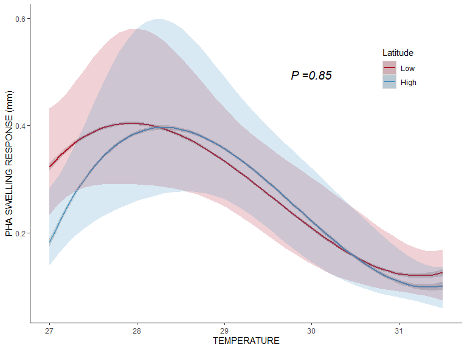<!-- -->

# Conclusion 

* In conclusion while immunocompetence is **significantly** positively correlated with temperature, there is no significant difference in immunocompetence between fish from the low- and high-latitude regions. 
